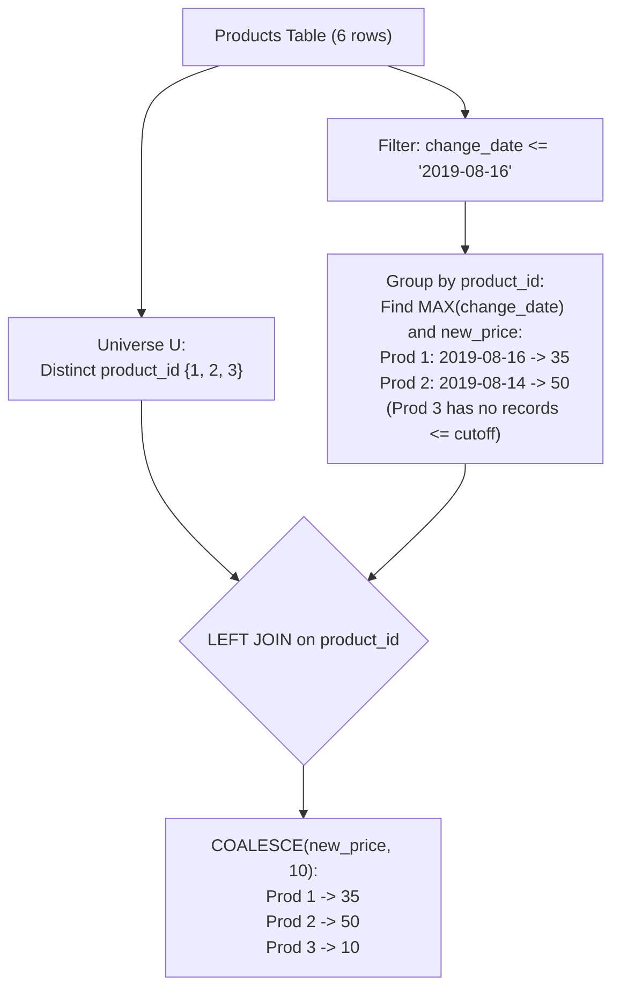

# Guided Example: Product Price at a Given Date

We trace the relational temporal step-function query to reconstruct the effective price of every distinct product on a target cutoff date, handling historical updates and default baseline values.

- **Input:**
  - `Products` table containing price change events across products 1, 2, 3
  - Target evaluation date: $T_0 = \text{'2019-08-16'}$
  - Baseline default price: $10$
- **Required output:**
  - Product 1: `price = 35` (most recent change on or before 2019-08-16 was on 2019-08-16)
  - Product 2: `price = 50` (most recent change on or before 2019-08-16 was on 2019-08-14; 2019-08-17 change is ignored)
  - Product 3: `price = 10` (no price change on or before 2019-08-16; retains initial default)

This instance illustrates point-in-time validity filtering, temporal step-function evaluation, handling entities with no prior transaction history, and null coalescence.

---

## 1. Instance & Teaching Goal

Each row in `Products` records that the price of `product_id` was updated to `new_price` on `change_date`. Prior to any recorded change, the price of every product is assumed to be `10`. We must report the active price for **every** product on `2019-08-16`.

A common failure mode is filtering by date too early:

```text
The Premature Date Filter Trap:

SELECT product_id, new_price AS price
FROM Products
WHERE change_date <= '2019-08-16'
...

Why this fails:
  Product 3 only has a change on '2019-08-18' (after the cutoff date).
  Filtering WHERE change_date <= '2019-08-16' completely eliminates Product 3!
  Product 3 vanishes from the result set instead of receiving its default price of 10.
```

The teaching goal is to model point-in-time pricing as a **temporal step-function**:
1. **Universe Extraction:** The set of all products $\mathcal{U}$ is derived from `SELECT DISTINCT product_id FROM Products`, ensuring products with only future changes are not discarded.
2. **Cutoff Partitioning:** For each product, evaluate changes strictly on or before $T_0 = \text{'2019-08-16'}$.
3. **Default Price Coalescence:** Left-join the distinct product universe with the latest applicable price record, mapping missing (`NULL`) historical records to the initial baseline of $10$ via `COALESCE(price, 10)`.

---

## 2. Conceptual Foundation & Invariants

Let $\mathcal{P}$ denote the `Products` relation.

For each distinct product $p \in \Pi_{product\_id}(\mathcal{P})$, its price at date $T_0$ is defined by:

$$\text{Price}(p, T_0) = \begin{cases} \text{new\_price}(p, d^*) & \text{if } \mathcal{D}_p(T_0) \ne \emptyset \text{ where } d^* = \max \mathcal{D}_p(T_0) \\ 10 & \text{if } \mathcal{D}_p(T_0) = \emptyset \end{cases}$$

where $\mathcal{D}_p(T_0) = \{d \mid (p, \text{price}, d) \in \mathcal{P} \wedge d \le T_0\}$.

| Relational Step | Logical Operation | Invariant Responsibility |
|---|---|---|
| Domain Extraction | `SELECT DISTINCT product_id FROM Products` | Establishes the complete set of entities requiring a price |
| Temporal Sieve | $\sigma_{change\_date \le T_0}(\mathcal{P})$ | Isolates changes effective on or before the target date |
| Argmax Extraction | `MAX(change_date)` grouped by `product_id` | Identifies the most recent effective timestamp per product |
| Outer Join & Fallback | `LEFT JOIN` and `COALESCE(new_price, 10)` | Supplies the latest price or defaults to 10 |



> **Temporal Step-Function Invariant.** A price change remains effective indefinitely until replaced by a subsequent change. Changes occurring strictly after $T_0$ must have zero influence on the price at $T_0$.

---

## 3. Step-by-Step Worked Execution

We trace the input records against target date $T_0 = \text{'2019-08-16'}$.

### Step 1: Extract All Distinct Products

From `Products`:
- `product_id = 1`
- `product_id = 2`
- `product_id = 3`

The universe of products is $\mathcal{U} = \{1, 2, 3\}$.

---

### Step 2: Temporal Filtering and Latest Price Selection ($change\_date \le \text{'2019-08-16'}$)

Evaluate each recorded transaction:
- `(prod 1, price 20, date 2019-08-14)` $\le T_0 \implies$ Eligible.
- `(prod 2, price 50, date 2019-08-14)` $\le T_0 \implies$ Eligible.
- `(prod 1, price 30, date 2019-08-15)` $\le T_0 \implies$ Eligible.
- `(prod 1, price 35, date 2019-08-16)` $\le T_0 \implies$ Eligible.
- `(prod 2, price 65, date 2019-08-17)` $> T_0 \implies$ **Excluded** (Future change).
- `(prod 3, price 20, date 2019-08-18)` $> T_0 \implies$ **Excluded** (Future change).

Now, determine the latest eligible change for each product:
- **Product 1:**
  - Eligible dates: `2019-08-14 (20)`, `2019-08-15 (30)`, `2019-08-16 (35)`.
  - Latest date is `2019-08-16`.
  - Effective price = **35**.
- **Product 2:**
  - Eligible dates: `2019-08-14 (50)`.
  - Latest date is `2019-08-14`.
  - Effective price = **50**.
- **Product 3:**
  - Eligible dates: None ($\emptyset$).
  - Effective price = **Unassigned (NULL)**.

---

### Step 3: Outer Join with Universe and Default Price Coalescence

Join universe $\mathcal{U}$ with the latest effective price:

| Product ID ($p$) | Latest Effective Date | Joined Price from `Products` | `COALESCE(price, 10)` Resolution | Output Row |
|---|---|---|---|---|
| $1$ | `2019-08-16` | $35$ | $35$ | `(1, 35)` |
| $2$ | `2019-08-14` | $50$ | $50$ | `(2, 50)` |
| $3$ | None | `NULL` | $10$ (Default applied) | `(3, 10)` |

---

## 4. Complete Execution Trace

```text
Product Price Timeline Visualization:

Target Date Cutoff: 2019-08-16
--------------------------------------------------------------------------
Product 1:
  ---[2019-08-14: $20]---[2019-08-15: $30]---[2019-08-16: $35] | ---> Active: $35

Product 2:
  ---[2019-08-14: $50]----------------------------------------- | ---[2019-08-17: $65]
                                                                  Active: $50

Product 3:
  (No changes prior to cutoff: default price $10 applies)       | ---[2019-08-18: $20]
                                                                  Active: $10
--------------------------------------------------------------------------
```

| Product ID | All Recorded Dates & Prices | Changes on/before `2019-08-16` | Maximum Eligible Date | Final Price |
|---|---|---|---|---|
| $1$ | 2019-08-14 ($20$), 2019-08-15 ($30$), 2019-08-16 ($35$) | 3 changes | `2019-08-16` | **35** |
| $2$ | 2019-08-14 ($50$), 2019-08-17 ($65$) | 1 change (2019-08-14) | `2019-08-14` | **50** |
| $3$ | 2019-08-18 ($20$) | 0 changes | None (`NULL`) | **10** |

---

## 5. Algorithmic Correctness

**Theorem (Completeness of Point-in-Time Price Resolution).**
1. **Universe Preservation:** Because the left side of the outer join consists of $\Pi_{product\_id}(Products)$, every product that exists in the database is guaranteed to appear in the output relation exactly once.
2. **Temporal Soundness:** Sifting rows by $change\_date \le T_0$ strictly eliminates future price modifications that have not yet occurred as of $T_0$. Selecting $\max(change\_date)$ among the remaining rows extracts the most recent state change prior to or on $T_0$.
3. **Default Completeness:** If $\mathcal{D}_p(T_0)$ is empty, the outer join produces a `NULL` price. The expression $\text{COALESCE}(price, 10)$ maps `NULL` deterministically to $10$, honoring the baseline price requirement.

---

## 6. Traps This Instance Exposes

| Trap Category | Hazard Scenario | Root Cause | Preventive Design Invariant |
|---|---|---|---|
| **Future-Only Omission Trap** | Product 3 only has records after 2019-08-16 | Applying a global `WHERE change_date <= '2019-08-16'` drops Product 3 before the distinct product list is formed. | Extract `DISTINCT product_id` from the full table before left-joining with filtered changes. |
| **Future Leakage Trap** | Product 2 reporting $65$ instead of $50$ | Failing to filter out dates strictly greater than 2019-08-16 before finding the maximum date. | Filter $change\_date \le T_0$ inside the price subquery. |
| **Indeterminate Column in Group By** | `SELECT product_id, new_price, MAX(change_date) FROM Products GROUP BY product_id` | In standard SQL, selecting a non-aggregated column (`new_price`) that is not in `GROUP BY` produces undefined/arbitrary values. | Use a correlated tuple join `(product_id, change_date) IN (...)` or a window function `RANK() / FIRST_VALUE()`. |
| **Strict Inequality Trap** | Using `< '2019-08-16'` instead of `<= '2019-08-16'` | A price change on the target date itself is effective on that date. | Use non-strict inequality: $change\_date \le T_0$. |

---

## 7. Complexity Derivation

### Time Complexity

1. **Universe Extraction:** Scanning $N$ rows to extract unique products takes $\mathcal{O}(N)$ using a hash table.
2. **Filtering and Grouping:**
   - Filtering $change\_date \le T_0$ takes $\mathcal{O}(N)$.
   - Grouping by $product\_id$ to find $\max(change\_date)$ takes $\mathcal{O}(N)$ time.
3. **Join & Projection:**
   - Joining the filtered price records back with the product universe takes $\mathcal{O}(N)$ time using a hash join or composite index lookup on $(product\_id, change\_date)$.
4. **Overall Time Complexity:**

$$\mathcal{O}(N)$$

With an index on `(product_id, change_date)`, query execution is near-instantaneous.

### Auxiliary Space Complexity

- Hash sets and intermediate joined tables store at most $N$ rows:

$$\mathcal{O}(N)$$
