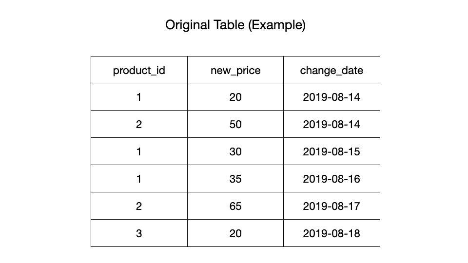
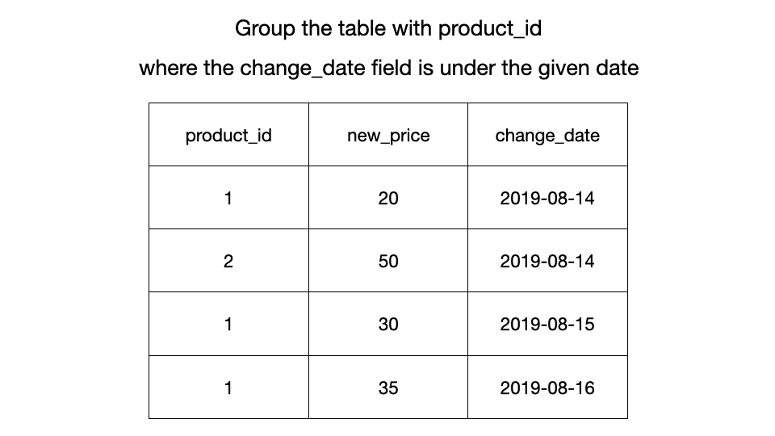
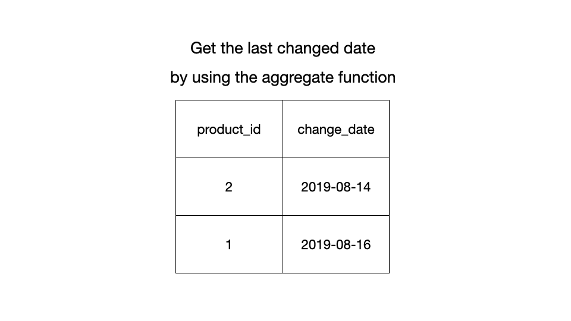
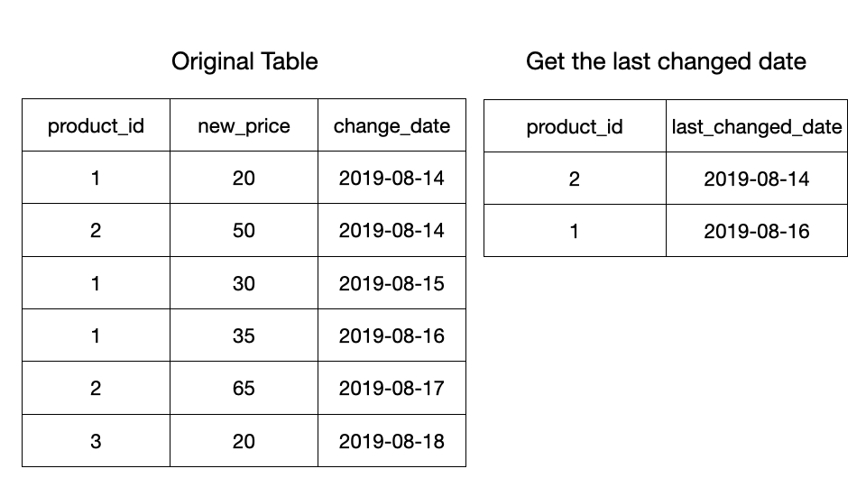
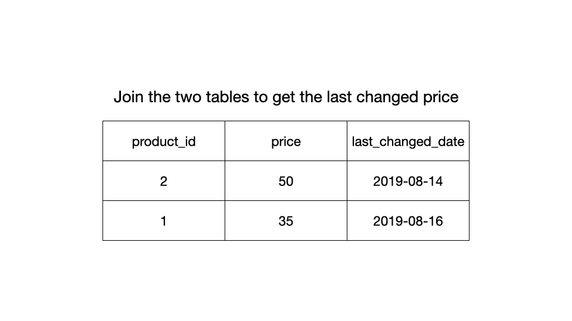
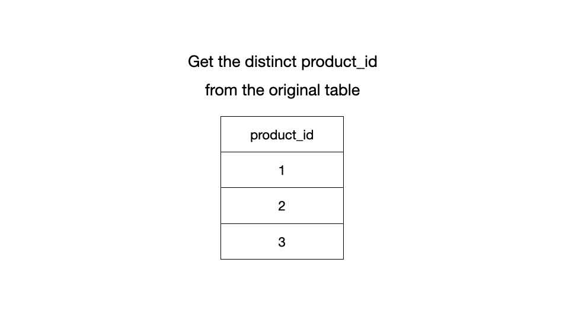
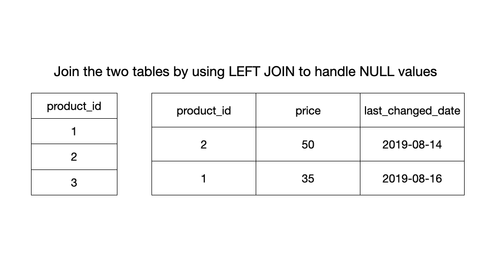
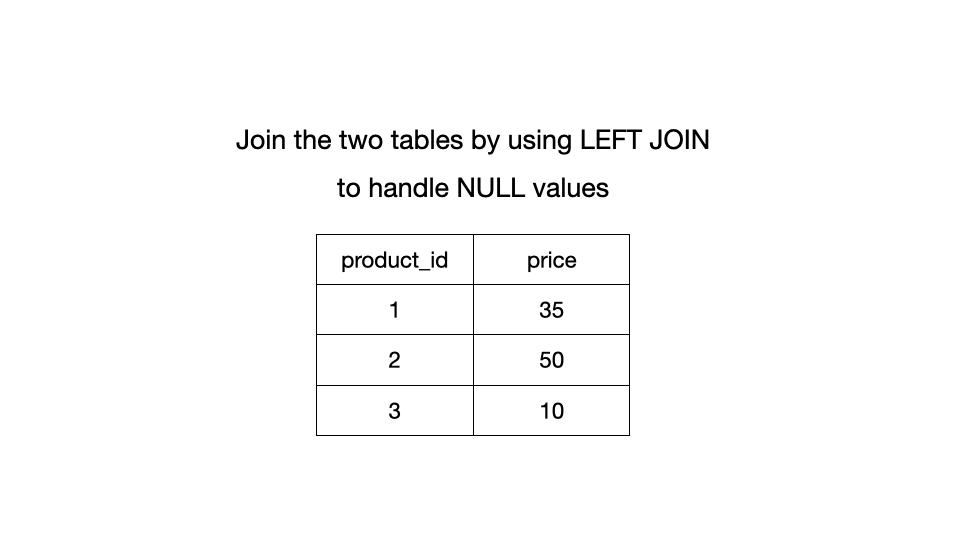
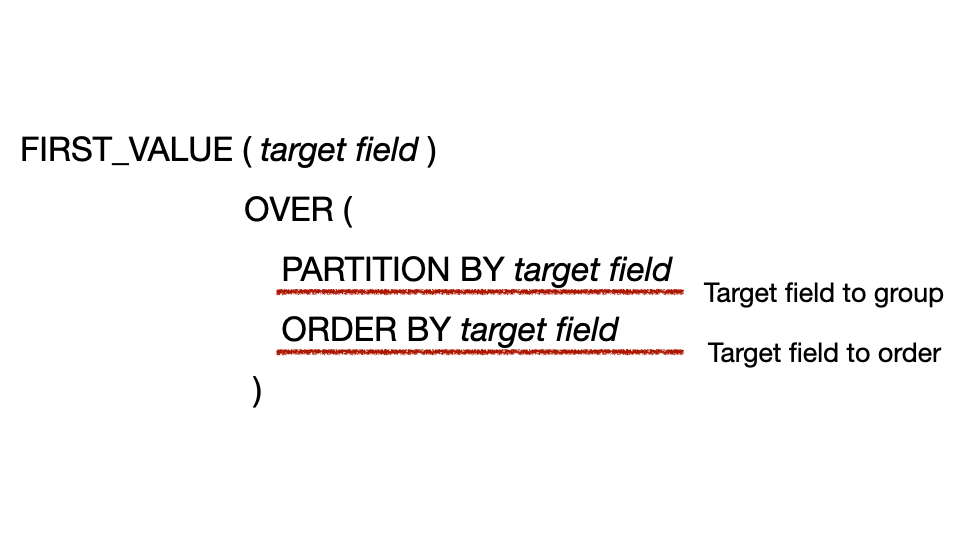

[TOC]

## Solution

---

### Overview

> **Problem reference:** Find the price of all products on the given date(`2019-08-16`). Assume the price before any change is `10`. Return the result table in any order.

We need to find the last changed price for each product until the given date (`2019-08-16`). If a product does not have an update before this date, the result for that product will be `NULL`. We need to handle `NULL` values so that the price is `10`.

---

### Approach 1: Divide cases by using `UNION ALL`

#### Intuition

We can separate the cases by using the `UNION ALL` keyword. If the first changed date ($\text{change}_{date}$) is over the given date (`2019-08-16`), the price wasn't changed in time, so the $\text{new}_{price}$ field is the old value `10`. Otherwise, we need to find the last changed date for the other rows by grouping to get the last changed price ($\text{new}_{price}$).

We know there are no duplicated tuples when we union the two separated tables because we get one field using `GROUP BY` for each query. Thus, it would be better to use `UNION ALL` instead of `UNION` for performance.

Also, we should be careful with grouping the table to get the last changed price because we cannot get the price directly by using a single `GROUP BY` clause. For example, if we group the example case where the $\text{change}_{date}$ field is under `'2019-08-16` inclusive, it looks like the one below.

```
+------------+-----------+------------------+
| product_id | new_price | last_change_date |
+------------+-----------+------------------+
| 1          | 20        | 2019-08-16       |
| 1          | 30        | 2019-08-16       |
| 1          | 35        | 2019-08-16       |
| 2          | 50        | 2019-08-14       |
| 2          | 65        | 2019-08-14       |
+------------+-----------+------------------+
```

We could try getting the last changed date by using the aggregate function and the $\text{product}_{id}$, which is the primary key and the grouping target. However, DBMS (Database Management System) does not know what to choose for the $\text{new}_{price}$ field after grouping because there are multiple rows to choose from, so we cannot use the aggregate function. The reason why we cannot use the aggregate function is that we need to only get the $\text{new}_{price}$ field by the last change date which we can do by comparing the set of the $\text{product}_{id}$ and $\text{change}_{date}$ fields.

#### Algorithm

1. Group the table with the $\text{product}_{id}$ field and find the first changed date over `2019-08-16` by using `MIN` aggregation function on `HAVING` clause.
2. Set the `price` table as `10`.
3. Group the table with the $\text{product}_{id}$ again, and find the $\text{product}_{id}$ field and the last changed date until `2019-08-16`.
4. Find the last changed $\text{new}_{price}$ field with the last changed date.
5. Union the two tables by using `UNION ALL`.

#### Implementation

##### MySQL

```sql
SELECT
  product_id,
  10 AS price
FROM
  Products
GROUP BY
  product_id
HAVING
  MIN(change_date) > '2019-08-16'
UNION ALL
SELECT
  product_id,
  new_price AS price
FROM
  Products
WHERE
  (product_id, change_date) IN (
    SELECT
      product_id,
      MAX(change_date)
    FROM
      Products
    WHERE
      change_date <= '2019-08-16'
    GROUP BY
      product_id
  )
```

### Approach 2: Divide cases by using `LEFT JOIN`

#### Intuition

We can also handle the `NULL` value using the `LEFT JOIN` clause. For example, if there are no changes before the given date, the result field of `LEFT JOIN` is `NULL`. Thus, after we get the last changed date before the given date, we could join that table with the table with a unique $\text{product}_{id}$ field and handle the `NULL` value using a condition statement.

We need to use two kinds of join, the `INNER JOIN` and the `LEFT JOIN`. We use the `INNER JOIN` to get the last changed price until the given date and the `LEFT JOIN` to handle the `NULL` value.

















#### Algorithm

1. Group the table with the $\text{product}_{id}$, and find the $\text{product}_{id}$ field and the last changed date until `2019-08-16` using the aggregate function.
2. Use `INNER JOIN` to join the tables where the set of $\text{product}_{id}$ and $\text{change}_{date}$ fields is the same.
3. Get the last changed price and the $\text{product}_{id}$ fields from the joined table.
4. Join by using `LEFT JOIN` where the $\text{product}_{id}$ field is the same.
5. Handle the `NULL` value, which means there are no changes before the given date, using the `IFNULL` function.

#### Implementation

##### MySQL

```sql
SELECT
  UniqueProductId.product_id,
  IFNULL (LastChangedPrice.new_price, 10) AS price
FROM
  (
    SELECT DISTINCT
      product_id
    FROM
      Products
  ) AS UniqueProductIds
  LEFT JOIN (
    SELECT
      Products.product_id,
      new_price
    FROM
      Products
      JOIN (
        SELECT
          product_id,
          MAX(change_date) AS change_date
        FROM
          Products
        WHERE
          change_date <= "2019-08-16"
        GROUP BY
          product_id
      ) AS LastChangedDate USING (product_id, change_date)
    GROUP BY
      product_id
  ) AS LastChangedPrice USING (product_id)
```

### Approach 3: Use the window function

#### Intuition

We can get the last changed price by using the window function, $\text{FIRST}_{VALUE}$.

#### Window function

In [MySQL](https://dev.mysql.com/doc/refman/8.0/en/window-functions-usage.html), they say the window function _performs an aggregate-like operation on a set of query rows._ Even though they work almost the same, the aggregate function returns a single row for each target field, but the window function produces a result for each row.

There are two window function types: the aggregate function and the non-aggregate function. The aggregate function could be the window function with the `OVER` clause, such as `MAX`, `MIN`, and `SUM`. Thus, if we use these aggregate functions **without** the `OVER` clause, it works as the aggregate function; if we use these **with** the `OVER` clause, it works as the window function. However, some window functions, such as `LEAD`, `LAG`, `RANK`, and $\text{FIRST}_{VALUE}$ are non-aggregate functions, which means they should be used with the `OVER` clause.

We define the target field to group or order on the `OVER` clause. Hence, if we use the $\text{FIRST}_{VALUE}$ window function, the syntax looks like the image below. (You can get more details if you want to know the specification of the window function in [MySQL reference](https://dev.mysql.com/doc/refman/8.0/en/window-functions-usage.html).)



The `PARTITION BY` works the same as `GROUP BY`. The only difference with `GROUP BY` is that it produces the result for each row. Now, we can get the last changed price by this $\text{FIRST}_{VALUE}$ instead of using `GROUP BY` and `JOIN`. We can order the $\text{change}_{date}$ fields in descending order and get each last changed price by `PARTITION BY` to group the table. You should be careful that we use the window function on the `SELECT` clause. Thus, it executes after the `JOIN`, `WHERE`, and `GROUP BY` clauses.

#### Algorithm

1. Filter the table where the value of the $\text{change}_{date}$ field is under the given date (`2019-08-16`).
2. Get the last changed price using $\text{FIRST}_{VALUE}$ for each $\text{product}_{id}$.
3. The rest of the process is the same as [Approach 2](#approach-2-divide-cases-by-using-the-left-join)

#### Implementation

##### MySQL

```sql
SELECT
  product_id,
  IFNULL (price, 10) AS price
FROM
  (
    SELECT DISTINCT
      product_id
    FROM
      Products
  ) AS UniqueProducts
  LEFT JOIN (
    SELECT DISTINCT
      product_id,
      FIRST_VALUE (new_price) OVER (
        PARTITION BY
          product_id
        ORDER BY
          change_date DESC
      ) AS price
    FROM
      Products
    WHERE
      change_date <= '2019-08-16'
  ) AS LastChangedPrice USING (product_id);
```

---

### Conclusion

We recommend [Approach 1](#approach-1-divide-cases-by-using-the-union-all) due to its simplicity and performance. Usually, it takes much more time when we use the `UNION` clause because it orders the table to remove the duplicated fields. However, the `UNION ALL` **does not** order the table because it **does not** remove the duplicated fields. We ensure that there are no duplicated fields because we use `GROUP BY` to get the last changed price for each $\text{product}_{id}$.