# Guided Example: Single-Row Keyboard

We trace the inverted index look-up and 1D metric space simulation to calculate the total movement time required to type a string on a custom single-row keyboard.

- **Input:** $keyboard = \text{"pqrstuvwxyzabcdefghijklmno"}, \ word = \text{"leetcode"}$
- **Required output:** `73`

This instance illustrates inverted index precomputation, 1D displacement calculation, tracking the persistent finger cursor, and handling consecutive identical characters.

---

## 1. Instance & Teaching Goal

We are given a single-row keyboard layout specified as a 26-character permutation of the lowercase English alphabet, indexed from $0$ to $25$. A single finger begins at physical coordinate $0$ (the character at $keyboard[0]$). To type any character $c$, the finger must move from its current coordinate $p_{\text{curr}}$ to the target character's position $p_{\text{target}}$, incurring cost $|p_{\text{curr}} - p_{\text{target}}|$.

A naive simulation scans $keyboard$ linearly for every typed character using string search:

$$\text{For word length } M = 10^4 \text{ and keyboard size } 26: \quad 10000 \times 26 = 2.6 \times 10^5 \text{ character comparisons}$$

While feasible, performing repeated scans is redundant.

```text
Keyboard Layout and Trajectory on "pqrstuvwxyzabcdefghijklmno":

Index:  0 1 2 3 4 5 6 7 8 9 10 11 12 13 14 15 16 17 18 19 20 21 22 23 24 25
Key:    p q r s t u v w x y z  a  b  c  d  e  f  g  h  i  j  k  l  m  n  o

Trajectory for "leetcode":
  Start at 0 ('p')
  Move to 22 ('l'): |0 - 22|  = 22
  Move to 15 ('e'): |22 - 15| = 7
  Move to 15 ('e'): |15 - 15| = 0
  Move to  4 ('t'): |15 - 4|  = 11
  Move to 13 ('c'): |4 - 13|  = 9
  Move to 25 ('o'): |13 - 25| = 12
  Move to 14 ('d'): |25 - 14| = 11
  Move to 15 ('e'): |14 - 15| = 1
  Total Time = 22 + 7 + 0 + 11 + 9 + 12 + 11 + 1 = 73
```

The core teaching goal is to invert the keyboard array into a direct-address lookup table $pos[\sigma]$ in $\mathcal{O}(26) = \mathcal{O}(1)$ time. This allows each move to be evaluated in $\mathcal{O}(1)$ time without searching.

---

## 2. Conceptual Foundation & Invariants

Let $\Sigma$ be the set of lowercase English letters, and let $keyboard[0 \dots 25]$ be a bijection from $\{0, \dots, 25\}$ to $\Sigma$.

### Inverted Index Construction

We precompute the inverse mapping:

$$pos[c] = i \iff keyboard[i] = c \quad \text{for each } i \in \{0, \dots, 25\}$$

### 1D Displacement Recurrence

Let $cursor_k$ denote the finger's position after typing the $k$-th character of $word$:
- Base state: $cursor_0 = 0$, $time_0 = 0$.
- For each character $word[k]$ ($k = 0, \dots, M-1$):
  $$target = pos[word[k]]$$
  $$\Delta = |cursor_k - target|$$
  $$time_{k+1} = time_k + \Delta$$
  $$cursor_{k+1} = target$$

| State Variable | Type | Invariant Property |
|---|---|---|
| $pos[\cdot]$ | Array of size $26$ | Maps each letter to its unique physical slot in $[0, 25]$ |
| $cursor$ | Integer in $[0, 25]$ | Physical coordinate of the key most recently typed |
| $target$ | Integer in $[0, 25]$ | Physical coordinate of the current letter to type |
| $\Delta = \lvert cursor - target \rvert$ | Non-negative integer | Metric distance traversed along the 1D rail |
| $total\_time$ | Non-negative integer | Running cumulative sum of all displacements |

```mermaid
flowchart LR
    accTitle: Finger Movement State Machine
    accDescr: Sequential pipeline tracking finger position transitions across characters.

    S0["Start: cursor = 0"] -->|" 'l' (target 22) -> +22 "| S1["cursor = 22"]
    S1 -->|" 'e' (target 15) -> +7 "| S2["cursor = 15"]
    S2 -->|" 'e' (target 15) -> +0 "| S3["cursor = 15"]
    S3 -->|" 't' (target 4)  -> +11 "| S4["cursor = 4"]
    S4 -->|" 'c' (target 13) -> +9 "| S5["cursor = 13"]
    S5 -->|" 'o' (target 25) -> +12 "| S6["cursor = 25"]
    S6 -->|" 'd' (target 14) -> +11 "| S7["cursor = 14"]
    S7 -->|" 'e' (target 15) -> +1 "| S8["cursor = 15
    Total = 73"]
```



> **Finger Continuity Invariant.** After character $word[k]$ is typed, the finger remains stationed at coordinate $pos[word[k]]$. The departure point for character $word[k+1]$ is strictly the arrival point of $word[k]$.

---

## 3. Step-by-Step Worked Execution

We trace $keyboard = \text{"pqrstuvwxyzabcdefghijklmno"}$ and $word = \text{"leetcode"}$.

### Step 0: Build Inverse Position Map

Traverse $keyboard$:
- $keyboard[0 \dots 10] = \text{"pqrstuvwxyz"} \implies \text{'p'}:0, \text{'q'}:1, \dots, \text{'z'}:10$
- $keyboard[11 \dots 25] = \text{"abcdefghijklmno"} \implies \text{'a'}:11, \dots, \text{'o'}:25$

Initialize $cursor = 0$, $total\_time = 0$.

---

### Step 1: Type `'l'` ($k = 0$)
- Destination: $target = pos[\text{'l'}] = 22$.
- Displacement: $|0 - 22| = 22$.
- Update: $total\_time = 0 + 22 = 22$, $cursor = 22$.

---

### Step 2: Type `'e'` ($k = 1$)
- Destination: $target = pos[\text{'e'}] = 15$.
- Displacement: $|22 - 15| = 7$.
- Update: $total\_time = 22 + 7 = 29$, $cursor = 15$.

---

### Step 3: Type `'e'` ($k = 2$)
- Destination: $target = pos[\text{'e'}] = 15$.
- Displacement: $|15 - 15| = 0$.
- Update: $total\_time = 29 + 0 = 29$, $cursor = 15$.

---

### Step 4: Type `'t'` ($k = 3$)
- Destination: $target = pos[\text{'t'}] = 4$.
- Displacement: $|15 - 4| = 11$.
- Update: $total\_time = 29 + 11 = 40$, $cursor = 4$.

---

### Step 5: Type `'c'` ($k = 4$)
- Destination: $target = pos[\text{'c'}] = 13$.
- Displacement: $|4 - 13| = 9$.
- Update: $total\_time = 40 + 9 = 49$, $cursor = 13$.

---

### Step 6: Type `'o'` ($k = 5$)
- Destination: $target = pos[\text{'o'}] = 25$.
- Displacement: $|13 - 25| = 12$.
- Update: $total\_time = 49 + 12 = 61$, $cursor = 25$.

---

### Step 7: Type `'d'` ($k = 6$)
- Destination: $target = pos[\text{'d'}] = 14$.
- Displacement: $|25 - 14| = 11$.
- Update: $total\_time = 61 + 11 = 72$, $cursor = 14$.

---

### Step 8: Type `'e'` ($k = 7$)
- Destination: $target = pos[\text{'e'}] = 15$.
- Displacement: $|14 - 15| = 1$.
- Update: $total\_time = 72 + 1 = 73$, $cursor = 15$.

Final cumulative time: **73**.

---

## 4. Complete Execution Trace

| Step ($k$) | Current Char | From Index ($cursor$) | Target Index ($pos[c]$) | Move Vector ($p - p_{\text{curr}}$) | Displacement ($\Delta$) | Running Total |
|---|---|---|---|---|---|---|
| $0$ (Init) | — | — | $0$ | — | — | $0$ |
| $1$ | `'l'` | $0$ | $22$ | $+22$ | $22$ | $22$ |
| $2$ | `'e'` | $22$ | $15$ | $-7$ | $7$ | $29$ |
| $3$ | `'e'` | $15$ | $15$ | $0$ | $0$ | $29$ |
| $4$ | `'t'` | $15$ | $4$ | $-11$ | $11$ | $40$ |
| $5$ | `'c'` | $4$ | $13$ | $+9$ | $9$ | $49$ |
| $6$ | `'o'` | $13$ | $25$ | $+12$ | $12$ | $61$ |
| $7$ | `'d'` | $25$ | $14$ | $-11$ | $11$ | $72$ |
| $8$ | `'e'` | $14$ | $15$ | $+1$ | $1$ | **73** |

```text
Finger Coordinates Over Time:
  Index  0 ('p') -> 22 ('l') -> 15 ('e') -> 15 ('e') -> 4 ('t') -> 13 ('c') -> 25 ('o') -> 14 ('d') -> 15 ('e')
  Time   0          22          29          29          40         49          61          72          73
```

---

## 5. Algorithmic Correctness

**Theorem (Metric Consistency).**
1. **Metric Space Axioms:** Absolute 1D distance $d(x, y) = |x - y|$ satisfies non-negativity ($d(x, y) \ge 0$), identity of indiscernibles ($d(x, y) = 0 \iff x = y$), symmetry ($d(x, y) = d(y, x)$), and the triangle inequality.
2. **Path Decomposition:** Total travel time along a sequence of coordinates $p_0, p_1, \dots, p_M$ is precisely $\sum_{k=0}^{M-1} |p_k - p_{k+1}|$.
3. **Bijective Mapping:** Since $keyboard$ contains all 26 letters with multiplicity 1, the map $pos[c]$ is well-defined and unique for all $c \in \Sigma$.
4. **Induction:** Base state $time_0 = 0$ holds. Assuming $time_k$ is the exact minimal travel time to type prefix $word[0 \dots k-1]$, adding $|cursor_k - pos[word[k]]|$ strictly preserves the exact physical path required by the problem rules.

---

## 6. Traps This Instance Exposes

| Trap Category | Hazard Scenario | Root Cause | Preventive Design Invariant |
|---|---|---|---|
| **The Letter 'a' Starting Fallacy** | Setting initial finger position to $pos[\text{'a'}]$ | Misreading "starts at index 0" as "starts at letter a". In custom layouts, index 0 can be any letter (e.g. 'p'). | Initialize $cursor = 0$ (the physical slot index, not a letter index). |
| **Consecutive Char Cost Error** | Assuming every typed letter incurs movement $> 0$ | Typing duplicate adjacent letters (like `"ee"` in `"leetcode"`) requires $0$ movement. | Absolute difference $\lvert 15 - 15 \rvert = 0$ handles identical characters naturally. |
| **Repeated Search Overhead** | Using `keyboard.find(c)` inside the typing loop | Causes $\mathcal{O}(\lvert \Sigma \rvert \cdot \lvert word \rvert)$ operations instead of $\mathcal{O}(\lvert word \rvert)$. | Precompute an inverted table `int[26]` for $\mathcal{O}(1)$ access. |
| **Signed Difference Bug** | Omitting the absolute value operator `abs()` | Negative leftward movements subtract from total time instead of adding. | Always apply absolute value $\lvert cursor - target \rvert$. |

---

## 7. Complexity Derivation

### Time Complexity

1. **Precomputing Inverse Map:**
   - Scanning $keyboard$ of length $26$: exactly $26$ iterations $\implies \mathcal{O}(|\Sigma|) = \mathcal{O}(1)$ time.
2. **Typing Simulation:**
   - Scanning $word$ of length $M$: for each character, one table lookup and one integer arithmetic operation $\implies \mathcal{O}(M)$ time.
3. **Total Time Complexity:**

$$\mathcal{O}(M)$$

For $M = 10{,}000$, this executes in under $1 \text{ ms}$.

### Auxiliary Space Complexity

- A direct address lookup table of size $26$ integers:

$$\mathcal{O}(|\Sigma|) = \mathcal{O}(1)$$
