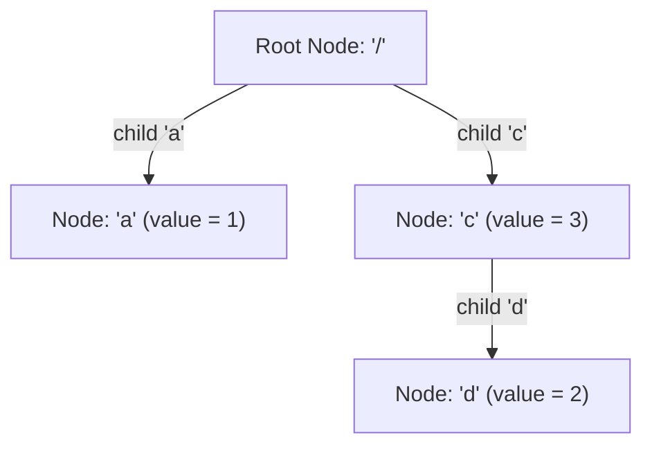

# Guided Example: Design File System

We trace the hierarchical namespace validation and trie/hash prefix verification for designing an in-memory file system.

- **Input Operations:**
  - `createPath("/a", 1) -> true`
  - `createPath("/c/d", 2) -> false`
  - `createPath("/c", 3) -> true`
  - `createPath("/c/d", 2) -> true`
  - `createPath("/c/d", 5) -> false`
  - `get("/c") -> 3`
  - `get("/c/d") -> 2`
  - `get("/c/e") -> -1`
- **Required output:** `[true, false, true, true, false, 3, 2, -1]`

This representative sequence illustrates root-level parent resolution, parent-absence rejection, subsequent child habilitation, duplicate prevention, and non-existent path query handling.

---

## 1. Instance & Teaching Goal

We must design a file system data structure supporting two core operations:
1. `createPath(path, value)`: Creates a new path associated with an integer value.
   - Fails (`false`) if `path` already exists.
   - Fails (`false`) if the immediate parent directory of `path` does not exist.
   - Succeeds (`true`) and records the value otherwise.
2. `get(path)`: Returns the value associated with `path`, or `-1` if the path does not exist.

A path is a string composed of one or more slash-separated components: `"/<name_1>/<name_2>/.../<name_k>"`. The root directory `"/"` is the implicit parent of all top-level paths like `"/a"`, but `"/"` itself is never created as a user path.

```text
Hierarchical Namespace Graph Progression:

Step 1: createPath("/a", 1) -> Valid (parent is root)
  Root (/)
    └── a (val = 1)

Step 2: createPath("/c/d", 2) -> Fails! Parent "/c" does not exist.

Step 3: createPath("/c", 3) -> Valid (parent is root)
  Root (/)
    ├── a (val = 1)
    └── c (val = 3)

Step 4: createPath("/c/d", 2) -> Valid! Parent "/c" now exists.
  Root (/)
    ├── a (val = 1)
    └── c (val = 3)
          └── d (val = 2)

Step 5: createPath("/c/d", 5) -> Fails! Path "/c/d" already exists (no overwrite).
```

The primary teaching goal is to maintain the **Strict Ancestor Existence Invariant**: a node can only be instantiated if its immediate prefix exists, and cannot be recreated once assigned.

---

## 2. Conceptual Foundation & Invariants

Two standard architectures implement this file system:
- **Approach A (Prefix Hash Map):** A hash table `paths` maps full path strings to values. For any path `path`, find the last slash index `idx = path.rfind('/')`. The parent path is `parent = path[:idx]`. If `parent` is non-empty (`len(parent) > 0`) and `parent not in paths`, creation is rejected.
- **Approach B (Trie / Prefix Tree):** A tree of `TrieNode` objects where each node contains a dictionary of children keyed by component name, and an integer value (default $-1$).

### Trie Node Structure & Transition Rules

Let a path $P = /c_1/c_2/\dots/c_k$ have $k$ components.
1. Start traversal at `curr = root`.
2. For intermediate components $c_1, \dots, c_{k-1}$:
   - If $c_i \notin curr.children$, the parent path does not exist $\implies$ abort and return `false`.
   - Advance: $curr \leftarrow curr.children[c_i]$.
3. For the final component $c_k$:
   - If $c_k \in curr.children$, the path already exists $\implies$ abort and return `false`.
   - Otherwise, create child: $curr.children[c_k] = \text{TrieNode}(c_k, value)$ and return `true`.

| Operation | Precondition | State Transformation | Return Value |
|---|---|---|---|
| `createPath(path, v)` | $path \notin \text{FileSystem} \ \wedge \ \text{Parent}(path) \in \text{FileSystem}$ | Adds new path with value $v$ | `true` |
| `createPath(path, v)` | $\text{Parent}(path) \notin \text{FileSystem}$ | No state change | `false` |
| `createPath(path, v)` | $path \in \text{FileSystem}$ | No state change (no overwrite) | `false` |
| `get(path)` | $path \in \text{FileSystem}$ | Read-only | Associated integer value |
| `get(path)` | $path \notin \text{FileSystem}$ | Read-only | `-1` |



> **Ancestor Closure Invariant.** Every path `/c_1/.../c_k` present in the file system has all its prefix ancestors `/c_1`, `/c_1/c_2`, ..., `/c_1/.../c_{k-1}` present with assigned non-negative values.

---

## 3. Step-by-Step Worked Execution

We trace the representative 8-operation sequence.

### Step 1: `createPath("/a", 1)`
- Parent: Root (`""` or `"/"`). Root implicitly exists.
- Target component: `"a"`.
- Check: `"a"` does not exist under root.
- Action: Create node `"a"` with value $1$.
- Return: `true`.

---

### Step 2: `createPath("/c/d", 2)`
- Split components: `["c", "d"]`.
- Check intermediate component `"c"` under root:
  - `"c"` is not present in `root.children`.
- Parent path `"/c"` does not exist.
- Action: Rejection; no modification.
- Return: `false`.

---

### Step 3: `createPath("/c", 3)`
- Parent: Root.
- Target component: `"c"`.
- Check: `"c"` not yet in `root.children`.
- Action: Create node `"c"` with value $3$.
- Return: `true`.

---

### Step 4: `createPath("/c/d", 2)`
- Split components: `["c", "d"]`.
- Check intermediate component `"c"` under root:
  - `"c"` exists with value $3$. Advance `curr = node_c`.
- Final component `"d"`:
  - `"d"` is not present in `node_c.children`.
- Action: Create node `"d"` under `"c"` with value $2$.
- Return: `true`.

---

### Step 5: `createPath("/c/d", 5)`
- Split components: `["c", "d"]`.
- Intermediate `"c"` exists. Advance `curr = node_c`.
- Final component `"d"`:
  - `"d"` already exists in `node_c.children`!
- Action: Duplicate detected; no overwrite permitted.
- Return: `false`.

---

### Step 6: `get("/c")`
- Traverse: `root` $\to$ `"c"`.
- Node `"c"` exists with value $3$.
- Return: `3`.

---

### Step 7: `get("/c/d")`
- Traverse: `root` $\to$ `"c"` $\to$ `"d"`.
- Node `"d"` exists with value $2$.
- Return: `2`.

---

### Step 8: `get("/c/e")`
- Traverse: `root` $\to$ `"c"`.
- Inspect `"e"` in `node_c.children`: not found.
- Path does not exist.
- Return: `-1`.

---

## 4. Complete Execution Trace

| Op # | Call Signature | Components | Parent Path | Parent Exists? | Path Already Exists? | Result | Internal Trie / Map State |
|---|---|---|---|---|---|---|---|
| $1$ | `createPath("/a", 1)` | `["a"]` | `"/"` | Yes (Implicit) | No | **true** | `{"/a": 1}` |
| $2$ | `createPath("/c/d", 2)` | `["c", "d"]` | `"/c"` | No | No | **false** | `{"/a": 1}` |
| $3$ | `createPath("/c", 3)` | `["c"]` | `"/"` | Yes (Implicit) | No | **true** | `{"/a": 1, "/c": 3}` |
| $4$ | `createPath("/c/d", 2)` | `["c", "d"]` | `"/c"` | Yes | No | **true** | `{"/a": 1, "/c": 3, "/c/d": 2}` |
| $5$ | `createPath("/c/d", 5)` | `["c", "d"]` | `"/c"` | Yes | Yes | **false** | `{"/a": 1, "/c": 3, "/c/d": 2}` |
| $6$ | `get("/c")` | `["c"]` | — | — | Yes | **3** | Unchanged |
| $7$ | `get("/c/d")` | `["c", "d"]` | — | — | Yes | **2** | Unchanged |
| $8$ | `get("/c/e")` | `["c", "e"]` | — | — | No | **-1** | Unchanged |

```text
Detailed Trace of Trie Traversal:

createPath("/c/d", 2) at Op 2:
  Root
    |-- a (exists)
    |-- c? NOT FOUND -> Immediate abort, return false!

createPath("/c/d", 2) at Op 4:
  Root
    |-- c (found)
          |-- d? NOT FOUND -> Last component! Create d with value 2, return true!
```

---

## 5. Algorithmic Correctness

**Theorem (Soundness of Hierarchical Namespace Verification).**
1. **Parent Necessity:** For path $P = /c_1/\dots/c_k$, the parent is $P' = /c_1/\dots/c_{k-1}$ (or root if $k=1$). By checking each prefix node sequentially in the Trie, any non-existent intermediate node $c_i$ triggers an immediate return of `false`, preventing orphaned child nodes.
2. **Immutability of Existing Paths:** Before assigning `curr.children[c_k]`, the algorithm tests if $c_k$ is already present. If present, the operation is rejected without modifying the existing stored value, preserving immutability.
3. **Deterministic Retrieval:** A path exists in the Trie if and only if every component along its unique branch exists. If any edge is missing, `get` returns `-1`. If all edges exist, it returns the uniquely stored scalar value.

---

## 6. Traps This Instance Exposes

| Trap Category | Hazard Scenario | Root Cause | Preventive Design Invariant |
|---|---|---|---|
| **The Overwrite Trap** | `createPath("/c/d", 5)` overwriting $2$ with $5$ and returning `true` | Treating `createPath` like a dictionary `set` operation instead of a creation method that requires uniqueness. | Explicitly check if the destination node already exists; if so, return `false`. |
| **Root Parent Confusion** | Evaluating parent of `"/a"` as `""` and rejecting it because `""` is not in the map | Root directory is represented by empty string prefix or `"/"` and must be recognized as valid. | Treat empty parent string `""` or single slash `"/"` as valid by default. |
| **Prefix Substring Truncation Bug** | Finding parent with `path.split("/")[0]` instead of slicing up to the last slash | Slicing components incorrectly on multi-tier paths like `"/a/b/c/d"`. | Use `path[:path.rfind('/')]` or navigate token-by-token in a Trie. |
| **Missing Lookup Default** | Returning `null` or `0` instead of `-1` for missing paths in `get()` | Violating API contract specification. | Explicitly return `-1` when path is not found. |

---

## 7. Complexity Derivation

Let $L$ be the length of the path string, and $K$ be the number of slash-delimited components ($K \le L$).

### Time Complexity

- **`createPath(path, value)`:**
  - Tokenizing `path` into $K$ components takes $\mathcal{O}(L)$ time.
  - Traversing $K$ trie nodes or hashing the parent string takes $\mathcal{O}(L)$ time.
  - Creating the new node takes $\mathcal{O}(1)$ time.
  - Total time: $\mathcal{O}(L)$.

- **`get(path)`:**
  - Tokenizing and traversing $K$ trie nodes takes $\mathcal{O}(L)$ time.
  - Total time: $\mathcal{O}(L)$.

Both operations run in linear time with respect to the query path string length $L$.

### Auxiliary Space Complexity

- Each unique path component is stored once in the Trie node hierarchy.
- For $N$ distinct created paths with average length $L$:
  - Shared prefixes are compressed along common Trie branches.
  - Total Auxiliary Space: $\mathcal{O}(\sum_{P} |P|) \le \mathcal{O}(N \cdot L)$.
