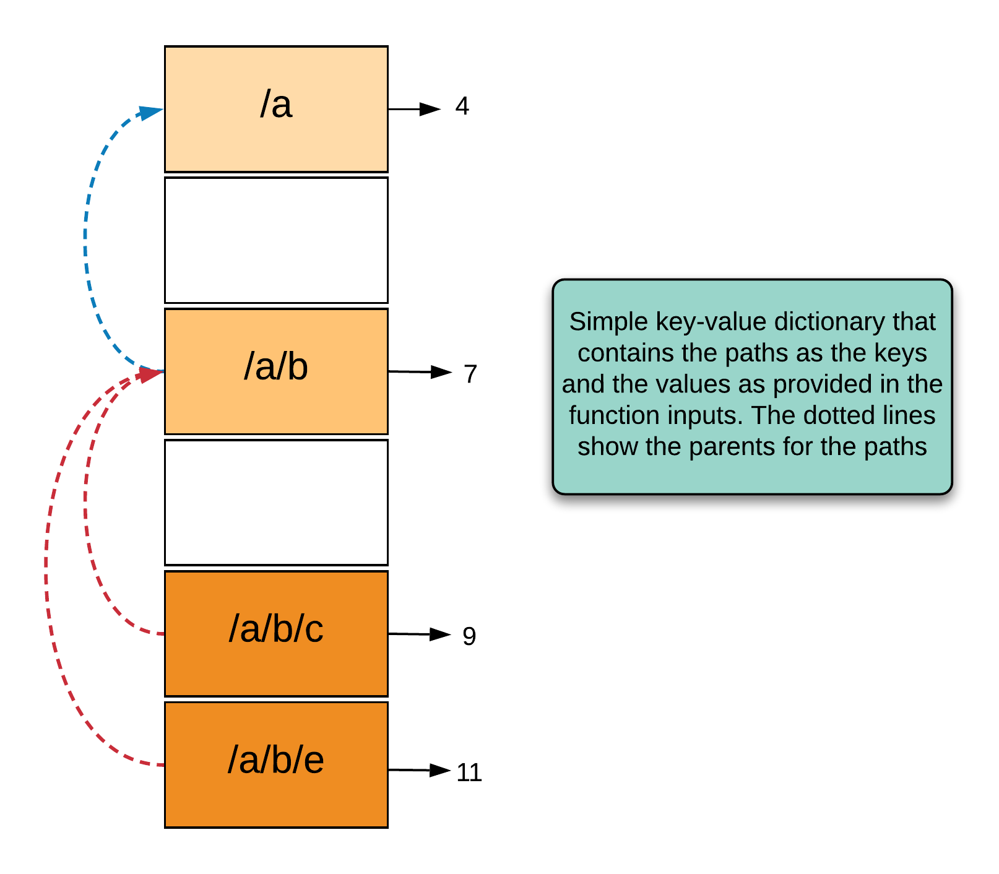
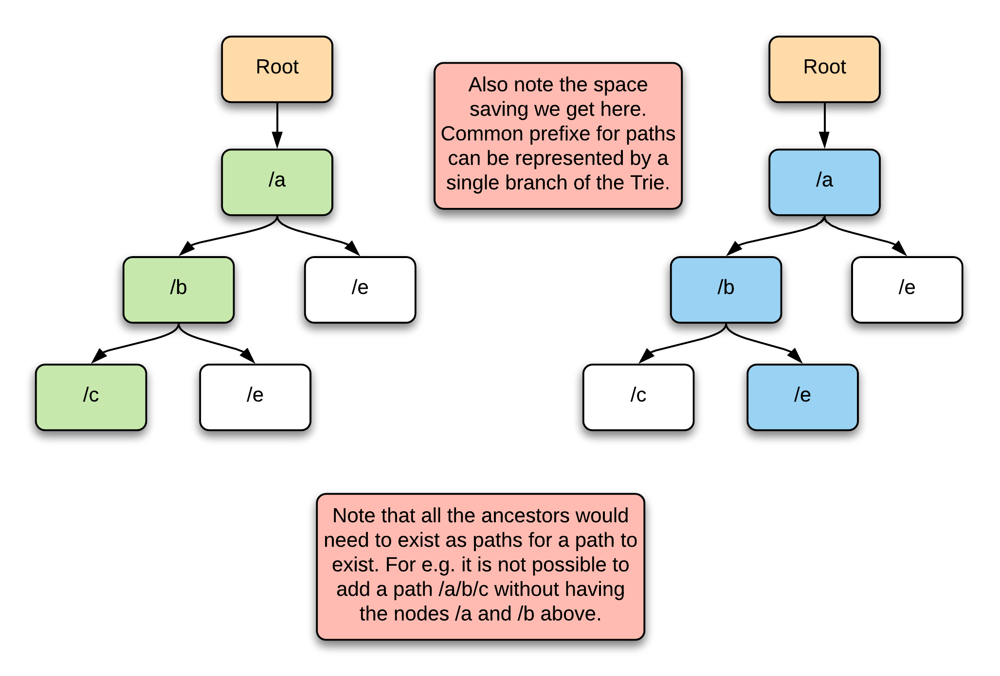
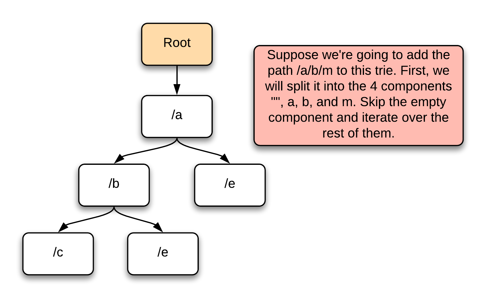
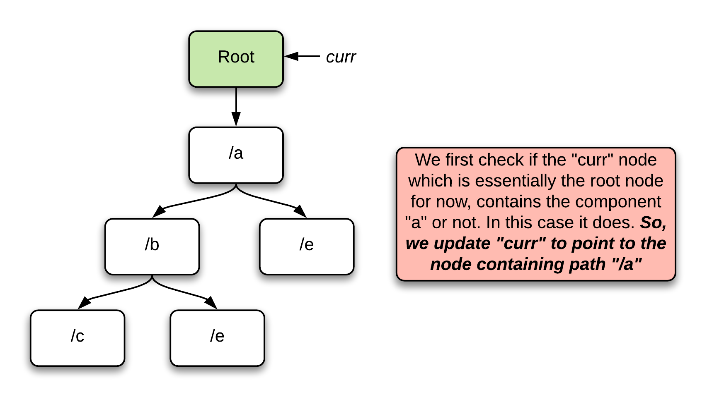
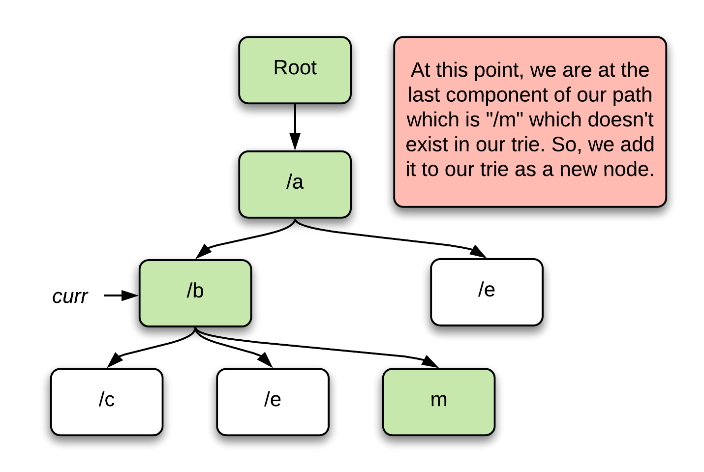

## Solution
---

### Approach 1: Dictionary for storing paths

**Intuition**

This first approach is pretty much a simulation-based approach for solving this problem. We call it a simulation-based approach because it doesn't use any fancy data-structure for storing the paths and pretty much, we do what the problem asks us to do for both the functions. We simply need a key-value data structure with some additional processing to verify the validity of a path being added. Naturally, a `HashMap` or a `dictionary` seems to be a good data structure to go with.

Let's look at a visual representation of how a HashMap would look as we keep on adding more paths to it. The following represents the state of the file system after adding the following paths: `/a`, `/a/b`, `/a/b/c`, and `/a/b/e`.



*Figure 1. A HashMap containing the various paths in the file system and their keys.*

Retrieving the value corresponding to a path is relatively simple because the path itself represents a key in the HashMap. However, for adding a new path, we can simply retrieve the `parent path` e.g. `/a/b` is the parent path for `/a/b/c` and similarly for `/a/b/e`, and then check if the parent path exists in the HashMap as a key or not.

 **Algorithm**

 1. Initialize a dictionary or a `HashMap` called `paths` that will have the key as the `path` input to our `create` function and the value would be the `value` passed to the function.
 2. For our `create` function, we have three steps that we need to do:
     1. Step-1 is that we do a basic verification of the path being valid or not. Here we check if the path is empty, or `"/"` or if the path already exists in our dictionary. If any of these conditions are met, we simply return `false`.
     2. The second step is to obtain the parent path of the provided `path` and check its presence in the dictionary. If the parent path doesn't exist, then we simply return false. Else, we move on.

     > Note that checking for just the parent is enough because the presence of the parent path ensures that the grandparent (and other ancestors by this logic) would also exist in the dictionary.

     3. Finally, we insert the provided `path` and `value` into the dictionary and return true.

 3. For the `get` function, we simply return a default value of `-1` if the `path` doesn't exist inside the dictionary. Else, we return the actual value.

```python
class FileSystem:

    def __init__(self):
        self.paths = defaultdict()

    def createPath(self, path: str, value: int) -> bool:

        # Step-1: basic path validations
        if path == "/" or len(path) == 0 or path in self.paths:
            return False

        # Step-2: if the parent doesn't exist. Note that "/" is a valid parent.
        parent = path[:path.rfind('/')]
        if len(parent) > 1 and parent not in self.paths:
            return False

        # Step-3: add this new path and return true.
        self.paths[path] = value
        return True

    def get(self, path: str) -> int:
        return self.paths.get(path, -1)
```

**Complexity Analysis**

* Time Complexity: $\mathcal{O}(M)$, where $M$ is the length of `path`. We spend $\mathcal{O}(M)$ to find the last `"/"` and another $\mathcal{O}(M)$ to obtain the parent substring. Inserting or searching in a HashMap/dictionary also takes $\mathcal{O}(M)$ time in this case, since hashing a string of length $M$ requires scanning all its characters. Thus, the total time per operation remains $\mathcal{O}(M)$.

* Space Complexity: $\mathcal{O}(K \cdot M)$, where $K$ is the number of unique paths added. This is because we may need to store up to $K$ distinct strings, each of length up to $M$.

---

### Approach 2: Trie based approach

**Intuition**

There is another great data structure which we can use for approaching this particular problem and that is the `Trie` data structure. In order to read more about this data structure and other use cases, please refer to our [Explore Card](https://leetcode.com/explore/learn/card/trie/) for the same. A problem that we see with our previous problem is that for adding a path of length `M`, we need to add all of its $\frac{M \times (M - 1)}{2}$ ancestors which would end up occupying a lot of space in our HashMap based solution since each of these ancestors would occupy a key in the dictionary.

> We can instead make use of a Trie here because the common prefixes for various strings can be represented by a common branch in the Trie and that ends up saving a lot of space. Additionally, sub-paths along a branch can also be represented easily without cloning the Trie branch. For example all the ancestors of /a/b/c/d/e i.e. /a, /a/b, /a/b/c, /a/b/c/d can be marked on the single branch representing the path /a/b/c/d/e and that is a lot of space saving for this problem.

Here's how a Trie would look like after we have added the following paths to it: `/a`, `/a/b`, `/a/b/c`, `/a/b/e`, `/a/e`.



*Figure 2. A Trie representation showing the various paths we added to the File System.*

 **Algorithm**

 1. The basic data structure that is used for representing a Trie is a dictionary. The dictionary and other potential flags/data values can be a part of a custom `TreeNode` data structure. For this problem, we will have a `TrieNode` data structure that will contain three things
         1. The string representing the path name.
         2. The value corresponding to this path.
         3. And finally, a dictionary representing the outgoing connections to other `TrieNodes`.
 2. The root of our trie will be a `TrieNode` containing the empty string.
 3. *Create()* ~
     1. First, we will split the given path into various components using `/` as the delimiter. So for the path `/a/b/c`, we will have four components namely ` `, `a`, `b`, and `c`.

         

         *Figure 3. Let's consider an example Trie.*

     2. Initialize a `TrieNode` called `curr` which will be equal to the root node of the trie. Note that we always start at the root node and then go down based on the various path components.

         

         *Figure 4. Initialize the "curr" node.*

     3. We will iterate over all of these components and for each of them, we will do the following:
         1. Check if the component exists in `curr`'s dictionary . If it doesn't we return false unless it is the last component of the path in which case we add it to the current dictionary.
         2. If the current component exists in the `curr` node, we obtain the value which will be another `TrieNode` and update `curr` to be equal to that node.
         3. Eventually, we will process the last component of the path. If that exists in the trie as well, we return `false` in accordance with the problem statement. Else, we add it to the trie by creating a new node with path as `path` and value as `value` i.e. the input parameters.

             

             *Figure 5. Add the last component to the Trie.*

4. *Get()* ~
1. To check if a path exists in the trie, we need to verify if all its components, along with the proper connections exist in the trie.
2. Split the given path into various components using `/` as the delimiter.
3. Initialize a `TrieNode` called `curr` which will be equal to the root node of the trie.
4. We will iterate over all of these components and for each of them, we will do the following:
1. Check if the component exists in `curr`'s dictionary .
2. If the current component exists in the `curr` node, we obtain the value which will be another `TrieNode` and update `curr` to be equal to that node.
3. If it doesn't exist, we return `false`.
5. Return `true`.

```python

# The TrieNode data structure.
class TrieNode(object):
    def __init__(self, name):
        self.map = defaultdict(TrieNode)
        self.name = name
        self.value = -1

class FileSystem:

    def __init__(self):

        # Root node contains the empty string.
        self.root = TrieNode("")

    def createPath(self, path: str, value: int) -> bool:

        # Obtain all the components
        components = path.split("/")

        # Start "curr" from the root node.
        cur = self.root

        # Iterate over all the components.
        for i in range(1, len(components)):
            name = components[i]

            # For each component, we check if it exists in the current node's dictionary.
            if name not in cur.map:

                # If it doesn't and it is the last node, add it to the Trie.
                if i == len(components) - 1:
                    cur.map[name] = TrieNode(name)
                else:
                    return False
            cur = cur.map[name]

        # Value not equal to -1 means the path already exists in the trie.
        if cur.value!=-1:
            return False

        cur.value = value
        return True

    def get(self, path: str) -> int:

        # Obtain all the components
        cur = self.root

        # Start "curr" from the root node.
        components = path.split("/")

        # Iterate over all the components.
        for i in range(1, len(components)):

            # For each component, we check if it exists in the current node's dictionary.
            name = components[i]
            if name not in cur.map:
                return -1
            cur = cur.map[name]
        return cur.value
```

**Complexity Analysis**

Before we get into the complexity analysis, let's see why one might prefer the Trie approach. The main advantage of the trie based approach is that we are able to save on space. All the paths sharing common prefixes can be represented by a common branch in the tree. The disadvantage however is that the `get` operation no longer remains $O(1)$.

* Time Complexity:

  * `create`: It takes $O(M)$ to add a path of length $M$ (splitting into $T$ components and inserting them into the trie).
  * `get`: It takes $O(M)$ to find a path of length $M$ (splitting into $T$ components and traversing them in the trie).

* Space Complexity:

  * `create`: In the worst case, none of the paths have any common prefixes. In such a case, each unique path containing $T$ components will contribute $T$ new nodes in the trie, giving $O(T)$ space per path.
  * `get`: Requires $O(M)$ temporary space for storing the split components of the path.

---