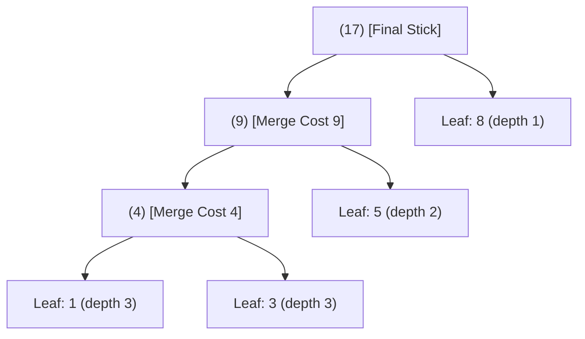

# Guided Example: Minimum Cost to Connect Sticks

We trace the greedy min-heap priority queue algorithm (equivalent to optimal Huffman tree construction) to minimize the cumulative cost of merging $N$ sticks into a single piece.

- **Input:** $sticks = [1, 8, 3, 5]$
- **Required output:** `30`

This instance illustrates greedy choice optimality, repeated element re-insertion, tree-depth cost weighting, and single-element boundary handling.

---

## 1. Instance & Teaching Goal

We are given an array $sticks$ containing $N$ positive integers representing stick lengths. In each step, we pick any two sticks of lengths $x$ and $y$, pay cost $x + y$, and replace them with a single merged stick of length $x + y$. We repeat this process until exactly one stick remains. We seek the minimum possible total cost.

Consider connecting sticks in an arbitrary or left-to-right order:

```text
Suboptimal Merging vs. Optimal Greedy Merging:

Arbitrary Merge (merging 8 and 5 first):
  Merge 8 + 5 = 13 (cost = 13, sticks: [1, 3, 13])
  Merge 13 + 3 = 16 (cost = 13 + 16 = 29, sticks: [1, 16])
  Merge 16 + 1 = 17 (cost = 29 + 17 = 46, sticks: [17])
  Total Cost = 46 (suboptimal!)

Optimal Greedy Merge:
  Merge 1 + 3 = 4 (cost = 4, sticks: [4, 5, 8])
  Merge 4 + 5 = 9 (cost = 4 + 9 = 13, sticks: [8, 9])
  Merge 8 + 9 = 17 (cost = 13 + 17 = 30, sticks: [17])
  Total Cost = 30 (optimal!)
```

The fundamental teaching goal is to recognize that this problem is mathematically isomorphic to constructing an **Optimal Binary Merge Tree** (or Huffman Coding Tree). In any sequence of connections:

$$\text{Total Cost} = \sum_{i=1}^N \ell_i \cdot d_i$$

where $\ell_i$ is the initial length of stick $i$, and $d_i$ is its depth in the resulting merge tree (the number of times stick $i$ participates in a connection). To minimize this sum, the largest stick lengths must have the smallest depths, and the smallest stick lengths must be placed deepest.

---

## 2. Conceptual Foundation & Invariants

Let $H$ be a min-heap initially populated with all elements of $sticks$.

### The Greedy Choice Invariant

At each merge step, extracting the two globally minimal values $x = \min(H)$ and $y = \min(H \setminus \{x\})$ is strictly optimal:
1. Connecting $x$ and $y$ first assigns them the deepest shared subtree level.
2. The merged stick $x + y$ is pushed back into the heap $H$, taking its rightful place among all remaining sticks.

| State Component | Data Structure | Invariant Semantics |
|---|---|---|
| Active Sticks | Min-Heap $H$ | Always provides the two smallest available lengths in $\mathcal{O}(\log \lvert H \rvert)$ |
| Extracted Pair $(x, y)$ | Smallest two integers | Locally optimal merge candidates |
| Connection Step Cost | $x + y$ | Incremental cost incurred for the current union |
| Cost Accumulator | Integer scalar | Cumulative sum of all $(N - 1)$ connection costs |



> **Huffman Optimality Invariant.** At any stage with $|H| \ge 2$, merging the two smallest elements in $H$ preserves the global optimal substructure. No alternative choice of first merge can produce a strictly lower total cost.

---

## 3. Step-by-Step Worked Execution

We trace $sticks = [1, 8, 3, 5]$ ($N = 4$).

### Step 0: Initialization

- Populate min-heap: $H = [1, 5, 3, 8]$ (min-heap representation).
- Initialize $total\_cost = 0$.
- Total connections required: $N - 1 = 3$.

---

### Step 1: Round 1 ($|H| = 4$)

1. **Extract Two Smallest:**
   - Pop smallest: $x = 1$.
   - Pop second smallest: $y = 3$.
2. **Merge & Cost:**
   - Step cost: $x + y = 1 + 3 = 4$.
   - Accumulate cost: $total\_cost = 0 + 4 = 4$.
3. **Reinsert Composite Stick:**
   - Push $4$ into $H$.
   - Heap contents: $[4, 5, 8]$.

---

### Step 2: Round 2 ($|H| = 3$)

1. **Extract Two Smallest:**
   - Pop smallest: $x = 4$.
   - Pop second smallest: $y = 5$.
2. **Merge & Cost:**
   - Step cost: $x + y = 4 + 5 = 9$.
   - Accumulate cost: $total\_cost = 4 + 9 = 13$.
3. **Reinsert Composite Stick:**
   - Push $9$ into $H$.
   - Heap contents: $[8, 9]$.

---

### Step 3: Round 3 ($|H| = 2$)

1. **Extract Two Smallest:**
   - Pop smallest: $x = 8$.
   - Pop second smallest: $y = 9$.
2. **Merge & Cost:**
   - Step cost: $x + y = 8 + 9 = 17$.
   - Accumulate cost: $total\_cost = 13 + 17 = 30$.
3. **Reinsert Composite Stick:**
   - Push $17$ into $H$.
   - Heap contents: $[17]$.

---

### Termination

Heap size $|H| = 1$. Exactly one stick remains.
Emit $total\_cost = \mathbf{30}$.

---

## 4. Complete Execution Trace

| Round | Heap Before Step | Popped $x$ | Popped $y$ | Merge Cost ($x+y$) | Running Total Cost | Heap After Push |
|---|---|---|---|---|---|---|
| $0$ (Init) | $[1, 3, 5, 8]$ | — | — | — | $0$ | $[1, 3, 5, 8]$ |
| $1$ | $[1, 3, 5, 8]$ | $1$ | $3$ | $1 + 3 = 4$ | $4$ | $[4, 5, 8]$ |
| $2$ | $[4, 5, 8]$ | $4$ | $5$ | $4 + 5 = 9$ | $13$ | $[8, 9]$ |
| $3$ | $[8, 9]$ | $8$ | $9$ | $8 + 9 = 17$ | **30** | $[17]$ |

```text
Depth Analysis of Individual Leaves:
  Stick 1: Depth 3 -> Contributes 1 * 3 =  3
  Stick 3: Depth 3 -> Contributes 3 * 3 =  9
  Stick 5: Depth 2 -> Contributes 5 * 2 = 10
  Stick 8: Depth 1 -> Contributes 8 * 1 =  8
  -----------------------------------------
  Total Tree Cost: 3 + 9 + 10 + 8 = 30
```

---

## 5. Algorithmic Correctness

**Theorem (Greedy Exchange Argument for Sticks).**
1. **Tree Formulation:** Every valid sequence of merges maps to a full binary tree with $N$ leaves. The sum of all internal node values equals the total cost $\sum_{i=1}^N \ell_i \cdot d_i$.
2. **Sibling Pairing:** Let $x$ and $y$ be the two smallest lengths in $sticks$. There exists an optimal binary tree where $x$ and $y$ are sibling leaves at the maximum depth.
   - *Proof:* Suppose an optimal tree $T^*$ places two other leaves $a, b$ at maximum depth with $a \ge x$ and $b \ge y$. Swapping $x$ with $a$ and $y$ with $b$ changes total cost by $(\ell_x - \ell_a)(d_{\max} - d_x) \le 0$ since $\ell_x \le \ell_a$ and $d_{\max} \ge d_x$. Thus, cost cannot increase.
3. **Induction:** Replacing $x$ and $y$ with their sum $x+y$ produces an identical problem of size $N - 1$. By induction, repeated selection of the two minimal elements is globally optimal.

---

## 6. Traps This Instance Exposes

| Trap Category | Hazard Scenario | Root Cause | Preventive Design Invariant |
|---|---|---|---|
| **Single-Stick Edge Case** | $sticks = [5]$ | Input already has only one stick; no connections can or should be made. | Check $N \le 1$: immediately return $0$. |
| **Static Sorting Fallacy** | Sorting the array once and merging adjacent elements linearly | After merging $x + y$, the new composite stick may exceed other elements and must be reordered dynamically. | Use a dynamic min-heap (priority queue) or dual queues. |
| **Paging / Queue Re-insertion Order** | Appending sum to the back of a plain list without re-sorting | Destroys the ascending order property in $\mathcal{O}(1)$ time. | Always use `heappush` to restore the heap property in $\mathcal{O}(\log N)$. |
| **Integer Truncation / Overflow** | For constraints with large values, intermediate sum exceeding 32-bit integer | Total cost can grow to $\mathcal{O}(N \cdot \max(\ell) \cdot \log N)$. | Use 64-bit integers (`long long` in C++ / Java). |

---

## 7. Complexity Derivation

### Time Complexity

1. **Heap Initialization:**
   - Building a min-heap from an array of $N$ integers using `heapify`:

$$T_{\text{build}} = \mathcal{O}(N)$$

2. **Iterative Merges:**
   - The loop runs exactly $N - 1$ iterations.
   - In each iteration: two `heappop` operations and one `heappush` operation.
   - Each heap operation on a heap of size $\le N$ takes $\mathcal{O}(\log N)$ time.

$$T_{\text{merges}} = \sum_{k=2}^N 3 \log k = \mathcal{O}(N \log N)$$

3. **Total Time Complexity:**

$$\mathcal{O}(N \log N)$$

For $N = 10{,}000$, total heap operations are $\approx 3 \times 10^4 \times 14 \approx 4.2 \times 10^5$, executing in under $10 \text{ ms}$.

### Auxiliary Space Complexity

- The min-heap stores at most $N$ elements at any time.
- Total Auxiliary Space Complexity:

$$\mathcal{O}(N)$$
