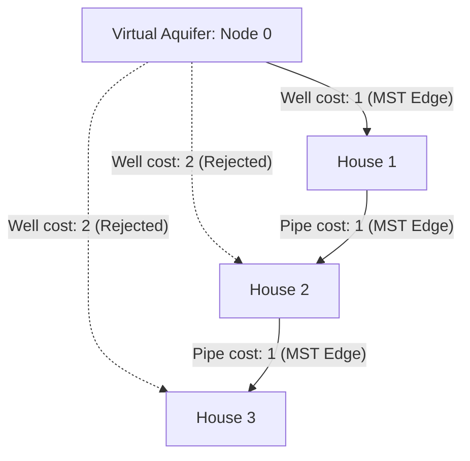

# Guided Example: Optimize Water Distribution in a Village

We trace the virtual-source augmentation technique combined with Kruskal's Minimum Spanning Tree (MST) algorithm to optimize water distribution across a village using wells and pipes.

- **Input:** $n = 3$, $wells = [1, 2, 2]$, $pipes = [[1, 2, 1], [2, 3, 1]]$
- **Required output:** `3`

This instance illustrates transforming localized node-activation costs into graph edge weights via a virtual aquifer node, cycle elimination, and disjoint-set component union.

---

## 1. Instance & Teaching Goal

In a village with $n$ houses, water can be supplied to each house through two mechanisms:
1. **Direct Well:** Build a well inside house $i$ at cost $wells[i-1]$.
2. **Piped Connection:** Lay a bidirectional pipe between house $u$ and house $v$ at cost $w$.

A house receives water if it either contains a well itself or is connected through a network of pipes to another house containing a well. We must minimize the total expenditure to supply water to all $n$ houses.

```text
The Node-Cost Dilemma vs. Virtual Aquifer Graph:

Physical Village:
  Houses have individual well costs: [w1=1, w2=2, w3=2]
  Pipes exist between pairs: (1-2: 1), (2-3: 1)
  Challenge: How to trade off building wells vs laying pipes?

Augmented Virtual Graph:
  Introduce a virtual source (Node 0) representing the underground aquifer.
  Building a well at house i is modeled as an edge: (0, i) with cost wells[i-1].
  Laying a pipe between i and j is an edge: (i, j) with cost w.
  
  Now, supplying water to every house is EXACTLY finding a Minimum Spanning Tree
  connecting all n + 1 nodes (Node 0 through Node n)!
```

The primary teaching goal is the **Virtual Super-Source Transformation**: converting a heterogeneous problem (node activation costs + edge connection costs) into a homogeneous Minimum Spanning Tree on an $(n + 1)$-vertex graph.

---

## 2. Conceptual Foundation & Invariants

Let $V = \{1, 2, \dots, n\}$ be the set of houses.
We introduce virtual node $0$ (the aquifer) to create augmented vertex set $V^* = \{0, 1, \dots, n\}$ containing $n + 1$ vertices.

### Edge Set Construction

The augmented edge set $E^*$ consists of two classes of edges:
1. **Well Edges:** For each house $i \in \{1, \dots, n\}$, add undirected edge $(0, i)$ with weight $wells[i-1]$.
2. **Pipe Edges:** For each pipe $[u, v, w]$, add undirected edge $(u, v)$ with weight $w$.

Total edges: $|E^*| = n + |pipes|$.

### Disjoint Set Union (DSU) and Kruskal's Invariant

- Sort all edges in $E^*$ in non-decreasing order of weight.
- Maintain a Disjoint Set data structure over $V^* = \{0, 1, \dots, n\}$.
- For each edge $(u, v, w)$ in sorted order:
  - If $\text{find}(u) \ne \text{find}(v)$, the edge connects two previously disjoint components. Add $w$ to total cost and union the components.
  - If $\text{find}(u) = \text{find}(v)$, the edge creates a cycle (redundant connection). Discard it.
- Terminate when exactly $n$ edges have been accepted (spanning all $n + 1$ vertices).

| Graph Component | Physical Meaning | Augmented Representation |
|---|---|---|
| Node $0$ | Underground Aquifer / Reservoir | Virtual root vertex |
| Nodes $1 \dots n$ | Village Houses | Vertices to be supplied |
| Edge $(0, i)$ with weight $wells[i-1]$ | Drilling a well at house $i$ | Edge connecting aquifer to house $i$ |
| Edge $(u, v)$ with weight $w$ | Laying pipe between houses $u$ and $v$ | Edge connecting house $u$ to house $v$ |
| Spanning Tree on $V^*$ | Universal water delivery network | Tree with $n$ edges connecting $n+1$ nodes |



> **Aquifer Connectivity Invariant.** In any spanning tree of $V^*$, every house $i \in \{1, \dots, n\}$ has a unique simple path to node $0$. The first edge on this path incident to $0$ represents the specific well supplying water to that connected sub-network.

---

## 3. Step-by-Step Worked Execution

We trace $n = 3$, $wells = [1, 2, 2]$, $pipes = [[1, 2, 1], [2, 3, 1]]$.

### Step 0: Construct and Sort Augmented Edge List

1. **Well Edges (from node 0):**
   - $(0, 1, \text{cost } 1)$
   - $(0, 2, \text{cost } 2)$
   - $(0, 3, \text{cost } 2)$
2. **Pipe Edges:**
   - $(1, 2, \text{cost } 1)$
   - $(2, 3, \text{cost } 1)$
3. **Sorted Augmented Edge List:**
   - Edge 1: $(1, 2)$, weight = $1$ (pipe)
   - Edge 2: $(2, 3)$, weight = $1$ (pipe)
   - Edge 3: $(0, 1)$, weight = $1$ (well)
   - Edge 4: $(0, 2)$, weight = $2$ (well)
   - Edge 5: $(0, 3)$, weight = $2$ (well)

Initialize DSU with 4 disjoint sets: $\{0\}, \{1\}, \{2\}, \{3\}$.
Initialize $total\_cost = 0$, $edges\_count = 0$.

---

### Step 1: Inspect Edge $(1, 2)$, weight $1$
- $\text{find}(1) = 1$, $\text{find}(2) = 2$.
- Components are disjoint.
- Union: Merge $\{1\}$ and $\{2\} \implies \{1, 2\}$.
- Accumulate: $total\_cost = 0 + 1 = 1$.
- Accepted edges: $1$ of $3$.

---

### Step 2: Inspect Edge $(2, 3)$, weight $1$
- $\text{find}(2) = 1$, $\text{find}(3) = 3$.
- Components are disjoint.
- Union: Merge $\{1, 2\}$ and $\{3\} \implies \{1, 2, 3\}$.
- Accumulate: $total\_cost = 1 + 1 = 2$.
- Accepted edges: $2$ of $3$.

---

### Step 3: Inspect Edge $(0, 1)$, weight $1$
- $\text{find}(0) = 0$, $\text{find}(1) = 1$.
- Components are disjoint.
- Union: Merge $\{0\}$ and $\{1, 2, 3\} \implies \{0, 1, 2, 3\}$.
- Accumulate: $total\_cost = 2 + 1 = 3$.
- Accepted edges: $3$ of $3$.

---

### Termination
Exactly $n = 3$ edges accepted. All $n + 1 = 4$ vertices belong to a single connected component.
Remaining edges $(0, 2)$ and $(0, 3)$ would create cycles and are discarded.
Total minimum cost: **3**.

---

## 4. Complete Execution Trace

| Edge Rank | Edge $(u, v)$ | Type | Weight | Component $u$ | Component $v$ | Action | Added Cost | Running Total | Accepted Edges |
|---|---|---|---|---|---|---|---|---|---|
| $1$ | $(1, 2)$ | Pipe | $1$ | $\{1\}$ | $\{2\}$ | **Union** | $+1$ | $1$ | $1 / 3$ |
| $2$ | $(2, 3)$ | Pipe | $1$ | $\{1, 2\}$ | $\{3\}$ | **Union** | $+1$ | $2$ | $2 / 3$ |
| $3$ | $(0, 1)$ | Well | $1$ | $\{0\}$ | $\{1, 2, 3\}$ | **Union** | $+1$ | **3** | $3 / 3$ (Complete) |
| $4$ | $(0, 2)$ | Well | $2$ | $\{0, 1, 2, 3\}$ | $\{0, 1, 2, 3\}$ | Reject (Cycle) | $+0$ | $3$ | $3 / 3$ |
| $5$ | $(0, 3)$ | Well | $2$ | $\{0, 1, 2, 3\}$ | $\{0, 1, 2, 3\}$ | Reject (Cycle) | $+0$ | $3$ | $3 / 3$ |

```text
Final Water Distribution Network:
  - Well built at House 1: Cost = 1
  - Pipe laid between House 1 and House 2: Cost = 1
  - Pipe laid between House 2 and House 3: Cost = 1
  
Water Flow:
  Aquifer (0) ===[well: 1]===> House 1 ===[pipe: 1]===> House 2 ===[pipe: 1]===> House 3
  Every house receives water. Total cost = 3.
```

---

## 5. Algorithmic Correctness

**Theorem (Spanning Tree Equivalence).**
1. **Feasibility:** A water supply configuration is valid if and only if every connected component of houses contains at least one well. In the augmented graph $G^*$, this is equivalent to every house vertex having a path to the virtual source $0$.
2. **Tree Minimality:** In any connected subgraph containing positive edge weights, removing any cycle preserves connectivity and strictly reduces or maintains weight. Thus, the minimum-cost water supply configuration forms a cycle-free tree spanning all $n + 1$ vertices.
3. **Optimality of Kruskal's Algorithm:** By the Cut Property of Minimum Spanning Trees, the greedy addition of the lightest edge between disjoint components guarantees finding a globally minimal spanning tree.

---

## 6. Traps This Instance Exposes

| Trap Category | Hazard Scenario | Root Cause | Preventive Design Invariant |
|---|---|---|---|
| **Single Well Assumption** | Forcing the network to build only one well | If pipes are very expensive, building multiple independent wells is cheaper (e.g. 3 wells of cost 1 vs pipes of cost 100). | The virtual node $0$ naturally allows multiple edges incident to $0$ to be chosen if cheaper. |
| **0-Indexed vs 1-Indexed Discrepancy** | Using DSU of size $n$ when houses are indexed $1 \dots n$ and virtual node is $0$ | Array index out of bounds on house $n$. | Size DSU array to at least $n + 1$. |
| **Parallel Pipe Duplication** | Multiple pipes provided between the same pair of houses | Attempting to dedup pipes into an adjacency matrix before sorting. | Kruskal's algorithm naturally handles multi-edges without preprocessing; sorting automatically picks the cheapest. |
| **Premature Termination** | Stopping after checking pipes without evaluating wells | Leaving houses disconnected from any water source. | Include all well edges $(0, i)$ in the primary edge list before sorting. |

---

## 7. Complexity Derivation

Let $N$ be the number of houses, and $M$ be the number of pipes.
The augmented graph has:
- $V = N + 1$ vertices
- $E = N + M$ edges

### Time Complexity

1. **Augmented Edge List Construction:** Appending $N$ well edges to $M$ pipe edges takes $\mathcal{O}(N + M)$ time.
2. **Edge Sorting:** Sorting $N + M$ edges:

$$T_{\text{sort}} = \mathcal{O}((N + M) \log(N + M))$$

3. **Kruskal's Traversal:**
   - At most $N + M$ edge inspections.
   - Each DSU `find` and `union` with path compression and union-by-rank takes $\mathcal{O}(\alpha(N))$ amortized time.

$$T_{\text{DSU}} = \mathcal{O}((N + M) \cdot \alpha(N))$$

4. **Total Time Complexity:**

$$\mathcal{O}((N + M) \log(N + M))$$

For $N, M \le 10{,}000$, $(N + M) \log(N + M) \approx 20000 \times 15 \approx 3 \times 10^5$ operations, running in under $10 \text{ ms}$.

### Auxiliary Space Complexity

- DSU `parent` and `rank` arrays of size $N + 1$: $\mathcal{O}(N)$.
- Augmented edge list storing $N + M$ tuples: $\mathcal{O}(N + M)$.
- Total Auxiliary Space Complexity:

$$\mathcal{O}(N + M)$$
