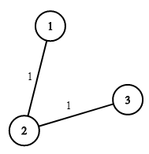

### 1. Description

There are `n` houses in a village. We want to supply water for all the houses by building wells and laying pipes.

For each house `i`, we can either build a well inside it directly with cost $wells[i - 1]$ (note the `-1` due to **0-indexing**), or pipe in water from another well to it. The costs to lay pipes between houses are given by the array `pipes` where each $\text{pipes}[j] = [\text{house1}_{j}, \text{house2}_{j}, \text{cost}_{j}]$ represents the cost to connect $\text{house1}_{j}$ and $\text{house2}_{j}$ together using a pipe. Connections are bidirectional, and there could be multiple valid connections between the same two houses with different costs.

Return *the minimum total cost to supply water to all houses*.

### 2. Function Contract

**Inputs**

- `n`: The number of houses, labeled from `1` through `n`.
- `wells`: A length-$n$ array in which $wells[i - 1]$ is the cost of building a well at house $i$.
- `pipes`: An array of offers. Each $\text{pipes}[j] = [\text{house1}_{j}, \text{house2}_{j}, \text{cost}_{j}]$ gives the cost of a bidirectional pipe between two different houses.

Parallel offers between the same two houses are allowed. Water may travel through any number of selected pipes. Let $p$ be `pipes.length` and let $e=n+p$, the total number of well and pipe choices.

**Return value**

- The minimum integer sum of selected well-building and pipe-laying costs that supplies all $n$ houses.

### 3. Examples

#### Example 1

- **Input:** $n = 3, wells = [1,2,2], pipes = [[1,2,1],[2,3,1]]$
- **Output:** `3`
- **Explanation:** The image shows the costs of connecting houses using pipes.
The best strategy is to build a well in the first house with cost 1 and connect the other houses to it with cost 2 so the total cost is 3.
#### Example 2

- **Input:** $n = 2, wells = [1,1], pipes = [[1,2,1],[1,2,2]]$
- **Output:** `2`
- **Explanation:** We can supply water with cost two using one of the three options:
Option 1:
- Build a well inside house 1 with cost 1.
- Build a well inside house 2 with cost 1.
The total cost will be 2.
Option 2:
- Build a well inside house 1 with cost 1.
- Connect house 2 with house 1 with cost 1.
The total cost will be 2.
Option 3:
- Build a well inside house 2 with cost 1.
- Connect house 1 with house 2 with cost 1.
The total cost will be 2.
Note that we can connect houses 1 and 2 with cost 1 or with cost 2 but we will always choose **the cheapest option**.

### 4. Constraints

- $2 \le n \le 10^{4}$

- $\text{wells.length} = n$

- $0 \le \text{wells}[i] \le 10^{5}$

- $1 \le \text{pipes.length} \le 10^{4}$

- $\text{pipes}[j].length = 3$

- $1 \le \text{house1}_{j}, \text{house2}_{j} \le n$

- $0 \le \text{cost}_{j} \le 10^{5}$

- $\text{house1}_{j} \neq \text{house2}_{j}$