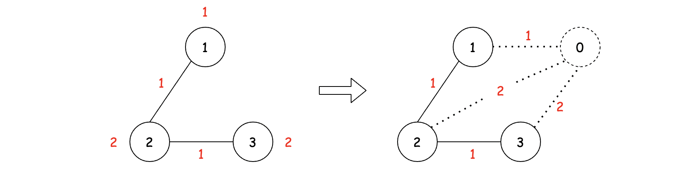
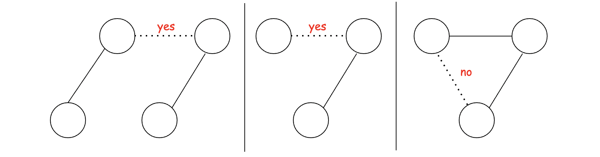

[TOC]

## Solution

---
### Overview

Since the problem description involves connecting houses (vertices) using pipes (edges), we can tell that this problem is a variant of graph problems.
More precisely, we can convert it into a standard [minimum spanning tree (MST)](https://en.wikipedia.org/wiki/Minimum_spanning_tree) problem, which we will discuss in detail how to do so in this article.

Concerning the MST problem, there exist several classic algorithms.
In particular, we will demonstrate two of them, namely [Prim's algorithm](https://en.wikipedia.org/wiki/Prim%27s_algorithm) and [Kruskal's algorithm](https://en.wikipedia.org/wiki/Kruskal%27s_algorithm), which are arguably the most popular ones and feasible to implement during an interview.

**Intuition**

First of all, let us introduce the problem of the minimum spanning tree.

>Given a _connected_, _edge-weighted_ and _undirected_ graph, a minimum spanning tree is a **_subset_** of edges that connect all vertices while the total weights of these edges are minimum among all possible subsets.

One can draw some similarities between the above definition and our problem here.
Specifically, we can consider each house as a vertex in a graph, and the pipes between the houses as edges in the graph.

However, there is one major **difference** between them.
In our problem, every vertex and every edge comes with a cost.
While in the setting of MST, only the edges are associated with the costs.

>To bridge the **_gap_**, as suggested in the hints, the trick is to add **one virtual vertex** to the existing graph. Along with the addition of vertex, we also add edges between the virtual vertex and the rest of the vertices.
Finally, we reassign the cost of each vertex to the corresponding newly-added edge.

Here is an illustration showing how we convert the graph in the example with the above trick.



With the converted graph, we then can take into account the costs from the vertex, via the additional edges.
We can focus entirely on selecting the appropriate edges to create an MST.
Thus, our problem is simplified to creating an MST from a list of weighted edges.


In the above graph, we demonstrate the solution that we will find after solving the MST problem, which we can translate as _"to minimize the cost, we should dig a well in the house indexed with `1` (denoted by the edge between indices `1` and `0`), and then supply the water to the rest of the houses_."

---
### Approach 1: Prim's Algorithm with Heap

**Intuition**

[Prim's](https://en.wikipedia.org/wiki/Prim%27s_algorithm) (also known as Jarník's) algorithm is a **_greedy_** algorithm used to find the minimum spanning tree in a _weighted_ and _undirected_ graph.

>The algorithm operates by building the tree one vertex at a time, from an arbitrary starting vertex, at each step adding the **_cheapest_** possible connection from any vertex in the tree to a vertex that is not in the tree.


The above illustration demonstrates how Prim's algorithm works.
Starting from an arbitrary vertex, Prim's algorithm **_grows_** the minimum spanning tree by adding one vertex at a time to the tree.
The choice of a vertex is based on the **_greedy_** strategy, _i.e._ the addition of the new vertex incurs the minimum cost.

**Algorithm**

To implement Prim's algorithm, essentially we will need the following three data structures:

- **adjacency list**: we need this to represent the graph, _i.e._ vertices and edges. The adjacency list can be a list of lists or a dictionary of lists.

- **set**: we need a set to maintain all the vertices that we have added to the final minimum spanning tree, during the construction of the tree.
With the help of set, we can determine whether a vertex has been added or not.

- **heap**: due to the nature of the greedy strategy, at each step, we can determine the best edge to be added based on the cost it will add to the tree.
[Heap](https://en.wikipedia.org/wiki/Heap_(data_structure)) (also known as a priority queue) is a data structure that allows us to retrieve the minimum element in constant time and to remove the minimum element in logarithmic time. This fits our need to repeatedly find the lowest cost edge perfectly.

**Implementation**

By applying the above three data structures, the following steps can be used to implement Prim's algorithm.

- First of all, given the input, we need to build a graph representation with the adjacency list.
- Note that, since the graph is undirected (_i.e._ bidirectional), for each pipe, we need to add two entries in the adjacency list, with each end of the pipe as a starting vertex.
- Also, to convert our problem into the MST problem, we need to add a virtual vertex (we index it as `0`) together with the additional `n` edges to each house.

- Starting from the virtual vertex, we build the MST by **_iteratively_** adding one vertex at a time.
- Note, when using Prim's algorithm, we can use any vertex as a starting point.
    Here, for the sake of convenience, we start from the newly-added virtual vertex.

- The process of building MST consists of a loop with the following substeps:

  - Each iteration, we pop an element from the heap. This element contains a vertex along with the cost that is associated with the edge that connecting the vertex to the tree.
  The vertex is chosen if it is not already in the tree.
  We know that the cost of this vertex is minimal among all choices because it was popped from the heap.

  - Once the vertex is added, we then examine its neighboring vertices.
  Specifically, we add these vertices along with their edges into the heap as the candidates for the next round of selection.

  - The loop **terminates** when we have added all the vertices from the graph into the MST.

```python
class Solution:
    def minCostToSupplyWater(self, n: int, wells: List[int], pipes: List[List[int]]) -> int:

        # bidirectional graph represented in adjacency list
        graph = defaultdict(list)

        # add a virtual vertex indexed with 0.
        #   then add an edge to each of the house weighted by the cost
        for index, cost in enumerate(wells):
            graph[0].append((cost, index + 1))

        # add the bidirectional edges to the graph
        for house_1, house_2, cost in pipes:
            graph[house_1].append((cost, house_2))
            graph[house_2].append((cost, house_1))

        # A set to maintain all the vertex that has been added to
        #   the final MST (Minimum Spanning Tree),
        #   starting from the vertex 0.
        mst_set = set([0])

        # heap to maitain the order of edges to be visited,
        #   starting from the edges originated from the vertex 0.
        # Note: we can start arbitrarily from any node.
        heapq.heapify(graph[0])
        edges_heap = graph[0]

        total_cost = 0
        while len(mst_set) < n + 1:
            cost, next_house = heapq.heappop(edges_heap)
            if next_house not in mst_set:
                # adding the new vertex into the set
                mst_set.add(next_house)
                total_cost += cost
                # expanding the candidates of edge to choose from
                #   in the next round
                for new_cost, neighbor_house in graph[next_house]:
                    if neighbor_house not in mst_set:
                        heapq.heappush(edges_heap, (new_cost, neighbor_house))

        return total_cost
```

**Complexity Analysis**

Let $N$ be the number of houses, and $M$ be the number of pipes from the input.

- Time Complexity: $O\big( (N+M) \cdot \log(N+M) \big)$

- To build the graph, we iterate through the houses and pipes in the input, which takes $O(N + M)$ time.

- While building the MST, we might need to iterate through all the edges in the graph in the worst case, which amounts to $N + M$ in total.
    For each edge, it would enter and exit the heap data structure at most once. The enter of edge into heap (_i.e._ `push` operation) takes $\log(N+M)$ time, while the exit of edge (_i.e._ `pop` operation) takes a constant time.
    Therefore, the time complexity of the MST construction process is $O\big( (N+M) \cdot \log(N+M) \big)$.

- To sum up, the overall time complexity of the algorithm is $O\big( (N+M) \cdot \log(N+M) \big)$.

- Space Complexity: $O(N+M)$

- We break down the analysis accordingly into the three major data structures that we used in the algorithm.

- The graph that we built consists of $N+1$ vertices and $2 \cdot M$ edges (_i.e._ pipes are bidirectional).
    Therefore, the space complexity of graph is $O(N + 1 + 2 \cdot M) = O(N + M)$.

- The space complexity of the set that is used to hold the vertices in MST is $O(N)$.

- Finally, in the worst case, the heap we used might hold all the edges in the graph which is $(N+M)$.

- To summarize, the overall space complexity of the algorithm is $O(N+M)$.

---
### Approach 2: Kruskal's Algorithm with Union-Find

**Intuition**

Another classical algorithm to solve the MST problem is called [Kruskal's algorithm](https://en.wikipedia.org/wiki/Kruskal%27s_algorithm).

>Similiar to Prim's algorithm, Kruskal's algorithm applies the **_greedy_** strategy to **_incrementally_** add new edges to the final solution.


The above animation shows how Kruskal's algorithm **_grows_** the minimum spanning tree.

>A major difference between them is that in Prim's algorithm the MST (minimal spanning tree) remains **_connected_** as a whole throughout the entire process, while in Kruskal's algorithm, the tree is formed by _merging_ the _**disjoint components**_ together.

**Algorithm**

Rather than adding vertices as in Prim's algorithm, the Kruskal's algorithm focuses on adding edges.
Furthermore, in Kruskal's algorithm, we consider **_all edges at once_** ranked by their costs, while in Prim's algorithm, although edges are ranked by costs in a heap or priority queue, at each iteration, we only explore **_edges that are connected to the vertices that are already in the MST_**.

>The overall idea of Kruskal's algorithm is that we **_iterate_** through all the edges *ordered* by their costs. For each edge, we decide whether to add it to the final MST. The decision is based on whether this new addition will help to **_connect_** more dots (_i.e._ vertices).



*Add or Not to Add ?*

The above diagram shows three example scenarios and for each scenario, specifies whether a new edge should be added or not.
The solid edges have already been added to the MST, while the dashed edges have yet to be decided.

- In the example on the left, we should add the new edge, since the edge **_bridges_** the gap between the two disjoint components.
- In the middle example, we should also add the new edge, since it **_connects_** to an unseen vertex (_i.e._ connecting more dots).
- In the example on the right, we should **not** add the new edge. Because it does not help us to make the current MST more **_connected_**, since all vertices are connected already.

>A more concise **_criteria_** to determine whether we should add a new edge in Kruskal's algorithm is that whether both ends of the edge belong to the same component (group).

**Implementation**

In order to determine the membership for a collection of elements, we often apply the data structure called [Disjoint Set](https://en.wikipedia.org/wiki/Disjoint-set_data_structure) which is also known as **Union-Find** data structure.

Essentially, the Union-Find data structure provides two interfaces:

- `find(a)`: the function returns the id of the group where the element `a` belongs to.
- `union(a, b)`: the function joins the two groups that the element `a` and `b` belong to. If they belong to the same group already, then the function does nothing.

We provide a full-fledged version of the Union-Find data structure with *path compression* and *link-by-rank* in the sample implementation.

If one would like to know more about how the Union-Find data structure works, one can refer to the solution for the problem of [323. Number of Connected Components in an Undirected Graph](https://leetcode.com/problems/number-of-connected-components-in-an-undirected-graph/) and a [tutorial](https://www.cs.princeton.edu/~wayne/kleinberg-tardos/pdf/UnionFind.pdf) from Princeton University.

Given the Union-Find data structure, we can implement Kruskal's algorithm with the following two steps:

- First of all, we __sort__ all the edges based on their costs, including the additional edges that are added with the virtual vertex.

- We then **iterate** through the _sorted_ edges. For each edge, if both ends of the edge belong to different groups, with the help of the Union-Find data structure, we then add this edge into the final MST.

```python
class UnionFind:
    """
        Implementation of UnionFind without load-balancing.
    """
    def __init__(self, size) -> None:
        """
        container to hold the group id for each member
        Note: the index of member starts from 1,
            thus we add one more element to the container.
        """
        self.group = [i for i in range(size + 1)]
        # the rank of each node for later rebalancing
        self.rank = [0] * (size + 1)

    def find(self, person: int) -> int:
        """
            return the group id that the person belongs to
        """
        if self.group[person] != person:
            self.group[person] = self.find(self.group[person])
        return self.group[person]

    def union(self, person_1: int, person_2: int) -> bool:
        """
            Join the groups together.
            return:
                false when the two persons belong to the same group already,
                otherwise true
        """
        group_1 = self.find(person_1)
        group_2 = self.find(person_2)
        if group_1 == group_2:
            return False

        # attach the group of lower rank to the group with higher rank
        if self.rank[group_1] > self.rank[group_2]:
            self.group[group_2] = group_1
        elif self.rank[group_1] < self.rank[group_2]:
            self.group[group_1] = group_2
        else:
            self.group[group_1] = group_2
            self.rank[group_2] += 1

        return True

class Solution:
    def minCostToSupplyWater(self, n: int, wells: List[int], pipes: List[List[int]]) -> int:
        ordered_edges = []
        # add the virtual vertex (index with 0) along with the new edges.
        for index, weight in enumerate(wells):
            ordered_edges.append((weight, 0, index+1))

        # add the existing edges
        for house_1, house_2, weight in pipes:
            ordered_edges.append((weight, house_1, house_2))

        # sort the entire edges by their weights
        ordered_edges.sort(key=lambda x: x[0])

        # iterate through the ordered edges
        uf = UnionFind(n)
        total_cost = 0
        for cost, house_1, house_2 in ordered_edges:
            # determine if we should add the new edge to the final MST
            if uf.union(house_1, house_2):
                total_cost += cost

        return total_cost
```

**Note:** in the above implementation, we **tweak** the `union(a, b)` a bit to make the code more efficient and concise.

In most implementations of Union-Find data structure, we do not return anything for the function of `union(a, b)`.
However, in our case, we return a flag to indicate whether the joining actually happens within the function.
With this tweak, we only need to invoke the `union(a,b)` function in our iteration, rather than invoking $find(a) = find(b)$ functions in addition.

**Complexity Analysis**

Since we applied the Union-Find data structure in our algorithm, let's begin with a statement on the time complexity of the data structure:

>If $K$ operations, either Union or Find, are applied to $L$ elements, the total run time is $\mathcal{O}(K \cdot \log^{*}{L})$, where $\log^{*}$ is the [iterated logarithm](https://en.wikipedia.org/wiki/Iterated_logarithm).

One can refer to the [proof of Union-Find complexity](https://en.wikipedia.org/wiki/Proof_of_O(log*n)_time_complexity_of_union%E2%80%93find) and the [tutorial](https://www.cs.princeton.edu/~wayne/kleinberg-tardos/pdf/UnionFind.pdf) from Princeton University for more details.

Let $N$ be the number of houses, and $M$ be the number of pipes from the input.

- Time Complexity: $O\big((N+M) \cdot \log(N+M) \big)$

- First, we build a list of edges, which takes $O(N + M)$ time.

- We then sort the list of edges, which takes $O\big((N+M) \cdot \log(N+M) \big)$ time.

- At the end, we iterate through the sorted edges. For each iteration, we invoke a Union-Find operation. Hence, the time complexity for iteration is $O\big( (N+M) * \log^{*}(N) \big)$.

- To sum up, the overall time complexity of the algorithm is $O\big((N+M) \cdot \log(N+M) \big)$ which is dominated by the sorting step.

- Space Complexity: $O(N+M)$

- The space complexity of our Union-Find data structure is $O(N)$.

- The space required by the list of edges is $O(N+M)$.

- Finally, the space complexity of the sorting algorithm depends on the implementation of each programming language. For instance, the `list.sort()` function in Python is implemented with the [Timsort](https://en.wikipedia.org/wiki/Timsort) algorithm whose space complexity is $\mathcal{O}(n)$ where $n$ is the number of the elements.
    While in Java, the [Collections.sort()](https://docs.oracle.com/javase/7/docs/api/java/util/Collections.html#sort(java.util.List)) is implemented as a variant of quicksort algorithm whose space complexity is $\mathcal{O}(\log{n})$.

- To sum up, the overall space complexity of the algorithm is $O(N+M)$ which is dominated by the list of edges.

---