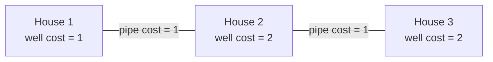

## Examples

**Example 1**

The independent diagram records every well and pipe cost shown for this village:

- Input: `n = 3, wells = [1,2,2], pipes = [[1,2,1],[2,3,1]]`
- Output: `3`
- Explanation: Build a well at house `1` for cost `1`, then lay both offered pipes for a combined cost of `2`. Houses `2` and `3` receive water through house `1`, and the total is `1 + 2 = 3`.

**Example 2**

- Input: `n = 2, wells = [1,1], pipes = [[1,2,1],[1,2,2]]`
- Output: `2`
- Explanation: There are three minimum-cost plans. Build both cost-`1` wells; build only the well at house `1` and use the cost-`1` pipe; or build only the well at house `2` and use that same pipe in the opposite direction. Each plan costs `2`. Although a second parallel pipe costs `2`, choosing the cheaper pipe is never worse.
