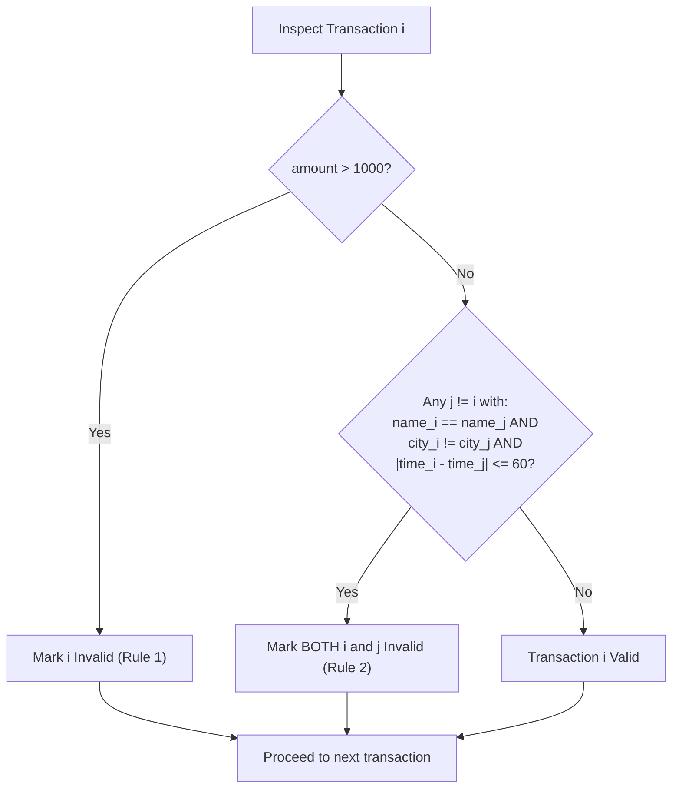

# Guided Example: Invalid Transactions

We trace the multi-criteria transaction audit algorithm to identify all transactions that violate spending limits or exhibit conflicting geographic activity within a 60-minute window.

- **Input:** $transactions = [\text{"alice,20,800,mtv"}, \text{"alice,50,100,beijing"}, \text{"bob,50,1200,mtv"}, \text{"bob,60,200,mtv"}]$
- **Required output:** `["alice,20,800,mtv", "alice,50,100,beijing", "bob,50,1200,mtv"]`

This instance illustrates symmetric pairwise conflict detection, isolating independent amount violations, handling identical-city multi-transactions, and index-based tracking to preserve duplicate inputs.

---

## 1. Instance & Teaching Goal

A transaction record `"{name},{time},{amount},{city}"` is deemed **invalid** if it meets at least one of two disjunctive conditions:
1. **Excessive Amount:** The transaction amount exceeds $1000$ ($\text{amount} > 1000$).
2. **Geographic Collision:** The transaction occurs within $60$ minutes (inclusive) of another transaction with the **same name** in a **different city** ($|time_1 - time_2| \le 60 \wedge city_1 \ne city_2$).

A naive classification often trips on the symmetric nature of geographic conflicts:

```text
The Single-Party Blame Trap:

Suppose Alice transacts in MTV at t = 20, then in Beijing at t = 50:
  |20 - 50| = 30 <= 60 minutes, and MTV != Beijing.

Flawed Logic:
  "Beijing is physically impossible after MTV, so Beijing is invalid."
  (Only marking the second transaction).

Correct Rule Logic:
  Both transactions cannot be simultaneously authentic.
  The problem contract mandates that BOTH the MTV and Beijing transactions
  are flagged as invalid!
```

The primary teaching goals are:
- **Symmetric Conflict Propagation:** If transaction $i$ conflicts with transaction $j$, both indices $i$ and $j$ must be marked invalid.
- **Index-Preserving Sets:** Tracking flagged items by array index ($i \in \{0, \dots, N-1\}$) ensures that duplicate transaction strings are preserved in the final output and not collapsed by set deduplication.
- **Precise Boundary Operators:** Strict inequality for amount ($> 1000$) versus inclusive inequality for time difference ($\le 60$).

---

## 2. Conceptual Foundation & Invariants

Let each transaction $i \in \{0, \dots, N-1\}$ be parsed into a tuple $(name_i, time_i, amount_i, city_i)$.

### Invalidity Predicate

$$\text{Invalid}(i) \equiv (amount_i > 1000) \lor \exists j \ne i \left( name_i = name_j \land city_i \ne city_j \land |time_i - time_j| \le 60 \right)$$

| Rule Component | Mathematical Condition | Behavioral Implication |
|---|---|---|
| Rule 1 (Threshold) | $amount_i > 1000$ | Local check on single transaction; independent of other records |
| Rule 2 (Collision) | $name_i = name_j \land city_i \ne city_j \land \|time_i - time_j\| \le 60$ | Pairwise relational check; flags both $i$ and $j$ simultaneously |
| Same-City Exemption | $city_i = city_j$ | Multiple transactions within 60 mins in the same city are completely valid |
| Index Set Tracker | $invalid\_indices \subseteq \{0, \dots, N-1\}$ | Set of integers preventing duplicate insertions of the same index |



> **Index Set Deduplication Invariant.** A transaction index $i$ is added to $invalid\_indices$ at most once, regardless of whether it violates Rule 1, Rule 2 with multiple partners, or both. The output is reconstructed by iterating over the original indices: $[transactions[i] \text{ for } i \in invalid\_indices]$.

---

## 3. Step-by-Step Worked Execution

We trace the 4 input transactions:
- $T_0$: `"alice,20,800,mtv"`
- $T_1$: `"alice,50,100,beijing"`
- $T_2$: `"bob,50,1200,mtv"`
- $T_3$: `"bob,60,200,mtv"`

Initialize $invalid\_indices = \emptyset$.

---

### Step 1: Evaluate Rule 1 (Amount > 1000)

We scan all transactions individually:
- $T_0$: $amount = 800 \le 1000 \implies$ Not flagged.
- $T_1$: $amount = 100 \le 1000 \implies$ Not flagged.
- $T_2$: $amount = 1200 > 1000 \implies$ **Flagged!** Insert $2 \in invalid\_indices$.
- $T_3$: $amount = 200 \le 1000 \implies$ Not flagged.

Set state: $invalid\_indices = \{2\}$.

---

### Step 2: Evaluate Rule 2 (Pairwise Geographic Collisions)

Group transactions by person name to compare candidate pairs:

#### Sub-group: Alice (Transactions $T_0$ and $T_1$)
- Compare pair $(T_0, T_1)$:
  - Names match: `"alice" == "alice"`.
  - Cities differ: `"mtv" \ne "beijing"`.
  - Time difference: $|20 - 50| = 30 \le 60$.
- Collision detected!
- Mark **both** transactions:
  - Insert $0 \in invalid\_indices$.
  - Insert $1 \in invalid\_indices$.

#### Sub-group: Bob (Transactions $T_2$ and $T_3$)
- Compare pair $(T_2, T_3)$:
  - Names match: `"bob" == "bob"`.
  - Cities: $city_2 = \text{"mtv"}$, $city_3 = \text{"mtv"}$.
  - Since $city_2 == city_3$, the cities are the **same**.
  - No geographic conflict occurs! (Rule 2 does not apply).

---

### Step 3: Final Output Assembly

The set of invalid indices is:

$$invalid\_indices = \{0, 1, 2\}$$

Reconstruct result strings:
- Index 0: `"alice,20,800,mtv"`
- Index 1: `"alice,50,100,beijing"`
- Index 2: `"bob,50,1200,mtv"`

Transaction $T_3$ (`"bob,60,200,mtv"`) is valid and omitted.

---

## 4. Complete Execution Trace

| Index ($i$) | Transaction String | Amount Check ($> 1000$) | Conflicting Pair ($j$) | City Match / Diff | Time Delta ($\le 60$) | Violation Reason | Result Status |
|---|---|---|---|---|---|---|---|
| $0$ | `"alice,20,800,mtv"` | $800 \le 1000$ | $T_1$ | `mtv != beijing` | $|20 - 50| = 30$ | Rule 2 (Geo Collision) | **Invalid** |
| $1$ | `"alice,50,100,beijing"` | $100 \le 1000$ | $T_0$ | `beijing != mtv` | $|50 - 20| = 30$ | Rule 2 (Geo Collision) | **Invalid** |
| $2$ | `"bob,50,1200,mtv"` | $1200 > 1000$ | None | Same city as $T_3$ | $|50 - 60| = 10$ | Rule 1 (Amount $> 1000$) | **Invalid** |
| $3$ | `"bob,60,200,mtv"` | $200 \le 1000$ | None | Same city as $T_2$ | $|60 - 50| = 10$ | None (Same city valid) | **Valid** |

```text
Geographic Timeline Comparison:

Alice's Timeline:
  t = 20: [MTV]       <==================== Delta = 30 mins ====================> t = 50: [Beijing]
  (Distance in time <= 60 min and different cities -> BOTH FLAGGED INVALID)

Bob's Timeline:
  t = 50: [MTV] (Amt: 1200 -> Flagged by Amount)
  t = 60: [MTV] (Amt: 200  -> Same city MTV, <= 1000 -> VALID)
```

---

## 5. Algorithmic Correctness

**Theorem (Symmetric Conflict Completeness).**
1. **Symmetry:** The relation $C(i, j) \equiv (name_i = name_j \land city_i \ne city_j \land |time_i - time_j| \le 60)$ is symmetric ($C(i, j) \iff C(j, i)$). If $C(i, j)$ holds, both $i$ and $j$ violate the physical feasibility condition, so both must be included in the output.
2. **Idempotence:** A transaction that violates Rule 1 and also violates Rule 2 with multiple other transactions is represented by a unique integer index $i$. Inserting $i$ into a set ensures each physical record from the input array is emitted exactly once.
3. **Exhaustive Partitioning:** Grouping by $name$ partitions the $N$ records into independent buckets $\{B_1, \dots, B_k\}$. Because $C(i, j)$ requires $name_i = name_j$, no cross-bucket comparisons can yield a violation, ensuring no valid conflict is missed.

---

## 6. Traps This Instance Exposes

| Trap Category | Hazard Scenario | Root Cause | Preventive Design Invariant |
|---|---|---|---|
| **One-Sided Blame Fallacy** | Adding only $j$ when $|time_i - time_j| \le 60$ | Assuming only the chronologically later transaction is invalid. | Always add both $i$ and $j$ to the invalid set upon detecting a conflict. |
| **Same-City False Alarm** | Flagging $T_3$ because it is within 10 minutes of $T_2$ | Forgetting to check $city_i \ne city_j$. | Check $city_i \ne city_j$ explicitly. |
| **String Set Duplicate Collapse** | Input contains two identical invalid strings: `["alice,20,800,mtv", "alice,20,800,mtv"]` | Storing invalid items in a `Set<String>` collapses the two items into one, losing an input element. | Store invalid indices in `Set<Integer>` and look up original strings from the input array. |
| **Boundary Strictness Error** | Using $|time_i - time_j| < 60$ instead of $\le 60$, or $amount \ge 1000$ instead of $> 1000$ | Misreading "exceeds 1000" as $\ge 1000$, or "within 60 minutes" as $< 60$. | Amount strictly $> 1000$; time difference inclusive $\le 60$. |

---

## 7. Complexity Derivation

Let $N$ be the total number of transactions ($N \le 1000$).

### Time Complexity

1. **Parsing:** Parsing $N$ strings of length $\le 40$ into fields takes $\mathcal{O}(N)$ time.
2. **Grouping by Name:** Placing records into a hash table grouped by $name$ takes $\mathcal{O}(N)$ time.
3. **Pairwise Comparison:**
   - For each group of size $N_c$, comparing all pairs takes $\binom{N_c}{2} = \mathcal{O}(N_c^2)$ operations.
   - Summing across all distinct names: $\sum N_c^2 \le (\sum N_c)^2 = N^2$.
4. **Total Time Complexity:**

$$\mathcal{O}(N^2)$$

For $N = 1000$, the maximum number of comparisons is $\binom{1000}{2} \approx 5 \times 10^5$, taking $\approx 5 \text{ ms}$.

### Auxiliary Space Complexity

- Grouping map and parsed record structures require $\mathcal{O}(N)$ space.
- Set of invalid indices contains at most $N$ integers.
- Total Auxiliary Space Complexity:

$$\mathcal{O}(N)$$
