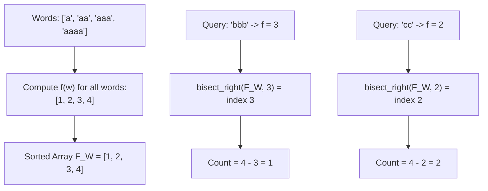

# Guided Example: Compare Strings by Frequency of the Smallest Character

We trace the character frequency reduction, sorted array bisection, and suffix bucket aggregation to answer threshold containment queries across strings.

- **Input:** $queries = [\text{"bbb"}, \text{"cc"}], \ words = [\text{"a"}, \text{"aa"}, \text{"aaa"}, \text{"aaaa"}]$
- **Required output:** `[1, 2]`

This instance illustrates evaluating the minimum-character frequency function $f(s)$, sorting discrete scalar metrics, using binary search (`bisect_right`) for strict inequality filtering, and bounded suffix count caching.

---

## 1. Instance & Teaching Goal

Let $f(s)$ denote the frequency of the **lexicographically smallest character** in a non-empty string $s$. For example:
- In $s = \text{"zaaaz"}$, the smallest character is `'a'`, which appears $3$ times $\implies f(\text{"zaaaz"}) = 3$.
- In $s = \text{"dcce"}$, the smallest character is `'c'`, which appears $2$ times $\implies f(\text{"dcce"}) = 2$.

Given $Q$ query strings and $W$ candidate words, for each query $q_i$, we must determine how many words $w \in words$ satisfy the strict inequality:

$$f(q_i) < f(w)$$

A naive solution computes $f(q_i)$ and compares it against $f(w)$ for every pair:

$$\mathcal{O}(Q \cdot W \cdot L) = 2000 \times 2000 \times 10 = 4 \times 10^7 \text{ operations}$$

```text
Naive Pairwise Re-evaluation vs. Sorted Distribution Bisection:

Words: ["a", "aa", "aaa", "aaaa"]
  f("a")    = 1
  f("aa")   = 2
  f("aaa")  = 3
  f("aaaa") = 4
  Sorted Word Distribution: [1, 2, 3, 4]

Query 1: "bbb" -> f("bbb") = 3
  Find count of elements in [1, 2, 3, 4] strictly > 3:
  Bisect right gives index 3 (elements > 3 start at index 3).
  Count = 4 - 3 = 1 (Word: "aaaa")

Query 2: "cc" -> f("cc") = 2
  Find count of elements in [1, 2, 3, 4] strictly > 2:
  Bisect right gives index 2 (elements > 2 start at index 2).
  Count = 4 - 2 = 2 (Words: "aaa", "aaaa")
```

The fundamental teaching goal is to decouple the string inspection from query answering:
1. Precompute $f(w)$ for all words once and store them in sorted order.
2. For each query, evaluate $f(q)$ in $\mathcal{O}(L)$ time and find the number of strictly greater words in $\mathcal{O}(\log W)$ time via binary search (or $\mathcal{O}(1)$ time via a bounded suffix array).

---

## 2. Conceptual Foundation & Invariants

### Definition of the Reduction Function $f(s)$

For any non-empty string $s$ of length $\le 10$:
1. Identify the minimum character $c_{\min} = \min_{0 \le j < |s|} s[j]$.
2. Count the occurrences of $c_{\min}$ in $s$:
   $$f(s) = \sum_{j=0}^{|s|-1} \mathbf{1}[s[j] = c_{\min}]$$

Because $|s| \le 10$, the range of $f(s)$ is strictly bounded:

$$f(s) \in \{1, 2, \dots, 10\}$$

### Query Resolution Mechanisms

Let $F_W = \text{sorted}([f(w) \text{ for } w \in words])$.
- **Binary Search Formulation:** To find how many elements in $F_W$ are strictly greater than $f(q)$, locate the first index whose value is $> f(q)$. This corresponds to the half-open partition point returned by `bisect_right(F_W, f(q))`:
  $$\text{Count} = |F_W| - \text{bisect\_right}(F_W, f(q))$$
- **Suffix Array Formulation:** Since $f(s) \le 10$, populate frequency array $B[k] = \text{count}(f(w) = k)$. Precompute suffix sums $S[k] = \sum_{j=k+1}^{10} B[j]$. Then query $q$ is answered in $\mathcal{O}(1)$ as $S[f(q)]$.

| Component | Type | Mathematical Role |
|---|---|---|
| $c_{\min}$ | Character $\in [\text{'a'}, \text{'z'}]$ | Lexicographical minimum letter in the string |
| $f(s)$ | Integer $\in [1, 10]$ | Multiplicity of $c_{\min}$ in $s$ |
| $F_W$ | Sorted integer array | Ascending distribution of word metric values |
| $\text{bisect\_right}(F_W, k)$ | Integer index $\in [0, W]$ | First position where values strictly exceed $k$ |
| Valid count | Integer $\ge 0$ | Number of words dominating the query |



> **Strict Inequality Invariant.** The problem condition $f(q) < f(w)$ requires strictly greater values. Using `bisect_right` skips all elements equal to $f(q)$, ensuring elements with $f(w) = f(q)$ are not counted.

---

## 3. Step-by-Step Worked Execution

We trace $queries = [\text{"bbb"}, \text{"cc"}]$ and $words = [\text{"a"}, \text{"aa"}, \text{"aaa"}, \text{"aaaa"}]$.

### Step 0: Compute Word Metrics and Sort

Evaluate $f(w)$ for each word:
1. $w_0 = \text{"a"}$: Smallest character is `'a'`, appears $1$ time $\implies f(w_0) = 1$.
2. $w_1 = \text{"aa"}$: Smallest character is `'a'`, appears $2$ times $\implies f(w_1) = 2$.
3. $w_2 = \text{"aaa"}$: Smallest character is `'a'`, appears $3$ times $\implies f(w_2) = 3$.
4. $w_3 = \text{"aaaa"}$: Smallest character is `'a'`, appears $4$ times $\implies f(w_3) = 4$.

Sorted distribution:

$$F_W = [1, 2, 3, 4], \quad W = 4$$

---

### Step 1: Evaluate Query 1: `"bbb"`

1. **Compute Query Metric:**
   - Smallest character in `"bbb"` is `'b'`.
   - Frequency of `'b'` is $3$.
   - $f(\text{"bbb"}) = 3$.
2. **Locate Insertion Index via Bisection:**
   - Probe $F_W = [1, 2, 3, 4]$ for target $3$.
   - Elements $\le 3$: indices $0, 1, 2$ (values $1, 2, 3$).
   - First element strictly $> 3$ is $4$ at index $3$.
   - $\text{bisect\_right}(F_W, 3) = 3$.
3. **Calculate Count:**
   $$\text{Count} = W - \text{index} = 4 - 3 = 1$$
   (The only qualifying word is `"aaaa"`).
4. Record answer: `ans[0] = 1`.

---

### Step 2: Evaluate Query 2: `"cc"`

1. **Compute Query Metric:**
   - Smallest character in `"cc"` is `'c'`.
   - Frequency of `'c'` is $2$.
   - $f(\text{"cc"}) = 2$.
2. **Locate Insertion Index via Bisection:**
   - Probe $F_W = [1, 2, 3, 4]$ for target $2$.
   - Elements $\le 2$: indices $0, 1$ (values $1, 2$).
   - First element strictly $> 2$ is $3$ at index $2$.
   - $\text{bisect\_right}(F_W, 2) = 2$.
3. **Calculate Count:**
   $$\text{Count} = W - \text{index} = 4 - 2 = 2$$
   (The qualifying words are `"aaa"` and `"aaaa"`).
4. Record answer: `ans[1] = 2`.

---

### Termination

All queries answered.
Emit final list: `[1, 2]`.

---

## 4. Complete Execution Trace

### Word Metric Profile Table

| Word Index | Word String | Lexicographically Smallest Char | Count of Smallest Char | $f(w)$ |
|---|---|---|---|---|
| $0$ | `"a"` | `'a'` | $1$ | $1$ |
| $1$ | `"aa"` | `'a'` | $2$ | $2$ |
| $2$ | `"aaa"` | `'a'` | $3$ | $3$ |
| $3$ | `"aaaa"` | `'a'` | $4$ | $4$ |

### Query Evaluation Table

| Query Index | Query String | Smallest Char | $f(q)$ | `bisect_right(F_W, f(q))` | Subarray $> f(q)$ | Final Query Output |
|---|---|---|---|---|---|---|
| $0$ | `"bbb"` | `'b'` | $3$ | Index $3$ | $[4]$ | **1** |
| $1$ | `"cc"` | `'c'` | $2$ | Index $2$ | $[3, 4]$ | **2** |

```text
Suffix Accumulation View (Alternative O(1) Query Path):

Frequency Buckets B[1..10]:
  B[1]=1 ("a"), B[2]=1 ("aa"), B[3]=1 ("aaa"), B[4]=1 ("aaaa"), B[5..10]=0

Suffix Sums S[k] (Count of words with f > k):
  S[0] = 4
  S[1] = 3
  S[2] = 2  <-- Query "cc"  (f=2) directly looks up S[2] = 2
  S[3] = 1  <-- Query "bbb" (f=3) directly looks up S[3] = 1
  S[4..10] = 0
```

---

## 5. Algorithmic Correctness

**Theorem (Correctness of Suffix Bisection Partitioning).**
1. **Monotonicity:** Sorting $F_W$ establishes the invariant $F_W[0] \le F_W[1] \le \dots \le F_W[W-1]$.
2. **Exact Strict Boundary:** For any threshold $k \in \mathbb{Z}$, the index $idx = \text{bisect\_right}(F_W, k)$ satisfies:
   $$F_W[j] \le k \quad \forall j < idx, \qquad F_W[j] > k \quad \forall j \ge idx$$
3. **Cardinality:** The number of elements strictly greater than $k$ is precisely the number of indices in the half-open interval $[idx, W)$, which equals $W - idx$.
4. Hence, for each query $q$, the computed value is identically equal to $|\{w \in words \mid f(w) > f(q)\}|$.

---

## 6. Traps This Instance Exposes

| Trap Category | Hazard Scenario | Root Cause | Preventive Design Invariant |
|---|---|---|---|
| **Smallest Char vs Mode Fallacy** | Defining $f(s)$ as the most frequent character | In `"zaaaz"`, `'z'` appears 2 times and `'a'` appears 3 times. But in `"zbb"`, `'b'` appears 2 times while `'z'` appears 1 time; the smallest char is `'b'`. | Find the minimum character alphabetically first: $c = \min(s)$, then count occurrences of $c$. |
| **Strict vs Non-Strict Inequality** | Using `bisect_left` instead of `bisect_right` | `bisect_left` includes elements where $f(w) = f(q)$, violating the strict condition $f(q) < f(w)$. | Use `bisect_right` to skip all ties and count strictly greater elements. |
| **Quadratic String Hashing** | Comparing raw strings during the query phase | Re-scanning character frequencies for all words in every query loop. | Precompute and isolate all integer metrics $f(w)$ before answering queries. |
| **Out of Range Bucket Indexing** | Using a bucket array of size 10 without accounting for 1-based indexing | Indexing `bucket[10]` on an array of size 10 causes an index out-of-bounds error. | Allocate bucket array of size at least 12 (`int[12]`). |

---

## 7. Complexity Derivation

Let $W$ be the number of words, $Q$ be the number of queries, and $L$ be the maximum string length ($L \le 10$).

### Time Complexity

1. **Word Precomputation:**
   - For each of the $W$ words, scanning $L$ characters takes $\mathcal{O}(L)$ time:

$$T_{\text{words}} = \mathcal{O}(W \cdot L)$$

2. **Sorting Word Metrics:**
   - Sorting $W$ integer values:

$$T_{\text{sort}} = \mathcal{O}(W \log W)$$

3. **Query Processing:**
   - For each of the $Q$ queries, computing $f(q)$ takes $\mathcal{O}(L)$ time.
   - Binary searching $F_W$ of size $W$ takes $\mathcal{O}(\log W)$ time:

$$T_{\text{queries}} = \mathcal{O}(Q \cdot (L + \log W))$$

4. **Overall Time Complexity:**

$$\mathcal{O}((W + Q) \cdot L + (W + Q) \log W)$$

Given $W, Q \le 2000$ and $L \le 10$, total operations are $\le 4000 \times 10 + 4000 \times 11 \approx 8.4 \times 10^4$, executing in under $3 \text{ ms}$.

### Auxiliary Space Complexity

- Array $F_W$ of $W$ integers: $\mathcal{O}(W)$.
- Output array of $Q$ integers: $\mathcal{O}(Q)$.
- Total Auxiliary Space: $\mathcal{O}(W + Q)$.
