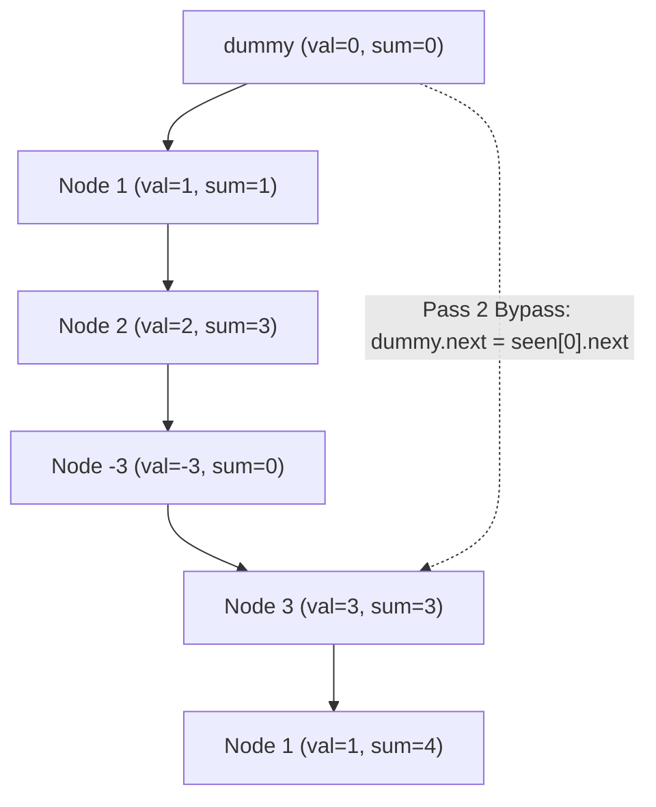

# Guided Example: Remove Zero Sum Consecutive Nodes from Linked List

We trace the two-pass prefix sum hash table algorithm to excise all consecutive sublists summing to zero from a singly linked list in linear time.

- **Input:** $head = [1, 2, -3, 3, 1]$
- **Required output:** `[3, 1]`

This instance illustrates the prefix sum equivalence principle for zero-sum subsegments, sentinel dummy anchoring, hash map latest-occurrence overwriting, and single-step pointer splicing.

---

## 1. Instance & Teaching Goal

Given the head of a linked list, we must repeatedly remove consecutive sequences of nodes whose values sum to $0$ until no such sequences remain.

A brute-force approach checks every sublist $[i \dots j]$, sums its nodes in $\mathcal{O}(j - i)$, and splices out zero-sum segments iteratively. For a list of length $N$:

$$\mathcal{O}(N^3) \text{ or } \mathcal{O}(N^2) \text{ time with repeated list traversals}$$

```text
Prefix Sum Equivalence for Zero-Sum Excision:

Linked List:       dummy(0) -> [ 1 ] -> [ 2 ] -> [ -3 ] -> [ 3 ] -> [ 1 ]
Prefix Sum:            0         1        3        0         3       4
                                                   ^                 ^
                                              Collision!         Collision!
                                              (sum = 0)          (sum = 3)

Key Insight:
  Prefix sum at dummy is 0.
  Prefix sum after node (-3) is 0 again (0 + 1 + 2 - 3 = 0).
  Because prefix(dummy) == prefix(node -3), the intermediate sublist
  [1, 2, -3] MUST sum to exactly zero!
  
  Splicing dummy.next directly to node(-3).next (which is node 3)
  excises the entire zero-sum subsegment in a single O(1) pointer jump!
```

The fundamental teaching goal is the **Prefix Sum Collision Theorem**:
The subsegment of nodes strictly between node $A$ and node $B$ (i.e., $A.next \dots B$) has a sum of zero if and only if the cumulative sum up to $A$ equals the cumulative sum up to $B$:

$$\sum_{u = A.next}^B u.val = \text{prefix}(B) - \text{prefix}(A) = 0 \iff \text{prefix}(A) = \text{prefix}(B)$$

---

## 2. Conceptual Foundation & Invariants

We attach a sentinel node $dummy = \text{ListNode}(0)$ whose `next` pointer references $head$.

### Two-Pass Architecture

1. **Pass 1 (Discovery & Latest-Occurrence Recording):**
   - Traverse the list starting from $dummy$.
   - Maintain running sum $s \leftarrow s + current.val$.
   - Record `seen[s] = current`.
   - If a prefix sum $s$ appears multiple times, each subsequent assignment overwrites the entry, ensuring `seen[s]` holds the **latest** node with prefix sum $s$.
2. **Pass 2 (Direct Pointer Splicing):**
   - Traverse the list a second time starting from $dummy$.
   - Maintain running sum $s \leftarrow s + current.val$.
   - Set:
     $$current.next \leftarrow seen[s].next$$
   - If no zero-sum sublist begins after $current$, then $seen[s] = current$, so $current.next$ remains unchanged.
   - If a zero-sum sublist exists between $current.next$ and $seen[s]$, setting $current.next \leftarrow seen[s].next$ bypasses and deletes all intermediate nodes in $\mathcal{O}(1)$ time.
   - Advance $current \leftarrow current.next$.

| Entity | Role in Algorithm | Invariant State |
|---|---|---|
| $dummy$ | Sentinel node before head ($val = 0$) | Anchors prefix sum $0$, allowing deletion of prefixes starting at head |
| $seen[s]$ | Hash table mapping prefix sum $s \to \text{ListNode}$ | Stores the chronologically latest node attaining prefix sum $s$ |
| $current$ | Active pointer during Pass 2 | Connects directly to $seen[s].next$, excising zero-sum ranges |
| $dummy.next$ | Final return pointer | Head of the modified zero-sum-free linked list |



> **Maximal Bypass Invariant.** In Pass 1, overwriting `seen[s]` guarantees that `seen[s]` points to the furthest reachable node with prefix sum $s$. In Pass 2, jumping from $current$ to $seen[s].next$ excises the maximal zero-sum span in a single assignment.

---

## 3. Step-by-Step Worked Execution

We trace $head = [1, 2, -3, 3, 1]$.
Insert sentinel: $dummy(0) \to 1 \to 2 \to -3 \to 3 \to 1$.

### Phase 1: Hash Map Population (Pass 1)

Initialize $s = 0$, $seen = \{\}$.

1. **At $dummy$ ($val = 0$):**
   - $s = 0 + 0 = 0$.
   - $seen[0] = dummy$.
2. **At Node $1_a$ ($val = 1$):**
   - $s = 0 + 1 = 1$.
   - $seen[1] = Node(1_a)$.
3. **At Node $2$ ($val = 2$):**
   - $s = 1 + 2 = 3$.
   - $seen[3] = Node(2)$.
4. **At Node $-3$ ($val = -3$):**
   - $s = 3 + (-3) = 0$.
   - Collision on sum $0$! Overwrite: $seen[0] = Node(-3)$.
5. **At Node $3$ ($val = 3$):**
   - $s = 0 + 3 = 3$.
   - Collision on sum $3$! Overwrite: $seen[3] = Node(3)$.
6. **At Node $1_b$ ($val = 1$):**
   - $s = 3 + 1 = 4$.
   - $seen[4] = Node(1_b)$.

End of Pass 1 map:

$$seen = \{0: Node(-3), \ 1: Node(1_a), \ 3: Node(3), \ 4: Node(1_b)\}$$

---

### Phase 2: Pointer Splicing (Pass 2)

Reset $current = dummy$, $s = 0$.

1. **At $dummy$ ($val = 0$):**
   - $s = 0$.
   - Look up $seen[0] \implies Node(-3)$.
   - Splice: $dummy.next = seen[0].next = Node(-3).next = Node(3)$.
   - Sublist $[1, 2, -3]$ has been excised!
   - Advance: $current = dummy.next = Node(3)$.
2. **At Node $3$ ($val = 3$):**
   - $s = 0 + 3 = 3$.
   - Look up $seen[3] \implies Node(3)$.
   - Splice: $Node(3).next = seen[3].next = Node(3).next = Node(1_b)$.
   - (No nodes skipped because $seen[3]$ is $Node(3)$ itself).
   - Advance: $current = Node(3).next = Node(1_b)$.
3. **At Node $1_b$ ($val = 1$):**
   - $s = 3 + 1 = 4$.
   - Look up $seen[4] \implies Node(1_b)$.
   - Splice: $Node(1_b).next = seen[4].next = \text{null}$.
   - Advance: $current = \text{null}$. Loop terminates.

Return $dummy.next \implies Node(3) \to Node(1_b) \implies [3, 1]$.

---

## 4. Complete Execution Trace

### Pass 1: Prefix Sum Mapping

| Node Visited | Node Value | Running Prefix Sum ($s$) | Prior Value in `seen[s]` | Updated `seen[s]` Entry | Collision / Action |
|---|---|---|---|---|---|
| $dummy$ | $0$ | $0$ | None | $seen[0] \leftarrow dummy$ | Initial sentinel entry |
| $Node(1_a)$ | $1$ | $1$ | None | $seen[1] \leftarrow Node(1_a)$ | New prefix sum |
| $Node(2)$ | $2$ | $3$ | None | $seen[3] \leftarrow Node(2)$ | New prefix sum |
| $Node(-3)$ | $-3$ | $0$ | $dummy$ | $seen[0] \leftarrow Node(-3)$ | **Collision on 0: Overwritten** |
| $Node(3)$ | $3$ | $3$ | $Node(2)$ | $seen[3] \leftarrow Node(3)$ | **Collision on 3: Overwritten** |
| $Node(1_b)$ | $1$ | $4$ | None | $seen[4] \leftarrow Node(1_b)$ | New prefix sum |

### Pass 2: Splicing and Traversal

| Current Node | Node Value | Recomputed Sum ($s$) | Target Node $seen[s]$ | Spliced Pointer `current.next` | Excised Segment | Next Node Visited |
|---|---|---|---|---|---|---|
| $dummy$ | $0$ | $0$ | $Node(-3)$ | $Node(3)$ | $[1_a, 2, -3]$ | $Node(3)$ |
| $Node(3)$ | $3$ | $3$ | $Node(3)$ | $Node(1_b)$ | None (Self-target) | $Node(1_b)$ |
| $Node(1_b)$ | $1$ | $4$ | $Node(1_b)$ | $\text{null}$ | None (Self-target) | $\text{null}$ (End) |

```text
Visual Link Comparison:

Initial: dummy -> [ 1 ] -> [ 2 ] -> [ -3 ] -> [ 3 ] -> [ 1 ] -> null
                   \____________________/
                         Sum = 0

Final:   dummy -----------------------------> [ 3 ] -> [ 1 ] -> null
```

---

## 5. Algorithmic Correctness

**Theorem (Zero-Sum Elimination Soundness).**
1. Let $A$ and $B$ be nodes with $\text{prefix}(A) = \text{prefix}(B) = s$ and $B$ appearing after $A$.
   The sum of values along the directed path $A.next \to \dots \to B$ is:
   $$\sum_{u = A.next}^B u.val = \text{prefix}(B) - \text{prefix}(A) = s - s = 0$$
2. In Pass 2, reassigning $A.next \leftarrow seen[s].next$ drops all nodes from $A.next$ to $seen[s]$.
3. Since $seen[s]$ contains the last node with prefix sum $s$, any node $w$ after $seen[s]$ has cumulative sum relative to $A$ equal to $\text{prefix}(w) - s$. Because the excised segment had net sum zero, the prefix sum of any surviving downstream node $w$ measured from $dummy$ is identical before and after excision.
4. Hence, no non-zero nodes have their relative prefix sums corrupted by the pointer bypass.

---

## 6. Traps This Instance Exposes

| Trap Category | Hazard Scenario | Root Cause | Preventive Design Invariant |
|---|---|---|---|
| **Missing Sentinel Node** | $head = [1, -1, 2]$ | The zero-sum sublist $[1, -1]$ starts at the very first node. Without a sentinel node holding prefix sum 0, there is no predecessor node $A$ to rewire. | Always prepend $dummy = \text{ListNode}(0, head)$ before executing Pass 1. |
| **First-Occurrence Fallacy** | Keeping the first node in `seen` instead of overwriting with the last | If `seen[s]` is not updated, Pass 2 cannot identify the end of the zero-sum subsegment. | In Pass 1, unconditionally overwrite `seen[s] = current` to retain the latest node. |
| **Premature Hash Deletion** | Attempting a one-pass algorithm without clearing intermediate hash keys | If an excised node's prefix sum remains in the hash table, subsequent nodes might splice into garbage unlinked nodes. | The two-pass approach completely avoids complex deletions by separating recording from splicing. |
| **Null-Dereference on Terminal Nodes** | Dereferencing `seen[s].next` when `seen[s]` is null | Forgetting to initialize $seen[0] = dummy$. | Ensure $dummy$ is mapped to sum $0$ at the start of Pass 1. |

---

## 7. Complexity Derivation

Let $N$ be the number of nodes in the linked list ($N \le 1000$).

### Time Complexity

1. **Pass 1 (Hash Map Recording):**
   - Traverses $N + 1$ nodes (including $dummy$).
   - Each hash table insertion takes $\mathcal{O}(1)$ average time.

$$T_{\text{pass1}} = \mathcal{O}(N)$$

2. **Pass 2 (Pointer Splicing):**
   - Traverses the surviving nodes (at most $N + 1$).
   - For each node, one hash lookup and one pointer assignment take $\mathcal{O}(1)$ time.

$$T_{\text{pass2}} = \mathcal{O}(N)$$

3. **Total Time Complexity:**

$$\mathcal{O}(N)$$

For $N = 1000$, total node operations are $\approx 2000$, executing in under $2 \text{ ms}$.

### Auxiliary Space Complexity

- The hash table `seen` stores at most $N + 1$ distinct integer keys mapped to node references.
- No new list nodes are allocated.
- Total Auxiliary Space Complexity:

$$\mathcal{O}(N)$$