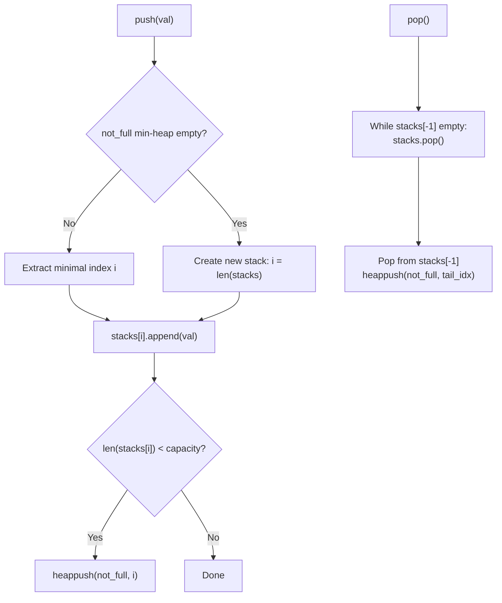

# Guided Example: Dinner Plate Stacks

We trace the hybrid data structure combining an array of bounded stacks, an index min-heap of unfilled slots, and lazy right-end truncation to implement an infinite row of plates with $\mathcal{O}(\log K)$ operations.

- **Input:** $capacity = 2$
- **Representative Sequence:**
  - `push(1)`, `push(2)`, `push(3)`, `push(4)`, `push(5)`
  - `popAtStack(0) -> 2`
  - `push(20)`, `push(21)`
  - `popAtStack(0) -> 20`
  - `popAtStack(2) -> 21`
  - `pop() -> 5`, `pop() -> 4`, `pop() -> 3`, `pop() -> 1`, `pop() -> -1`
- **Required output:** `[null, null, null, null, null, 2, null, null, 20, 21, 5, 4, 3, 1, -1]`

This instance illustrates leftmost-available hole reclamation, selective middle-stack popping, rightmost non-empty frontier contraction, and stale heap index invalidation.

---

## 1. Instance & Teaching Goal

We are tasked with managing an unbounded row of stacks numbered $0, 1, 2, \dots$, each with fixed positive capacity $C$.
- `push(val)`: Adds $val$ to the **leftmost** stack that has size $< C$.
- `pop()`: Removes and returns the top value from the **rightmost** non-empty stack (returns $-1$ if all stacks are empty).
- `popAtStack(index)`: Removes and returns the top value from stack $index$ (returns $-1$ if empty or out of bounds).

A naive architecture using a plain array of stacks requires linear scanning:
- Finding the leftmost non-full stack for `push` takes $\mathcal{O}(K)$ time.
- Finding the rightmost non-empty stack for `pop` takes $\mathcal{O}(K)$ time.

For $2 \times 10^5$ operations, $\mathcal{O}(M \cdot K) \approx 2 \times 10^5 \times 10^5 = 2 \times 10^{10}$ operations (Time Limit Exceeded).

```text
The Left-Push / Right-Pop Asymmetry:

Initial State (Capacity = 2):
  Stack 0: [1, 2]  (Full)
  Stack 1: [3, 4]  (Full)
  Stack 2: [5]     (Open: 1 slot left)

popAtStack(0) creates an interior hole:
  Stack 0: [1]     (Hole created at index 0!)
  Stack 1: [3, 4]
  Stack 2: [5]

Next push(20) must NOT append to Stack 2!
It must greedily fill the leftmost open hole at Stack 0:
  Stack 0: [1, 20] (Hole filled!)
  Stack 1: [3, 4]
  Stack 2: [5]
```

The core teaching goal is to coordinate two opposing pointers efficiently:
1. **Min-Heap `not_full`:** Supplies the minimal available index in $\mathcal{O}(\log K)$ time for `push`.
2. **Right-Trimming Array `stacks`:** Automatically pops empty lists from the tail of `stacks`, keeping `stacks[-1]` as the true rightmost non-empty stack for `pop` in $\mathcal{O}(1)$ amortized time.

---

## 2. Conceptual Foundation & Invariants

Let $C$ denote the fixed stack capacity.

### Component Structures

1. `stacks`: A dynamic list of lists, where `stacks[i]` stores up to $C$ values.
2. `not_full`: A min-heap storing indices $i$ of stacks that have available capacity ($|stacks[i]| < C$).

### Operation Invariants

- **`push(val)`:**
  - Check `not_full` for the smallest available index $i$.
  - Clean stale indices: while `not_full` is non-empty and `not_full[0] >= len(stacks)`, discard the top.
  - If `not_full` is empty: append a new empty stack to `stacks`, and let $i = |stacks| - 1$.
  - Otherwise, pop $i$ from `not_full`.
  - Push $val$ into `stacks[i]`. If $|stacks[i]| < C$, push $i$ back into `not_full`.
- **`pop()`:**
  - Tail cleanup: While `stacks` is non-empty and `len(stacks[-1]) == 0`, pop the empty stack from the end of `stacks`.
  - If `stacks` is empty, return $-1$.
  - Delegate to `popAtStack(len(stacks) - 1)`.
- **`popAtStack(index)`:**
  - If $index \ge |stacks|$ or $|stacks[index]| == 0$, return $-1$.
  - Pop value: $val = stacks[index].\text{pop}()$.
  - If the stack was previously full ($|stacks[index]| == C - 1$ after pop), push $index$ into `not_full`.
  - Clean up trailing empty stacks if $index == |stacks| - 1$.
  - Return $val$.

| State Component | Role | Invariant Guarantee |
|---|---|---|
| `stacks[i]` | Content of stack $i$ | Bounded size: $0 \le \lvert stacks[i] \rvert \le C$ |
| Min-Heap `not_full` | Hole locator | Top element $\min(not\_full)$ is the leftmost non-full stack |
| Tail Trimming | Boundary maintenance | `stacks[-1]` is guaranteed non-empty whenever `len(stacks) > 0` |



> **Rightmost Frontier Invariant.** By continually popping empty lists from the tail of `stacks` during both `pop` and `popAtStack`, the rightmost non-empty stack is always accessible directly at `stacks[-1]`.

---

## 3. Step-by-Step Worked Execution

We trace $capacity = 2$ through the representative 15-operation sequence.

### Phase 1: Sequential Pushes (Ops 1–5)
- `push(1)`: New stack $0 \to [1]$. $not\_full = [0]$.
- `push(2)`: Stack $0 \to [1, 2]$ (Full). $not\_full = \emptyset$.
- `push(3)`: New stack $1 \to [3]$. $not\_full = [1]$.
- `push(4)`: Stack $1 \to [3, 4]$ (Full). $not\_full = \emptyset$.
- `push(5)`: New stack $2 \to [5]$. $not\_full = [2]$.

Stacks: `[[1, 2], [3, 4], [5]]`.

---

### Phase 2: Perforation and Leftmost Refill (Ops 6–8)
- **Op 6: `popAtStack(0)`:**
  - Pops $2$ from stack $0$. Stack $0$ becomes $[1]$.
  - Since stack $0$ was full, slot $0$ is now open: push $0$ into $not\_full \implies not\_full = [0, 2]$.
  - Returns **2**.
- **Op 7: `push(20)`:**
  - Extract minimal open index from $not\_full \implies \mathbf{index \ 0}$.
  - Push $20$ into stack $0$: becomes $[1, 20]$ (Full).
  - Stack $0$ is full, not pushed back. $not\_full = [2]$.
- **Op 8: `push(21)`:**
  - Extract minimal index from $not\_full \implies \mathbf{index \ 2}$.
  - Push $21$ into stack $2$: becomes $[5, 21]$ (Full).
  - $not\_full = \emptyset$.

Stacks: `[[1, 20], [3, 4], [5, 21]]`. All stacks full!

---

### Phase 3: Selective Interior Pops (Ops 9–10)
- **Op 9: `popAtStack(0)`:**
  - Pops $20$ from stack $0$. Stack $0$ becomes $[1]$.
  - Push $0$ into $not\_full \implies not\_full = [0]$.
  - Returns **20**.
- **Op 10: `popAtStack(2)`:**
  - Pops $21$ from stack $2$. Stack $2$ becomes $[5]$.
  - Push $2$ into $not\_full \implies not\_full = [0, 2]$.
  - Returns **21**.

Stacks: `[[1], [3, 4], [5]]`.

---

### Phase 4: Sequential Rightmost Pops (Ops 11–15)
- **Op 11: `pop()`:**
  - Rightmost non-empty is stack $2$ (`[5]`).
  - Pop $5 \implies$ stack $2$ becomes empty (`[]`).
  - Tail trimming: stack $2$ is at tail and empty, so pop it from `stacks`!
  - `stacks` becomes `[[1], [3, 4]]`.
  - Returns **5**.
- **Op 12: `pop()`:**
  - Rightmost is stack $1$ (`[3, 4]`).
  - Pop $4 \implies$ stack $1$ becomes $[3]$.
  - Push $1$ into $not\_full$.
  - Returns **4**.
- **Op 13: `pop()`:**
  - Rightmost is stack $1$ (`[3]`).
  - Pop $3 \implies$ stack $1$ becomes empty (`[]`).
  - Tail trimming: pop stack $1$ from `stacks`.
  - `stacks` becomes `[[1]]`.
  - Returns **3**.
- **Op 14: `pop()`:**
  - Rightmost is stack $0$ (`[1]`).
  - Pop $1 \implies$ stack $0$ becomes empty (`[]`).
  - Tail trimming: pop stack $0$ from `stacks`.
  - `stacks` becomes `[]`.
  - Returns **1**.
- **Op 15: `pop()`:**
  - `stacks` is empty $\implies$ returns **-1**.

---

## 4. Complete Execution Trace

| Op # | Call Signature | Target Stack | Action Taken | Returned Value | `stacks` State | Min-Heap `not_full` |
|---|---|---|---|---|---|---|
| $1$ | `push(1)` | $0$ | Append to new stack $0$ | null | `[[1]]` | `[0]` |
| $2$ | `push(2)` | $0$ | Fill stack $0$ (Full) | null | `[[1, 2]]` | $\emptyset$ |
| $3$ | `push(3)` | $1$ | Append to new stack $1$ | null | `[[1, 2], [3]]` | `[1]` |
| $4$ | `push(4)` | $1$ | Fill stack $1$ (Full) | null | `[[1, 2], [3, 4]]` | $\emptyset$ |
| $5$ | `push(5)` | $2$ | Append to new stack $2$ | null | `[[1, 2], [3, 4], [5]]` | `[2]` |
| $6$ | `popAtStack(0)` | $0$ | Pop from stack $0$ | **2** | `[[1], [3, 4], [5]]` | `[0, 2]` |
| $7$ | `push(20)` | $0$ | Fill leftmost hole (stack $0$) | null | `[[1, 20], [3, 4], [5]]` | `[2]` |
| $8$ | `push(21)` | $2$ | Fill stack $2$ (Full) | null | `[[1, 20], [3, 4], [5, 21]]` | $\emptyset$ |
| $9$ | `popAtStack(0)` | $0$ | Pop from stack $0$ | **20** | `[[1], [3, 4], [5, 21]]` | `[0]` |
| $10$ | `popAtStack(2)` | $2$ | Pop from stack $2$ | **21** | `[[1], [3, 4], [5]]` | `[0, 2]` |
| $11$ | `pop()` | $2$ | Pop $5$; trim empty stack $2$ | **5** | `[[1], [3, 4]]` | `[0, 2]` (2 stale) |
| $12$ | `pop()` | $1$ | Pop $4$ from stack $1$ | **4** | `[[1], [3]]` | `[0, 1, 2]` |
| $13$ | `pop()` | $1$ | Pop $3$; trim empty stack $1$ | **3** | `[[1]]` | `[0, 1, 2]` |
| $14$ | `pop()` | $0$ | Pop $1$; trim empty stack $0$ | **1** | `[]` | `[0, 1, 2]` |
| $15$ | `pop()` | — | All stacks empty | **-1** | `[]` | `[0, 1, 2]` |

```text
Visual Layout of Stacks at Peak (Op 8):
  Stack 0: [ 1, 20 ]
  Stack 1: [ 3,  4 ]
  Stack 2: [ 5, 21 ]

Hole Filling Progression (Ops 6 -> 7):
  Before push(20): Stack 0 has hole [ 1, _ ]
  After push(20):  Stack 0 filled    [ 1, 20 ] (Stack 2 left untouched)
```

---

## 5. Algorithmic Correctness

**Theorem (Correctness of Min-Heap and Tail-Trimming Pairing).**
1. **Leftmost Placement:** The min-heap $not\_full$ maintains all indices $i < |stacks|$ with $|stacks[i]| < C$. Discarding stale indices $\ge |stacks|$ ensures that the extracted index $i$ is strictly the minimum valid index with capacity.
2. **Rightmost Drainage:** A stack $j$ can only become empty via `pop()` or `popAtStack(j)`. By trimming while $|stacks[-1]| == 0$, the tail element `stacks[-1]` is invariant: it is either non-empty or `stacks` is empty. Hence, `pop()` always targets the true rightmost non-empty plate.
3. **No Lost Elements:** Interior empty stacks remain at their fixed index positions in `stacks` so that calls to `popAtStack(index)` for smaller indices remain well-defined.

---

## 6. Traps This Instance Exposes

| Trap Category | Hazard Scenario | Root Cause | Preventive Design Invariant |
|---|---|---|---|
| **Stale Index in Heap** | Popping index $i$ from `not_full` where $i \ge \lvert stacks \rvert$ due to earlier tail-trimming | Tail-trimming removed stack $i$, but its index still lingers in the min-heap. | Before pushing to $i$, prune `while not_full and not_full[0] >= len(stacks): heappop(not_full)`. |
| **Interior Shifting Fallacy** | Deleting empty stacks from the middle of `stacks` | Shifts all subsequent stack indices, invalidating caller expectations for `popAtStack(index)`. | Only trim empty stacks from the **right tail** (`stacks.pop()`); preserve interior empty stacks as `[]`. |
| **Duplicate Insertion into Heap** | Pushing index $i$ into $not\_full$ when it was already not full | Causes the same index to appear multiple times in the heap. | Push $index$ to $not\_full$ strictly when $\lvert stacks[index] \rvert == C - 1$ (the pop that created the opening). |
| **Invalid Index Query** | `popAtStack(100)` when only 3 stacks exist | Accessing `stacks[100]` causes index out-of-range exception. | Validate $0 \le index < \lvert stacks \rvert$; return $-1$ if out of bounds. |

---

## 7. Complexity Derivation

Let $M$ be the total number of operations ($M \le 2 \times 10^5$), and $K$ be the maximum number of active stacks ($K \le M$).

### Time Complexity

- **`push(val)`:**
  - Discarding stale heap elements takes $\mathcal{O}(\log K)$ amortized time.
  - Pushing to stack array takes $\mathcal{O}(1)$ time.
  - Heap insertion takes $\mathcal{O}(\log K)$ time.
  - Total time: $\mathcal{O}(\log K)$.

- **`pop()`:**
  - Tail trimming pops each stack from the end of `stacks` at most once in its lifetime: $\mathcal{O}(1)$ amortized time.
  - Array pop takes $\mathcal{O}(1)$ time.
  - Pushing to $not\_full$ takes $\mathcal{O}(\log K)$ time.
  - Total time: $\mathcal{O}(\log K)$.

- **`popAtStack(index)`:**
  - Array access and element pop take $\mathcal{O}(1)$ time.
  - Pushing $index$ to $not\_full$ takes $\mathcal{O}(\log K)$ time.
  - Tail trimming takes $\mathcal{O}(1)$ amortized time.
  - Total time: $\mathcal{O}(\log K)$.

Every operation executes in $\mathcal{O}(\log K)$ worst-case or amortized time.

### Auxiliary Space Complexity

- The array `stacks` stores at most $N$ elements across all active stacks: $\mathcal{O}(N)$ where $N \le M$.
- The min-heap $not\_full$ stores at most $K$ indices: $\mathcal{O}(K) \le \mathcal{O}(N)$.
- Total Auxiliary Space Complexity:

$$\mathcal{O}(N)$$
