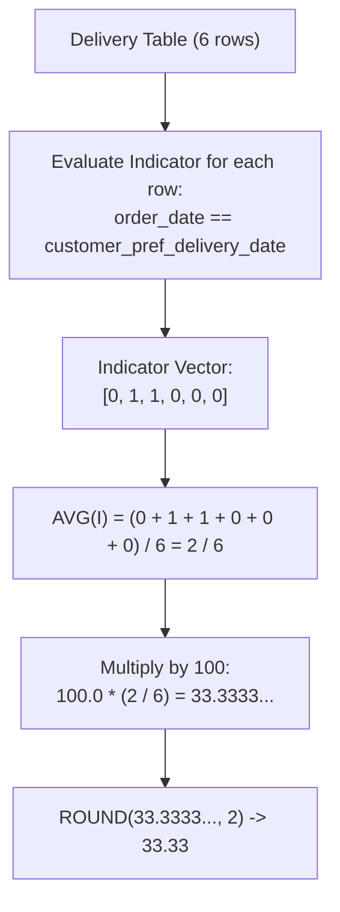

# Guided Example: Immediate Food Delivery I

We trace the relational aggregation pipeline using boolean indicator evaluation and floating-point ratio projection to compute the global percentage of immediate delivery orders.

- **Input:** `Delivery` table containing 6 delivery orders
- **Immediate condition:** `order_date == customer_pref_delivery_date`
- **Required output:**
  - `immediate_percentage = 33.33` (2 immediate orders out of 6 total orders: $2/6 \times 100 \approx 33.33\%$)

This instance illustrates row-level boolean indicator mapping, single-pass ratio aggregation (`AVG`), integer division avoidance, and two-decimal rounding.

---

## 1. Instance & Teaching Goal

In food delivery operations, each transaction in table `Delivery` records an `order_date` and a `customer_pref_delivery_date`.
- An order is **immediate** if the customer requested delivery on the exact same date as the order: `order_date = customer_pref_delivery_date`.
- An order is **scheduled** if the requested delivery date is strictly after the order date.

We must determine the percentage of immediate orders across the entire dataset, rounded to $2$ decimal places.

```text
Table Population Partitioning:

All Orders (N = 6):
  Order 1: 2019-08-01 vs 2019-08-02 -> Scheduled (0)
  Order 2: 2019-08-02 vs 2019-08-02 -> IMMEDIATE (1)  <--
  Order 3: 2019-08-11 vs 2019-08-11 -> IMMEDIATE (1)  <--
  Order 4: 2019-08-24 vs 2019-08-26 -> Scheduled (0)
  Order 5: 2019-08-21 vs 2019-08-22 -> Scheduled (0)
  Order 6: 2019-08-11 vs 2019-08-13 -> Scheduled (0)

Summary:
  Immediate count = 2
  Total count     = 6
  Ratio           = 2 / 6 = 0.333333...
  Percentage      = 33.33%
```

The fundamental teaching goal is to model category membership as an **indicator variable** $I \in \{0, 1\}$. In SQL, the mean of an indicator expression directly computes the empirical proportion without requiring subqueries:

$$\text{Proportion} = \frac{1}{N} \sum_{i=1}^N \mathbf{1}[\text{condition}_i] = \text{AVG}(\text{condition})$$

---

## 2. Conceptual Foundation & Invariants

Let $\mathcal{D}$ denote the `Delivery` table with cardinality $N = |\mathcal{D}|$.

For each row $i \in \{1, \dots, N\}$, define indicator:

$$I_i = \begin{cases} 1 & \text{if } order\_date_i = customer\_pref\_delivery\_date_i \\ 0 & \text{otherwise} \end{cases}$$

The global immediate percentage is:

$$\text{immediate\_percentage} = \text{ROUND}\left( 100.0 \times \frac{\sum_{i=1}^N I_i}{N}, \ 2 \right) = \text{ROUND}\left( 100.0 \times \text{AVG}(I), \ 2 \right)$$

| Entity | Relational Type | Role in Calculation |
|---|---|---|
| `order_date` | `DATE` | Timestamp when the transaction was placed |
| `customer_pref_delivery_date` | `DATE` | Desired arrival date requested by customer |
| Boolean Expression | `order_date = customer_pref_delivery_date` | Evaluates to $1$ (True) or $0$ (False) per row |
| `AVG(...)` | Aggregate function | Computes sample mean $\mu = \frac{1}{N} \sum I_i$ |
| `ROUND(..., 2)` | Scalar function | Formats decimal precision to two fractional digits |



> **Full Population Invariant.** This query operates on the global dataset without customer partitioning (`GROUP BY`). Every row in `Delivery` contributes unit weight $1$ to the denominator $N$.

---

## 3. Step-by-Step Worked Execution

We trace the 6 rows of `Delivery`.

### Step 1: Evaluate the Immediate Indicator for Every Row

1. **Row 1 (`delivery_id = 1`):**
   - $order\_date = \text{'2019-08-01'}$, $pref\_date = \text{'2019-08-02'}$.
   - Dates differ: $\text{'2019-08-01'} \ne \text{'2019-08-02'}$.
   - Classification: Scheduled. Indicator $I_1 = 0$.
2. **Row 2 (`delivery_id = 2`):**
   - $order\_date = \text{'2019-08-02'}$, $pref\_date = \text{'2019-08-02'}$.
   - Dates match: $\text{'2019-08-02'} = \text{'2019-08-02'}$.
   - Classification: Immediate. Indicator $I_2 = 1$.
3. **Row 3 (`delivery_id = 3`):**
   - $order\_date = \text{'2019-08-11'}$, $pref\_date = \text{'2019-08-11'}$.
   - Dates match: $\text{'2019-08-11'} = \text{'2019-08-11'}$.
   - Classification: Immediate. Indicator $I_3 = 1$.
4. **Row 4 (`delivery_id = 4`):**
   - $order\_date = \text{'2019-08-24'}$, $pref\_date = \text{'2019-08-26'}$.
   - Dates differ: $\text{'2019-08-24'} \ne \text{'2019-08-26'}$.
   - Classification: Scheduled. Indicator $I_4 = 0$.
5. **Row 5 (`delivery_id = 5`):**
   - $order\_date = \text{'2019-08-21'}$, $pref\_date = \text{'2019-08-22'}$.
   - Dates differ: $\text{'2019-08-21'} \ne \text{'2019-08-22'}$.
   - Classification: Scheduled. Indicator $I_5 = 0$.
6. **Row 6 (`delivery_id = 6`):**
   - $order\_date = \text{'2019-08-11'}$, $pref\_date = \text{'2019-08-13'}$.
   - Dates differ: $\text{'2019-08-11'} \ne \text{'2019-08-13'}$.
   - Classification: Scheduled. Indicator $I_6 = 0$.

---

### Step 2: Aggregate Counts and Compute Proportion

- Total rows: $N = 6$.
- Sum of indicators:
  $$\sum_{i=1}^6 I_i = 0 + 1 + 1 + 0 + 0 + 0 = 2$$
- Sample proportion:
  $$\mu = \frac{2}{6} = \frac{1}{3} \approx 0.333333\dots$$

---

### Step 3: Scale and Round

1. Convert to percentage:
   $$100.0 \times \mu = 100.0 \times \frac{1}{3} = 33.333333\dots$$
2. Round to $2$ decimal places:
   $$\text{ROUND}(33.333333\dots, \ 2) = \mathbf{33.33}$$

---

## 4. Complete Execution Trace

| `delivery_id` | `customer_id` | `order_date` | `customer_pref_delivery_date` | Category | Indicator $I_i$ | Running Immediate | Running Total |
|---|---|---|---|---|---|---|---|
| $1$ | $1$ | `2019-08-01` | `2019-08-02` | Scheduled | $0$ | $0$ | $1$ |
| $2$ | $5$ | `2019-08-02` | `2019-08-02` | **Immediate** | $1$ | $1$ | $2$ |
| $3$ | $1$ | `2019-08-11` | `2019-08-11` | **Immediate** | $1$ | $2$ | $3$ |
| $4$ | $3$ | `2019-08-24` | `2019-08-26` | Scheduled | $0$ | $2$ | $4$ |
| $5$ | $4$ | `2019-08-21` | `2019-08-22` | Scheduled | $0$ | $2$ | $5$ |
| $6$ | $2$ | `2019-08-11` | `2019-08-13` | Scheduled | $0$ | $2$ | $6$ |

```text
Final Statistical Metric:
  Immediate Orders Count = 2
  Total Orders Count     = 6
  Raw Percentage         = (2 / 6) * 100 = 33.333333... %
  Output Value           = 33.33
```

---

## 5. Algorithmic Correctness

**Theorem (Soundness of Single-Pass Indicator Aggregation).**
1. **Exhaustive Partition:** The binary equality predicate $P(r) \equiv (r.order\_date = r.customer\_pref\_delivery\_date)$ partitions relation $\mathcal{D}$ into disjoint sets $\mathcal{D}_{\text{imm}}$ and $\mathcal{D}_{\text{sched}}$ such that $|\mathcal{D}_{\text{imm}}| + |\mathcal{D}_{\text{sched}}| = |\mathcal{D}|$.
2. **Mean Equivalence:** In standard relational database semantics:
   $$\text{AVG}(P(r)) = \frac{1}{|\mathcal{D}|} \sum_{r \in \mathcal{D}} \mathbf{1}[P(r)] = \frac{|\mathcal{D}_{\text{imm}}|}{|\mathcal{D}|}$$
3. **Scaling & Precision:** Multiplying the scalar mean by $100.0$ converts the decimal ratio to percentage units. Applying $\text{ROUND}(x, 2)$ rounds using standard half-up arithmetic to exactly two decimal places, matching the schema requirement.

---

## 6. Traps This Instance Exposes

| Trap Category | Hazard Scenario | Root Cause | Preventive Design Invariant |
|---|---|---|---|
| **Integer Division Truncation** | Evaluating `COUNT(imm) / COUNT(*) * 100` resulting in `0` | In several SQL engines (SQL Server, PostgreSQL), integer divided by integer performs integer truncation ($2 / 6 = 0$). | Use floating-point literal: `100.0 * ...` to force floating-point arithmetic. |
| **Customer Grouping Confusion** | Adding `GROUP BY customer_id` | Misreading the problem to compute percentage per customer rather than across all delivery records globally. | Do not use `GROUP BY`; compute global aggregate over the entire table. |
| **Null Preference Date Handling** | If preference date could be null, equality evaluates to unknown | In database schemas where columns can be null, equality must be guarded. | Problem constraints specify dates are non-null; boolean equality is safe. |
| **Column Aliasing Omission** | Omitting `AS immediate_percentage` | The problem contract requires the output relation column to be named `immediate_percentage`. | Always provide the requested alias. |

---

## 7. Complexity Derivation

Let $N$ be the number of rows in the `Delivery` table.

### Time Complexity

- The database engine executes a single sequential table scan over $\mathcal{D}$.
- For each row, evaluating date equality takes $\mathcal{O}(1)$ time.
- Accumulating sum and count takes $\mathcal{O}(1)$ time per row.
- Total Time Complexity:

$$\mathcal{O}(N)$$

For tables with up to $10^6$ records, this runs in under $100 \text{ ms}$.

### Auxiliary Space Complexity

- The aggregate operation maintains only two internal scalar registers: running count of matches and total row count.
- Total Auxiliary Space Complexity:

$$\mathcal{O}(1)$$
