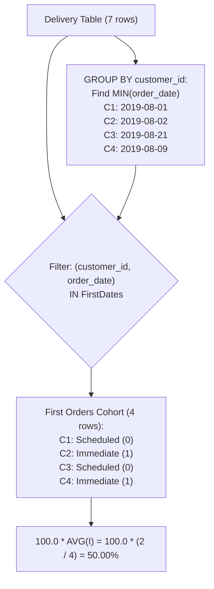

# Guided Example: Immediate Food Delivery II

We trace the relational aggregation pipeline using composite key filtering and window ranking to calculate the percentage of immediate deliveries strictly among the first orders of all customers.

- **Input:** `Delivery` table with 7 orders across 4 distinct customers
- **First order definition:** The earliest chronological order placed by each customer
- **Required output:**
  - `immediate_percentage = 50.00` (Customers 2 and 4 had immediate first orders; Customers 1 and 3 had scheduled first orders: $2 / 4 \times 100 = 50.00\%$)

This instance illustrates customer-grain timeline partitioning, isolating first-purchase events, filtering subsequent transactions, and cohort ratio aggregation.

---

## 1. Instance & Teaching Goal

Unlike Part I (which evaluates all delivery rows across the entire dataset), this problem restricts attention to the **first order** ever made by each customer. The problem statement guarantees that every customer has precisely one earliest order date.

A customer's first order is:
- **Immediate:** if $order\_date = customer\_pref\_delivery\_date$.
- **Scheduled:** if $customer\_pref\_delivery\_date > order\_date$.

We must compute the percentage of customers whose very first order was immediate, rounded to $2$ decimal places.

```text
Full Transaction Log vs. Customer First-Order Cohort:

Customer 1:
  - 2019-08-01 (pref 2019-08-02) -> FIRST ORDER -> Scheduled (0)
  - 2019-08-11 (pref 2019-08-12) -> Later order -> Ignored

Customer 2:
  - 2019-08-02 (pref 2019-08-02) -> FIRST ORDER -> IMMEDIATE (1)
  - 2019-08-11 (pref 2019-08-13) -> Later order -> Ignored

Customer 3:
  - 2019-08-21 (pref 2019-08-22) -> FIRST ORDER -> Scheduled (0)
  - 2019-08-24 (pref 2019-08-24) -> Later order (immediate, but not first!) -> Ignored

Customer 4:
  - 2019-08-09 (pref 2019-08-09) -> FIRST ORDER -> IMMEDIATE (1)

First Order Cohort (4 customers):
  Immediate: Customers 2, 4 (count = 2)
  Scheduled: Customers 1, 3 (count = 2)
  Ratio: 2 / 4 = 50.00%
```

The fundamental teaching goal is **Cohort Filtering**:
1. Identify the earliest order date for each customer: $(customer\_id, \min(order\_date))$.
2. Filter the transaction table to retain only these first orders, discarding all subsequent activity.
3. Compute the proportion of immediate orders over this customer-level cohort.

---

## 2. Conceptual Foundation & Invariants

Let $\mathcal{D}$ denote the `Delivery` table.

### Formulation via Composite Key Matching

We find each customer's earliest order date:

$$\mathcal{F} = \Pi_{customer\_id, \, \min(order\_date) \to first\_date}(\mathcal{D})$$

We then filter $\mathcal{D}$ using an equi-join or composite `IN` predicate:

$$\mathcal{D}_{\text{first}} = \sigma_{(customer\_id, \, order\_date) \in \mathcal{F}}(\mathcal{D})$$

### Alternative Formulation via Window Function

Assign a chronological row number per customer:

$$rnk = \text{ROW\_NUMBER}() \text{ OVER (PARTITION BY } customer\_id \text{ ORDER BY } order\_date \text{ ASC)}$$

Then filter for $rnk = 1$.

| Relational Stage | Operation | Invariant Guarantee |
|---|---|---|
| Grouped Minimum | `MIN(order_date) GROUP BY customer_id` | Identifies each customer's first purchase date |
| Composite Filter | `(customer_id, order_date) IN (...)` | Retains exactly one row per customer |
| Indicator Mapping | $\mathbf{1}[order\_date = customer\_pref\_delivery\_date]$ | Classifies first order as immediate ($1$) or scheduled ($0$) |
| Cohort Aggregation | $\text{ROUND}(100.0 \times \text{AVG}(I), 2)$ | Averages over customer cohort size, not total order volume |



> **Single First Order Invariant.** Because the problem guarantees that each customer has precisely one first order, $|\mathcal{D}_{\text{first}}|$ equals the exact number of distinct customers. No customer can contribute more than one vote to the final percentage.

---

## 3. Step-by-Step Worked Execution

We trace the 7 delivery rows across Customers 1, 2, 3, 4.

### Step 1: Identify Each Customer's First Order Date

- **Customer 1:**
  - Order 1 on `2019-08-01`
  - Order 3 on `2019-08-11`
  - Earliest date: $\mathbf{2019-08-01}$.
- **Customer 2:**
  - Order 2 on `2019-08-02`
  - Order 6 on `2019-08-11`
  - Earliest date: $\mathbf{2019-08-02}$.
- **Customer 3:**
  - Order 5 on `2019-08-21`
  - Order 4 on `2019-08-24`
  - Earliest date: $\mathbf{2019-08-21}$.
- **Customer 4:**
  - Order 7 on `2019-08-09`
  - Earliest date: $\mathbf{2019-08-09}$.

Earliest dates set:

$$\mathcal{F} = \{(1, \text{'2019-08-01'}), (2, \text{'2019-08-02'}), (3, \text{'2019-08-21'}), (4, \text{'2019-08-09'})$$

---

### Step 2: Filter and Evaluate First Orders

We test each row in `Delivery` against $\mathcal{F}$:

1. **Row 1 (`delivery_id = 1`, Customer 1):**
   - Matches $(1, \text{'2019-08-01'})$. **Is First Order.**
   - $order\_date = \text{'2019-08-01'}$, $pref\_date = \text{'2019-08-02'}$.
   - Dates differ $\implies$ **Scheduled (0)**.
2. **Row 2 (`delivery_id = 2`, Customer 2):**
   - Matches $(2, \text{'2019-08-02'})$. **Is First Order.**
   - $order\_date = \text{'2019-08-02'}$, $pref\_date = \text{'2019-08-02'}$.
   - Dates match $\implies$ **Immediate (1)**.
3. **Row 3 (`delivery_id = 3`, Customer 1):**
   - Date is `2019-08-11` $\ne$ `2019-08-01`. **Discarded (Later Order).**
4. **Row 4 (`delivery_id = 4`, Customer 3):**
   - Date is `2019-08-24` $\ne$ `2019-08-21`. **Discarded (Later Order).**
5. **Row 5 (`delivery_id = 5`, Customer 3):**
   - Matches $(3, \text{'2019-08-21'})$. **Is First Order.**
   - $order\_date = \text{'2019-08-21'}$, $pref\_date = \text{'2019-08-22'}$.
   - Dates differ $\implies$ **Scheduled (0)**.
6. **Row 6 (`delivery_id = 6`, Customer 2):**
   - Date is `2019-08-11` $\ne$ `2019-08-02`. **Discarded (Later Order).**
7. **Row 7 (`delivery_id = 7`, Customer 4):**
   - Matches $(4, \text{'2019-08-09'})$. **Is First Order.**
   - $order\_date = \text{'2019-08-09'}$, $pref\_date = \text{'2019-08-09'}$.
   - Dates match $\implies$ **Immediate (1)**.

---

### Step 3: Compute the Cohort Percentage

- Cohort size (distinct customers): $4$.
- Immediate first orders: $2$ (Customers 2 and 4).
- Scheduled first orders: $2$ (Customers 1 and 3).
- Proportion:
  $$\frac{2}{4} = 0.50$$
- Percentage:
  $$\text{ROUND}(100.0 \times 0.50, \ 2) = \mathbf{50.00}$$

---

## 4. Complete Execution Trace

| `delivery_id` | `customer_id` | `order_date` | `customer_pref_delivery_date` | Customer Earliest Date | Is First Order? | Immediate? | Contribution to Metric |
|---|---|---|---|---|---|---|---|
| $1$ | $1$ | `2019-08-01` | `2019-08-02` | `2019-08-01` | **Yes** | No ($0$) | Counted as Scheduled |
| $2$ | $2$ | `2019-08-02` | `2019-08-02` | `2019-08-02` | **Yes** | Yes ($1$) | Counted as Immediate |
| $3$ | $1$ | `2019-08-11` | `2019-08-12` | `2019-08-01` | No | — | Discarded |
| $4$ | $3$ | `2019-08-24` | `2019-08-24` | `2019-08-21` | No | — | Discarded (Even though pref=order) |
| $5$ | $3$ | `2019-08-21` | `2019-08-22` | `2019-08-21` | **Yes** | No ($0$) | Counted as Scheduled |
| $6$ | $2$ | `2019-08-11` | `2019-08-13` | `2019-08-02` | No | — | Discarded |
| $7$ | $4$ | `2019-08-09` | `2019-08-09` | `2019-08-09` | **Yes** | Yes ($1$) | Counted as Immediate |

```text
Critical Pitfall Illustrated by Customer 3:
  Order 5 (First): 2019-08-21 -> Scheduled
  Order 4 (Later): 2019-08-24 -> Immediate
  
  If we evaluated all orders without filtering for the first order,
  Customer 3's immediate second order would falsely inflate the immediate count.
  Correct logic strictly examines Order 5 (Scheduled).
```

---

## 5. Algorithmic Correctness

**Theorem (First-Order Cohort Cardinality and Uniqueness).**
1. **Uniqueness:** The problem specification guarantees that each customer has precisely one first order (no customer has two orders on their earliest order date). Thus, the set $\mathcal{F} = \{(c, \min_{r.customer\_id = c} r.order\_date)\}$ has cardinality $|\mathcal{F}| = |Customers|$.
2. **Bijective Cohort Mapping:** Filtering $\mathcal{D}$ by $(customer\_id, order\_date) \in \mathcal{F}$ yields a subset $\mathcal{D}_{\text{first}}$ where each customer $c$ is represented by exactly one row.
3. **Sound Ratio:** The denominator of `AVG` over $\mathcal{D}_{\text{first}}$ is identically the total count of distinct customers, and the numerator is the exact number of customers whose first order was immediate.
4. Hence, $\text{ROUND}(100.0 \times \text{AVG}(I), 2)$ is sound and exact.

---

## 6. Traps This Instance Exposes

| Trap Category | Hazard Scenario | Root Cause | Preventive Design Invariant |
|---|---|---|---|
| **Subsequent Immediate Order Pollution** | Counting Customer 3's second order (Order 4) because its preferred date matches its order date | Failing to restrict the analysis to the earliest order date per customer. | Only evaluate rows satisfying $order\_date = \min(order\_date)$ for each customer. |
| **Multi-Order Customer Weighting** | Dividing by total orders rather than total customers | Repeating the Part I logic instead of normalizing by distinct customer count. | The denominator must be the cardinality of the customer cohort. |
| **Tied Order Dates Assumption** | Multiple orders on the same first date | In general SQL, `MIN(order_date)` could match multiple rows if ties exist. | The problem explicitly guarantees: "It is guaranteed that a customer has precisely one first order." |
| **Integer Truncation in Percentage** | `COUNT(imm) / COUNT(*) * 100` yielding `0` | Integer division truncation. | Always multiply by `100.0` or cast to floating-point. |

---

## 7. Complexity Derivation

Let $N$ be the number of rows in `Delivery`, and $C$ be the number of distinct customers ($C \le N$).

### Time Complexity

1. **Finding Minimum Dates:**
   - Grouping $N$ rows by $customer\_id$ to find $\min(order\_date)$ takes $\mathcal{O}(N)$ using a hash table or index.
2. **Filtering First Orders:**
   - Semi-join or composite key matching against the $C$ minimum dates takes $\mathcal{O}(N)$ time.
3. **Aggregation:**
   - Computing the mean over the $C$ first orders takes $\mathcal{O}(C)$ time.
4. **Overall Time Complexity:**

$$\mathcal{O}(N)$$

With an index on `(customer_id, order_date)`, execution completes in $\mathcal{O}(N \log C)$ or $\mathcal{O}(N)$.

### Auxiliary Space Complexity

- Temporary table or hash map storing $C$ customer minimum dates requires $\mathcal{O}(C)$ space.
- Overall Auxiliary Space Complexity:

$$\mathcal{O}(C) \le \mathcal{O}(N)$$
