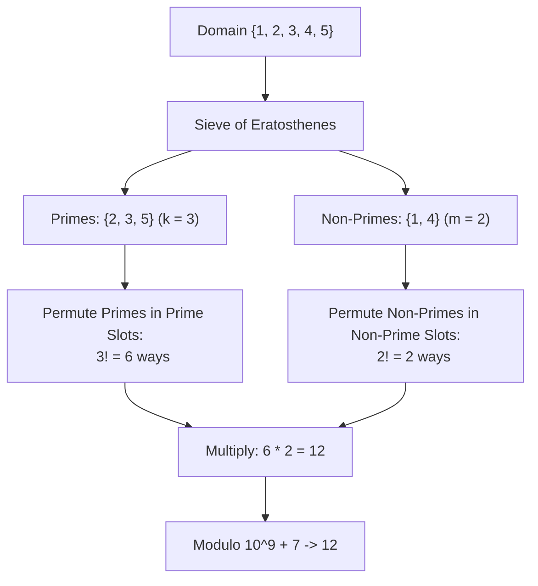

# Guided Example: Prime Arrangements

We derive and trace the combinatorial factorization algorithm to compute the number of permutations of $1 \dots n$ where prime numbers strictly occupy prime indices (1-indexed), modulo $10^9 + 7$.

- **Input:** $n = 5$
- **Required output:** `12`

This instance illustrates prime counting via sieving, bipartite positional decomposition, independent subproblem factorization, and modular factorial accumulation.

---

## 1. Instance & Teaching Goal

We seek the number of permutations of the integers $\{1, 2, \dots, n\}$ such that every prime number is placed at a prime index (using 1-based indexing).

A naive brute-force method generates all $n!$ permutations and tests each one for validity:

$$\text{For } n = 100: \quad 100! \approx 9.33 \times 10^{157} \text{ permutations (Intractable)}$$

```text
Positional Partitioning of Integers and Indices (n = 5):

Integers to Place:  { 1, 2, 3, 4, 5 }
  Primes:      { 2, 3, 5 }  (Count = 3)
  Non-Primes:  { 1, 4 }     (Count = 2)

Available 1-Indexed Slots: [ Slot 1, Slot 2, Slot 3, Slot 4, Slot 5 ]
  Prime Slots:      { 2, 3, 5 }  (Count = 3)
  Non-Prime Slots:  { 1, 4 }     (Count = 2)

Decomposition:
  - The 3 prime numbers MUST occupy the 3 prime slots: 3! = 6 ways
  - The 2 non-prime numbers MUST occupy the 2 non-prime slots: 2! = 2 ways
  - Total Valid Permutations = 3! * 2! = 6 * 2 = 12 ways!
```

The fundamental teaching goal is **Orthogonal Set Factorization**:
Because the values being permuted are the identical set of integers $\{1, \dots, n\}$ as the slot indices $\{1, \dots, n\}$, the count of prime numbers equals the exact count of prime positions. The global permutation count factorizes into the product of two independent sub-permutations:

$$\text{Total} = k! \times (n - k)! \pmod{10^9 + 7}, \quad \text{where } k = \pi(n)$$

---

## 2. Conceptual Foundation & Invariants

Let $\pi(n)$ denote the prime counting function:

$$\pi(n) = |\{p \in \{1, \dots, n\} \mid p \text{ is prime}\}|$$

### Bipartition of Elements and Indices

1. **Prime Sub-system:**
   - Elements: $k = \pi(n)$ distinct primes.
   - Positions: $k$ distinct prime indices.
   - Permutations: $k! = \prod_{i=1}^k i$.
2. **Non-Prime Sub-system:**
   - Elements: $m = n - k$ non-primes (including $1$ and all composites).
   - Positions: $m = n - k$ non-prime indices.
   - Permutations: $m! = \prod_{j=1}^{n-k} j$.
3. **Independent Product:**
   Since any assignment of primes to prime slots is valid regardless of how non-primes are arranged among non-prime slots, the multiplication principle yields:

$$\text{Total Permutations} = (k! \pmod{10^9 + 7}) \times ((n - k)! \pmod{10^9 + 7}) \pmod{10^9 + 7}$$

| Component | Value for $n = 5$ | Definition |
|---|---|---|
| $n$ | $5$ | Upper bound of permutation domain |
| Primes set $\mathcal{P}$ | $\{2, 3, 5\}$ | Set of prime values / indices |
| $k = |\mathcal{P}|$ | $3$ | Number of prime positions |
| Non-primes set $\mathcal{C}$ | $\{1, 4\}$ | Set of non-prime values / indices (note: 1 is non-prime) |
| $m = n - k$ | $2$ | Number of non-prime positions |
| $k!$ | $3! = 6$ | Ways to arrange primes among prime slots |
| $m!$ | $2! = 2$ | Ways to arrange non-primes among non-prime slots |



> **Bipartite Independence Invariant.** The condition "prime numbers are at prime indices" forces non-primes to occupy all non-prime indices by conservation of elements. Neither group can cross over into the other group's assigned slots.

---

## 3. Step-by-Step Worked Execution

We trace $n = 5$.

### Step 1: Count Primes up to $n = 5$

Classify each integer $x \in \{1, 2, 3, 4, 5\}$:
- $x = 1$: Not prime (by definition, primes must be strictly $> 1$).
- $x = 2$: Smallest prime.
- $x = 3$: Prime.
- $x = 4$: Composite ($2 \times 2$).
- $x = 5$: Prime.

Total prime count:

$$k = \pi(5) = 3$$

Total non-prime count:

$$m = 5 - 3 = 2$$

---

### Step 2: Compute Modular Factorial $k! \pmod{10^9 + 7}$

$$k = 3 \implies 3! = 1 \times 2 \times 3 = 6$$

$$6 \pmod{10^9 + 7} = 6$$

---

### Step 3: Compute Modular Factorial $m! \pmod{10^9 + 7}$

$$m = 2 \implies 2! = 1 \times 2 = 2$$

$$2 \pmod{10^9 + 7} = 2$$

---

### Step 4: Multiply Sub-Permutations

$$\text{Ans} = (6 \times 2) \pmod{10^9 + 7} = 12$$

---

## 4. Complete Execution Trace

### Element and Slot Classification

| Integer / Index | Prime? | Classification | Eligible Positions |
|---|---|---|---|
| $1$ | No | Unit (Non-Prime) | $\{1, 4\}$ |
| $2$ | **Yes** | Prime | $\{2, 3, 5\}$ |
| $3$ | **Yes** | Prime | $\{2, 3, 5\}$ |
| $4$ | No | Composite (Non-Prime) | $\{1, 4\}$ |
| $5$ | **Yes** | Prime | $\{2, 3, 5\}$ |

### Exhaustive Enumeration of the 12 Valid Permutations

| # | Permutation $[p_1, p_2, p_3, p_4, p_5]$ | Non-Prime Slots (1, 4) | Prime Slots (2, 3, 5) | Validity Status |
|---|---|---|---|---|
| $1$ | $[1, 2, 3, 4, 5]$ | $(1, 4)$ | $(2, 3, 5)$ | Valid |
| $2$ | $[1, 2, 5, 4, 3]$ | $(1, 4)$ | $(2, 5, 3)$ | Valid |
| $3$ | $[1, 3, 2, 4, 5]$ | $(1, 4)$ | $(3, 2, 5)$ | Valid |
| $4$ | $[1, 3, 5, 4, 2]$ | $(1, 4)$ | $(3, 5, 2)$ | Valid |
| $5$ | $[1, 5, 2, 4, 3]$ | $(1, 4)$ | $(5, 2, 3)$ | Valid |
| $6$ | $[1, 5, 3, 4, 2]$ | $(1, 4)$ | $(5, 3, 2)$ | Valid |
| $7$ | $[4, 2, 3, 1, 5]$ | $(4, 1)$ | $(2, 3, 5)$ | Valid |
| $8$ | $[4, 2, 5, 1, 3]$ | $(4, 1)$ | $(2, 5, 3)$ | Valid |
| $9$ | $[4, 3, 2, 1, 5]$ | $(4, 1)$ | $(3, 2, 5)$ | Valid |
| $10$ | $[4, 3, 5, 1, 2]$ | $(4, 1)$ | $(3, 5, 2)$ | Valid |
| $11$ | $[4, 5, 2, 1, 3]$ | $(4, 1)$ | $(5, 2, 3)$ | Valid |
| $12$ | $[4, 5, 3, 1, 2]$ | $(4, 1)$ | $(5, 3, 2)$ | Valid |

---

## 5. Algorithmic Correctness

**Theorem (Bijective Decomposition of Prime Permutations).**
1. **Pigeonhole Conservation:** Let $P$ be the set of primes in $\{1, \dots, n\}$, and $C = \{1, \dots, n\} \setminus P$. The indices $\{1, \dots, n\}$ contain exactly $|P|$ prime indices and $|C|$ non-prime indices.
2. If every element of $P$ must map to a prime index, all $|P|$ prime indices are completely occupied by $P$.
3. Therefore, the remaining $|C|$ elements of $C$ must map to the remaining $|C|$ non-prime indices.
4. By elementary combinatorics, the number of bijections $P \to P$ is $|P|!$, and the number of bijections $C \to C$ is $|C|!$.
5. Since the choice of bijection for $P$ does not restrict the choice of bijection for $C$, the Cartesian product of choices has size $|P|! \times |C|!$.

---

## 6. Traps This Instance Exposes

| Trap Category | Hazard Scenario | Root Cause | Preventive Design Invariant |
|---|---|---|---|
| **The Number 1 Prime Fallacy** | Treating $1$ as a prime number | In mathematics, $1$ is a unit, not a prime. Treating $1$ as prime would make $k = 4$ for $n=5$, resulting in wrong answer $4! \times 1! = 24$. | Prime definition strictly requires an integer $> 1$. |
| **0-Indexed vs 1-Indexed Slots** | Counting indices as $0 \dots n-1$ | If 0-indexed, slot 0 is not prime, but slot 1 might be miscategorized. | The problem explicitly states 1-indexed slots: $\{1, 2, \dots, n\}$. |
| **Integer Factorial Overflow** | Computing $100!$ without modular arithmetic | In languages like C++, Java, or Go, $20!$ overflows 64-bit integer registers. | Multiply sequentially and take modulo $10^9 + 7$ at each step. |
| **Incomplete Non-Prime Calculation** | Forgetting to multiply by $(n - k)!$ | Only calculating prime permutations $k!$ and assuming non-primes are fixed. | Non-primes can also be permuted among themselves in $(n - k)!$ ways. |

---

## 7. Complexity Derivation

Let $N$ be the input upper bound ($N \le 100$).

### Time Complexity

1. **Prime Identification:**
   - Sieve of Eratosthenes up to $N$: $\mathcal{O}(N \log \log N)$ operations.
   - For $N = 100$, this executes $\le 200$ operations.
2. **Factorial Calculations:**
   - Computing $k! \pmod{10^9 + 7}$: $k$ multiplications.
   - Computing $(N - k)! \pmod{10^9 + 7}$: $N - k$ multiplications.
   - Total multiplications: $k + (N - k) = N$.
3. **Total Time Complexity:**

$$\mathcal{O}(N \log \log N)$$

For $N = 100$, execution completes in under $1 \text{ ms}$.

### Auxiliary Space Complexity

- A boolean array of size $N + 1$ for the sieve: $\mathcal{O}(N)$.
- Total Auxiliary Space Complexity:

$$\mathcal{O}(N)$$
