# Guided Example: Diet Plan Performance

We trace the fixed-size sliding window algorithm to evaluate daily dietary performance across consecutive $k$-day spans in strictly linear time.

- **Input:** $calories = [6, 5, 0, 0]$, $k = 2$, $lower = 1$, $upper = 5$
- **Required output:** `0`

This instance illustrates fixed-size window initialization, differential rolling sum updates ($\mathcal{O}(1)$ transitions), strict three-way threshold partitioning, and score accumulation.

---

## 1. Instance & Teaching Goal

Given an array $calories$ representing daily caloric intake, we evaluate every consecutive sequence of $k$ days. For each contiguous window of length $k$, let $T$ be the total calories consumed:
- If $T < lower$: performance is poor, lose $1$ point ($\Delta = -1$).
- If $T > upper$: performance is excessive/good, gain $1$ point ($\Delta = +1$).
- If $lower \le T \le upper$: performance is normal, score is unchanged ($\Delta = 0$).

Initially, points are $0$. Total points can be negative. We return the final cumulative score after evaluating all $N - k + 1$ valid windows.

A naive algorithm computes the sum of elements for each $k$-length window independently from scratch:

$$\text{Naive Cost} = \mathcal{O}((N - k + 1) \cdot k)$$

When $k \approx N/2$ with $N = 10^5$:
$$(50000) \times 50000 = 2.5 \times 10^9 \text{ operations (Time Limit Exceeded)}$$

```text
Naive Window Recomputation vs. Differential Sliding Window:

Window 0: [6, 5] -> 6 + 5 = 11 (2 additions)
Window 1: [5, 0] -> 5 + 0 = 5  (2 additions)
Window 2: [0, 0] -> 0 + 0 = 0  (2 additions)

Sliding Window:
  Seed initial sum: T = 6 + 5 = 11
  Slide to Window 1: Drop 6, Add 0 -> T = 11 - 6 + 0 = 5 (O(1))
  Slide to Window 2: Drop 5, Add 0 -> T = 5 - 5 + 0 = 0  (O(1))
```

The fundamental teaching goal is the **Differential Shift Invariant**:
When advancing a window of fixed width $k$ by one position to the right, exactly one element leaves the left boundary ($calories[i-k]$) and exactly one element enters the right boundary ($calories[i]$). The new sum is maintained in $\mathcal{O}(1)$ time:

$$T_{\text{new}} = T_{\text{old}} - calories[i-k] + calories[i]$$

---

## 2. Conceptual Foundation & Invariants

Let $N = |calories|$. The sequence contains exactly $N - k + 1$ windows of length $k$, indexed by starting position $j \in \{0, \dots, N-k\}$.

### Metric Invariant

For every window $[j, j+k-1]$:

$$T_j = \sum_{m=j}^{j+k-1} calories[m]$$

### Transition Function

$$\text{score}_{j+1} = \text{score}_j + \begin{cases} +1 & \text{if } T_j > upper \\ -1 & \text{if } T_j < lower \\ 0 & \text{if } lower \le T_j \le upper \end{cases}$$

| State Variable | Type | Invariant Role |
|---|---|---|
| Window Span $[j, j+k-1]$ | Index range of length $k$ | Fixed boundary interval |
| $T$ | Integer $\ge 0$ | Exact sum of the $k$ elements currently in the active window |
| $lower$ | Integer | Strict threshold below which points are deducted |
| $upper$ | Integer | Strict threshold above which points are awarded |
| $score$ | Signed integer | Cumulative tally of all performance points earned or lost |

```mermaid
flowchart TD
    accTitle: Fixed-Width Sliding Window State Progression
    accDescr: Diagram illustrating window initialization, evaluation of three-way threshold conditions, and O(1) rolling updates.

    Init["Initialize: T = sum(calories[0...k-1]), score = 0"] --> Eval0["Evaluate Window 0:
    Compare T with lower and upper"]
    Eval0 --> UpdateScore0["Update score"]
    UpdateScore0 --> SlideLoop{"More elements ahead?"}
    SlideLoop -- "Yes" --> Shift["T = T - calories[i - k] + calories[i]"]
    Shift --> EvalI["Compare new T with lower and upper"]
    EvalI --> UpdateScoreI["Update score"]
    UpdateScoreI --> SlideLoop
    SlideLoop -- "No" --> Done["Return final score"]
```



> **Strict Boundary Invariant.** If $T = lower$ or $T = upper$, the condition is considered normal and neither awards nor penalizes points ($\Delta = 0$). Only strict inequalities trigger point modifications.

---

## 3. Step-by-Step Worked Execution

We trace $calories = [6, 5, 0, 0]$, $k = 2$, $lower = 1$, $upper = 5$.
$N = 4 \implies$ total windows to evaluate: $4 - 2 + 1 = 3$.

### Step 0: Initialize First Window (Window 0: indices $[0, 1]$)

- Initial slice: $[calories[0], calories[1]] = [6, 5]$.
- Initial sum: $T = 6 + 5 = 11$.
- Initial points: $score = 0$.

---

### Step 1: Evaluate Window 0 (Days $0 \dots 1$)

- Active window: $[6, 5]$, sum $T = 11$.
- Threshold checks:
  - $T = 11 > upper \ (5) \implies$ Excessive/good intake!
  - Point change: $\Delta = +1$.
- Update: $score = 0 + 1 = 1$.

---

### Step 2: Slide and Evaluate Window 1 (Days $1 \dots 2$)

- Incoming element: $calories[2] = 0$ (day 2).
- Outgoing element: $calories[2 - 2] = calories[0] = 6$ (day 0).
- Differential update:
  $$T \leftarrow 11 - 6 + 0 = 5$$
- Active window: $[5, 0]$, sum $T = 5$.
- Threshold checks:
  - $lower \ (1) \le T \ (5) \le upper \ (5)$.
  - Point change: $\Delta = 0$.
- Update: $score = 1 + 0 = 1$.

---

### Step 3: Slide and Evaluate Window 2 (Days $2 \dots 3$)

- Incoming element: $calories[3] = 0$ (day 3).
- Outgoing element: $calories[3 - 2] = calories[1] = 5$ (day 1).
- Differential update:
  $$T \leftarrow 5 - 5 + 0 = 0$$
- Active window: $[0, 0]$, sum $T = 0$.
- Threshold checks:
  - $T = 0 < lower \ (1) \implies$ Poor/insufficient intake!
  - Point change: $\Delta = -1$.
- Update: $score = 1 + (-1) = 0$.

---

### Termination

All $3$ windows processed.
Emit final score: **0**.

---

## 4. Complete Execution Trace

| Window Index ($j$) | Day Range | Outgoing ($-$) | Incoming ($+$) | Window Sum ($T$) | Comparison Tested | Point Delta ($\Delta$) | Cumulative Score |
|---|---|---|---|---|---|---|---|
| $0$ (Init) | $[0, 1]$ | None | $6, 5$ | $11$ | $11 > 5$ ($T > upper$) | $+1$ | $1$ |
| $1$ | $[1, 2]$ | $calories[0] = 6$ | $calories[2] = 0$ | $5$ | $1 \le 5 \le 5$ (Normal) | $0$ | $1$ |
| $2$ | $[2, 3]$ | $calories[1] = 5$ | $calories[3] = 0$ | $0$ | $0 < 1$ ($T < lower$) | $-1$ | **0** |

```text
Performance Profile across Diet Windows:

Window 0 [6, 5]: Sum = 11 > 5  --> Gain 1 point  (Running Score:  1)
Window 1 [5, 0]: Sum =  5 in [1, 5] --> No change  (Running Score:  1)
Window 2 [0, 0]: Sum =  0 < 1  --> Lose 1 point  (Running Score:  0)
```

---

## 5. Algorithmic Correctness

**Theorem (Correctness of Differential Sum Maintenance).**
1. **Base Case:** For $j = 0$, $T_0 = \sum_{m=0}^{k-1} calories[m]$ by direct summation.
2. **Induction Step:** Suppose $T_j = \sum_{m=j}^{j+k-1} calories[m]$. When moving to window $j+1$:
   $$T_{j+1} = \sum_{m=j+1}^{j+k} calories[m] = \left(\sum_{m=j}^{j+k-1} calories[m]\right) - calories[j] + calories[j+k] = T_j - calories[j] + calories[j+k]$$
   Thus, $T$ remains exact without accumulated drift.
3. **Partition Completeness:** Since the window advances by exactly $1$ index in each step until $j + k = N$, every consecutive subsegment of length $k$ is evaluated exactly once against the thresholds.

---

## 6. Traps This Instance Exposes

| Trap Category | Hazard Scenario | Root Cause | Preventive Design Invariant |
|---|---|---|---|
| **Non-Strict Inequality Trap** | Treating $T = lower$ as losing a point, or $T = upper$ as gaining a point | The problem specification states "If $T < lower$" and "If $T > upper$". Exact matches are normal. | Use strict comparisons: $T < lower$ and $T > upper$. |
| **Window Count Off-By-One** | Evaluating only $N - k$ windows instead of $N - k + 1$ | Stopping the loop before evaluating the final window at the tail. | Ensure loop covers all indices up to $N - 1$, and final window is evaluated. |
| **Quadratic Inner Summation** | Calling `sum(calories[i:i+k])` inside the loop | Re-summing $k$ elements per iteration reintroduces $\mathcal{O}(N \cdot k)$ runtime. | Update $T$ in $\mathcal{O}(1)$ via subtraction and addition. |
| **Negative Score Avoidance** | Clamping score to $0$ if it drops below zero | Assuming points cannot be negative. | The problem explicitly states: "Note that the total points can be negative." |

---

## 7. Complexity Derivation

Let $N$ be the number of days in $calories$ ($N \le 10^5$), and $k$ be the window size ($k \le N$).

### Time Complexity

1. **Initial Window Sum:** Summing the first $k$ elements takes $\mathcal{O}(k)$ time.
2. **Sliding Window Loop:**
   - The loop runs $N - k$ times.
   - Each iteration performs $1$ subtraction, $1$ addition, and at most $2$ constant-time comparisons.
   - Total loop time: $\mathcal{O}(N - k)$.
3. **Overall Time Complexity:**

$$\mathcal{O}(k + (N - k)) = \mathcal{O}(N)$$

For $N = 100{,}000$, total arithmetic operations are $\le 200{,}000$, executing in under $3 \text{ ms}$.

### Auxiliary Space Complexity

- The algorithm maintains only a few scalar variables: $T$, $score$, and loop indices.
- Total Auxiliary Space Complexity:

$$\mathcal{O}(1)$$
