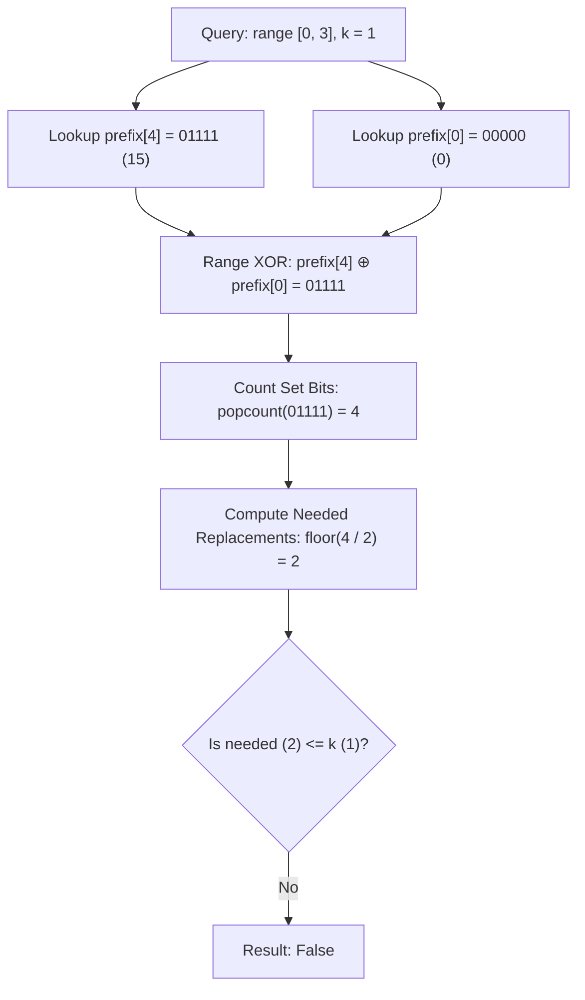

# Guided Example: Can Make Palindrome from Substring

## 1. Problem Essence & Algorithmic Mental Model

Given a string $s$ and a sequence of queries, each query is defined as a triplet $(l, r, k)$. We are permitted to extract the contiguous substring $s[l \dots r]$, rearrange its characters in any arbitrary permutation, and subsequently replace at most $k$ characters with any chosen lowercase English letter. The goal is to determine whether the substring can be converted into a palindrome under these operations.

Because arbitrary character rearrangement is permitted, the positional sequence of characters within the substring is completely irrelevant; only their multiset character frequencies matter. A sequence of characters can be rearranged into a palindrome if and only if at most one character occurs an odd number of times (which can occupy the exact central pivot of an odd-length palindrome).

Each replacement operation allows us to transform an "unpaired" character (a character with an odd frequency) into a match for another unpaired character. Concretely, choosing two distinct characters with odd frequencies and replacing one with the other reduces the count of odd-frequency character types by exactly 2. Consequently, $k$ replacements can resolve up to $2k$ odd-frequency characters. If the substring has an odd length, one odd character naturally sits in the center without requiring replacement. Hence, if $m$ denotes the number of distinct character types appearing an odd number of times in $s[l \dots r]$, the substring can form a palindrome if and only if:

$$\lfloor \frac{m}{2} \rfloor \le k$$

Evaluating this condition naively by counting character frequencies over each query substring takes $\mathcal{O}(|s|)$ per query, leading to an unacceptable $\mathcal{O}(|s| \cdot |queries|)$ total time. To optimize, we recognize that character frequency parity forms an abelian group under addition modulo 2 (exclusive OR). By precomputing a prefix bitmask where bit $c \in [0, 25]$ tracks the cumulative parity of character $c$, any substring query can be answered in $\mathcal{O}(1)$ time using bitwise XOR and population count.

```
       Substring: "a b c d a"
  Frequencies:  a: 2 (even), b: 1 (odd), c: 1 (odd), d: 1 (odd)
  Odd count m = 3
  Required replacements = floor(3 / 2) = 1
  If k >= 1: TRUE (e.g., replace 'd' with 'b' -> "abcba")
  If k == 0: FALSE
```

---

## 2. Mathematical Formalism & Invariants

Let $\Sigma = \{a, b, \dots, z\}$ with alphabet size $|\Sigma| = 26$. For any string $w$, let $\text{freq}(w, c)$ denote the number of occurrences of character $c \in \Sigma$ in $w$.

### Lemma 1: Necessary and Sufficient Condition for Permutation Palindromicity
A multiset of characters can be arranged into a palindrome if and only if:
$$\sum_{c \in \Sigma} (\text{freq}(w, c) \bmod 2) \le 1$$

### Lemma 2: Odd Count Reduction via Character Replacement
Let $m = \sum_{c \in \Sigma} (\text{freq}(s[l \dots r], c) \bmod 2)$ be the number of character types with odd frequencies in substring $s[l \dots r]$.
Each single character substitution changes the frequency of one character by $-1$ and another character by $+1$. Modulo 2, this flips the parity of exactly two characters. In the optimal scenario, we choose two characters with odd parity and flip both to even parity. Thus, one replacement reduces $m$ by 2.
Therefore, $k$ substitutions can eliminate at most $2k$ odd characters. The condition for feasibility is:
$$m - 2k \le 1 \iff m \le 2k + 1 \iff \lfloor \frac{m}{2} \rfloor \le k$$

### Prefix Parity Bitmask Formulation
We represent the parity of all 26 character counts as an integer bitmask $B \in [0, 2^{26}-1]$.
For each prefix $s[0 \dots i-1]$ (with $0 \le i \le n$):
$$\text{prefix}[0] = 0$$
$$\text{prefix}[i] = \text{prefix}[i-1] \oplus (1 \ll (\text{ord}(s[i-1]) - \text{ord}('a')))$$

By the properties of bitwise XOR ($\oplus$):
$$\text{mask}(s[l \dots r]) = \text{prefix}[r + 1] \oplus \text{prefix}[l]$$
The total number of odd-frequency characters $m$ in $s[l \dots r]$ is given by the population count (Hamming weight):
$$m = \text{popcount}(\text{prefix}[r + 1] \oplus \text{prefix}[l])$$

The query predicate evaluates to:
$$\text{ans}(l, r, k) = \left( \lfloor \frac{\text{popcount}(\text{prefix}[r + 1] \oplus \text{prefix}[l])}{2} \rfloor \le k \right)$$

---

## 3. Concrete Example Execution & State Evolution

Consider the string $s = \text{"abcda"}$ and query $Q = (0, 3, 1)$ corresponding to substring $s[0 \dots 3] = \text{"abcd"}$ with $k = 1$.

### Prefix Parity Construction Trace

| Prefix Index $i$ | Character $s[i-1]$ | Character Bit | Previous Mask (binary) | Updated Mask $\text{prefix}[i]$ |
|---|---|---|---|---|
| $0$ | None (empty) | - | `00000` | `00000` ($0$) |
| $1$ | 'a' | $1 \ll 0$ | `00000` | `00001` ($1$) |
| $2$ | 'b' | $1 \ll 1$ | `00001` | `00011` ($3$) |
| $3$ | 'c' | $1 \ll 2$ | `00011` | `00111` ($7$) |
| $4$ | 'd' | $1 \ll 3$ | `00111` | `01111` ($15$) |
| $5$ | 'a' | $1 \ll 0$ | `01111` | `01110` ($14$) |

*Note: Masks are shown in reverse bit order for low bits $d, c, b, a$.*



### Multi-Query Evaluation Trace

Let $s = \text{"abcda"}$. We evaluate three representative queries:

| Query $(l, r, k)$ | Substring | $\text{prefix}[l]$ | $\text{prefix}[r+1]$ | Substring Mask ($\oplus$) | Popcount $m$ | $\lfloor m / 2 \rfloor$ | Feasible? ($\le k$) |
|---|---|---|---|---|---|---|---|
| $(0, 3, 1)$ | "abcd" | `00000` | `01111` | `01111` | 4 | 2 | $2 \le 1 \implies$ **False** |
| $(0, 3, 2)$ | "abcd" | `00000` | `01111` | `01111` | 4 | 2 | $2 \le 2 \implies$ **True** |
| $(0, 4, 1)$ | "abcda" | `00000` | `01110` | `01110` | 3 | 1 | $1 \le 1 \implies$ **True** |
| $(1, 3, 0)$ | "bcd" | `00001` | `01111` | `01110` | 3 | 1 | $1 \le 0 \implies$ **False** |

In query $(0, 4, 1)$, $s[0 \dots 4] = \text{"abcda"}$. The character 'a' appeared twice, canceling out in the XOR bitmask (`01110`). The three remaining odd characters ('b', 'c', 'd') produce $m = 3$. Replacing 1 character (say, changing 'd' to 'b') yields frequencies `'a': 2, 'b': 2, 'c': 1`, which rearranges directly into palindrome `"abcba"`.

---

## 4. Multi-Approach Comparison & Trade-Offs

| Metric / Dimension | Naive Substring Frequency Scan | 2D Prefix Sum Array ($N \times 26$) | Prefix XOR Bitmask Array (Optimal) |
|---|---|---|---|
| **Preprocessing Time** | $\mathcal{O}(1)$ | $\mathcal{O}(26 \cdot N)$ | $\mathcal{O}(N)$ |
| **Per-Query Time** | $\mathcal{O}(L)$ where $L = r - l + 1$ | $\mathcal{O}(26)$ | $\mathcal{O}(1)$ |
| **Total Time ($Q$ queries)**| $\mathcal{O}(Q \cdot N)$ | $\mathcal{O}(26 \cdot N + 26 \cdot Q)$ | $\mathcal{O}(N + Q)$ |
| **Auxiliary Memory** | $\mathcal{O}(1)$ | $\mathcal{O}(26 \cdot N)$ integers | $\mathcal{O}(N)$ single integers |
| **Bitwise Hardware Support**| Not applicable | Not utilized | Utilizes hardware `POPCNT` instruction |

```
Memory Layout Comparison:
2D Prefix Array (26 ints per index):
Index i: [ cnt_a | cnt_b | cnt_c | ... | cnt_z ]  (104 bytes per character)

Bitmask Prefix Array (1 int per index):
Index i: [ 0 0 ... 1 0 1 1 0 ] (26 active bits in 4 bytes)
```

---

## 5. Algorithmic Edge Cases & Boundary Analysis

| Scenario | Input Characteristics | Expected Behavior | Invariant Preservation |
|---|---|---|---|
| **Single Character Query** | $l = r$, $k = 0$ | Always True | $m = 1 \implies \lfloor 1/2 \rfloor = 0 \le 0$. A single character is trivially palindromic. |
| **Zero Replacements Allowed** | $k = 0$, $l < r$ | True only if $m \le 1$ | Checks if the original multiset is already an anagram of a palindrome. |
| **Generous Budget** | $k \ge 13$ | Always True | Since $|\Sigma| = 26$, $m \le 26$. Thus $\lfloor m/2 \rfloor \le 13$. For any $k \ge 13$, answer is unconditionally True. |
| **Full String Query** | $l = 0, r = |s|-1$ | Correct global parity | Queries prefix array at boundary $0$ and $n$ without index out-of-bounds. |
| **All Identical Characters** | e.g. "aaaaa", $k = 0$ | Always True | $m = 0$ (even length) or $m = 1$ (odd length); satisfies inequality without replacement. |

---

## 6. Mathematical Verification & Complexity Derivation

### Preprocessing Phase:
1. Allocating an integer array of size $n + 1$ requires $\mathcal{O}(n)$ time and space.
2. Iterating through $s$ from index $0$ to $n-1$, computing the bit shift $1 \ll (\text{ord}(c) - \text{ord}('a'))$ and applying bitwise XOR takes $\mathcal{O}(1)$ arithmetic operations per character.
3. Total preprocessing time: $\mathcal{O}(n)$.

### Query Processing Phase:
1. For each of the $q$ queries $(l, r, k)$, we perform:
   - One array access: $\text{prefix}[r + 1]$
   - One array access: $\text{prefix}[l]$
   - One bitwise XOR: $B = \text{prefix}[r + 1] \oplus \text{prefix}[l]$
   - One population count: $m = \text{popcount}(B)$ (executed via a single CPU instruction such as `POPCNT` on x86 or `VCNT` on ARM).
   - One integer division and comparison: $\lfloor m / 2 \rfloor \le k$.
2. Each query takes strictly $\mathcal{O}(1)$ operations.
3. Total query processing time: $\mathcal{O}(q)$.

### Total Asymptotics:
- **Total Time Complexity:** $\mathcal{O}(n + q)$
- **Total Space Complexity:** $\mathcal{O}(n)$ auxiliary storage for the prefix bitmask array.

---

## 7. Synthesis & Strategic Takeaways

1. **Parity as an Abelian Group**: Whenever a problem concerns only the even/odd parity of counts across a finite alphabet, frequency counting can be projected into the finite field $\mathbb{F}_2^{|\Sigma|}$. The group operation is bitwise XOR ($\oplus$), which enables prefix sum properties without requiring individual character count tracking.
2. **Elimination of Structural Constraints**: Whenever character rearrangement is unconstrained, spatial coordinates collapse into multiset statistics. Recognizing that order is irrelevant immediately rules out string matching algorithms (KMP, suffix trees) and redirects focus to frequency metrics.
3. **Hardware Bit-Parallelism**: Condensing 26 independent boolean flags into a single 32-bit machine word reduces memory bandwidth by $26\times$ and turns a 26-step iteration into a single CPU instruction (`POPCNT`), maximizing cache locality and execution speed.
