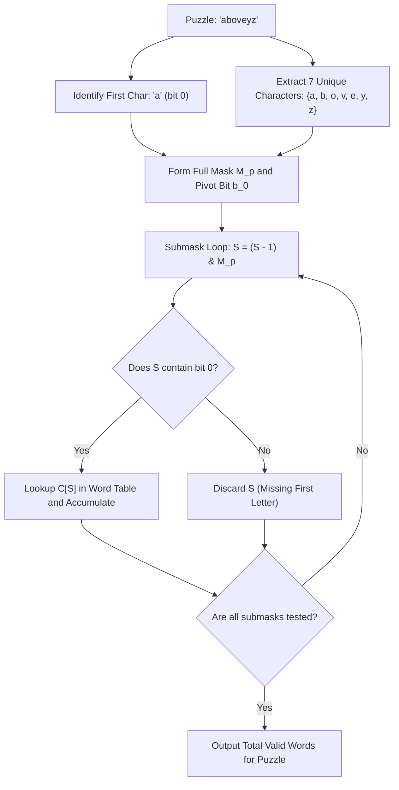

# Guided Example: Number of Valid Words for Each Puzzle

## 1. Problem Essence & Algorithmic Mental Model

Given a collection of strings $\text{words}$ and another collection of 7-letter strings $\text{puzzles}$, we seek to compute, for every individual puzzle, the count of words that are valid for it. A word $w$ is defined to be valid for a puzzle $p$ if and only if two structural criteria are satisfied:
1. $w$ contains the first letter of $p$ at least once.
2. Every character appearing in $w$ is present somewhere within $p$.

A direct comparison checking every word against every puzzle requires $\mathcal{O}(|\text{words}| \cdot |\text{puzzles}|)$ operations. With $|\text{words}| \le 10^5$ and $|\text{puzzles}| \le 10^4$, a brute-force approach requires $10^9$ operations, which substantially exceeds permissible execution time limits.

The crucial architectural insight emerges from three distinct properties of the problem:
- **Set Invariance**: Neither character order nor duplicate frequencies matter. If word $w_1 = \text{"apple"}$ and $w_2 = \text{"pplae"}$, both possess the identical unique character set $\{a, e, l, p\}$.
- **Dimensionality Truncation**: Every puzzle contains exactly $7$ distinct lowercase English letters. Consequently, any word containing more than $7$ distinct letters can never have its character set contained within any puzzle, allowing such words to be safely ignored or pre-filtered.
- **Submask Enumeration**: Because each puzzle has at most 7 unique letters, the universe of valid subsets for a given puzzle is bounded by $2^7 = 128$ combinations (or exactly $2^6 = 64$ combinations when anchoring the mandatory first letter).

Instead of searching from each puzzle across all $10^5$ words, we pre-aggregate words into a frequency table indexed by their 26-bit character bitmask, and then for each puzzle, directly generate and look up its 64 valid submasks.

```
       Word: "apple"                Puzzle: "aelprst" (First char: 'a')
  Distinct: {a, e, l, p}        Distinct: {a, e, l, p, r, s, t}
  Mask: 000...01000100010001    Puzzle Mask: 7 bits active
  
  Condition 1: Does word mask include bit('a')? YES.
  Condition 2: Is word mask a submask of puzzle mask? YES.
  Result: "apple" is VALID for "aelprst".
```

---

## 2. Mathematical Formalism & Invariants

Let $\Sigma = \{a, b, \dots, z\}$ with alphabet size $|\Sigma| = 26$. We define the characteristic bitmask mapping $\mu: \Sigma^* \to \{0, 1\}^{26}$ by:

$$\mu(s) = \sum_{c \in \text{set}(s)} 2^{\text{ord}(c) - \text{ord}('a')}$$

### Validity Conditions
For a puzzle $p$ with first letter $p_0 = p[0]$, a word $w$ is valid for $p$ if and only if:

$$\left(\mu(w) \subseteq \mu(p)\right) \quad \land \quad \left(2^{\text{ord}(p_0) - \text{ord}('a')} \subseteq \mu(w)\right)$$

In terms of bitwise operations, this is equivalent to:

$$(\mu(w) \ \& \ \mu(p) = \mu(w)) \quad \text{and} \quad ((\mu(w) \gg (\text{ord}(p_0) - \text{ord}('a'))) \ \& \ 1 = 1)$$

### Frequency Aggregation
Let $C: [0, 2^{26}-1] \to \mathbb{Z}_{\ge 0}$ denote the multiset frequency distribution of word masks:

$$C[m] = \sum_{w \in \text{words}} [ \mu(w) = m ]$$

For any word $w$ where $|\text{set}(w)| > 7$, $C[\mu(w)]$ can never match any submask of a 7-bit puzzle mask, so such masks never contribute to puzzle sums.

### Fast Submask Summation
For a puzzle $p$, let $M_p = \mu(p)$ be its 7-bit mask, and let $b_0 = 1 \ll (\text{ord}(p_0) - \text{ord}('a'))$ be the mandatory pivot bit.
The number of valid words for puzzle $p$ is:

$$\text{Valid}(p) = \sum_{\substack{S \subseteq M_p \\ b_0 \in S}} C[S]$$

We iterate through all submasks $S$ of $M_p$ using the classic bitwise transition:
$$S_{\text{next}} = (S - 1) \ \& \ M_p$$
filtering for those where $S \ \& \ b_0 \neq 0$, which evaluates exactly $2^7 = 128$ states (or $2^6 = 64$ states if enumerating subsets over $M_p \setminus \{b_0\}$ directly).

---

## 3. Concrete Example Execution & State Evolution

Consider a small vocabulary and single puzzle:
- Words: `["aaaa", "asas", "able", "ability", "actt", "actor", "access"]`
- Puzzle: `"aboveyz"` (First character: `'a'`)

### Word Bitmask Computation Trace

| Word | Unique Characters | Active Bits (alphabet indices) | Bitmask (hexadecimal / decimal) | Popcount $\le 7$? |
|---|---|---|---|---|
| `"aaaa"` | $\{a\}$ | bit 0 | `0x000001` (1) | Yes (1) |
| `"asas"` | $\{a, s\}$ | bit 0, bit 18 | `0x040001` (262145) | Yes (2) |
| `"able"` | $\{a, b, e, l\}$ | bits 0, 1, 4, 11 | `0x000813` (2067) | Yes (4) |
| `"ability"` | $\{a, b, i, l, t, y\}$ | bits 0, 1, 8, 11, 19, 24 | `0x1080903` (17303811) | Yes (6) |
| `"actt"` | $\{a, c, t\}$ | bits 0, 2, 19 | `0x080005` (524293) | Yes (3) |
| `"actor"` | $\{a, c, o, r, t\}$ | bits 0, 2, 14, 17, 19 | `0x0A4005` (671749) | Yes (5) |
| `"access"` | $\{a, c, e, s\}$ | bits 0, 2, 4, 18 | `0x040015` (262165) | Yes (4) |

Each valid mask is inserted into the frequency map $C$.



### Submask Traversal Trace for Puzzle `"aboveyz"`
Let puzzle characters be $\{a, b, o, v, e, y, z\}$.
Mandatory character is `'a'`.
We inspect subset matches present in our dictionary:

| Candidate Submask $S$ Character Set | Contains `'a'`? | Word Match in Dictionary | Count $C[S]$ Added | Cumulative Valid Words |
|---|---|---|---|---|
| $\{a\}$ | Yes | `"aaaa"` | 1 | 1 |
| $\{a, b, e\}$ | Yes | (None) | 0 | 1 |
| $\{a, b, e, l\}$ | Yes | Not a submask ('l' not in puzzle) | - | 1 |
| $\{a, b, o, v, e, y, z\}$ | Yes | (None) | 0 | 1 |
| $\{a, s\}$ | Yes | Not a submask ('s' not in puzzle) | - | 1 |
| Total across all 64 subsets | - | Only mask of $\{a\}$ matches | - | **1** |

---

## 4. Multi-Approach Comparison & Trade-Offs

| Metric / Dimension | Pure Pairwise Nested Loop | Trie with Backtracking | Bitmask Frequency + Submask Iteration (Optimal) |
|---|---|---|---|
| **Preprocessing Cost** | $\mathcal{O}(1)$ | $\mathcal{O}(W \cdot L_W)$ tree insertions | $\mathcal{O}(W \cdot L_W)$ bitmask generation |
| **Per-Puzzle Query Cost** | $\mathcal{O}(W \cdot L_W)$ | $\mathcal{O}(2^7)$ tree node visits | $\mathcal{O}(2^6)$ arithmetic lookups |
| **Total Runtime** | $\mathcal{O}(P \cdot W \cdot L)$ ($\approx 10^9$ ops, TLE) | $\mathcal{O}(W \cdot L + P \cdot 2^7)$ | $\mathcal{O}(W \cdot L + P \cdot 2^6)$ (Fastest) |
| **Auxiliary Memory** | $\mathcal{O}(1)$ | $\mathcal{O}(W \cdot \min(L_W, 26))$ nodes | $\mathcal{O}(W)$ hash table entries |
| **Cache Behavior** | Streaming / High bandwidth | Pointer-chasing / Node misses | Dense hash table / Flat array |

```
Submask Iteration Pattern:
Full Puzzle Mask:   1 0 1 1 0 0 1  (7 bits)
Step 1:             1 0 1 1 0 0 1
Step 2:             1 0 1 1 0 0 0
Step 3:             1 0 1 0 0 0 1
...
Step 64:            0 0 0 0 0 0 1  (only first character active)
```

---

## 5. Algorithmic Edge Cases & Boundary Analysis

| Edge Case Scenario | Input State | Algorithmic Consequence & Handling |
|---|---|---|
| **Word with $>7$ Distinct Letters** | e.g. `"abcdefgh"` | Mask contains 8 set bits. Ignored during submask lookup because no 7-bit puzzle submask can equal an 8-bit mask. |
| **Duplicate Words in Vocabulary** | e.g. `["apple", "apple"]` | Frequency counter $C[\mu(\text{"apple"})] = 2$. Handled correctly by adding full count. |
| **Multiple Words Sharing Mask** | e.g. `"eat"`, `"tea"`, `"ate"` | All map to identical mask $\{a, e, t\}$; counter aggregates to 3, checked in a single $\mathcal{O}(1)$ lookup. |
| **Missing First Character** | Word subset matches $\{b, o, v\}$ | Filter condition $S \ \& \ b_0 \neq 0$ eliminates this submask; words missing $p[0]$ are never counted. |
| **Zero Matches** | No words formed from puzzle letters | Returns 0 for this puzzle naturally as all hash table lookups yield 0. |

---

## 6. Mathematical Verification & Complexity Derivation

Let $N_W = |\text{words}|$, $N_P = |\text{puzzles}|$, $L_W$ be the maximum word length ($\le 50$), and $L_P = 7$ be the puzzle length.

### Step 1: Preprocessing Words into Frequency Hash Map
1. For each word $w \in \text{words}$, computing its mask requires iterating over its characters: $\mathcal{O}(L_W)$.
2. We filter or keep words with $\le 7$ unique characters and increment the frequency map: $\mathcal{O}(1)$ on average.
3. Total preprocessing time: $\mathcal{O}(N_W \cdot L_W)$.

### Step 2: Processing Puzzles via Submask Enumeration
1. For each puzzle $p$, computing its 7-bit mask $M_p$ and pivot bit takes $\mathcal{O}(L_P) = \mathcal{O}(7) = \mathcal{O}(1)$.
2. Generating all submasks of a 7-bit integer takes:
   $$\sum_{k=0}^{6} \binom{6}{k} = 2^6 = 64 \text{ iterations}$$
3. In each iteration, a hash map lookup in $C$ takes $\mathcal{O}(1)$ average time.
4. Total puzzle processing time: $\mathcal{O}(N_P \cdot 2^{L_P - 1}) = \mathcal{O}(64 \cdot N_P)$.

### Aggregate Complexity:
- **Total Time Complexity:** $\mathcal{O}(N_W \cdot L_W + 64 \cdot N_P)$. For $N_W = 10^5, L_W = 50, N_P = 10^4$, total operations $\approx 5 \times 10^6 + 6.4 \times 10^5 \approx 5.6 \times 10^6$, comfortably executing well within standard runtime thresholds.
- **Total Space Complexity:** $\mathcal{O}(N_W)$ to store unique word masks in the frequency table.

---

## 7. Synthesis & Strategic Takeaways

1. **Query-Space Inversion**: When querying many patterns against a large database, evaluate which side has smaller combinatorial degrees of freedom. Here, each puzzle generates only $2^6 = 64$ candidate queries, whereas scanning words per puzzle generates $10^5$ checks. Translating the search into puzzle-driven submask lookup turns a bottleneck into an instant calculation.
2. **Lossless Equivalence Class Compression**: Strings with identical unique character multisets form an equivalence class under this problem's contract. Grouping words by their 26-bit bitmask compresses millions of character comparisons into single integer counter lookups.
3. **The `(S - 1) & M` Submask Idiom**: The bitwise formula $S_{\text{next}} = (S - 1) \ \& \ M$ enumerates all submasks of $M$ in strictly descending order with zero redundant states, forming an essential tool in bitmask dynamic programming and subset query problems.
