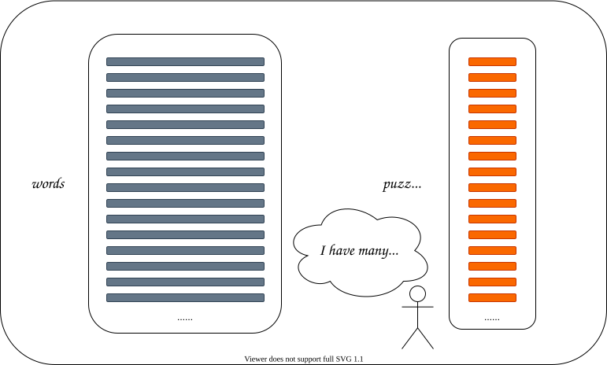
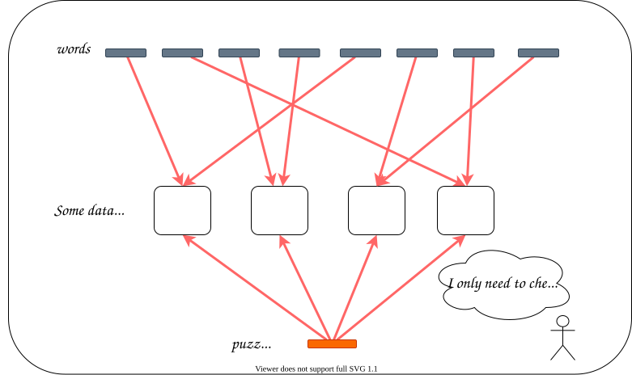
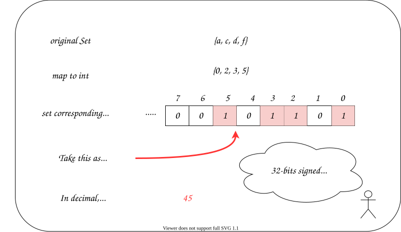
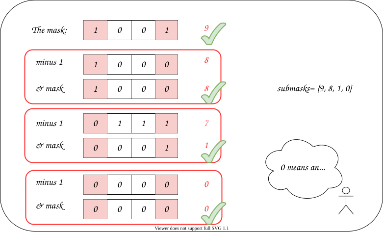
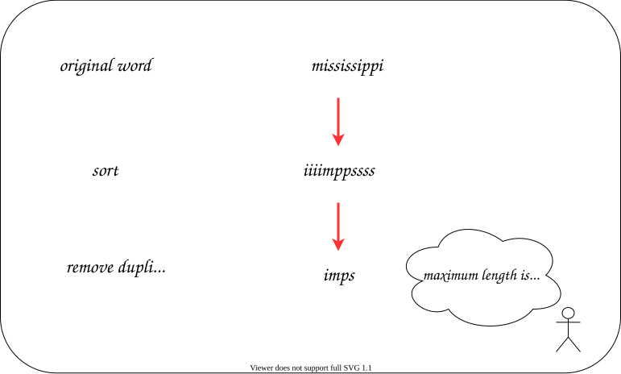
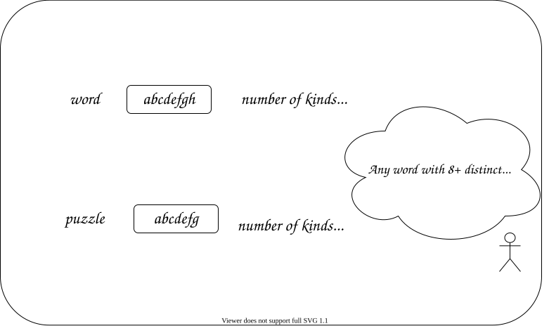

[TOC]

## Solution

---

### Overview

At first glance, this problem may appear to be quite challenging. The primary challenge is determining an efficient way to find the number of valid words for each puzzle. To achieve this, we need to somehow put the words into a data structure that allows us to perform a quick search. The problem will become a bit easier once we find an efficient data structure to use.

In the following approaches, we will discuss what clues can be extracted from the problem description and constraints and how we can use those clues to select a suitable data structure.

Below, two approaches are given. The first is a hashing approach based on the map, and the second one is a trie approach.

</br>

---

### Approach 1: Hashing (Bitmask)

**Intuition**

We have lots of puzzles to answer.
To handle a multi-query problem, such as this one, it is beneficial to select a data structure that allows us to efficiently address each query.

For example, to handle range sum queries, we would use a prefix-sum or a segment tree.

But here we have a problem that requires us to find out some valid words, or to "filter" words.

If a specific data structure does not immediately come to mind, do not panic! It's perfectly normal not to have an idea of how to approach the problem at this point.

> **Interview Tip**: In a real interview, if you are unsure how to solve the problem, a good first step is to remain calm and reread the problem description looking for hidden clues.
>
> Also, remember to ask the interviewer about the problem constraints. The constraints are very important for solving problems as they can help us determine which data structures and algorithms can feasibly be used to solve the problem.
>
> However, if the interviewer chooses to deliberately hide the constraints, then they likely want you to find different methods under different assumed constraints. Although, on rare occasions, a problem may be too simple to provide constraints.

There are some critical constraints in the problem description:

> - $1 \le \text{words.length} \le 10^{5}$
> - $4 \le \text{words}[i].length \le 50$
> - $1 \le \text{puzzles.length} \le 10^{4}$
> - $\text{puzzles}[i].length = 7$

Notice that we have many words and puzzles, but the length of each word and each puzzle is short.



A notable constraint here is $\text{puzzles}[i].length = 7$.

> **Interview Tip**: A constraint under $10$ usually accepts a method with $N!$ time complexity with respect to this constraint. Factorial time complexities can occur for operations like finding all permutations from a set or using brute-force to solve the traveling salesman problem.
>
> A constraint under $30$ usually accepts a method with $2^N$ time complexity at worst with respect to this constraint.  Some examples include iterating over all combinations or subsets from a set or some brute-force solutions that use DFS.
>
> However, a solution with better time complexity can still exist even when the constraints are small. One should use the constraints to estimate the complexity of the worst acceptable solution, not the best solution.

By now, you may already have an idea of how to solve this problem, and if not, it is still okay. No matter what, we can always start with a brute-force solution.

> **Interview Tip**: When you still do not have any idea after rereading the problem, you can try a brute-force method that works but may have an unacceptable time complexity. Then you can either try to improve on the brute-force method or gain some insight from the brute-force method.

In the brute-force approach, for each `puzzle`, we iterate over each `word` and check whether this word is valid.

For a word to be "valid", it must meet two criteria:

1. `word` contains the first letter in `puzzle`.
2. `puzzle` contains every letter in `word`.

Since we need to iterate over every `word` for every `puzzle`, the time complexity is **at least** $O(words.length \cdot puzzles.length)$. Given that there could be as many as $10^5$ words and $10^4$ puzzles, there could be as many as $10^9$ word-puzzle pairs.

Therefore, checking each `word` one by one will be too slow. Could we perhaps check multiple words **at the same time**?

What if we group similar words and place them in the same bin and check the bins one by one...?



If the bins are implemented by a hash map, we do not have to iterate all the bins, instead, for each puzzle, we can look at only the bins that contain words that we need.

There are two common ways to group strings into "bins":

1. Trie
2. Set (hashing)

Which one is better? The lines of codes for trie may be significantly larger than those for hashing. For an interview, a set may be a better choice.

> **Interview Tip**: In an interview, if the first solution that comes to mind involves a complex data structure, you can wait a minute and try thinking of other similar methods. In a real-world setting, we typically prioritize efficiency and readability. We prioritize these characteristics in an interview setting as well, however, we also value solutions that we are less likely to make a mistake while coding and solutions that do not require a long time to code.
>
> In this problem, you should consider your level of familiarity with the trie data structure before choosing between implementing a solution using a trie or a set. If the more comfortable approach is not the most efficient, then you should also weigh the increased chance of making a mistake versus the gain of having a more efficient solution.
>
> Worry not, as we will cover both methods in this article.

Now, let's try to hash each `word` and put some of them into the same bin.

Since we need to count the number of valid words, a map may be what we want, where the value stores the number of strings in the bin, and we haven't decided what the key is yet.

##### Deciding the Details of Our Map

The next problem is what kinds of words we want to put together?

Notice the two conditions for a word to be valid only depend on the letters in the word. So let's start by putting words that contain the **same letters** into the same bin.

So, our key can be a set containing what letters are in a word. Wait a minute, can we use a set as a key in a map?

It depends. Some languages allow us to create an immutable copy of a set, which can be used as a key. For instance, Python offers `frozenset`. However, most languages do not.

In most languages, we need to write a custom hashing function to map a set into a **string or number** to use a set as a key.

When the number of distinct values that could be in a set is small (like 26 lowercase English letters), then we can transform each set into a number, using a very nice data structure called a bitmask (or bitset).

##### Bitmask and Subset Iterating

Let's quickly review how bitmasking works. Generally, we treat an integer as a binary number, and each digit in the binary number represents an item. The value of the digit acts like a flag indicating whether the set contains the item or not.



Good! We can also use this method to get the letters contained in a word and a puzzle. Wait, how do we get the answer to a puzzle?

The target word should contain the first letter of the puzzle and cannot contain any letters that are not in the puzzle.

Therefore, any word that does not contain the first letter in a puzzle cannot be valid for that puzzle. Thus, we only need to iterate over the **subsets** of letters contained in `puzzle` that also contain the first letter of `puzzle`.

Here we find another challenge: How to iterate over all the subsets of a set? This is a classic [problem](https://leetcode.com/problems/subsets/) that can be solved using a depth-first search.

However, when working with a bitmask that represents a set of all possible items, we can use a simple trick to find all possible subsets of those items using only a for loop.

Let's have a quick look at how this works. The pseudo-code is as follows:

```javascript
for (subset = bitmask; subsets >= 0; subset = (subset - 1) & bitmask) {
  // do what you want with the current subset...
}
```

Or with a while loop:

```javascript
let subset = bitmask;
while (subsets >= 0) {
  // do what you want with the current subset...
  subset = (subset - 1) & bitmask;
}
```

Why does this work? The subsets must be included in range `[0, bitmask]`, and if we iterate from `bitmask` to `0` one by one, we are guaranteed to visit the bitmask of every subset along the way.

But we can also meet those that are not a subset of `bitmask`. Fortunately, instead of decrementing `subset` by one at each iteration, we can use $subset = (subset - 1) \& bitmask$ to ensure that each `subset` only contains characters that exist in `bitmask`.

Also, we will not miss any subset because $subset - 1$ turns at most one `1` into `0`.



Adding all of the steps together, for each `puzzle`, we just need to iterate over all the subsets of letters contained in `puzzle` that also contain the first letter of `puzzle`. For each subset, we add the number of words that match the subset to the count of valid words for the current puzzle. Thus, for one `puzzle`, the complexity is $O(2^{puzzle.length})$, which is much less than the total number of words in `words`.

**Algorithm**

Step 1: Build the map.

- For each word in `words`:
  - Transform it into a bitmask of its characters.
  - If the bitmask has not been seen before, store it as a key in the map with a value of one.
    If it has been seen before, then increment the map's count for this bitmask by one.

Step 2: Count the number of valid words for each puzzle.

- For each puzzle in `puzzles`:
  - Transform it into a bitmask of its characters.
  - Iterate over every possible `submask` containing the first letter in `puzzle` ($\text{puzzle}[i][0]$).
    A word is valid for a puzzle if its bitmask matches one of the puzzle's submasks.
    For each `submask`, increase the `count` by the number of words that match the `submask`.
    We can find the number of words that match the `submask` using the map built in the previous step.

**Implementation**

```python
class Solution:
    def findNumOfValidWords(self, words: List[str], puzzles: List[str]) -> List[int]:

        def bitmask(word: str) -> int:
            mask = 0
            for letter in word:
                mask |= 1 << (ord(letter) - ord('a'))
            return mask

        # Create a bitmask for each word.
        word_count = Counter(bitmask(word) for word in words)

        result = []
        for puzzle in puzzles:
            first = 1 << (ord(puzzle[0]) - ord('a'))
            count = word_count[first]

            # Make bitmask but ignore the first character since it must always
            # be there.
            mask = bitmask(puzzle[1:])

            # Iterate over every possible subset of characters.
            submask = mask
            while submask:
                # Increment the count by the number of words that match the
                # current submask.
                count += word_count[submask | first]  # add first character
                submask = (submask - 1) & mask
            result.append(count)
        return result
```

**Complexity Analysis**

Let $N$ and $M$ be the length of `words` and `puzzles` respectively. Let $\bar N, \bar M$ be the average length of $\text{words}[i]$ and $\text{puzzles}[i]$ respectively. Let $k$ be the size of the character set.

Note that in this problem, the value of $\bar M$ is fixed at $7$, and the value of $k$ is fixed at $26$.

- Time Complexity: $O(N\cdot \bar N + M\cdot 2^{\bar M})$.

  For each $\text{words}[i]$ in `words`, we spend $O(\bar N)$ time to calculate its mask. For each $\text{puzzles}[i]$ in `puzzles`, we spend $O(\bar M)$ to transform its characters into a bitmask, and $O(2^{\bar M})$ to iterate over all of its subsets.

  In total, we have $O(N \cdot \bar N + M \cdot (2^{\bar M} + \bar M)) = O(N \cdot \bar N + M \cdot 2^{\bar M})$.

- Space Complexity: $O(N)$.

  We use a map to store the mask of each $\text{word}[i]$, and each entry uses an integer for the key and the value.

  Alternatively, if you use a list with $length = (1<<k)$, then the space complexity is $O(2^k)$. Note that, in practice, $2^{26}=67108864$, which is much larger than the maximum of the given $N$, $10^5$.

</br>

---

### Approach 2: Trie

**Intuition**

> The intuition of this approach is a continuation of the previous approach. It is recommended to read the previous approach first.

> If you are unfamiliar with the trie data structure, we encourage you to check out the [Trie Explore Card](https://leetcode.com/explore/learn/card/trie/).

A trie can help us to quickly determine whether a word exists among all the words. Thus, it is similar to a dictionary.

However, if we want to put all the words into a trie, then in the worst case, none of the words start with the same letter, and thus every character of every word has its own node in the trie. Thus, the number of nodes in the trie would be $O(\sum N_i)$, where $N_i$ is the length of $\text{word}[i]$.

Wait, can we reduce the number of nodes in the trie?

As determined in Approach 1, the validity of a word only depends on the letters in the word. So first, we can remove the duplicate letters from each word.
In this way, the maximum length of a word becomes $26$ instead of $N_i$. Moreover, we can sort the letters in `word` in ascending order to further aggregate the same letters together, because sorted words are more likely to share a common prefix than unsorted words.



Also, we know that the length of `puzzle` is $7$, and a valid word must consist entirely of letters in `puzzle`.
Therefore, any words containing more than **$7$ distinct letters** are always invalid. That is to say, our trie is at most $7$ levels deep. Also, since we sort the letters and remove duplicates in each word, we cannot have duplicate letters in any path from the root to a leaf in the trie.



In conclusion, the maximum number of nodes in the trie is $7! = 5040$, which is small enough to iterate over for each `puzzle`.

As before, we must search for all valid words for each puzzle. However, instead of checking every subset of the puzzle, we can now perform a simple tree iteration using DFS. We can traverse the tree following the nodes inside the sorted set of `puzzle`, and when we meet a word and have already seen the first letter in `puzzle`, then the word must be valid.

**Algorithm**

Step 1: Build the trie.

- For each word in `words`:
  - Sort the word and remove duplicate letters.
  - Store the word, which is now a sorted list of distinct characters, in the trie.

Step 2: Count the number of valid words for each puzzle.

- For each puzzle in `puzzles`:
  - Iterate over the trie to find all valid words for the current puzzle.

**Implementation**

```python
class Solution:
    def findNumOfValidWords(self, words: List[str], puzzles: List[str]) -> List[int]:
        SIZE = 26  # 26 letters in the alphabet
        trie = [[0] * SIZE]  # we use list to mimic the trie tree
        count = [0]  # the number of words ending at node i
        for word in words:
            word = sorted(set(word))
            if len(word) <= 7:  # longer words are never valid
                # insert into trie
                node = 0
                for letter in word:
                    i = ord(letter) - ord('a')
                    if trie[node][i] == 0:  # push empty node
                        trie.append([0] * SIZE)
                        count.append(0)
                        trie[node][i] = len(trie) - 1
                    node = trie[node][i]
                count[node] += 1

        # search for valid words
        def dfs(node, has_first):
            total = count[node] if has_first else 0
            for letter in puzzle:  # catch puzzle from outside environment
                i = ord(letter) - ord('a')
                if trie[node][i]:
                    total += dfs(trie[node][i], has_first or letter == puzzle[0])
            return total

        result = []
        for puzzle in puzzles:
            result.append(dfs(0, False))
        return result
```

Note: There are multiple ways to implement trie. We here chose to use a list to mimic the trie tree. If you are using a language with pointers and use pointers to implement the trie, remember to free the memory as needed.

**Complexity Analysis**

Let $N$ and $M$ be the length of `words` and `puzzles` respectively. Let $\bar N, \bar M$ be the average length of $\text{words}[i]$ and $\text{puzzles}[i]$ respectively. Let $k$ be the size of the character set.

Note that in this problem, the value of $\bar M$ is fixed at $7$, and the value of $k$ is fixed at $26$.

- Time Complexity: $O(N\cdot (\bar N \log \bar N + \bar M) + M\cdot \bar M!)$.

  - To build the trie, for each $\text{word}[i]$ in `words`, we spend $O(\bar N\log \bar N)$ to sort it and remove the duplicates, and, we spend $O(\bar M)$ to insert into the trie.
  - To search for the answer for each $\text{puzzles}[i]$ in `puzzles`, we spend $O(\bar M!)$ to iterate the whole trie.
  - Totally, we have $O(N\cdot (\bar N \log \bar N + \bar M) + M\cdot \bar M!)$.
  - Alternatively, one can use bucket sort to reduce the time complexity to $O(N\cdot (\bar N + k +\bar M)+ M\cdot \bar M!)$.

- Space Complexity: $O(k\cdot\bar M!)$.

  Our trie has at most $O(\bar M!)$ nodes, and each node is an array of size $k$.