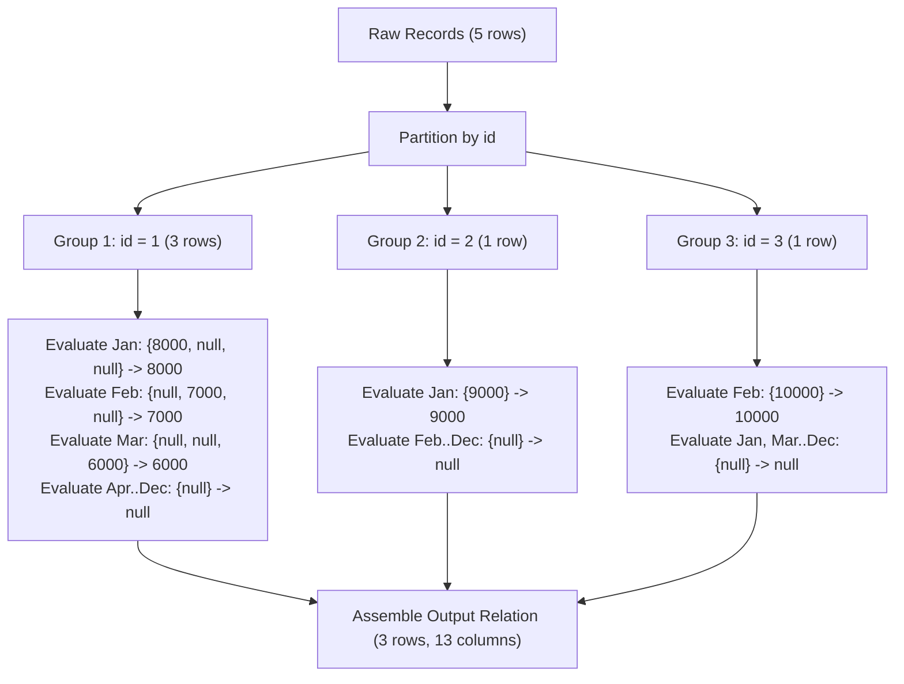

# Guided Example: Reformat Department Table

## 1. Problem Essence & Algorithmic Mental Model

In relational database systems and data warehousing, records are frequently stored in a normalized "tall" or "narrow" format where attributes vary along a categorical dimension (such as `month`), producing multiple rows per entity. For executive reporting and cross-sectional analytics, however, analysts often require a "wide" or pivoted layout where categorical values become dedicated columns and each primary entity occupies a single consolidated row.

Given a table containing tuples of $(id, \text{revenue}, \text{month})$, where $(id, \text{month})$ forms the composite primary key, our task is to reshape this dataset so that:
1. Every unique department $id$ appears exactly once as a distinct row.
2. Twelve distinct monthly revenue columns ($\text{Jan\_Revenue}$ through $\text{Dec\_Revenue}$) represent the earnings for each corresponding calendar month.
3. If an entity recorded no entry for a given month, the resulting cell must evaluate to $\text{null}$ rather than zero.

A naive conceptual model might attempt twelve separate full-table scans or a cascade of twelve outer self-joins linked on department identifier. However, relational algebra provides a much more direct paradigm: **Conditional Aggregation** (often called the Pivot idiom). By grouping records by the entity identifier ($id$) and applying an aggregate function over a conditional projection (which isolates values matching the target month while discarding all others), the relational engine collapses all constituent rows for an entity into a single unified record in one linear scan.

```
Tall / Narrow Input:                Wide / Pivoted Output:
+----+---------+-------+            +----+-------------+-------------+
| id | revenue | month |  Pivot     | id | Jan_Revenue | Feb_Revenue | ...
+----+---------+-------+  ------>   +----+-------------+-------------+
| 1  | 8000    | Jan   |            | 1  | 8000        | 7000        | ...
| 2  | 9000    | Jan   |            | 2  | 9000        | null        | ...
| 1  | 7000    | Feb   |            +----+-------------+-------------+
+----+---------+-------+
```

---

## 2. Mathematical Formalism & Invariants

Let the input relation be denoted as $\mathcal{R} \subseteq \mathcal{D} \times \mathbb{R} \times \mathcal{M}$, where $\mathcal{D}$ is the domain of department identifiers, and $\mathcal{M} = \{\text{'Jan'}, \text{'Feb'}, \dots, \text{'Dec'}\}$ represents the twelve calendar months. The schema guarantee states that $(id, \text{month})$ is a functional dependency determining at most one record:

$$\forall (d, m) \in \mathcal{D} \times \mathcal{M}, \quad |\{\rho \in \mathcal{R} \mid \rho.id = d \land \rho.\text{month} = m\}| \le 1$$

### Conditional Projection Mapping
For each month $\mu \in \mathcal{M}$, define a projection operator $\pi_\mu: \mathcal{R} \to \mathbb{R} \cup \{\text{null}\}$:

$$\pi_\mu(\rho) = \begin{cases} \rho.\text{revenue} & \text{if } \rho.\text{month} = \mu \\ \text{null} & \text{if } \rho.\text{month} \neq \mu \end{cases}$$

### Grouping and Invariant Preservation
Let $\mathcal{R}_d = \{\rho \in \mathcal{R} \mid \rho.id = d\}$ represent the partition of records associated with entity $d \in \mathcal{D}$.
For each month $\mu \in \mathcal{M}$, the aggregate function $\text{AGG} \in \{\text{SUM}, \text{MAX}\}$ maps the multiset of projected values into a scalar:

$$\text{Revenue}(d, \mu) = \text{AGG}\left( \{\pi_\mu(\rho) \mid \rho \in \mathcal{R}_d\} \right)$$

Under relational database standards (ANSI SQL):
1. **Null-Ignorance Invariant**: The aggregate function $\text{SUM}$ or $\text{MAX}$ completely ignores $\text{null}$ tokens.
2. If $\mathcal{R}_d$ contains an entry for month $\mu$, exactly one record evaluates to non-null revenue $r$, and all other $|\mathcal{R}_d| - 1$ records evaluate to $\text{null}$. The aggregate returns $r$.
3. If $\mathcal{R}_d$ contains no entry for month $\mu$, every element in the multiset evaluates to $\text{null}$. The aggregate over an all-null set evaluates strictly to $\text{null}$ (not 0), fulfilling the exact contract specification.

---

## 3. Concrete Example Execution & State Evolution

Consider an input instance containing five raw records across two department identifiers:

### Input Dataset
| $id$ | $\text{revenue}$ | $\text{month}$ |
|---|---|---|
| 1 | 8000 | 'Jan' |
| 2 | 9000 | 'Jan' |
| 3 | 10000 | 'Feb' |
| 1 | 7000 | 'Feb' |
| 1 | 6000 | 'Mar' |



### Transformation & Reduction Trace

We trace the step-by-step reduction for entity group $id = 1$:

| Processing Step | Row Processed | Jan Column Evaluation | Feb Column Evaluation | Mar Column Evaluation | Apr..Dec Evaluation |
|---|---|---|---|---|---|
| Initial | - | $\text{null}$ | $\text{null}$ | $\text{null}$ | $\text{null}$ |
| Row 1 | $(1, 8000, \text{'Jan'})$ | 8000 | $\text{null}$ | $\text{null}$ | $\text{null}$ |
| Row 2 | $(1, 7000, \text{'Feb'})$ | 8000 (unchanged) | 7000 | $\text{null}$ | $\text{null}$ |
| Row 3 | $(1, 6000, \text{'Mar'})$ | 8000 (unchanged) | 7000 (unchanged) | 6000 | $\text{null}$ |
| Final Aggregate | Group $id = 1$ | **8000** | **7000** | **6000** | **null** |

Similarly, for group $id = 2$, only the `'Jan'` row exists, yielding `Jan_Revenue = 9000` and `null` for all remaining eleven months. For group $id = 3$, only `'Feb'` exists, yielding `Feb_Revenue = 10000` and `null` for all other months.

---

## 4. Multi-Approach Comparison & Trade-Offs

| Metric / Dimension | Cascade of 12 Outer Self-Joins | Relational Vendor PIVOT Clause | Conditional Aggregation (Optimal) |
|---|---|---|---|
| **Query Plan Complexity** | 12 Join operations, high tree depth | Engine-dependent rewrite | Single Hash/Sort Group-By node |
| **I/O Table Scans** | Up to 12 separate scans or index probes | Single scan | Single scan ($\mathcal{O}(N)$) |
| **Portability** | Universal ANSI SQL | Limited (vendor-specific dialect) | Universal across PostgreSQL, MySQL, SQLite, Oracle |
| **Memory Footprint** | Large intermediate hash join tables | Compact accumulator | Minimal ($\mathcal{O}(\lvert \mathcal{D} \rvert)$ aggregate states) |
| **Execution Cost** | $\mathcal{O}(12 \cdot N \log N)$ | $\mathcal{O}(N)$ | $\mathcal{O}(N)$ |

```
Query Execution Plan Comparison:

12-Way Outer Join:
[Scan] -> [Join 1] -> [Join 2] -> ... -> [Join 11] -> [Result] (Massive Join Overhead)

Conditional Aggregation:
[Single Table Scan] -> [Hash/Sort by ID] -> [12 Evaluators] -> [Output] (Streamlined)
```

---

## 5. Algorithmic Edge Cases & Boundary Analysis

| Boundary Scenario | Structural Condition | Output Behavior & Verification |
|---|---|---|
| **Zero Revenue Month** | Tuple has revenue = 0 | Correctly outputs `0`, not `null`. A non-null zero is preserved by conditional aggregation. |
| **Missing Month** | No record exists for a department in month $M$ | Evaluates conditionally to `null` across all candidate rows; aggregate over all-null evaluates strictly to `null`. |
| **Department with All 12 Months** | Full calendar coverage | All 12 columns populated with their respective revenue values; no nulls present. |
| **Single-Row Input Table** | Exactly one department, one month | Outputs 1 row with that department's single value in the target column and 11 nulls. |
| **Negative Revenue** | Financial loss recorded (e.g., -500) | Handled accurately without magnitude truncation; preserved as a negative integer. |

---

## 6. Mathematical Verification & Complexity Derivation

Let $N$ be the total number of rows in the `Department` table, and let $K = |\mathcal{D}|$ be the number of distinct department identifiers ($K \le N$).

### Execution Steps in Database Query Planner:
1. **Table Scan / Ingestion**: The database reads the $N$ records from disk or buffer pool in $\mathcal{O}(N)$ sequential time.
2. **Partitioning / Grouping**:
   - In a hash-based aggregation engine, records are dispatched into a hash table keyed on $id$. Each insertion or lookup costs $\mathcal{O}(1)$ average time.
   - For each incoming row, exactly 12 branch evaluations are performed to check the `month` attribute against the 12 constants. Since 12 is a fixed constant, each record requires $\mathcal{O}(1)$ CPU operations.
3. **Aggregate Reduction**: As each record is processed, its non-null contribution updates the accumulator for the matching month in the entity's hash entry. Total aggregation time across all records is $\mathcal{O}(12 \cdot N) = \mathcal{O}(N)$.
4. **Result Projection**: The hash table emits $K$ consolidated tuples, each containing the department $id$ and 12 aggregated values. Emitting output requires $\mathcal{O}(K)$ time.

### Asymptotic Summary:
- **Total Time Complexity:** $\mathcal{O}(N)$ linear time with respect to the input table size.
- **Total Space Complexity:** $\mathcal{O}(K)$ auxiliary memory to maintain grouping buckets and 12-column state accumulators for each distinct department.

---

## 7. Synthesis & Strategic Takeaways

1. **The Conditional Aggregation Design Pattern**: Transforming row-level categorical labels into column-level headers is the canonical pivot pattern across all SQL dialects. Pairing `CASE` projections with distributive aggregate operators (`SUM`, `MAX`, `MIN`) provides complete dialect portability without relying on vendor-proprietary keywords.
2. **Strict Semantic Distinction Between 0 and Null**: In relational schemas, a missing data point (`null`) fundamentally differs from a numeric quantity of zero (`0`). Using conditional expressions without an `ELSE 0` clause ensures that non-existent months remain `null`, maintaining strict informational fidelity.
3. **Linear Single-Pass Efficiency**: While joining an entity table twelve times creates quadratic join state and explosive query planning complexity, conditional aggregation scans the raw relation exactly once, maximizing cache locality and streaming throughput.
