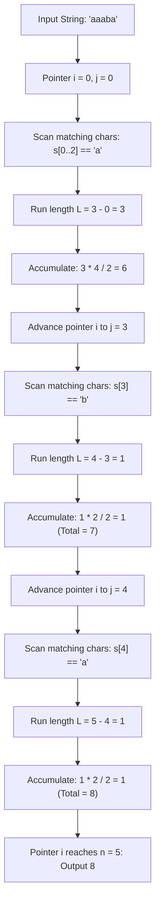

# Guided Example: Count Substrings with Only One Distinct Letter

## 1. Problem Essence & Algorithmic Mental Model

We are given a string $s$ consisting of lowercase English letters. A substring of $s$ is defined as a contiguous non-empty sequence of characters. Our objective is to count the total number of substrings that contain exactly one distinct character (i.e., all characters within the substring are identical).

A naive brute-force method would examine all $\frac{N(N+1)}{2}$ possible substrings, verify character homogeneity for each in $\mathcal{O}(N)$ time, resulting in an $\mathcal{O}(N^3)$ (or $\mathcal{O}(N^2)$ with rolling validation) runtime.

However, the problem exhibits a clean decomposition property:
1. **Boundary Independence**: A substring of identical characters cannot cross a boundary between two distinct characters. For instance, in the string `"aaabb"`, no valid substring can contain both an `'a'` and a `'b'`.
2. **Maximal Run Partition**: The entire string can be uniquely partitioned into maximal contiguous runs of identical characters:
   $$s = \sigma_1^{L_1} \sigma_2^{L_2} \dots \sigma_k^{L_k} \quad \text{where } \sigma_i \neq \sigma_{i+1}$$
3. **Triangular Number Summation**: Within a single homogeneous block of length $L$, any contiguous subsegment is guaranteed to consist of the same character. The number of such subsegments of length 1 is $L$, of length 2 is $L-1$, down to length $L$ which is 1. The total number of valid substrings formed entirely within this block is precisely the $L$-th triangular number:
   $$\text{Count}(L) = \sum_{i=1}^L i = \frac{L(L+1)}{2}$$

Because these blocks are disjoint and non-overlapping, the global answer is simply the sum of the triangular numbers of all maximal run lengths.

```
String: "a a a b b a"
Runs:   [a: len 3]   [b: len 2]   [a: len 1]
Counts:  3*4/2 = 6    2*3/2 = 3    1*2/2 = 1

Total = 6 + 3 + 1 = 10 valid substrings
```

---

## 2. Mathematical Formalism & Invariants

Let $s$ be a string of length $n$ indexed from $0$ to $n-1$.
Define a substring $s[i \dots j]$ ($0 \le i \le j < n$) to be homogeneous if:
$$\forall k \in [i, j], \quad s[k] = s[i]$$

### Partitioning Theorem
The index set $\{0, 1, \dots, n-1\}$ can be partitioned into $m$ contiguous intervals $[l_r, r_r]$ ($1 \le r \le m$) such that:
1. $l_1 = 0$, $r_m = n-1$.
2. For all $r \in [1, m-1]$, $l_{r+1} = r_r + 1$.
3. For each interval $r$, $\forall k \in [l_r, r_r], \ s[k] = s[l_r]$.
4. For adjacent intervals, $s[r_r] \neq s[l_{r+1}]$.

### Count Invariant
Any valid homogeneous substring $s[i \dots j]$ must satisfy:
$$\exists ! r \in [1, m] \quad \text{such that } l_r \le i \le j \le r_r$$

Proof: If $s[i \dots j]$ crossed a partition boundary, say $j \ge l_{r+1}$ with $i \le r_r$, then $s[r_r] = s[i] = s[j] = s[l_{r+1}]$, contradicting the maximal boundary condition $s[r_r] \neq s[l_{r+1}]$.

Therefore, the set of all homogeneous substrings is the disjoint union of homogeneous substrings within each maximal run:

$$\text{Total Substrings} = \sum_{r=1}^m \frac{(r_r - l_r + 1)(r_r - l_r + 2)}{2} = \sum_{r=1}^m \frac{L_r(L_r + 1)}{2}$$

---

## 3. Concrete Example Execution & State Evolution

Consider the input string $s = \text{"aaaba"}$ of length $n = 5$.

### Run-Length Partitioning Trace

| Run Index $r$ | Character $\sigma_r$ | Start Index $l_r$ | End Index $r_r$ | Run Length $L_r$ | Formula $\frac{L_r(L_r+1)}{2}$ | Substrings Generated | Running Total |
|---|---|---|---|---|---|---|---|
| 1 | `'a'` | 0 | 2 | 3 | $\frac{3 \times 4}{2} = 6$ | `"a" (x3)`, `"aa" (x2)`, `"aaa"` | 6 |
| 2 | `'b'` | 3 | 3 | 1 | $\frac{1 \times 2}{2} = 1$ | `"b"` | 7 |
| 3 | `'a'` | 4 | 4 | 1 | $\frac{1 \times 2}{2} = 1$ | `"a"` | **8** |



### Dynamic Rolling Window Alternative View
Alternatively, maintaining a single integer for the current consecutive streak:
At each character index $k$:
- If $s[k] == s[k-1]$, $\text{streak} = \text{streak} + 1$.
- Else, $\text{streak} = 1$.
- $\text{Total} = \text{Total} + \text{streak}$.

| Index $k$ | Character $s[k]$ | Previous Character | Streak Length | Substrings Ending at $k$ | Cumulative Total |
|---|---|---|---|---|---|
| 0 | `'a'` | (None) | 1 | $s[0 \dots 0]$ (`"a"`) | 1 |
| 1 | `'a'` | `'a'` | 2 | $s[1 \dots 1]$ (`"a"`), $s[0 \dots 1]$ (`"aa"`) | 3 |
| 2 | `'a'` | `'a'` | 3 | $s[2 \dots 2]$, $s[1 \dots 2]$, $s[0 \dots 2]$ | 6 |
| 3 | `'b'` | `'a'` | 1 | $s[3 \dots 3]$ (`"b"`) | 7 |
| 4 | `'a'` | `'b'` | 1 | $s[4 \dots 4]$ (`"a"`) | 8 |

Both formulations are mathematically isomorphic.

---

## 4. Multi-Approach Comparison & Trade-Offs

| Metric / Dimension | All Substrings Naive Validation | Dynamic Window Expansion | Run-Length Triangular Aggregation (Optimal) |
|---|---|---|---|
| **Time Complexity** | $\mathcal{O}(N^3)$ | $\mathcal{O}(N)$ | $\mathcal{O}(N)$ |
| **Space Complexity** | $\mathcal{O}(1)$ | $\mathcal{O}(1)$ | $\mathcal{O}(1)$ |
| **Loop Operations** | Triple nested loops | Single forward loop | Two-pointer block skips |
| **Arithmetic Cost** | $\approx N^3$ equality checks | $N$ additions | $M$ multiplications/divisions ($M \le N$) |
| **Code Simplicity** | Low efficiency | Single accumulator variable | Clean two-pointer / run-length structure |

```
Execution Comparison on Run of Length 1000:
- Naive: Checks 500,500 substrings individually
- Rolling: Adds 1 + 2 + ... + 1000 across 1000 loop cycles
- Triangular: Directly computes (1000 * 1001) / 2 = 500,500 in one arithmetic operation
```

---

## 5. Algorithmic Edge Cases & Boundary Analysis

| Scenario | Input Example | Expected Output | Behavioral Verification |
|---|---|---|---|
| **Single Character String** | `"z"` | 1 | Single run of length 1: $\frac{1 \times 2}{2} = 1$. |
| **All Identical Characters** | `"aaaaa"` ($n = 5$) | 15 | Single run of length 5: $\frac{5 \times 6}{2} = 15$. |
| **All Distinct Characters** | `"abcdef"` ($n = 6$) | 6 | 6 runs of length 1 each: $6 \times \frac{1 \times 2}{2} = 6$. |
| **Alternating Characters** | `"ababab"` ($n = 6$) | 6 | Each character is an isolated run of length 1. |
| **Large Homogeneous Run** | String with $n = 1000$ identical characters | 500500 | Evaluates $\frac{1000 \times 1001}{2} = 500500$ without integer overflow in standard 32-bit/64-bit integer types. |

---

## 6. Mathematical Verification & Complexity Derivation

Let $N = |s|$ be the total number of characters in the string.
Let the maximal homogeneous runs be of lengths $L_1, L_2, \dots, L_m$, where $\sum_{r=1}^m L_r = N$.

### Time Complexity Derivation:
1. The outer two-pointer loop starts with index $i = 0$.
2. The inner loop advances index $j$ until $s[j] \neq s[i]$ or $j = N$. Each character index in $s$ is visited by $j$ exactly once throughout the entire algorithm.
3. The arithmetic computation $\frac{L_r(L_r+1)}{2}$ requires $\mathcal{O}(1)$ basic arithmetic operations per run.
4. The outer pointer jumps to $i = j$.
5. Since each character is examined at most twice (once by $j$ and once by $i$), the total number of steps is strictly bounded by $2N$.
- **Total Time Complexity:** $\mathcal{O}(N)$ linear time.

### Space Complexity Derivation:
- The algorithm uses only a constant number of scalar index pointers ($i, j$) and accumulator counters ($ans$).
- No additional strings, vectors, or dynamic memory structures are allocated.
- **Total Auxiliary Space Complexity:** $\mathcal{O}(1)$ constant space.

---

## 7. Synthesis & Strategic Takeaways

1. **The Triangular Counting Formula**: Whenever counting all contiguous subsegments of an interval of length $L$, the number of choices is given by $\binom{L+1}{2} = \frac{L(L+1)}{2}$. Recognizing this formula replaces nested iteration with instant closed-form evaluation.
2. **Disjoint Partitioning for Multi-Condition Substrings**: When a substring validity property cannot survive across transitions between different symbols, the problem immediately reduces to independent, mutually disjoint blocks.
3. **Equivalence of Two-Pointer Block Scanning and Stream Accumulation**: Summing triangular numbers at the end of each run and adding the active streak length at every single step are mathematically identical. Choosing the two-pointer block formulation minimizes memory writes and loop iterations.
