[TOC]

## Solution

---

### Approach 1: Arithmetic Sequence

**Intuition**

Note that given a string `s`, there are:
- substrings with size `1`: `len(s)`;
- substrings with size `2`: $len(s) - 1$;

    ...
- substrings with size $len(s) - 1$: `2`;
- substrings with size `len(s)`: `1`.

Therefore, the number of substrings of `s` is $1 + 2 + ... + (len(s) - 1) + len(s)$, which is an Arithmetic Sequence. If you are familiar with the [Sum Equation of Arithmetic Sequence](https://en.wikipedia.org/wiki/Arithmetic_progression#Sum), it's obvious that the number of substrings is $(1 + len(s)) * len(s) / 2$. If not, I'll also provide a rough analysis here for your reference.

> Given a list of numbers `1, 2, 3, ..., n-1, n`, an interesting fact is that:
>- 1 + n = n + 1
>- 2 + (n - 1) = n + 1
>- 3 + (n - 2) = n + 1
>- ...
>
> If `n` is an even number, there would be $n / 2$ pairs of numbers summed to $n + 1$. Hence the sum of all numbers is simply $(1 + n) * n / 2$. Moreover, this applies to cases when `n` is an odd number!

Notice that, if a string contains only one distinct letter, all of its substrings are formed by one distinct letter as well.
For example, all substrings of `aaa` contain only one distinct letter `a`: `a`, `aa`, and `aaa`.
Therefore, to find the number of substrings that contain only one distinct letter, we can first find the longest continuous segments with only one distinct letter; then we can apply the formula mentioned above to calculate the number of substrings of each segment.

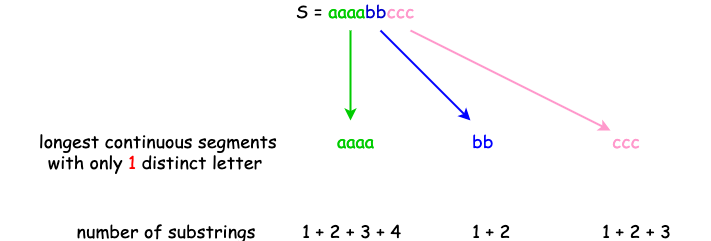

*Figure 1. Find the longest continuous segments with one distinct letter and count the substrings.*

**Algorithm**

- Initialize an integer variable `total` to count the number of substrings along with the iteration; initialize two pointers `left` and `right` which mark the beginning and the end of the substring that contains only one distinct letter.
- Iterate through `S`:
  - If we do not reach the end and the new character $S[right]$ is the same as the beginning one $S[left]$, increment `right` by 1 to keep exploring `S`;
  - otherwise, calculate the length of the substring as $right - left$ and apply the Sum Equation of Arithmetic Sequence; remember to set `right` as `left` to start exploring the new substring.

```python
class Solution:
    def countLetters(self, S: str) -> int:
        total = left = 0

        for right in range(len(S) + 1):
            if right == len(S) or S[left] != S[right]:
                len_substring = right - left
                # more details about the sum of the arithmetic sequence:
                # https://en.wikipedia.org/wiki/Arithmetic_progression#Sum
                total += (1 + len_substring) * len_substring // 2
                left = right
        return total

```

**Complexity Analysis**

* Time Complexity: $\mathcal{O}(N)$, where $N$ is the length of `S`.
This is because we iterate through `S` once.
* Space Complexity: $\mathcal{O}(1)$.
This is because we do not use additional data structures.
<br/>
---

### Approach 2: Dynamic Programming

**Intuition**

Given a string `S`, we may define an integer array `substrings[]` with a length of `len(S)`, such that $\text{substrings}[i]$ is the number of substrings ending with $S[i]$ which contains only one distinct letter $S[i]$. Therefore, if $S[i] = S[i - 1]$, $\text{substrings}[i]$ would be $substrings[i - 1] + 1$ where `1` refers to the substring containing only $S[i]$; else if $S[i] \neq S[i - 1]$, $\text{substrings}[i]$ would be `1`.

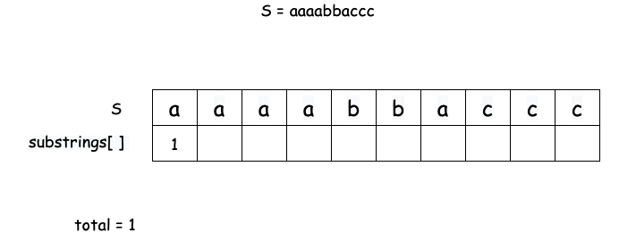

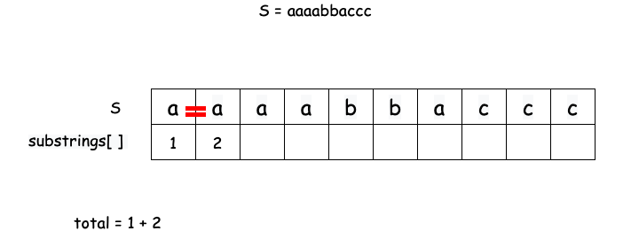

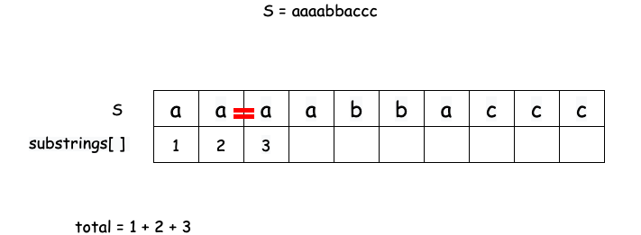

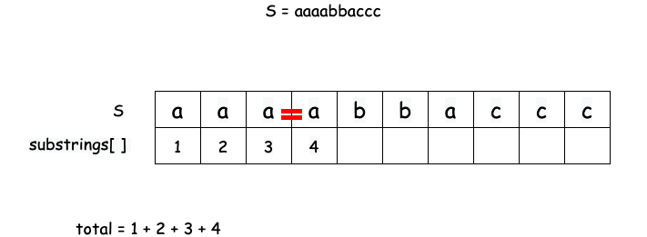

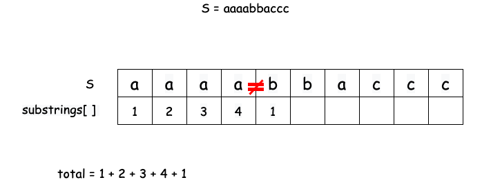

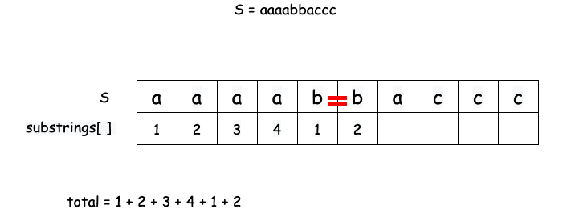

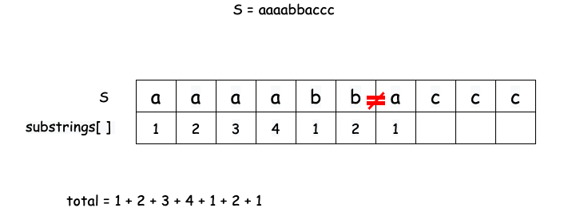

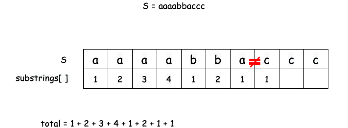

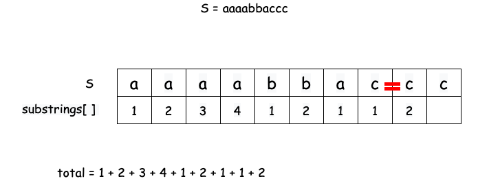

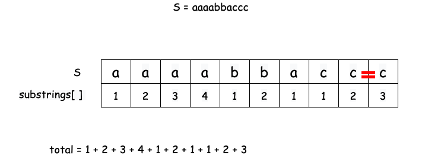

*For those who like mathematical definitions, you may find the state transition function as follows. Otherwise, feel free to skip this part.*

$$
  \text{substrings}(i)=\begin{cases}
    \text{substrings}(i - 1) + 1, & \text{if $\text{S}[i - 1] = \text{S}[i]$}\\
    1, & \text{otherwise}
  \end{cases}
$$

<br/>

**Algorithm**

- Initialize an integer `total` to count the number of substrings during the iteration, and an integer array `substrings` to record the number of substrings ending with $S[i]$ containing only one distinct letter $S[i]$.
- Initialize $\text{substrings}[0]$ to 1.
- Iterate `S` skipping the first element as we've initialized $\text{substrings}[0]$:
  - if $S[i-1] = S[i]$, set $\text{substrings}[i]$ to $substrings[i-1] + 1$;
  - else, set $\text{substring}[i]$ to 1.
  - increment `total` by $\text{substrings}[i]$.

```python
class Solution:
    def countLetters(self, S: str) -> int:
        total = 1
        substrings = [0] * len(S)
        substrings[0] = 1
        for i in range(1, len(S)):
            if S[i - 1] == S[i]:
                substrings[i] = substrings[i-1] + 1
            else:
                substrings[i] = 1
            total += substrings[i]
        return total
```

Note that $\text{substrings}[i]$ only depends on $substrings[i - 1]$, therefore instead of using an array, we can use an integer variable `count` to keep track of $\text{substrings}[i]$ to improve the space complexity from $\mathcal{O}(N)$ to $\mathcal{O}(1)$.

```python
class Solution:
    def countLetters(self, S: str) -> int:
        total = 1
        count = 1
        for i in range(1, len(S)):
            if S[i] == S[i-1]:
                count += 1
            else:
                count = 1
            total += count
        return total
```

**Complexity Analysis**

* Time Complexity: $\mathcal{O}(N)$, where $N$ is the length of `S`.
This is because we iterate through `S` once.
* Space Complexity: $\mathcal{O}(1)$.
The original implementation of this dynamic programming approach takes $\mathcal{O}(N)$ space complexity as it uses an array with a size of `len(S)`. With the optimization, we achieve $\mathcal{O}(1)$ space complexity because we do not use additional data structures.<br/>
---