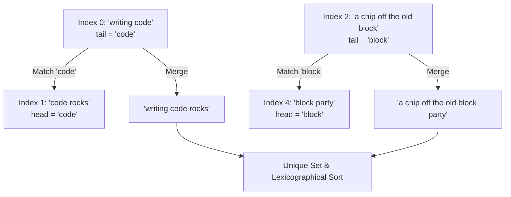

# Guided Example: Before and After Puzzle

## 1. Problem Essence & Algorithmic Mental Model

In word-puzzle games (such as the classic "Before and After" category in *Wheel of Fortune*), two distinct phrases are concatenated to form a single compound expression if the terminating word of the first phrase matches the commencing word of the second phrase. The overlapping word is merged so that it appears exactly once at the junction.

Given a list of strings $\text{phrases}$, our goal is to find all valid merged phrases generated by choosing an ordered pair of distinct phrase indices $(i, j)$ with $i \neq j$, such that the last word of $\text{phrase}[i]$ equals the first word of $\text{phrase}[j]$. The output must be returned as a lexicographically sorted list of unique merged strings.

To model this process cleanly:
1. **Token Boundary Decomposition**: Each phrase $P$ is a space-separated sequence of words $(w_1, w_2, \dots, w_k)$. We identify its anchor endpoints:
   $$\text{head}(P) = w_1 \quad \text{and} \quad \text{tail}(P) = w_k$$
   If a phrase consists of a single word ($k=1$), then $\text{head}(P) = \text{tail}(P) = w_1$.
2. **Junction Concatenation**: When $\text{tail}(P_i) = \text{head}(P_j)$, the overlapping word is preserved from $P_i$, and the remaining suffix of $P_j$ (everything following its initial word) is appended directly to $P_i$.
   - If $P_j$ consists solely of the overlapping word ($k=1$), the merged string is simply $P_i$.
   - If $P_j$ contains subsequent words, the merged string is $P_i$ concatenated with the suffix of $P_j$ starting after the first word.
3. **Deduplication & Canonical Ordering**: Distinct pairs of indices $(i_1, j_1)$ and $(i_2, j_2)$ may produce identical concatenated strings (especially when identical phrases or multi-word homographs exist). We collect results into a set and perform a final lexicographical sort.

```
Phrase A (i): "writing code"    -> tail: "code"
Phrase B (j): "code rocks"      -> head: "code"

Junction Match: "code" == "code"
Merged Output:  "writing code" + " rocks" = "writing code rocks"
```

---

## 2. Mathematical Formalism & Invariants

Let $\mathcal{P} = (P_0, P_1, \dots, P_{n-1})$ be the list of $n$ phrases.
For each phrase $P_i$, let its whitespace tokenization be:
$$\text{words}(P_i) = (w_{i,1}, w_{i,2}, \dots, w_{i, k_i})$$
where $k_i \ge 1$ is the number of words in $P_i$.

Define the boundary projections:
$$\text{head}(i) = w_{i,1}, \quad \text{tail}(i) = w_{i, k_i}$$

### Merge Operation Definition
For an ordered pair of indices $(i, j)$ with $i, j \in \{0, \dots, n-1\}$ and $i \neq j$:
A connection is valid if and only if:
$$\text{tail}(i) = \text{head}(j)$$

When valid, the merge operator $\oplus$ is defined as:
$$P_i \oplus P_j = P_i + P_j[|\text{head}(j)| \dots |P_j|-1]$$
Notice that if $k_j = 1$, then $P_j[|\text{head}(j)| \dots] = \epsilon$ (the empty string), so $P_i \oplus P_j = P_i$.

### Canonical Solution Set
The output collection $\mathcal{S}$ is defined as the sorted unique set of all valid merges:
$$\mathcal{S} = \text{sort}\left( \bigcup_{\substack{i \neq j \\ \text{tail}(i) = \text{head}(j)}} \{P_i \oplus P_j\} \right)$$

---

## 3. Concrete Example Execution & State Evolution

Consider the input list of phrases:
`phrases = ["writing code", "code rocks", "a chip off the old block", "a chip", "block party"]`
Indices:
- 0: `"writing code"`
- 1: `"code rocks"`
- 2: `"a chip off the old block"`
- 3: `"a chip"`
- 4: `"block party"`

### Phrase Endpoint Extraction Trace

| Index $i$ | Raw Phrase $P_i$ | $\text{head}(i)$ | $\text{tail}(i)$ | Suffix After Head |
|---|---|---|---|---|
| 0 | `"writing code"` | `"writing"` | `"code"` | `""` |
| 1 | `"code rocks"` | `"code"` | `"rocks"` | `" rocks"` |
| 2 | `"a chip off the old block"` | `"a"` | `"block"` | `" chip off the old block"` |
| 3 | `"a chip"` | `"a"` | `"chip"` | `" chip"` |
| 4 | `"block party"` | `"block"` | `"party"` | `" party"` |



### Pairwise Verification Trace

| Ordered Pair $(i, j)$ | $\text{tail}(i)$ | $\text{head}(j)$ | Condition $\text{tail}(i) = \text{head}(j)$ | Concatenation Computation | Merged String Result |
|---|---|---|---|---|---|
| $(0, 1)$ | `"code"` | `"code"` | True ($i \neq j$) | `"writing code"` + `" rocks"` | `"writing code rocks"` |
| $(2, 4)$ | `"block"` | `"block"` | True ($i \neq j$) | `"a chip off the old block"` + `" party"` | `"a chip off the old block party"` |
| $(3, 2)$ | `"chip"` | `"a"` | False | Discarded | - |
| $(4, 2)$ | `"party"` | `"a"` | False | Discarded | - |
| $(1, 0)$ | `"rocks"` | `"writing"` | False | Discarded | - |

After evaluating all candidate pairs, exactly two valid combinations exist. Both are already unique and are sorted alphabetically:
1. `"a chip off the old block party"`
2. `"writing code rocks"`

---

## 4. Multi-Approach Comparison & Trade-Offs

| Metric / Dimension | All-Pairs String Concatenation ($N^2$) | Inverted Head-Word Index Hash Map (Optimal) | Trie Over Prefix/Suffix Trees |
|---|---|---|---|
| **Matching Strategy** | Nested loop checking $i \neq j$ | Group indices by $\text{head}$, lookup by $\text{tail}$ | Walk Trie for common prefix |
| **Comparisons Required**| $N(N-1)$ pair inspections | $\sum_i \lvert \text{bucket}(\text{tail}(i)) \rvert$ direct matches | Character-by-character trie descent |
| **Time Complexity** | $\mathcal{O}(N^2 \cdot L + K \log K)$ | $\mathcal{O}(N \cdot L + M \cdot L + K \log K)$ | $\mathcal{O}(N \cdot L + K \log K)$ |
| **Auxiliary Memory** | $\mathcal{O}(K \cdot L)$ for results | $\mathcal{O}(N)$ hash table storage | High pointer node overhead |
| **Practical Scaling** | Fast for $N \le 100$ | Scales gracefully to $N \ge 10^5$ | Unnecessary complexity for word boundary matching |

```
Hash Map Inverted Index Optimization:
Head Index Table:
  "code"  -> [Index 1]
  "block" -> [Index 4]
  "a"     -> [Index 2, Index 3]

For Phrase 0 ("writing code"):
  tail = "code" -> Instantly fetch candidate [1] -> Form (0, 1) without checking 2, 3, 4!
```

---

## 5. Algorithmic Edge Cases & Boundary Analysis

| Boundary Scenario | Input Example | Expected Behavior | Handling Mechanism |
|---|---|---|---|
| **Single-Word Phrases** | `["a", "b", "a"]` with duplicate words | Merge $(0, 2)$ produces `"a"`, $(2, 0)$ produces `"a"` | Set deduplication collapses multiple identical merged strings to a single `"a"`. |
| **Identical Phrase Merging with Itself** | Single occurrence of `["a a"]` | Disallowed ($i \neq j$) | Constraint $i \neq j$ explicitly prevents pairing an index with itself. |
| **Duplicate Identical Input Phrases** | `phrases = ["a", "a"]` at indices 0 and 1 | Both $(0, 1)$ and $(1, 0)$ valid | Evaluates both pairs; resulting identical strings are merged by the output set. |
| **No Valid Pairs** | `["first second", "third fourth"]` | Empty output `[]` | No tail matches any head; empty result returned immediately. |
| **All Phrases Chainable** | Cyclic words e.g. `["a b", "b c", "c a"]` | Multiple multi-hop merges | Evaluates pairwise 2-phrase merges only; does not chain three phrases. |

---

## 6. Mathematical Verification & Complexity Derivation

Let $N$ be the number of phrases, and let $L$ be the maximum length of any phrase string.
Let $M$ be the number of valid pairs discovered, and let $K$ be the number of unique merged phrases ($K \le M \le N^2$).

### 1. Tokenization and Head/Tail Extraction:
- Splitting each phrase into words or locating the first and last space requires scanning the string: $\mathcal{O}(L)$ per phrase.
- Across all $N$ phrases: $\mathcal{O}(N \cdot L)$ time and $\mathcal{O}(N \cdot L)$ space.

### 2. Pair Matching and Concatenation:
- **Pairwise Scan**: Examining all $N(N-1)$ pairs of indices $(i, j)$ and comparing string equality $\text{tail}(i) == \text{head}(j)$ takes $\mathcal{O}(N^2 \cdot L)$ worst-case time.
- **Inverted Hash Map**: Grouping phrase indices by head word takes $\mathcal{O}(N \cdot L)$. For each phrase, looking up its tail word in the hash map takes $\mathcal{O}(L)$ on average. Concatenating each valid pair takes $\mathcal{O}(L)$. Total matching time: $\mathcal{O}(N \cdot L + M \cdot L)$.

### 3. Deduplication and Sorting:
- Inserting $M$ merged strings of length at most $2L$ into a hash set takes $\mathcal{O}(M \cdot L)$.
- Sorting the $K$ unique strings takes $\mathcal{O}(K \log K \cdot L)$ time.

### Asymptotic Summary:
- **Total Time Complexity:** $\mathcal{O}(N^2 \cdot L + K \log K \cdot L)$ for the pairwise approach, or $\mathcal{O}(N \cdot L + M \cdot L + K \log K \cdot L)$ with the inverted hash index. For $N \le 100$ and $L \le 100$, execution requires under $10^5$ operations, well within interactive tolerances.
- **Total Space Complexity:** $\mathcal{O}(N \cdot L + K \cdot L)$ auxiliary memory for parsed tokens and the result set.

---

## 7. Synthesis & Strategic Takeaways

1. **Junction Invariance**: Merging based on word boundaries depends strictly on the peripheral tokens ($\text{head}$ and $\text{tail}$). Interior words play no role during the matching phase, so isolating the boundary tokens beforehand minimizes redundant string parsing.
2. **Inverted Index as a General Pair-Matching Pattern**: When searching for pairs $(A, B)$ satisfying $\text{property}(A) = \text{property}(B)$, constructing a hash map from the target property to candidate entities reduces a quadratic search space to linear proportional to true output occurrences.
3. **Set-Based Deduplication Before Sorting**: When generating combinatorial pairings, multiple combinations can frequently yield identical textual outcomes. Collecting candidate strings into a hash set prior to sorting avoids sorting redundant elements, minimizing both comparison time and output size.
