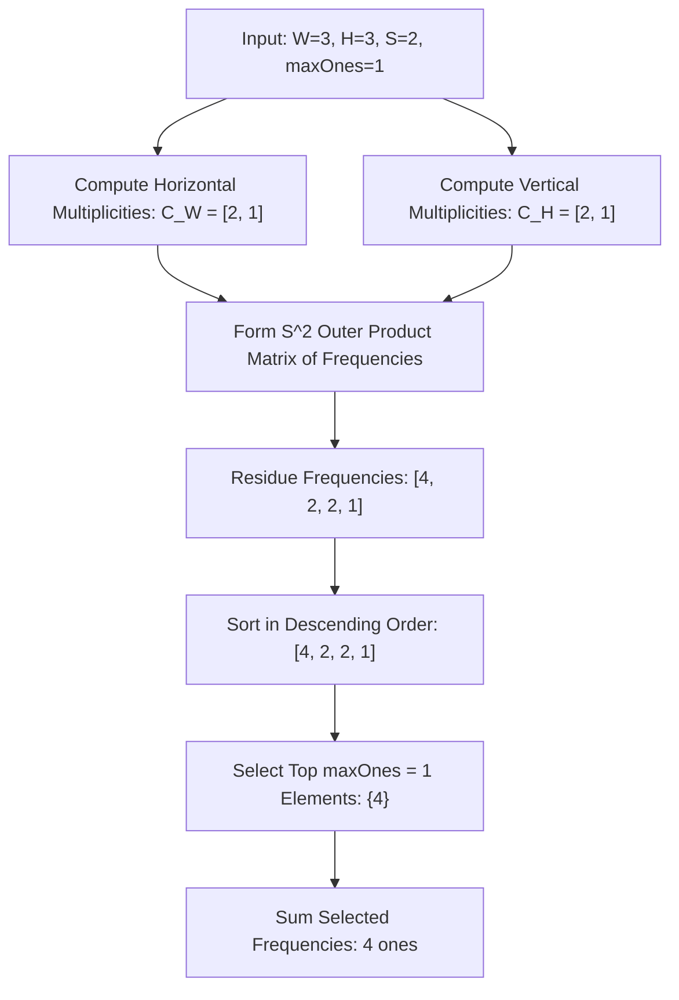

# Guided Example: Maximum Number of Ones

## 1. Problem Essence & Algorithmic Mental Model

We are tasked with populating a 2D binary grid of dimensions $\text{width} \times \text{height}$ with the maximum possible number of ones ($1$s) such that every square subgrid of size $\text{sideLength} \times \text{sideLength}$ contains at most $\text{maxOnes}$ ones.

A naive constraint-satisfaction model or integer linear programming formulation quickly becomes intractable due to the astronomical combinatorial state space ($2^{\text{width} \times \text{height}}$ configurations).

The mathematical core of this problem lies in **2D Modular Periodicity**:
1. **Residue Class Invariance**: Let $S = \text{sideLength}$. Any contiguous window of length $S$ along a 1D line contains every residue modulo $S$ ($\{0, 1, \dots, S-1\}$) exactly once. By Cartesian extension, every contiguous $S \times S$ square subgrid in the 2D plane contains each residue pair $(r, c) \in [0, S-1] \times [0, S-1]$ precisely once.
2. **Global Constraint Decoupling**: If we choose a set of coordinate offsets $\Omega \subset \{0, \dots, S-1\}^2$ with $|\Omega| \le \text{maxOnes}$, and place a $1$ at cell $(i, j)$ if and only if $(i \bmod S, j \bmod S) \in \Omega$, then **every** $S \times S$ subgrid throughout the entire board will contain exactly $|\Omega|$ ones. This guarantees zero constraint violations everywhere.
3. **Frequency Disparity & Greedy Selection**: Across the full grid of size $W \times H$, different residue pairs $(r, c)$ do not appear an equal number of times unless both $W$ and $H$ are exact multiples of $S$. The cells near the top-left of each period appear more frequently when $W \bmod S \neq 0$ or $H \bmod S \neq 0$. Therefore, each residue class $(r, c)$ has an easily computable global replication frequency $f(r, c)$. To maximize the global sum of ones, we simply pick the $\text{maxOnes}$ residue classes that possess the largest replication frequencies.

```
Full Grid (Width 5, Height 4, S = 3):
Residues:
(0,0) (0,1) (0,2) | (0,0) (0,1)
(1,0) (1,1) (1,2) | (1,0) (1,1)
(2,0) (2,1) (2,2) | (2,0) (2,1)
------------------+------------
(0,0) (0,1) (0,2) | (0,0) (0,1)

Residue (0,0) appears 4 times! Residue (2,2) appears only 1 time!
Greedy strategy: Activate cells with highest replication count first.
```

---

## 2. Mathematical Formalism & Invariants

Let $W = \text{width}$, $H = \text{height}$, $S = \text{sideLength}$, and $K = \text{maxOnes}$.
Define the 2D periodic projection $\pi: \{0, \dots, W-1\} \times \{0, \dots, H-1\} \to \{0, \dots, S-1\}^2$:
$$\pi(i, j) = (i \bmod S, j \bmod S)$$

### Lemma: Uniform Representation in Subgrids
For any top-left coordinate $(x, y)$ such that $0 \le x \le W - S$ and $0 \le y \le H - S$, the subgrid $\mathcal{B}(x, y) = \{(x + u, y + v) \mid 0 \le u, v < S\}$ satisfies:
$$\pi(\mathcal{B}(x, y)) = \{0, \dots, S-1\} \times \{0, \dots, S-1\}$$
where the mapping $\pi$ restricted to $\mathcal{B}(x, y)$ is a bijection.

### Replication Frequency Formula
For a residue coordinate $r \in [0, S-1]$ along the horizontal dimension, the number of integer coordinates $i \in [0, W-1]$ with $i \equiv r \pmod S$ is:
$$C_W(r) = \lfloor \frac{W}{S} \rfloor + [r < (W \bmod S)]$$
Similarly, along the vertical dimension for $c \in [0, S-1]$:
$$C_H(c) = \lfloor \frac{H}{S} \rfloor + [c < (H \bmod S)]$$
By independence of dimensions, the total number of cells in the entire board mapping to residue $(r, c)$ is:
$$\text{Freq}(r, c) = C_W(r) \times C_H(c)$$

### Optimization Objective
Let $\mathbf{x}: \{0, \dots, S-1\}^2 \to \{0, 1\}$ be an indicator function choosing whether to place a 1 at residue class $(r, c)$. The problem reduces to:
$$\max \sum_{r=0}^{S-1} \sum_{c=0}^{S-1} \text{Freq}(r, c) \cdot \mathbf{x}(r, c) \quad \text{subject to} \quad \sum_{r=0}^{S-1} \sum_{c=0}^{S-1} \mathbf{x}(r, c) \le K$$

Because this is a standard linear 0-1 knapsack problem with uniform unit weights (each item consumes 1 unit of capacity against budget $K$), the optimal strategy is greedy: sort the $S^2$ frequency values in descending order and sum the top $K$ values.

---

## 3. Concrete Example Execution & State Evolution

Consider the configuration:
- $\text{width} = 3$, $\text{height} = 3$
- $\text{sideLength} = 2$
- $\text{maxOnes} = 1$

### Frequency Calculation Trace for $S = 2$ ($2 \times 2$ period)
Here $W = 3, H = 3, S = 2$.
$W / S = 1$ with remainder $3 \bmod 2 = 1$.
- $C_W(0) = 1 + 1 = 2$ (indices 0, 2)
- $C_W(1) = 1 + 0 = 1$ (index 1)
- $C_H(0) = 1 + 1 = 2$ (indices 0, 2)
- $C_H(1) = 1 + 0 = 1$ (index 1)

| Residue Pair $(r, c)$ | Horizontal Count $C_W(r)$ | Vertical Count $C_H(c)$ | Global Frequency $C_W(r) \times C_H(c)$ | Board Coordinates Mapped |
|---|---|---|---|---|
| $(0, 0)$ | 2 | 2 | **4** | $(0,0), (0,2), (2,0), (2,2)$ |
| $(0, 1)$ | 2 | 1 | **2** | $(0,1), (2,1)$ |
| $(1, 0)$ | 1 | 2 | **2** | $(1,0), (1,2)$ |
| $(1, 1)$ | 1 | 1 | **1** | $(1,1)$ |



### Resulting Matrix Visualization
With $\text{maxOnes} = 1$, we select the single highest frequency residue, $(0, 0)$:

$$\begin{bmatrix} 1 & 0 & 1 \\ 0 & 0 & 0 \\ 1 & 0 & 1 \end{bmatrix}$$

Verification of all $2 \times 2$ subgrids:
1. Top-Left $[0 \dots 1] \times [0 \dots 1]$: contains $(0,0) \implies 1$ one.
2. Top-Right $[0 \dots 1] \times [1 \dots 2]$: contains $(0,2) \implies 1$ one.
3. Bottom-Left $[1 \dots 2] \times [0 \dots 1]$: contains $(2,0) \implies 1$ one.
4. Bottom-Right $[1 \dots 2] \times [1 \dots 2]$: contains $(2,2) \implies 1$ one.

Every $2 \times 2$ subgrid contains exactly $1 \le \text{maxOnes}$ one. Total ones placed = **4**.

---

## 4. Multi-Approach Comparison & Trade-Offs

| Dimension / Approach | Backtracking Search / Constraint Solver | Full Grid Coordinate Iteration ($\mathcal{O}(W \cdot H)$) | Analytical Multiplicity Outer Product (Optimal) |
|---|---|---|---|
| **Time Complexity** | Exponential ($\mathcal{O}(2^{W \cdot H})$) | $\mathcal{O}(W \cdot H + S^2 \log S)$ | $\mathcal{O}(S^2 + S^2 \log S)$ |
| **Space Complexity** | $\mathcal{O}(W \cdot H)$ recursion stack | $\mathcal{O}(S^2)$ frequency array | $\mathcal{O}(S^2)$ or $\mathcal{O}(S)$ |
| **Handling Large Grids** | Infeasible beyond $5 \times 5$ | Practical for $W, H \le 10^4$ | Instantaneous even if $W, H \ge 10^9$ |
| **Implementation Complexity**| Extreme | Very straightforward | Mathematical and clean |

```
Frequency Distribution Pattern:
High frequency cells cluster at residue indices < (W % S, H % S):

      c=0    c=1    c=2
r=0 [ High | Med  | Med  ]
r=1 [ Med  | Low  | Low  ]
r=2 [ Med  | Low  | Low  ]
```

---

## 5. Algorithmic Edge Cases & Boundary Analysis

| Boundary Scenario | Configuration State | Mathematical Behavior & Result |
|---|---|---|
| **$S = 1$ (Unit Square)** | $\text{sideLength} = 1$ | Every cell is its own square. Maximum ones $= \text{maxOnes} \times W \times H$. If $\text{maxOnes} = 0$, returns 0; if $\text{maxOnes} = 1$, returns $W \times H$. |
| **$\text{maxOnes} \ge S^2$** | Maximum budget | We can activate all $S^2$ residue classes; returns $W \times H$ (every cell in the board is 1). |
| **$\text{maxOnes} = 0$** | Zero budget | We can activate zero residue classes; sum of top 0 elements is 0. |
| **Exact Multiple Dimensions** | $W \bmod S = 0$ and $H \bmod S = 0$ | All $S^2$ residue classes have identical frequencies $\frac{W \cdot H}{S^2}$. Any choice of $K$ classes gives exactly $K \cdot \frac{W \cdot H}{S^2}$. |
| **$S$ Equal to Full Grid** | $S = W = H$ | Exactly one subgrid covers the entire board; answer is strictly $\min(W \cdot H, \text{maxOnes})$. |

---

## 6. Mathematical Verification & Complexity Derivation

Let $W = \text{width}$, $H = \text{height}$, $S = \text{sideLength}$, and $K = \text{maxOnes}$.

### 1. Frequency Generation:
- **Approach A (Double Loop over Grid)**:
  Iterating over all $i \in [0, W-1]$ and $j \in [0, H-1]$, computing $(i \bmod S) \cdot S + (j \bmod S)$ and incrementing an array of size $S^2$ takes $\mathcal{O}(W \cdot H)$ steps.
- **Approach B (1D Coordinate Multiplicity)**:
  Precomputing $C_W(r)$ for $r \in [0, S-1]$ takes $\mathcal{O}(S)$ steps. Precomputing $C_H(c)$ for $c \in [0, S-1]$ takes $\mathcal{O}(S)$ steps. Forming the $S^2$ products takes $\mathcal{O}(S^2)$ operations, completely independent of the magnitudes of $W$ and $H$.

### 2. Selection of Top $K$ Frequencies:
- Sorting the array of $S^2$ frequencies takes $\mathcal{O}(S^2 \log(S^2)) = \mathcal{O}(S^2 \log S)$ comparisons.
- Alternatively, using a linear selection algorithm (such as Introselect / Quickselect) takes $\mathcal{O}(S^2)$ worst/average time.
- Summing the top $K$ elements takes $\mathcal{O}(K) \le \mathcal{O}(S^2)$ time.

### Total Asymptotics:
- **Time Complexity:** $\mathcal{O}(W \cdot H + S^2 \log S)$ for full-grid tallying, or $\mathcal{O}(S^2 \log S)$ with closed-form coordinate products.
- **Space Complexity:** $\mathcal{O}(S^2)$ auxiliary storage to retain the $S \times S$ period frequency values.

---

## 7. Synthesis & Strategic Takeaways

1. **Modular Invariance as Dimensionality Reduction**: In geometric grid problems with local translation-invariant constraints (e.g., fixed-size sliding windows), modular arithmetic collapses an infinite or large board into a compact fundamental domain (the torus $\mathbb{Z}_S \times \mathbb{Z}_S$).
2. **Greedy Optimality in Unit-Cost Knapsacks**: Whenever decisions are independent and binary with identical marginal resource costs (each residue selection consumes exactly 1 unit of `maxOnes`), greedy prioritization by marginal yield (replication frequency) is provably optimal.
3. **Multiplicity Factorization**: Because horizontal and vertical coordinates translate independently under the Euclidean metric, 2D cell frequency decomposes into the product of 1D marginal frequencies ($C_W(r) \times C_H(c)$), providing a classic example of dimensional separability.
