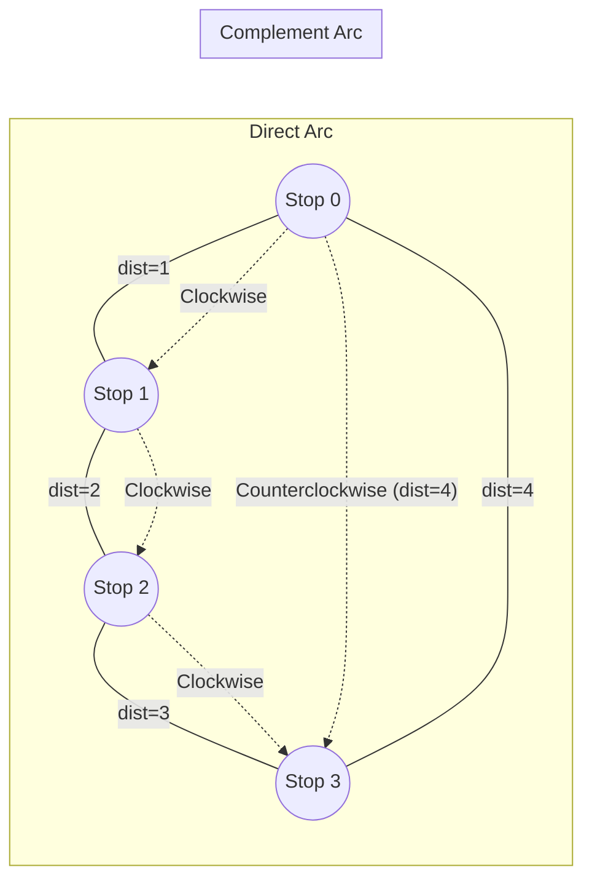

# Guided Example: Distance Between Bus Stops

## 1. Problem Essence & Algorithmic Mental Model

A bus operates along a circular route comprising $n$ discrete stops labeled $0, 1, \dots, n-1$ in sequential clockwise order. The transit authority provides a distance array where entry $\text{distance}[i]$ specifies the route distance separating stop $i$ from stop $(i + 1) \bmod n$. We are given two stops: a starting location $\text{start}$ and a target $\text{destination}$. The bus may navigate in either direction—clockwise or counterclockwise—to reach its destination. We must determine the minimum total distance required to travel between the two designated stops.

Because the bus topology forms a simple closed cycle (a 1D circle / ring graph):
1. **Bipartition of the Cyclic Perimeter**: Any pair of distinct stops partitions the entire cyclic route into exactly two mutually disjoint, complementary paths:
   - A **clockwise path** traversing forward along increasing stop indices (wrapping around from $n-1$ to $0$ if necessary).
   - A **counterclockwise path** traversing backward along decreasing indices (wrapping around from $0$ to $n-1$).
2. **Perimeter Complementarity**: Let $C = \sum_{i=0}^{n-1} \text{distance}[i]$ denote the total perimeter of the ring. If the clockwise path has length $d_1$, then the counterclockwise path must have length $d_2 = C - d_1$. The sum of both paths always equals the full ring perimeter:
   $$d_1 + d_2 = C$$
3. **Canonical Normalization**: Because undirected distance is symmetric, traveling from $\text{start}$ to $\text{destination}$ is identical to traveling from $\text{destination}$ to $\text{start}$. By setting $u = \min(\text{start}, \text{destination})$ and $v = \max(\text{start}, \text{destination})$, the direct interval without index wrap-around is simply the subsegment $[u, v)$. We can compute the sum across this contiguous segment in a single pass, then compare it against its complement.

```
                  Stop 0
               /          \
    distance[3]            distance[0]
             /              \
         Stop 3             Stop 1
             \              /
    distance[2]            distance[1]
               \          /
                  Stop 2

Perimeter C = dist[0] + dist[1] + dist[2] + dist[3]
Path 1 (clockwise 0 -> 2): dist[0] + dist[1]
Path 2 (counterclockwise 0 -> 2): C - Path 1 = dist[3] + dist[2]
Result = min(Path 1, Path 2)
```

---

## 2. Mathematical Formalism & Invariants

Let the cycle graph be $G = (V, E)$ where $V = \{0, 1, \dots, n-1\}$ and undirected edges $E = \{(i, (i+1) \bmod n) \mid i \in V\}$. Each edge has non-negative length $w(i, (i+1) \bmod n) = \text{distance}[i]$.

### Total Perimeter
The total cycle length is the sum over all edge weights:
$$C = \sum_{i=0}^{n-1} \text{distance}[i]$$

### Canonical Direct Arc
Without loss of generality, let $u = \min(\text{start}, \text{destination})$ and $v = \max(\text{start}, \text{destination})$.
The direct subsegment from $u$ to $v$ along the non-wrapping index range has length:
$$d_{\text{direct}} = \sum_{i=u}^{v-1} \text{distance}[i]$$

### Complementary Arc
The complementary path connecting $v$ back to $u$ across the cyclic boundary $n-1 \to 0$ has length:
$$d_{\text{complement}} = C - d_{\text{direct}} = \sum_{i=0}^{u-1} \text{distance}[i] + \sum_{i=v}^{n-1} \text{distance}[i]$$

### Optimization Criterion
The shortest distance $\delta(u, v)$ is the minimum over the two candidate trajectories:
$$\delta(u, v) = \min(d_{\text{direct}}, d_{\text{complement}}) = \min\left( d_{\text{direct}}, C - d_{\text{direct}} \right)$$

---

## 3. Concrete Example Execution & State Evolution

Consider the transit route:
- $\text{distance} = [1, 2, 3, 4]$
- $\text{start} = 0$, $\text{destination} = 3$

Here $n = 4$, $u = \min(0, 3) = 0$, $v = \max(0, 3) = 3$.

### Ring Geometry and Edge Assignment

| Edge Index $i$ | Traversed Segment | Edge Length $\text{distance}[i]$ | In Direct Arc $[0, 3)$? | In Complementary Arc? |
|---|---|---|---|---|
| 0 | Stop $0 \to$ Stop 1 | 1 | Yes | No |
| 1 | Stop $1 \to$ Stop 2 | 2 | Yes | No |
| 2 | Stop $2 \to$ Stop 3 | 3 | Yes | No |
| 3 | Stop $3 \to$ Stop 0 | 4 | No | Yes |



### Cumulative Path Accumulation Trace

| Step / Index $i$ | Processed Edge | Edge Weight | Running Direct Sum $d_{\text{direct}}$ | Running Total Sum $C$ |
|---|---|---|---|---|
| Initial | - | - | 0 | 0 |
| $i = 0$ | $0 \to 1$ | 1 | $0 + 1 = 1$ | $0 + 1 = 1$ |
| $i = 1$ | $1 \to 2$ | 2 | $1 + 2 = 3$ | $1 + 2 = 3$ |
| $i = 2$ | $2 \to 3$ | 3 | $3 + 3 = 6$ | $3 + 3 = 6$ |
| $i = 3$ | $3 \to 0$ | 4 | 6 (outside $[0, 3)$) | $6 + 4 = 10$ |

Final calculations:
- $C = 10$
- $d_{\text{direct}} = 6$
- $d_{\text{complement}} = C - d_{\text{direct}} = 10 - 6 = 4$
- Shortest path $= \min(6, 4) =$ **4**.

---

## 4. Multi-Approach Comparison & Trade-Offs

| Metric / Dimension | Breadth-First / Dijkstra Graph Search | Circular Two-Pointer Simulation | Single-Pass Range Sum & Complement (Optimal) |
|---|---|---|---|
| **Time Complexity** | $\mathcal{O}(V + E \log V)$ | $\mathcal{O}(N)$ | $\mathcal{O}(N)$ |
| **Auxiliary Memory** | $\mathcal{O}(V + E)$ priority queue | $\mathcal{O}(1)$ | $\mathcal{O}(1)$ |
| **Branching / Modulo Overhead**| High overhead | Modulo operations in while loop | Linear array slices or one for-loop |
| **Implementation Simplicity**| Complex graph representation | Moderate | Minimal & robust |
| **Applicability** | Arbitrary general graphs | Circular rings only | Circular rings only |

```
Path Comparison on Circular Ring:
Direct Arc:         [Stop 0] ===(1)===> [Stop 1] ===(2)===> [Stop 2] ===(3)===> [Stop 3]  Length: 6
Complementary Arc:  [Stop 0] <====================(4)========================== [Stop 3]  Length: 4 (Optimal!)
```

---

## 5. Algorithmic Edge Cases & Boundary Analysis

| Scenario | Configuration Example | Expected Result | Invariant Behavior |
|---|---|---|---|
| **Identical Start and Destination** | $\text{start} = 2, \text{destination} = 2$ | 0 | $u = v \implies$ loop range $[2, 2)$ is empty ($d_{\text{direct}} = 0$). $\min(0, C) = 0$. |
| **Adjacent Stops** | $\text{start} = 0, \text{destination} = 1$ | $\min(\text{distance}[0], C - \text{distance}[0])$ | Evaluates single edge directly against the long path around the entire remaining cycle. |
| **Boundary Wrap-Around** | $\text{start} = n-1, \text{destination} = 0$ | Direct comparison | Direct interval is the long path $[0, n-1)$; complement is the single edge $\text{distance}[n-1]$. |
| **Uniform Edge Weights** | All edge lengths equal $w$ | $w \times \min(k, n - k)$ | Correctly simplifies to standard modular distance on a uniform cycle. |
| **Reversed Input Order** | $\text{start} > \text{destination}$ | Symmetric output | Normalized via $u = \min(s, d)$ and $v = \max(s, d)$, producing identical results. |

---

## 6. Mathematical Verification & Complexity Derivation

Let $N$ denote the number of bus stops ($N = |\text{distance}|$).

### Execution Stages:
1. **Coordinate Normalization**: Assigning $u = \min(\text{start}, \text{destination})$ and $v = \max(\text{start}, \text{destination})$ takes $\mathcal{O}(1)$ time.
2. **Accumulation**:
   - In a single pass through the array from index $0$ to $N-1$:
     - For every index $i$, we add $\text{distance}[i]$ to total perimeter accumulator $C$.
     - If $u \le i < v$, we simultaneously add $\text{distance}[i]$ to the direct arc accumulator $d_{\text{direct}}$.
   - This performs exactly $N$ additions and comparisons.
3. **Minimum Evaluation**: Computing $\min(d_{\text{direct}}, C - d_{\text{direct}})$ requires one subtraction and one comparison: $\mathcal{O}(1)$.

### Complexity Summary:
- **Total Time Complexity:** $\mathcal{O}(N)$ strictly linear time.
- **Total Auxiliary Space Complexity:** $\mathcal{O}(1)$ strictly constant memory, requiring only two integer accumulators.

---

## 7. Synthesis & Strategic Takeaways

1. **Cycle Complementarity Principle**: On any simple connected cycle, any two vertices divide the graph into exactly two paths that sum to the total cycle perimeter. Computing one path automatically yields the other via subtraction ($C - d$), obviating the need for a second simulated traversal.
2. **Canonical Index Normalization**: Enforcing an order invariant like $u \le v$ before processing eliminates boundary wrap-around logic, allowing standard contiguous slice summation over $[u, v)$.
3. **Avoid Over-Engineering on Constrained Topologies**: While shortest path queries on general graphs mandate Dijkstra's algorithm or BFS, 1D circular graphs have a topology with degree-2 vertices where graph traversal reduces to elementary array accumulation.
