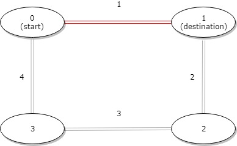
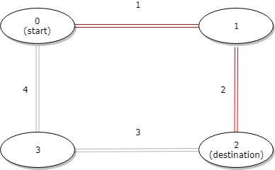
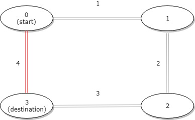

### 1. Description

A bus has `n` stops numbered from `0` to $n - 1$ that form a circle. We know the distance between all pairs of neighboring stops where $\text{distance}[i]$ is the distance between the stops number `i` and $(i + 1) \% n$.

The bus goes along both directions i.e. clockwise and counterclockwise.

Return the shortest distance between the given `start` and `destination` stops.

### 2. Function Contract

**Inputs**

- `distance`: Input parameter (`List[int]`).
- `start`: Input parameter (`int`).
- `destination`: Input parameter (`int`).

**Return value**

- Returns `int`.

### 3. Examples

#### Example 1

- **Input:** $distance = [1,2,3,4], start = 0, destination = 1$
- **Output:** `1`
- **Explanation:** Distance between 0 and 1 is 1 or 9, minimum is 1.

#### Example 2

- **Input:** $distance = [1,2,3,4], start = 0, destination = 2$
- **Output:** `3`
- **Explanation:** Distance between 0 and 2 is 3 or 7, minimum is 3.

#### Example 3

- **Input:** $distance = [1,2,3,4], start = 0, destination = 3$
- **Output:** `4`
- **Explanation:** Distance between 0 and 3 is 6 or 4, minimum is 4.

### 4. Constraints

- $1 \le n \le 10^{4}$

- $\text{distance.length} = n$

- $0 \le start, destination < n$

- $0 \le \text{distance}[i] \le 10^{4}$
