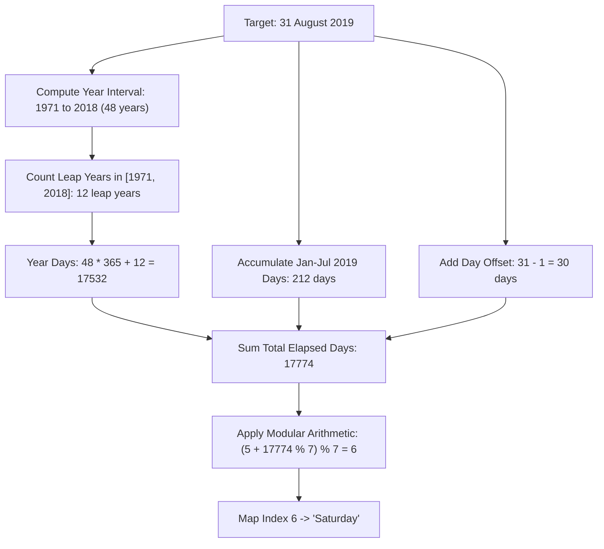

# Guided Example: Day of the Week

## 1. Problem Essence & Algorithmic Mental Model

Given a calendar date specified by three positive integers—$\text{day}$, $\text{month}$, and $\text{year}$—within the Gregorian calendar epoch between the years $1971$ and $2100$, our task is to compute the exact day of the week corresponding to this date. The output must be one of the standard English weekday names: `["Sunday", "Monday", "Tuesday", "Wednesday", "Thursday", "Friday", "Saturday"]`.

The passage of weekdays is a cyclic group of order 7, represented by the modular ring $\mathbb{Z}_7$. Each non-leap year comprises 365 days. Since $365 = 52 \times 7 + 1$, each standard calendar year shifts the day of the week forward by exactly $1 \pmod 7$. A leap year contains 366 days, shifting the day of the week forward by $2 \pmod 7$.

Two fundamental algorithmic paradigms solve this problem:
1. **Epoch Offset Counting**: Choose a known reference date (e.g., January 1, 1971, which fell on a Friday). Count the cumulative number of days that have elapsed from that epoch to the target date by tallying days across intermediate years, accounting for leap years according to Gregorian rules, and adding the days across elapsed months in the target year. The weekday is determined by $(4 + \text{elapsed\_days}) \bmod 7$.
2. **Tomohiko Sakamoto's Congruence**: Treat January and February as the 13th and 14th months of the preceding year. This ingenious re-indexing places the quadrennial leap day (February 29) at the very end of the adjusted calendar year. With an array of twelve precomputed monthly offsets $t$, the weekday index can be calculated in $\mathcal{O}(1)$ time using a direct arithmetic formula.

```
Gregorian Leap Year Rule:
Year Y is leap iff: (Y % 4 == 0) AND (Y % 100 != 0 OR Y % 400 == 0)
Between 1971 and 2100, the century rule Y % 100 != 0 applies to 2000 (leap, divisible by 400).
Thus, all years divisible by 4 in [1971, 2100] are leap years!
```

---

## 2. Mathematical Formalism & Invariants

Let $\mathcal{W} = \{\text{Sunday}, \text{Monday}, \text{Tuesday}, \text{Wednesday}, \text{Thursday}, \text{Friday}, \text{Saturday}\}$ be mapped to residue classes $0, 1, 2, 3, 4, 5, 6 \in \mathbb{Z}_7$.

### Gregorian Leap Rule
For any year $Y \in \mathbb{Z}^+$:
$$\text{isLeap}(Y) = \left( (Y \bmod 4 = 0) \land (Y \bmod 100 \neq 0) \right) \lor (Y \bmod 400 = 0)$$

For the constrained domain $Y \in [1971, 2100]$, the only century boundary is $2000$. Since $2000 \bmod 400 = 0$, the year 2000 is a leap year. Consequently, every multiple of 4 in this entire domain is an active leap year.

### Method A: Cumulative Days from Epoch (January 1, 1971)
Let the base epoch date be $1971\text{-}01\text{-}01$, known to be a **Friday** (index 5, where Sunday = 0).
The number of elapsed days from $1971\text{-}01\text{-}01$ to $Y\text{-}M\text{-}D$ is:

$$\Delta = \sum_{y=1971}^{Y-1} (365 + \text{isLeap}(y)) + \sum_{m=1}^{M-1} \text{daysInMonth}(m, \text{isLeap}(Y)) + (D - 1)$$

The resulting weekday index is:
$$W = (5 + \Delta) \bmod 7$$

### Method B: Tomohiko Sakamoto's Closed-Form Formula
Let $y' = Y - [M < 3]$.
Using the month shift array:
$$t = [0, 3, 2, 5, 0, 3, 5, 1, 4, 6, 2, 4]$$
The weekday index (with $0 = \text{Sunday}, \dots, 6 = \text{Saturday}$) is:

$$W = \left( y' + \lfloor \frac{y'}{4} \rfloor - \lfloor \frac{y'}{100} \rfloor + \lfloor \frac{y'}{400} \rfloor + t[M - 1] + D \right) \bmod 7$$

---

## 3. Concrete Example Execution & State Evolution

Consider the target date: $\text{day} = 31$, $\text{month} = 8$, $\text{year} = 2019$ (August 31, 2019).

### Trace via Cumulative Days from 1971-01-01

#### Step 1: Elapsed Full Years (1971 to 2018)
- Total years $= 2019 - 1971 = 48$ years.
- Leap years in this interval are multiples of 4 from 1972 through 2016 inclusive:
  $$\text{Leap years} = \{1972, 1976, \dots, 2016\} \implies \frac{2016 - 1972}{4} + 1 = 12 \text{ leap years}$$
- Days from years $= 48 \times 365 + 12 = 17520 + 12 = 17532$ days.

#### Step 2: Elapsed Months in 2019 (January through July)
2019 is not a leap year ($2019 \bmod 4 \neq 0$). Days per month:

| Month | Month Name | Days in Month | Cumulative Days in 2019 |
|---|---|---|---|
| 1 | January | 31 | 31 |
| 2 | February | 28 | 59 |
| 3 | March | 31 | 90 |
| 4 | April | 30 | 120 |
| 5 | May | 31 | 151 |
| 6 | June | 30 | 181 |
| 7 | July | 31 | 212 |

Days from completed months $= 212$.

#### Step 3: Days in August
- Target day is 31, contributing $31 - 1 = 30$ additional elapsed days.

#### Step 4: Total Modulo Reduction
- Total elapsed days $\Delta = 17532 + 212 + 30 = 17774$.
- Modulo reduction: $17774 \bmod 7 = 1$.
- Day of week $= (5 + 1) \bmod 7 = 6 \implies$ **Saturday**.



### Verification via Sakamoto's Formula
- $Y = 2019, M = 8, D = 31$.
- Since $M = 8 \ge 3$, $y' = 2019$.
- Term 1: $y' = 2019$
- Term 2: $\lfloor 2019 / 4 \rfloor = 504$
- Term 3: $-\lfloor 2019 / 100 \rfloor = -20$
- Term 4: $\lfloor 2019 / 400 \rfloor = 5$
- Term 5: $t[7] = 1$ (for August, 8th month, 0-indexed position 7)
- Term 6: $D = 31$

Summing all components:
$$\text{Sum} = 2019 + 504 - 20 + 5 + 1 + 31 = 2540$$
Reducing modulo 7:
$$2540 \bmod 7 = 6$$
Index 6 corresponds directly to **Saturday**. Both methods agree unconditionally.

---

## 4. Multi-Approach Comparison & Trade-Offs

| Metric / Dimension | Standard Library (`datetime.date`) | Epoch Day Counting | Tomohiko Sakamoto's Congruence (Optimal) |
|---|---|---|---|
| **Runtime Complexity** | $\mathcal{O}(1)$ | $\mathcal{O}(1)$ (bounded loops) | $\mathcal{O}(1)$ strictly 6 arithmetic ops |
| **Auxiliary Memory** | Allocates date/calendar objects | 12-element month array | 12-element integer lookup table |
| **Portability** | Language runtime dependent | Highly portable | Universal across any compiler / hardware |
| **Mathematical Transparency**| Hidden inside black-box library | Transparent date arithmetic | Direct modular number theory |
| **Execution Cost** | Dynamic object instantiation overhead | $\approx 60$ arithmetic operations | Instant machine-word register computation |

```
Memory Footprint Comparison:
Standard Library: [Alloc Heap Object] -> [Parse Locale] -> [Format String] (~500ns)
Sakamoto Form:    [Load t[M-1]] -> [6 ALU operations] -> [Lookup String] (~5ns)
```

---

## 5. Algorithmic Edge Cases & Boundary Analysis

| Boundary Case | Input Date | Behavioral Significance | Validation Result |
|---|---|---|---|
| **Epoch Lower Bound** | `1971-01-01` | First permissible date in problem domain | $\Delta = 0$, index $= 5 \implies$ **Friday**. |
| **Upper Limit Year** | `2100-12-31` | Last date in problem domain | Non-leap century year ($2100 \bmod 400 \neq 0$). Correctly yields **Friday**. |
| **Century Leap Year Day** | `2000-02-29` | Quad-centennial leap day | $2000 \bmod 400 = 0 \implies$ valid leap day. Correctly yields **Tuesday**. |
| **Non-Leap Year Leap Boundary** | `1999-03-01` | Post-February transition in standard year | February contributes 28 days. Yields **Monday**. |
| **Leap Year Leap Boundary** | `2004-03-01` | Post-February transition in leap year | February contributes 29 days. Yields **Monday**. |

---

## 6. Mathematical Verification & Complexity Derivation

### Epoch Day Counting Complexity:
1. **Year Loop**: Iterates at most $2100 - 1971 = 129$ iterations. Inside the loop, testing leap condition takes $\mathcal{O}(1)$. Alternatively, computed in closed form using $\lfloor Y/4 \rfloor - \lfloor Y/100 \rfloor + \lfloor Y/400 \rfloor$. Time: $\mathcal{O}(1)$.
2. **Month Array Sum**: Sums at most 11 integer elements: $\mathcal{O}(1)$.
3. **Modulo and Array Indexing**: $\mathcal{O}(1)$.
- **Time Complexity:** $\mathcal{O}(1)$ constant operations.
- **Space Complexity:** $\mathcal{O}(1)$ auxiliary memory.

### Sakamoto's Congruence Complexity:
1. One conditional decrement: $y' = Y - (M < 3)$.
2. Three integer divisions: $\lfloor y'/4 \rfloor, \lfloor y'/100 \rfloor, \lfloor y'/400 \rfloor$.
3. One table lookup: $t[M - 1]$.
4. Five integer additions and one modulo 7 reduction.
5. All operations run in strictly $\mathcal{O}(1)$ time within CPU registers with zero dynamic allocations.
- **Time Complexity:** $\mathcal{O}(1)$ deterministic constant time.
- **Space Complexity:** $\mathcal{O}(1)$ auxiliary space.

---

## 7. Synthesis & Strategic Takeaways

1. **The Power of Epoch Translation**: Abstract time queries are made manageable by measuring elapsed discrete units (days) from an arbitrary fixed point in time. Because the calendar repeats cyclically with period 7, modulo arithmetic maps total elapsed days to weekday names.
2. **Month Shift Encoding**: Tomohiko Sakamoto's offset array $t$ embeds the cumulative monthly variances $(31 \bmod 7 = 3, 30 \bmod 7 = 2)$ into a compact precomputed table, eliminating monthly loops.
3. **Gregorian Calendar 400-Year Invariant**: The Gregorian calendar repeats exactly every 400 years: in 400 years, there are $400 \times 365 + 97 = 146,097$ days. Since $146,097 = 20,871 \times 7$, the weekday cycle aligns with the calendar every 400 years without drift.
