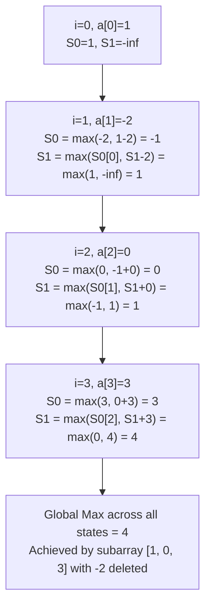

# Guided Example: Maximum Subarray Sum with One Deletion

## 1. Problem Essence & Algorithmic Mental Model

In classic algorithmic analysis, Kadane's algorithm computes the maximum contiguous subarray sum of an array in $\mathcal{O}(N)$ time by maintaining a single running state. Here, we are introduced to a structural relaxation: we may choose to delete **at most one** element from the chosen contiguous subarray, provided the resulting subarray remains strictly non-empty. Our goal is to find the maximum possible sum obtainable under this relaxed rule.

Consider the array $[1, -2, 0, 3]$.
- If no element is deleted, the maximum subarray is $[1, -2, 0, 3]$, which sums to $1 - 2 + 0 + 3 = 2$, or the subsegment $[0, 3]$ summing to 3.
- If we choose to delete the negative element $-2$, the remaining elements concatenate into $[1, 0, 3]$, yielding a sum of $1 + 0 + 3 = 4$.

Why can we not simply find the maximum subarray using Kadane's algorithm and delete its minimum element?
Because the optimal deleted element might lie outside what a standard Kadane scan would have considered a promising window. For instance, a very large negative valley might cause standard Kadane to prematurely reset its accumulator to 0, completely missing an enormous positive surge on the other side that would have been reachable had the single negative barrier been excised.

To capture this interaction correctly, we model the problem as a **Multi-State Markovian Decision Process** across the array:
At each element $arr[i]$, the active subarray is either:
1. In state **Zero-Deleted**: no elements have been skipped yet.
2. In state **One-Deleted**: exactly one previous element was excised.

```
State Machine Transition at index i:

           [Start Fresh / arr[i]]
                    │
                    ▼
           ┌─────────────────┐  Delete arr[i]   ┌─────────────────┐
           │   Zero-Deleted  │ ───────────────> │   One-Deleted   │
           │      State      │                  │      State      │
           └─────────────────┘                  └─────────────────┘
                    │                                    │
              Keep arr[i]                          Keep arr[i]
                    │                                    │
                    ▼                                    ▼
           [Extend Zero-Del]                    [Extend One-Del]
```

---

## 2. Mathematical Formalism & Invariants

Let $A = [a_0, a_1, \dots, a_{n-1}]$ be the input sequence of length $n \ge 1$.

### State Definitions
For each index $i \in [0, n-1]$, define:
- $S_0[i]$: Maximum sum of a contiguous, non-empty subarray ending strictly at index $i$, containing **zero** deleted elements.
- $S_1[i]$: Maximum sum of a contiguous, non-empty subarray ending strictly at index $i$, containing **exactly one** deleted element.

### State Transition Equations
For the zero-deletion state:
$$S_0[i] = \max(a_i, S_0[i-1] + a_i)$$
This is identical to classic Kadane's recurrence: either initiate a fresh subarray containing only $a_i$, or append $a_i$ to the optimal zero-deletion subarray ending at $i-1$.

For the one-deletion state:
$$S_1[i] = \max(S_0[i-1], S_1[i-1] + a_i)$$
Here, two mutually exclusive operational choices exist:
1. **Delete current element $a_i$**: We inherit the valid zero-deletion subarray ending at $i-1$ ($S_0[i-1]$), and drop element $a_i$. (Note: for the subarray to end effectively at $i$ with $a_i$ deleted, $i \ge 1$).
2. **Retain current element $a_i$**: The single permitted deletion occurred earlier, so we append $a_i$ to the one-deletion subarray ending at $i-1$ ($S_1[i-1] + a_i$).

### Initial Boundary Conditions
At the first element ($i = 0$):
- $S_0[0] = a_0$ (the single element $a_0$ is chosen).
- $S_1[0] = -\infty$ (we cannot delete $a_0$ because the resulting subarray would be empty, violating the non-empty requirement).

### Global Objective Function
The global maximum is the supremum over all valid subarray endpoints:
$$\text{MaxSum} = \max_{0 \le i < n} \left( S_0[i], S_1[i] \right)$$

---

## 3. Concrete Example Execution & State Evolution

Consider the sequence $A = [1, -2, 0, 3]$ of length $n = 4$.

### Detailed State Machine Progression

| Index $i$ | Element $a_i$ | Calculation of $S_0[i]$ | Zero-Del $S_0[i]$ | Calculation of $S_1[i]$ | One-Del $S_1[i]$ | Running Global Maximum |
|---|---|---|---|---|---|---|
| 0 | 1 | Single element initialization | 1 | Cannot delete only element | $-\infty$ | 1 |
| 1 | -2 | $\max(-2, 1 + (-2)) = \max(-2, -1)$ | -1 | $\max(S_0[0], S_1[0] + a_1) = \max(1, -\infty)$ | 1 | 1 |
| 2 | 0 | $\max(0, -1 + 0) = \max(0, -1)$ | 0 | $\max(S_0[1], S_1[1] + 0) = \max(-1, 1 + 0)$ | 1 | 1 |
| 3 | 3 | $\max(3, 0 + 3) = \max(3, 3)$ | 3 | $\max(S_0[2], S_1[2] + 3) = \max(0, 1 + 3)$ | 4 | **4** |



### Analysis of the Optimal Path
At index 3, $S_1[3] = 4$ is achieved by taking $S_1[2] + 3 = 1 + 3 = 4$.
Tracing backward:
- At index 2: $S_1[2] = 1$ was formed by extending $S_1[1] + 0 = 1 + 0 = 1$.
- At index 1: $S_1[1] = 1$ was formed by deleting $a_1 = -2$ from $S_0[0] = 1$.
- At index 0: $S_0[0] = 1$ was formed by picking $a_0 = 1$.

The underlying sequence of kept elements is $[a_0, a_2, a_3] = [1, 0, 3]$, giving a sum of $1 + 0 + 3 = 4$.

---

## 4. Multi-Approach Comparison & Trade-Offs

| Dimension | Brute-Force Deletion Enumeration | Bidirectional Prefix/Suffix Arrays | Two-State Rolling DP (Optimal) |
|---|---|---|---|
| **Strategy** | Try deleting each index $k$, run Kadane | Build $L[i]$ from left, $R[i]$ from right | Single forward pass updating 2 scalar states |
| **Time Complexity** | $\mathcal{O}(N^2)$ | $\mathcal{O}(N)$ | $\mathcal{O}(N)$ |
| **Auxiliary Memory** | $\mathcal{O}(1)$ | $\mathcal{O}(N)$ ($2N$ integers) | $\mathcal{O}(1)$ ($2$ scalar variables) |
| **Cache Friendliness** | Extremely poor (quadratic scans) | Two array passes + combination pass | Perfect linear streaming cache locality |
| **Implementation Footprint**| Nested loops | Multiple pre-allocation loops | 6 lines of rolling arithmetic |

```
Bidirectional Array Layout:
Left[i]:   Max subarray ending at index i
Right[i]:  Max subarray starting at index i
Deleting index k: Sum = Left[k-1] + Right[k+1]

Rolling State Layout:
Just two integers: (s0, s1) streaming through the array!
```

---

## 5. Algorithmic Edge Cases & Boundary Analysis

| Scenario | Input Example | Expected Output | Critical Mechanism |
|---|---|---|---|
| **All Negative Elements** | `[-5, -2, -8]` | -2 | $S_1$ cannot delete the only negative number to leave an empty subarray. The maximum single element ($-2$) must be selected without deletion. |
| **Single Element Array** | `[7]` or `[-3]` | 7 or -3 | At length 1, zero deletions are permitted because deleting leaves 0 elements. Returns $a_0$. |
| **All Positive Elements** | `[1, 2, 3, 4]` | 10 | Deleting any element strictly decreases the sum. $S_0$ dominates throughout; returns full array sum. |
| **Isolated Large Negative Pit** | `[100, -50, 100]` | 200 | Deleting $-50$ bridges the two $100$s into a single subarray of sum 200. |
| **Zero Values** | `[0, -1, 0]` | 0 | Subarray `[0]` yields sum 0. Deleting $-1$ bridges the two zeros to yield $0 + 0 = 0$. |

---

## 6. Mathematical Verification & Complexity Derivation

Let $N = |A|$ be the length of the input array.

### Single-Pass Rolling State Algorithm Analysis:
1. **Initialization**:
   - Setting $s_0 = a_0$, $s_1 = -\infty$, and $\text{max\_sum} = a_0$ takes $\mathcal{O}(1)$ time and memory.
2. **Loop Iterations**:
   - The loop runs for indices $i = 1$ to $N-1$ ($N-1$ total iterations).
   - In each iteration:
     - Compute new $s_1$: $\max(s_0, s_1 + a_i)$ (2 arithmetic ops, 1 comparison).
     - Compute new $s_0$: $\max(a_i, s_0 + a_i)$ (1 addition, 1 comparison).
     - Update global answer: $\max(\text{max\_sum}, s_0, s_1)$.
   - Each iteration strictly executes a fixed constant number of elementary operations ($\mathcal{O}(1)$).
3. **Total Work**:
   $$(N - 1) \times \mathcal{O}(1) = \mathcal{O}(N)$$

### Space Complexity:
- The algorithm retains only four scalar variables: `s0`, `s1`, `next_s1`, `max_sum`.
- No dynamic memory or array allocations are used.
- **Total Space Complexity:** $\mathcal{O}(1)$ constant auxiliary space.

---

## 7. Synthesis & Strategic Takeaways

1. **State-Space Expansion for Budgeted Skips**: When an optimization problem introduces a limited allowance for an abnormal action (such as skipping/deleting up to $K$ elements), creating $K+1$ parallel recurrence states naturally models the system without backtracking.
2. **Enforcing Non-Empty Constraints via Boundary Invariants**: Initializing the deletion state to $-\infty$ at index 0 guarantees that an empty set is never considered a valid candidate, naturally upholding the non-empty requirement without ad-hoc branch logic.
3. **Equivalence of Forward-Backward Splitting and Forward State Machines**: Splitting at index $k$ via $L[k-1] + R[k+1]$ provides excellent conceptual intuition, but the dual-state forward DP compresses the identical computational invariant into an $\mathcal{O}(1)$ memory streaming algorithm.
