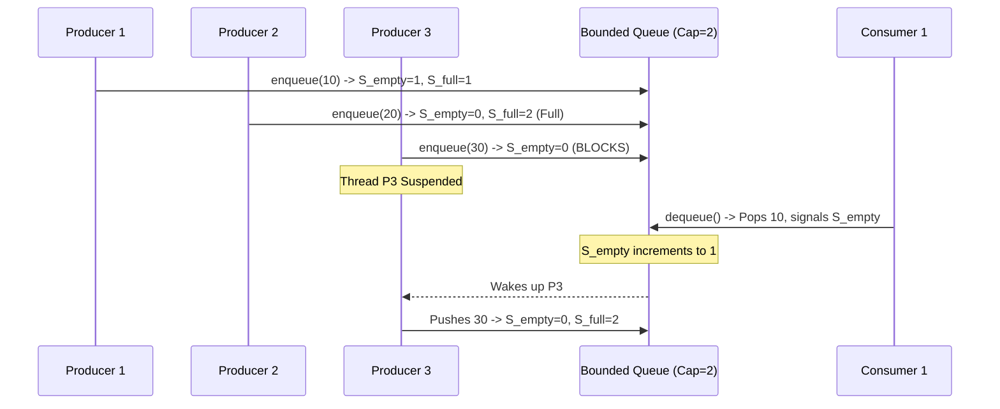

# Guided Example: Design Bounded Blocking Queue

## 1. Problem Essence & Algorithmic Mental Model

In concurrent systems programming and operating systems design, the **Bounded Buffer Problem** (often termed the Producer-Consumer pattern) represents the canonical synchronization archetype. We must design a thread-safe FIFO (First-In, First-Out) queue with a strictly bounded maximum capacity $C$. Multiple producer threads asynchronously invoke $\text{enqueue}(x)$, while multiple consumer threads asynchronously invoke $\text{dequeue}()$.

The coordination protocol enforces two blocking invariants:
1. **Full Buffer Suspension (Backpressure)**: If a producer thread invokes $\text{enqueue}$ when the internal queue already holds $C$ elements, the calling thread must suspend its execution (block) until a consumer thread removes at least one element, creating an open slot.
2. **Empty Buffer Suspension**: If a consumer thread invokes $\text{dequeue}$ when the queue holds $0$ elements, the calling thread must block until a producer thread inserts at least one element.
3. **FIFO Ordering & Atomicity**: Elements must emerge in the exact order they were enqueued, and concurrent mutations must never corrupt the internal linked buffer or produce lost updates.

Two classic synchronization mechanisms realize this protocol:
- **Dual Counting Semaphores**: One counting semaphore tracks available empty slots (initialized to $C$), while a second semaphore tracks occupied data slots (initialized to $0$). Producers acquire empty permits and release full permits; consumers acquire full permits and release empty permits.
- **Mutex with Dual Condition Variables**: A mutual exclusion lock serializes queue modifications, paired with two condition variables: $\text{not\_full}$ (signaled when capacity frees up) and $\text{not\_empty}$ (signaled when an item arrives).

```
Capacity C = 3:
Producer Threads:  P1, P2  ────────> [ e1 | e2 | e3 ] ────────> Consumer Threads: C1, C2
                                      Queue Full!
                             P1 attempts enqueue -> BLOCKS
                             C1 invokes dequeue  -> Consumes e1, Wakes P1!
```

---

## 2. Mathematical Formalism & Invariants

Let $Q$ denote the ordered sequence of elements, and let $C \in \mathbb{Z}^+$ be the maximum capacity.
At any point in time $t$, let $|Q(t)|$ be the number of active elements.

### Safety Invariants
1. **Capacity Invariant**:
   $$0 \le |Q(t)| \le C \quad \forall t \ge 0$$
2. **First-In First-Out Invariant**:
   If item $A$ was successfully enqueued at time $t_A$ and item $B$ was enqueued at time $t_B$ with $t_A < t_B$, then $A$ must be dequeued before $B$.
3. **Mutual Exclusion Invariant**:
   At most one thread may mutate the underlying container pointers at any instant.

### Semaphore Invariant Model
Let $S_{\text{empty}}$ and $S_{\text{full}}$ be counting semaphores initialized to:
$$S_{\text{empty}} = C, \quad S_{\text{full}} = 0$$

For any valid execution history up to time $t$:
- Let $E_{\text{acq}}$ and $E_{\text{rel}}$ denote the total completed acquisitions and releases on $S_{\text{empty}}$.
- Let $F_{\text{acq}}$ and $F_{\text{rel}}$ denote the total completed acquisitions and releases on $S_{\text{full}}$.

The semaphore counting guarantees:
$$S_{\text{empty}}(t) = C - E_{\text{acq}}(t) + F_{\text{acq}}(t) = C - |Q(t)|$$
$$S_{\text{full}}(t) = 0 + E_{\text{acq}}(t) - F_{\text{acq}}(t) = |Q(t)|$$
Summing both values yields the conservation law:
$$S_{\text{empty}}(t) + S_{\text{full}}(t) = C$$
This conservation law mathematically proves that deadlocks due to resource exhaustion cannot occur as long as $C > 0$.

---

## 3. Concrete Example Execution & State Evolution

Consider a queue with capacity $C = 2$ shared among four threads:
- Producers: Thread $P_1$ (enqueues 10), Thread $P_2$ (enqueues 20), Thread $P_3$ (enqueues 30)
- Consumer: Thread $C_1$ (calls dequeue)

Initial State:
- Buffer $Q = []$
- $S_{\text{empty}} = 2$
- $S_{\text{full}} = 0$

### Concurrency Interleaving Trace

| Chronological Step | Active Thread | Operation Attempted | Semaphore Action | Buffer State $Q$ | Thread Status |
|---|---|---|---|---|---|
| Step 1 | $P_1$ | $\text{enqueue}(10)$ | Acquire $S_{\text{empty}}$ ($2 \to 1$), Release $S_{\text{full}}$ ($0 \to 1$) | $[10]$ | Completes successfully |
| Step 2 | $P_2$ | $\text{enqueue}(20)$ | Acquire $S_{\text{empty}}$ ($1 \to 0$), Release $S_{\text{full}}$ ($1 \to 2$) | $[10, 20]$ | Completes successfully (Buffer Full) |
| Step 3 | $P_3$ | $\text{enqueue}(30)$ | Attempts Acquire $S_{\text{empty}}$ ($0 \to \text{blocks}$) | $[10, 20]$ | **Blocked / Suspended** on $S_{\text{empty}}$ |
| Step 4 | $C_1$ | $\text{dequeue}()$ | Acquire $S_{\text{full}}$ ($2 \to 1$), Release $S_{\text{empty}}$ ($0 \to 1$) | $[20]$ | Pops 10, unblocks $P_3$! |
| Step 5 | $P_3$ | Resumes $\text{enqueue}(30)$ | Consumes released $S_{\text{empty}}$ ($1 \to 0$), Release $S_{\text{full}}$ ($1 \to 2$) | $[20, 30]$ | Pushes 30, completes |



### State Evolution of Synchronization Primitives

| Event | Queue Size $|Q|$ | $S_{\text{empty}}$ Count | $S_{\text{full}}$ Count | Blocked Producers | Blocked Consumers |
|---|---|---|---|---|---|
| Initialization | 0 | 2 | 0 | None | None |
| After $P_1$ finishes | 1 | 1 | 1 | None | None |
| After $P_2$ finishes | 2 | 0 | 2 | None | None |
| After $P_3$ attempts | 2 | 0 | 2 | $\{P_3\}$ | None |
| After $C_1$ finishes | 1 | 1 | 1 | None ($P_3$ unblocked) | None |
| After $P_3$ completes | 2 | 0 | 2 | None | None |

---

## 4. Multi-Approach Comparison & Trade-Offs

| Synchronization Mechanism | Dual Counting Semaphores | Monitor Pattern (Mutex + Condition Variables) | Lock-Free Ring Buffer (CAS Atomic) |
|---|---|---|---|
| **Underlying Primitives** | Two OS/Kernel Semaphores | 1 Mutex Lock, 2 Condition Variables | Atomic load/store + Compare-And-Swap |
| **Blocking Mechanism** | OS kernel wait queue | Kernel thread sleep / wait queue | Busy-spin (spinning loop) |
| **Overhead on Contention**| Minimal; kernel deschedules thread | Minimal; efficient OS sleep | High CPU utilization if spin-waiting |
| **Spurious Wakeup Safety** | Immune (semaphores preserve permit counts) | Requires `while` loop re-check on predicate | Not applicable |
| **Correctness Proof** | Immediate via permit conservation | Requires predicate invariant verification | Complex memory barriers (ABA problem) |

```
Condition Variable vs Semaphore Flow:

Condition Variable Protocol:
[Lock Mutex] -> while (size == Cap) { wait(not_full, Mutex) } -> [Push] -> [Signal(not_empty)] -> [Unlock]

Counting Semaphore Protocol:
[Acquire(empty_slots)] -> [Mutex Push] -> [Release(full_slots)]
```

---

## 5. Algorithmic Edge Cases & Boundary Analysis

| Scenario | Condition | System Response & Correctness |
|---|---|---|
| **Zero-Capacity Initialization** | $C = 0$ | Prohibited by specification ($C \ge 1$); queue must allow at least 1 resident element. |
| **Multiple Blocked Consumers** | Multiple threads call $\text{dequeue}$ on empty queue | All callers suspend on $S_{\text{full}}$. When a producer inserts an item, exactly one consumer is unblocked. |
| **Spurious Wakeups (Monitors)** | OS wakes thread without matching signal | Guarded by `while (len == capacity)` loop re-evaluating condition before proceeding. |
| **Burst of Enqueues Exceeding Capacity** | 100 threads enqueue to capacity 5 queue | Exactly 5 enqueues succeed immediately; remaining 95 threads enter the FIFO wait queue in the kernel. |
| **Interleaved Concurrent `size()` Calls** | Consumer reading size during active push | Protected by mutex locking or atomic size counter, preventing half-written reads. |

---

## 6. Mathematical Verification & Complexity Derivation

Let $C$ denote the capacity of the queue, $P$ be the number of active producers, and $K$ be the number of active consumers.

### Operation Costs:
1. **$\text{enqueue}(element)$**:
   - Acquiring a semaphore or mutex lock: $\mathcal{O}(1)$ time (system call or futex instruction).
   - Appending to a doubly-linked list or circular array: $\mathcal{O}(1)$ pointer operations.
   - Releasing the counterpart synchronization primitive: $\mathcal{O}(1)$ time.
   - Time complexity: $\mathcal{O}(1)$ operations per invocation (excluding indefinite suspension time while waiting for available capacity).
2. **$\text{dequeue}()$**:
   - Acquiring permit and popping front node: $\mathcal{O}(1)$ time.
   - Time complexity: $\mathcal{O}(1)$ operations per invocation.
3. **$\text{size}()$**:
   - Reading the length of the internal container under lock: $\mathcal{O}(1)$ time.

### Space Complexity:
- The internal buffer holds at most $C$ items at any moment.
- The synchronization primitives (semaphores, mutexes, condition variables) require $\mathcal{O}(1)$ system resources.
- **Total Space Complexity:** $\mathcal{O}(C)$ auxiliary memory proportional to the bounded capacity.

---

## 7. Synthesis & Strategic Takeaways

1. **Separation of Concerns in Concurrency**: Counting semaphores decouple resource tracking (capacity counting) from memory protection (mutual exclusion). Using one semaphore for empty capacity and one for filled elements guarantees progress without complex state flags.
2. **The While-Loop Re-check Rule**: In monitor-based designs, always use `while (condition)` instead of `if (condition)` around condition variable waits. This defensively guards against spurious wakeups and thread-scheduling races where another thread consumes the slot between signal and wake.
3. **Permit Duality Principle**: In any bounded producer-consumer pipeline, the sum of remaining producer permits and consumer permits is an invariant constant equal to capacity ($S_{\text{empty}} + S_{\text{full}} = C$). This structural balance prevents buffer overflows and resource starvation.
