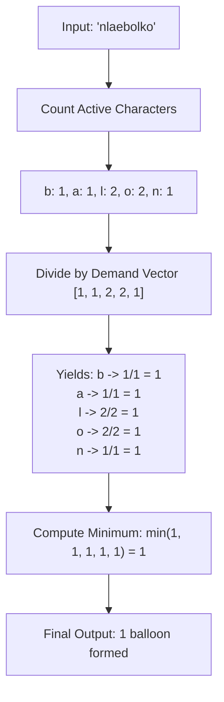

# Guided Example: Maximum Number of Balloons

## 1. Problem Essence & Algorithmic Mental Model

Given a string $\text{text}$ of lowercase English letters, we wish to determine the maximum number of instances of the word `"balloon"` that can be simultaneously formed using the characters available in $\text{text}$. Each character in the input string may be assigned to at most one formed word.

This problem is an exact computational analog of **Stoichiometric Limiting Reagents** in chemistry:
To synthesize one molecule of the target compound `"balloon"`, a precise multiset ratio of elementary components is consumed:
- 1 unit of `'b'`
- 1 unit of `'a'`
- 2 units of `'l'`
- 2 units of `'o'`
- 1 unit of `'n'`

All other lowercase English characters present in $\text{text}$ (such as `'c'`, `'d'`, `'z'`) are inert spectators that contribute nothing toward the synthesis. The maximum number of complete `"balloon"` words that can be assembled is strictly dictated by the most scarce constituent relative to its required stoichiometric coefficient:

$$\text{MaxInstances} = \min\left( \text{count}('b'), \text{count}('a'), \lfloor \frac{\text{count}('l')}{2} \rfloor, \lfloor \frac{\text{count}('o')}{2} \rfloor, \text{count}('n') \right)$$

No dynamic programming, graph matching, or backtracking is necessary; computing the empirical frequency distribution of the five active characters yields the optimal answer instantly.

```
Available Inventory in text:
'b': 3  --> can form 3 / 1 = 3
'a': 4  --> can form 4 / 1 = 4
'l': 5  --> can form 5 / 2 = 2  <-- Bottleneck / Limiting Reagent!
'o': 6  --> can form 6 / 2 = 3
'n': 2  --> can form 2 / 1 = 2

Limiting factor is 'l' (or 'n'): at most 2 instances can be created!
```

---

## 2. Mathematical Formalism & Invariants

Let $\Sigma = \{a, b, \dots, z\}$. Let $W = \text{"balloon"}$ be the target string of length $|W| = 7$.
The multiset demand vector $\mathbf{d} \in \mathbb{Z}_{\ge 0}^5$ over the active alphabet $\Omega = (b, a, l, o, n)$ is:
$$\mathbf{d} = (d_b, d_a, d_l, d_o, d_n) = (1, 1, 2, 2, 1)$$

### Input Frequency Vector
Given input string $T$, define the empirical count function $f: \Omega \to \mathbb{Z}_{\ge 0}$:
$$f(c) = \sum_{i=0}^{|T|-1} [T[i] = c]$$
Let the supply vector be $\mathbf{s} = (f(b), f(a), f(l), f(o), f(n))$.

### Optimization Problem Formulation
We wish to maximize the integer scalar $k \ge 0$ such that:
$$k \cdot \mathbf{d} \le \mathbf{s}$$
where $\le$ denotes component-wise inequality across all 5 dimensions:
$$\forall c \in \Omega, \quad k \cdot d_c \le f(c)$$

### Closed-Form Solution
Because each constraint $k \le \lfloor \frac{f(c)}{d_c} \rfloor$ is independent, the supremum is the component-wise minimum:
$$k^* = \min_{c \in \Omega} \lfloor \frac{f(c)}{d_c} \rfloor = \min\left( f(b), f(a), \lfloor \frac{f(l)}{2} \rfloor, \lfloor \frac{f(o)}{2} \rfloor, f(n) \right)$$

---

## 3. Concrete Example Execution & State Evolution

Consider the input string $T = \text{"nlaebolko"}$.

### Frequency Accumulation Trace

| Index $i$ | Character $T[i]$ | Is Active in $\Omega$? | Updated Count $f(b)$ | Updated Count $f(a)$ | Updated Count $f(l)$ | Updated Count $f(o)$ | Updated Count $f(n)$ |
|---|---|---|---|---|---|---|---|
| Initial | - | - | 0 | 0 | 0 | 0 | 0 |
| 0 | `'n'` | Yes | 0 | 0 | 0 | 0 | 1 |
| 1 | `'l'` | Yes | 0 | 0 | 1 | 0 | 1 |
| 2 | `'a'` | Yes | 0 | 1 | 1 | 0 | 1 |
| 3 | `'e'` | No (inert) | 0 | 1 | 1 | 0 | 1 |
| 4 | `'b'` | Yes | 1 | 1 | 1 | 0 | 1 |
| 5 | `'o'` | Yes | 1 | 1 | 1 | 1 | 1 |
| 6 | `'l'` | Yes | 1 | 1 | 2 | 1 | 1 |
| 7 | `'k'` | No (inert) | 1 | 1 | 2 | 1 | 1 |
| 8 | `'o'` | Yes | 1 | 1 | 2 | 2 | 1 |



### Component-Wise Yield Calculation

| Character $c$ | Available Supply $f(c)$ | Demand Coefficient $d_c$ | Component Yield $\lfloor f(c) / d_c \rfloor$ | Is Bottleneck? |
|---|---|---|---|---|
| `'b'` | 1 | 1 | $1 / 1 = 1$ | Yes (tied) |
| `'a'` | 1 | 1 | $1 / 1 = 1$ | Yes (tied) |
| `'l'` | 2 | 2 | $2 / 2 = 1$ | Yes (tied) |
| `'o'` | 2 | 2 | $2 / 2 = 1$ | Yes (tied) |
| `'n'` | 1 | 1 | $1 / 1 = 1$ | Yes (tied) |
| Global Minimum | - | - | **1** | All components balanced |

Result: Exactly **1** instance of `"balloon"` can be created.

---

## 4. Multi-Approach Comparison & Trade-Offs

| Metric / Dimension | Simulated Greedy Consumption | Full Alphabet Frequency Map (26) | Direct 5-Bucket Counter (Optimal) |
|---|---|---|---|
| **Strategy** | Repeatedly search and subtract `"balloon"` chars | Tally all 26 letters, inspect 5 | Tally only $\{b, a, l, o, n\}$ |
| **Time Complexity** | $\mathcal{O}(K \cdot N)$ where $K$ is word count | $\mathcal{O}(N + 26)$ | $\mathcal{O}(N)$ strictly single pass |
| **Space Complexity** | Mutates original string / auxiliary flags | $\mathcal{O}(26)$ integer table | $\mathcal{O}(1)$ five scalar registers |
| **Arithmetic Overhead** | String deletion / index searching | Array lookups for all letters | 5 filter checks + 2 bitwise right-shifts |
| **Scalability** | Degrades as $K$ increases | Constant extra work | Constant optimal work |

```
Execution Pipeline Comparison:

Simulation: [Find 'b'] -> [Find 'a'] -> [Find 'l'] -> ... (Repeats K times, highly inefficient)

Stoichiometric Reduction:
[Single Scan of Text] ---> [Five Counters] ---> [min(b, a, l>>1, o>>1, n)] (Instant!)
```

---

## 5. Algorithmic Edge Cases & Boundary Analysis

| Boundary Case | Input Text | Expected Result | Algorithmic Rationale |
|---|---|---|---|
| **Missing Single Critical Letter** | `"balloo"` (no `'n'`) | 0 | $f(n) = 0 \implies \min(\dots, 0) = 0$. Missing one required character precludes forming any complete word. |
| **Odd Count of Double Letters** | `'l'` count = 3, `'o'` count = 3 | 1 | $\lfloor 3 / 2 \rfloor = 1$. The third `'l'` and `'o'` cannot form a word without another companion pair. |
| **Zero Active Characters** | `"xyzqwerty"` | 0 | All active counts are 0; minimum evaluates cleanly to 0. |
| **Exact Multiple Balance** | `"balloonballoon"` | 2 | Counts are $(2, 2, 4, 4, 2)$; yields $(2, 2, 2, 2, 2) \implies \min = 2$. |
| **Short Text** | `"bal"` (length $< 7$) | 0 | Since $\lvert T \rvert < 7$, cannot satisfy $\sum d_c = 7$; evaluated directly to 0. |

---

## 6. Mathematical Verification & Complexity Derivation

Let $N = |\text{text}|$ be the length of the input string.

### Processing Phases:
1. **Frequency Tallying**:
   - We scan through the characters of $\text{text}$ from index $0$ to $N-1$.
   - For each character, we either increment one of 5 dedicated counters (or index into a fixed 26-element array): exactly 1 operation per character.
   - Total tallying operations: $\mathcal{O}(N)$.
2. **Division and Minimum Extraction**:
   - Compute $f(l) // 2$ (executed via a single machine instruction: bitwise right-shift $f(l) \gg 1$).
   - Compute $f(o) // 2$ ($f(o) \gg 1$).
   - Compute the minimum across 5 scalar values: 4 binary comparison operations.
   - Total evaluation operations: $\mathcal{O}(1)$.

### Complexity Summary:
- **Total Time Complexity:** $\mathcal{O}(N)$ linear time.
- **Total Space Complexity:** $\mathcal{O}(1)$ auxiliary memory (using only 5 integer counters or a fixed 26-element array).

---

## 7. Synthesis & Strategic Takeaways

1. **Multiset Quotient Mapping**: When measuring how many times a fixed pattern $P$ can be formed from an unordered multiset of tokens $T$, the global answer is always the bottleneck ratio: $\min_{c \in P} \lfloor \frac{\text{count}_T(c)}{\text{count}_P(c)} \rfloor$.
2. **Bitwise Halving for Powers of Two**: For demand coefficients that are powers of 2 (such as 2 for `'l'` and `'o'`), floor integer division $\lfloor x / 2 \rfloor$ simplifies to the bitwise shift operator `x >> 1`, executing in a single clock cycle without division latency.
3. **Irrelevant Symbol Invariance**: In frequency-constrained problems, characters not appearing in the target specification have a demand coefficient of zero. Filtering them out or ignoring them preserves the global solution without maintaining extraneous state.
