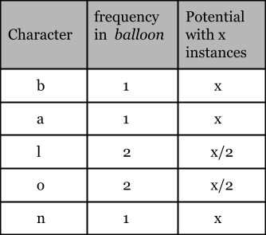

## Solution

---

### Overview

This problem can be interestingly related to production management. Assume there is an industry that produces a product `X`. The product `X` can be produced by assembling one instance of each of five different parts. We have some fixed quantity of each of these parts, then the maximum number of product `X` that can be produced will be equal to the quantity of that part which is available in the least quantity. This least available part is known as the bottleneck resource.

In this problem, the product `X` is the string $balloon$ and the five parts are the characters $b$, $a$, $l$, $o$, and $n$.
<br/>

---

### Approach 1: Counting Characters

**Intuition**

The word $balloon$ consists of five different characters with counts of `{'b':1, 'a':1, 'l':2, 'o':2, 'n':1}`. The first thing to note is that in order to find the number of instances of $balloon$ that can be produced by any given string `text` we only need to count the above five characters and the remaining twenty-one lowercase English letters can be ignored.

Now we will observe each of these five characters in isolation. We define the `potential` of a character as the number of times that $balloon$ can be produced, assuming there is an infinite supply of other characters.

For instance, to find the `potential` of character $b$, which has a limited quantity equal to $x$, then the answer is $x$. We cannot form more than $x$ instances as we need one $b$ to produce each instance of $balloon$. Similarly, for character $l$, with a limited quantity of $x$ the `potential` will be $x/2$ as we need two instances of $l$ to produce each instance of $balloon$.

After we find the `potential` of all five characters, we can make use of each character's `potential` to find the maximum number of $balloon$ strings that we can produce. The point to note here is that the production of the word $balloon$ depends on the bottleneck character. As in the above case, despite having an infinite capacity of other characters, we can only form $x$ instances of $balloon$ because character $b$ is the bottleneck.

**Algorithm**

Per the discussion above, the algorithm is: Find the `potential` of each of the five characters in isolation and then find the bottleneck character among them. The table below shows the `potential` for each character given $x$ instances of the character and an infinite supply of other characters.



Now that we have the `potential` of each character, we can find the bottleneck character (the one with the lowest `potential`).

**Implementation**

1. Store the frequency of all the five characters in the given string `text`.
2. Find the `potential` of each of the five characters.
3. Return the minimum `potential` of the five characters.

The code below prioritizes readability; it could be written more succinctly by using an array (which is discussed in the next approach).

```cpp
class Solution {
public:
    int maxNumberOfBalloons(string text) {
        int bCount = 0, aCount = 0, lCount = 0, oCount = 0, nCount = 0;

        // Count the frequencey of all the five characters
        for (int i = 0; i < text.length(); i++) {
            if (text[i] == 'b') {
                bCount++;
            } else if (text[i] == 'a') {
                aCount++;
            } else if (text[i] == 'l') {
                lCount++;
            } else if (text[i] == 'o') {
                oCount++;
            } else if (text[i] == 'n') {
                nCount++;
            }
        }

        // Find the potential of each character.
        // Except for 'l' and 'o' the potential is equal to the frequency.
        lCount = lCount / 2;
        oCount = oCount / 2;

        // Find the bottleneck.
        return min({bCount, aCount, lCount, oCount, nCount});
    }
};
```

**Complexity Analysis**

Here $N$ is equal to the length of `text`.

* Time complexity: $O(N)$

  We iterate over all the characters of string `text` which requires $N$ operations.

* Space complexity: $O(1)$

  All we need is the $5$ variables to store the frequency of characters. Hence the space complexity is constant.

<br/>

---

### Approach 2: Generalized Solution using an Array

**Intuition**

As a follow-up exercise, let's consider how we can approach this problem if the word is not guaranteed to be $balloon$. Suppose we are given an arbitrary string `pattern` instead of $balloon$ then we can use the same counting characters approach, except we must do so in a more generalized way. Close observation of the previous approach reveals that the `potential` of each character is equal to the number of instances in `text` divided by the number of instances in `pattern` ($balloon$ in the previous approach). So we just need to find the frequency of all the letters in the strings `text` and `pattern`. Then the minimum `potential` of a character will be the answer.

**Algorithm**
1. Store the frequency of all the characters in `text` in `freqInText` and the frequency of all the characters in `pattern` in `freqInPattern`.
2. Find the potential of all the lowercase English letters. The potential will be equal to its frequency in `text` divided by its frequency in `pattern`.
3. Return the minimum potential of a character.

**Implementation**

```python
class Solution:
    def maxNumberOfBalloons(self, text: str) -> int:
        pattern_str = 'balloon'
        pattern_elem_freq = Counter(pattern_str)
        text_elem_freq = Counter(text)
        max_pattern_count = math.inf

        for char in pattern_str:
            max_pattern_count = min(max_pattern_count, text_elem_freq[char] // pattern_elem_freq[char])

        return max_pattern_count
```

**Complexity Analysis**

Here $N$ equals the length of `text`, $M$ equals the length of `pattern`, and $K$ equals the maximum possible number of distinct letters in `pattern`.

* Time complexity: $O(N + M)$

     We traverse over `text` having length $N$ and over the string `pattern` of length $M$ to find the frequency of each character in each string.  Lastly, we traverse over the frequency arrays of length $K$ to find the bottleneck character.  Since this problem only uses lowercase English letters, $K$ is fixed at $26$. Hence, we can consider the space complexity to be $O(N + M)$.

* Space complexity: $O(1)$

     The integer arrays used to store the frequency of characters in `text` and `pattern` each require $O(K)$ space.  Since this problem only uses lowercase English letters, $K$ is fixed at $26$. Hence, we can consider the space complexity to be constant.

<br/>

---