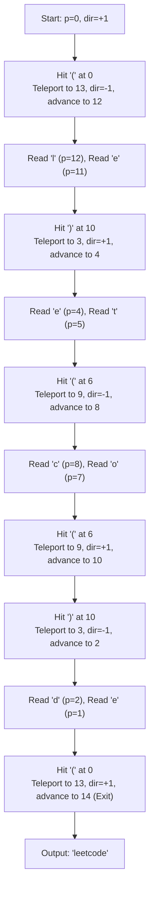

# Guided Example: Reverse Substrings Between Each Pair of Parentheses

## 1. Problem Essence & Algorithmic Mental Model

Given a string $s$ composed of lowercase English letters and balanced parentheses, our goal is to reverse the characters within every pair of matching parentheses, resolving the innermost pairs first and working outward. The final returned string must contain only lowercase letters with all parenthesis tokens stripped.

Consider the nested string `"(u(love)i)"`:
1. The innermost parentheses enclose `"love"`. Reversing this gives `"evol"`, transforming the expression to `"(uevoli)"`.
2. The outer parentheses enclose `"uevoli"`. Reversing this gives `"iloveu"`.
3. Stripping all parentheses leaves the final result `"iloveu"`.

The naive simulation uses an explicit stack: characters are pushed sequentially until a closing parenthesis `')'` is met, at which point characters are popped back to the matching `'('`, reversed, and re-inserted. While conceptually straightforward, in deeply nested structures like `"((((...))))"`, repeated physical reversals copy substrings up to $N/2$ times, degrading execution to $\mathcal{O}(N^2)$ quadratic time.

A far more elegant paradigm is the **Wormhole Teleportation Algorithm** ($\mathcal{O}(N)$ linear time):
Instead of physically moving and rewriting characters in memory, we treat matching parentheses as bidirectional portals ("wormholes").
1. In a single preprocessing pass, we record the partner index for every parenthesis: if `'('` sits at index $i$ and its matching `')'` sits at index $j$, then $\text{pair}[i] = j$ and $\text{pair}[j] = i$.
2. We then traverse the string with a single pointer $p$ and a directional velocity $d \in \{+1, -1\}$, starting at $p = 0$ with forward direction $d = +1$.
3. When pointer $p$ encounters an ordinary letter, we append it to the result and advance $p \leftarrow p + d$.
4. When pointer $p$ hits a parenthesis (whether `'('` or `')'`), we teleport across the wormhole:
   $$p \leftarrow \text{pair}[p]$$
   and immediately invert our traversal direction:
   $$d \leftarrow -d$$
   We then advance $p \leftarrow p + d$.
Each letter is visited and printed exactly once in the correct orientation, achieving optimal $\mathcal{O}(N)$ time.

```
String:  (  u  (  l  o  v  e  )  i  )
Index:   0  1  2  3  4  5  6  7  8  9

Matching Pairs: pair[0] = 9, pair[2] = 7

Wormhole Path:
Start at 0: Hit '(', jump to 9, flip direction to -1.
At 8: Read 'i' (dir -1).
At 7: Hit ')', jump to 2, flip direction to +1.
At 3, 4, 5, 6: Read 'l', 'o', 'v', 'e' (dir +1).
At 7: Hit ')', jump to 2, flip direction to -1.
At 1: Read 'u' (dir -1).
At 0: Hit '(', jump to 9, flip direction to +1.
Exit: Output assembled as "iloveu"!
```

---

## 2. Mathematical Formalism & Invariants

Let $S$ be a well-formed parenthesized string of length $n$.
Define the set of parenthesis indices:
$$\mathcal{P} = \{i \in [0, n-1] \mid S[i] \in \{\text{'('}, \text{')'}\}\}$$

### Parenthesis Pairing Map
Using standard Dyck-path parsing (prefix sum of $+1$ for `'('` and $-1$ for `')'`), each open parenthesis at $i$ has a unique matched closing parenthesis at $j > i$.
We define an involution $\pi: \mathcal{P} \to \mathcal{P}$ such that:
$$\pi(i) = j \quad \text{and} \quad \pi(j) = i \quad \implies \pi(\pi(k)) = k$$

### Traversal State Machine
At discrete time $t$, the traversal state is a tuple $(p_t, d_t) \in [0, n] \times \{+1, -1\}$.
- Initial state: $(p_0, d_0) = (0, +1)$.
- State transitions:
  $$\begin{cases}
  \text{Output } S[p_t], \quad (p_{t+1}, d_{t+1}) = (p_t + d_t, d_t) & \text{if } S[p_t] \notin \mathcal{P} \\
  (p_{t+1}, d_{t+1}) = (\pi(p_t) - d_t, -d_t) & \text{if } S[p_t] \in \mathcal{P}
  \end{cases}$$

### Reversal Parity Invariant
At any index $k \notin \mathcal{P}$, let $\text{depth}(k)$ denote the number of enclosing parenthesis pairs surrounding index $k$.
The orientation of character $S[k]$ in the final string is reversed if and only if $\text{depth}(k)$ is odd.
The wormhole traversal guarantees that every character $S[k]$ is visited with direction $d = +1$ if $\text{depth}(k)$ is even, and direction $d = -1$ if $\text{depth}(k)$ is odd.

---

## 3. Concrete Example Execution & State Evolution

Consider the string $S = \text{"(ed(et(oc))el)"}$.
Length $n = 14$.

### Matching Pair Preprocessing Trace

| Parenthesis Index | Character | Matching Index | Partner Character |
|---|---|---|---|
| 0 | `'('` | 13 | `')'` |
| 3 | `'('` | 10 | `')'` |
| 6 | `'('` | 9 | `')'` |
| 9 | `')'` | 6 | `'('` |
| 10 | `')'` | 3 | `'('` |
| 13 | `')'` | 0 | `'('` |



### Complete Step-by-Step Traversal Trace

| Step | Current Pointer $p$ | Character $S[p]$ | Action Taken | Direction $d$ | Next Pointer $p$ | Accumulated Output |
|---|---|---|---|---|---|---|
| 0 | 0 | `'('` | Jump to 13, flip direction | $-1$ | 12 | `""` |
| 1 | 12 | `'l'` | Emit `'l'` | $-1$ | 11 | `"l"` |
| 2 | 11 | `'e'` | Emit `'e'` | $-1$ | 10 | `"le"` |
| 3 | 10 | `')'` | Jump to 3, flip direction | $+1$ | 4 | `"le"` |
| 4 | 4 | `'e'` | Emit `'e'` | $+1$ | 5 | `"lee"` |
| 5 | 5 | `'t'` | Emit `'t'` | $+1$ | 6 | `"leet"` |
| 6 | 6 | `'('` | Jump to 9, flip direction | $-1$ | 8 | `"leet"` |
| 7 | 8 | `'c'` | Emit `'c'` | $-1$ | 7 | `"leetc"` |
| 8 | 7 | `'o'` | Emit `'o'` | $-1$ | 6 | `"leetco"` |
| 9 | 6 | `'('` | Jump to 9, flip direction | $+1$ | 10 | `"leetco"` |
| 10 | 10 | `')'` | Jump to 3, flip direction | $-1$ | 2 | `"leetco"` |
| 11 | 2 | `'d'` | Emit `'d'` | $-1$ | 1 | `"leetcod"` |
| 12 | 1 | `'e'` | Emit `'e'` | $-1$ | 0 | `"leetcode"` |
| 13 | 0 | `'('` | Jump to 13, flip direction | $+1$ | 14 | `"leetcode"` |
| End | 14 | Out of bounds | Terminate scan | - | - | **"leetcode"** |

---

## 4. Multi-Approach Comparison & Trade-Offs

| Dimension / Metric | Stack-Based Simulation | Recursive String Slicing | Wormhole Teleportation (Optimal) |
|---|---|---|---|
| **Time Complexity** | $\mathcal{O}(N^2)$ worst case | $\mathcal{O}(N^2)$ worst case | $\mathcal{O}(N)$ strictly linear |
| **Space Complexity** | $\mathcal{O}(N)$ character stack | $\mathcal{O}(N^2)$ substring copies | $\mathcal{O}(N)$ pair index array |
| **Data Movement** | Massive repeatedly copied substrings | Repeated memory reallocations | Zero string mutation; single emission pass |
| **Deep Nesting Performance** | Degrades severely on $N = 10^5$ | Stack overflow risk | Instantaneous execution |
| **Algorithmic Elegance** | Direct mechanical replication | Recursive structural decomposition | Topological graph traversal on Dyck paths |

```
Execution Comparison on 2000 Nested Pairs: "((((...a...))))"
- Stack Method: Copies the central character 2,000 times -> ~2,000,000 operations
- Wormhole Method: Teleports across portals 2,000 times, prints 'a' once -> ~4,000 operations
```

---

## 5. Algorithmic Edge Cases & Boundary Analysis

| Scenario | Input Example | Expected Behavior | Handling Mechanism |
|---|---|---|---|
| **No Parentheses Present** | `"abcdef"` | Returns `"abcdef"` unchanged | No parenthesis portal triggers; pointer advances linearly from $0$ to $N-1$ with $d = +1$. |
| **Single Isolated Pair** | `"(abcd)"` | Returns `"dcba"` | Enters at 0, jumps to 5, reads backward from 4 to 1, exits at 6. |
| **Adjacent Disjoint Pairs** | `"(ab)(cd)"` | Returns `"bacd"` | Reverses each component independently; resets to $+1$ forward motion between pairs. |
| **Empty String or Empty Pairs** | `"a()b"` | Returns `"ab"` | Wormhole portal jumps directly over the empty interval without emitting any characters. |
| **All Nested with No Letters Inside**| `"((()))"` | Returns `""` | Traverses portals back and forth without appending any characters to the output buffer. |

---

## 6. Mathematical Verification & Complexity Derivation

Let $N = |s|$ be the total number of characters in the input string.

### Phase 1: Parenthesis Pairing via Stack
1. We iterate through the string from index $0$ to $N-1$.
2. When encountering `'('`, its index is pushed onto an integer stack: $\mathcal{O}(1)$.
3. When encountering `')'`, the matching index is popped from the stack, and we assign:
   $$\text{pair}[\text{open}] = \text{close}, \quad \text{pair}[\text{close}] = \text{open}$$
   This takes $\mathcal{O}(1)$ operations per parenthesis.
4. Total preprocessing time: $\mathcal{O}(N)$ operations, with maximum stack depth bounded by $N/2$.

### Phase 2: Wormhole Traversal
1. The pointer $p$ initiates at $0$.
2. At each step:
   - If $s[p]$ is a letter, it is emitted to the output buffer and $p$ advances by $\pm 1$. Each of the $K \le N$ letters is emitted exactly once.
   - If $s[p]$ is a parenthesis, $p$ teleports to $\text{pair}[p]$, flips direction, and advances by $\pm 1$. Each parenthesis is visited at most twice.
3. Total steps during traversal: at most $2N$.
4. Total traversal time: $\mathcal{O}(N)$ operations.

### Complexity Summary:
- **Total Time Complexity:** $\mathcal{O}(N)$ strictly linear time.
- **Total Auxiliary Space Complexity:** $\mathcal{O}(N)$ to store the `pair` array and traversal stack.

---

## 7. Synthesis & Strategic Takeaways

1. **Virtualization of Reversal Operations**: Whenever a problem demands nested or repeated segment reversals, consider whether physically mutating the array is necessary. By introducing a directional velocity indicator $d \in \{+1, -1\}$ and jumping between interval boundaries, physical memory writes are eliminated entirely.
2. **Involutions in Paired Data Structures**: Matching bracket pairs form an involution ($\pi(\pi(x)) = x$). Involutions naturally support bidirectional traversal because entering from either direction cleanly maps to the opposite endpoint.
3. **From Quadratic Simulation to Linear Traversal**: Recognizing that each reversal merely switches the traversal direction between consecutive nested scopes unlocks the transition from naive $\mathcal{O}(N^2)$ stack simulations to the optimal $\mathcal{O}(N)$ wormhole algorithm.
