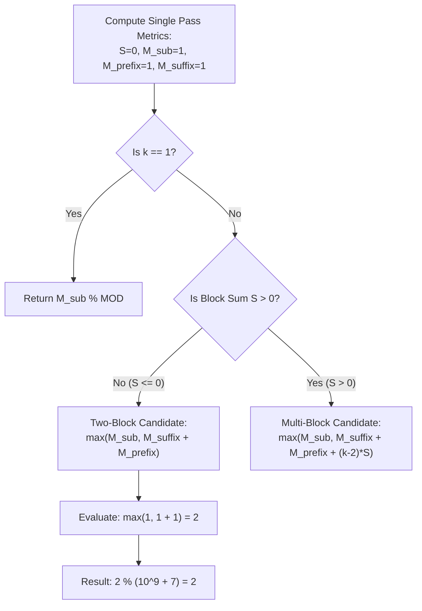

# Guided Example: K-Concatenation Maximum Sum

## 1. Problem Essence & Algorithmic Mental Model

We are given an integer array $\text{arr}$ and a repetition count $k \ge 1$. We form a virtual concatenated array by repeating $\text{arr}$ exactly $k$ consecutive times. Our objective is to determine the maximum contiguous subarray sum achievable within this concatenated array, returning the result modulo $10^9 + 7$. By definition, an empty subarray is permissible and yields a sum of $0$.

If $k$ were small, one might consider physically materializing the concatenated array and running Kadane's algorithm. However, with $|\text{arr}| \le 10^5$ and $k \le 10^5$, the concatenated length can reach $10^{10}$ integers, creating impossible memory and time bottlenecks.

The problem resolves cleanly via **Block Boundary Decomposition**:
Any contiguous subarray within $k$ concatenated copies of $\text{arr}$ falls into one of three structural categories:
1. **Intra-Block Subarray**: The subarray is completely contained within a single copy of $\text{arr}$. The maximum sum achievable here is standard single-array Kadane's maximum: $M_{\text{sub}}$.
2. **Two-Block Boundary Span**: The subarray starts in copy $i$ and ends in copy $i+1$, spanning across exactly one block boundary. This sum is composed of a non-empty suffix of copy $i$ and a non-empty prefix of copy $i+1$. The optimal sum is the maximum suffix sum plus the maximum prefix sum:
   $$M_{\text{span}} = M_{\text{suffix}} + M_{\text{prefix}}$$
3. **Multi-Block Enclosure ($k \ge 3$)**: The subarray starts with a suffix in copy $1$, spans across all $(k-2)$ intermediate complete copies of $\text{arr}$, and terminates in a prefix in copy $k$.
   - If the total sum of a single block $S = \sum \text{arr}$ is positive ($S > 0$), every additional middle block strictly increases the sum. Thus, taking all $(k-2)$ intermediate blocks yields:
     $$M_{\text{multi}} = M_{\text{suffix}} + (k - 2) \cdot S + M_{\text{prefix}}$$
   - If $S \le 0$, adding complete middle blocks cannot increase the total sum, so taking zero middle blocks ($M_{\text{span}}$) remains strictly superior.

```
Visualizing Subarray Geometries across Concatenated Blocks:

Case 1 (Intra-Block):
[ ... (=====) ... ] [ .............. ] [ .............. ]

Case 2 (Two-Block Boundary Span):
[ ......... (==== ] [ ====) ......... ] [ .............. ]
       Max Suffix         Max Prefix

Case 3 (Multi-Block Enclosure, S > 0):
[ ......... (==== ] [ ===== S ===== ] ... [ ===== S ===== ] [ ====) ......... ]
       Max Suffix          (k - 2) Full Blocks                  Max Prefix
```

---

## 2. Mathematical Formalism & Invariants

Let $A = [a_0, a_1, \dots, a_{n-1}]$ be an array of length $n$.
Let the total block sum be:
$$S = \sum_{i=0}^{n-1} a_i$$

### Boundary Metrics Definitions
1. **Maximum Prefix Sum**:
   $$M_{\text{prefix}} = \max_{0 \le j \le n} \sum_{i=0}^{j-1} a_i \quad (\text{with } M_{\text{prefix}} \ge 0 \text{ representing the empty prefix})$$
2. **Maximum Suffix Sum**:
   $$M_{\text{suffix}} = \max_{0 \le j \le n} \sum_{i=j}^{n-1} a_i \quad (\text{with } M_{\text{suffix}} \ge 0 \text{ representing the empty suffix})$$
3. **Maximum Intra-Block Subarray Sum**:
   $$M_{\text{sub}} = \max_{0 \le l \le r \le n} \sum_{i=l}^{r-1} a_i \quad (\text{with } M_{\text{sub}} \ge 0 \text{ representing the empty subarray})$$

### Closed-Form Global Maximization
- **When $k = 1$**:
  The array cannot span across block boundaries:
  $$\text{Ans}(k = 1) = M_{\text{sub}}$$
- **When $k \ge 2$**:
  - If $S \le 0$:
    $$\text{Ans}(k \ge 2, S \le 0) = \max(M_{\text{sub}}, M_{\text{suffix}} + M_{\text{prefix}})$$
  - If $S > 0$:
    $$\text{Ans}(k \ge 2, S > 0) = \max(M_{\text{sub}}, M_{\text{suffix}} + M_{\text{prefix}} + (k - 2) \cdot S)$$

Finally, the non-negative scalar is mapped to $\mathbb{Z}_{10^9+7}$:
$$\text{Result} = \text{Ans} \bmod (10^9 + 7)$$

---

## 3. Concrete Example Execution & State Evolution

Consider the array $A = [1, -2, 1]$ with $k = 5$.

### Single Block Traversal Trace
We compute $S$, $M_{\text{prefix}}$, $M_{\text{suffix}}$, and $M_{\text{sub}}$ in a single pass over $A = [1, -2, 1]$:

| Index $i$ | Element $a_i$ | Cumulative Prefix Sum $P_i$ | Running Max Prefix | Local Kadane $K_i = \max(a_i, K_{i-1}+a_i)$ | Global Kadane $M_{\text{sub}}$ |
|---|---|---|---|---|---|
| Initial | - | 0 | 0 | 0 | 0 |
| 0 | 1 | 1 | $\max(0, 1) = 1$ | $\max(1, 0+1) = 1$ | $\max(0, 1) = 1$ |
| 1 | -2 | $1 - 2 = -1$ | $\max(1, -1) = 1$ | $\max(-2, 1-2) = -1$ | $\max(1, -1) = 1$ |
| 2 | 1 | $-1 + 1 = 0$ | $\max(1, 0) = 1$ | $\max(1, -1+1) = 1$ | $\max(1, 1) = 1$ |

Summary from pass:
- Total Sum $S = P_2 = 0$.
- $M_{\text{prefix}} = 1$.
- For suffix sum: Suffixes are $[1]$ (sum 1), $[-2, 1]$ (sum -1), $[1, -2, 1]$ (sum 0), and empty (sum 0).
  Thus $M_{\text{suffix}} = 1$.
- $M_{\text{sub}} = 1$.



### Scenario Evaluation for $A = [1, -2, 1]$:
- Since $k = 5 \ge 2$ and $S = 0 \le 0$:
- Boundary span candidate: $M_{\text{suffix}} + M_{\text{prefix}} = 1 + 1 = 2$.
  (This corresponds to suffix $[1]$ of block 1 joined with prefix $[1]$ of block 2, forming subarray $[1, 1]$).
- Middle blocks have sum $S = 0$, adding nothing.
- $\text{Ans} = \max(M_{\text{sub}}, M_{\text{suffix}} + M_{\text{prefix}}) = \max(1, 2) =$ **2**.

### Contrast Scenario: $A = [1, 2], k = 3$
- $S = 1 + 2 = 3 > 0$.
- $M_{\text{prefix}} = 3$, $M_{\text{suffix}} = 3$, $M_{\text{sub}} = 3$.
- Because $S > 0$, middle blocks contribute positive value:
  $$\text{Ans} = 3 + 3 + (3 - 2) \times 3 = 9$$
- Entire concatenated array $[1, 2, 1, 2, 1, 2]$ sums to 9.

---

## 4. Multi-Approach Comparison & Trade-Offs

| Metric / Dimension | Physical Concatenation + Kadane | Two-Copy Simulation ($k=2$) | Closed-Form Block Decomposition (Optimal) |
|---|---|---|---|
| **Time Complexity** | $\mathcal{O}(k \cdot N)$ (TLE for large $k$) | $\mathcal{O}(2 \cdot N)$ | $\mathcal{O}(N)$ strictly single pass |
| **Space Complexity** | $\mathcal{O}(k \cdot N)$ (MLE for large $k$) | $\mathcal{O}(2 \cdot N)$ or $\mathcal{O}(1)$ | $\mathcal{O}(1)$ constant registers |
| **Scaling Capability** | Fails when $k \cdot N > 10^7$ | Requires algebraic extension for $k > 2$ | Instantaneous even if $k = 10^{18}$ |
| **Arithmetic Safety** | Unbounded accumulators | Overflow on large arrays | Modulo arithmetic applied at final step |
| **Code Footprint** | Complex allocation logic | Re-run Kadane twice | 15 lines of elementary arithmetic |

```
Memory Footprint Comparison:
Physical Concatenation (k = 100,000, N = 100,000):
Requires 10,000,000,000 32-bit integers = 40 GIGABYTES (Out of Memory)

Closed-Form Decomposition:
Requires 4 scalar integers (S, M_sub, M_pre, M_suf) = 16 BYTES!
```

---

## 5. Algorithmic Edge Cases & Boundary Analysis

| Edge Case Scenario | Input State | Behavior & Mathematical Correctness |
|---|---|---|
| **$k = 1$ Base Case** | $k = 1$ regardless of $S$ | Cannot cross block boundaries. Returns strictly $M_{\text{sub}} \bmod (10^9+7)$. |
| **All Negative Elements** | `arr = [-5, -2, -3]` | $M_{\text{sub}} = 0, M_{\text{prefix}} = 0, M_{\text{suffix}} = 0$ (empty subarray allowed). Returns 0. |
| **All Positive Elements** | `arr = [1, 2, 3]`, $k = 4$ | $S = 6 > 0$. Takes all elements across all 4 blocks: $6 \times 4 = 24$. |
| **Zero Total Sum ($S = 0$)** | `arr = [1, -1]`, $k = 10^5$ | $S = 0 \le 0$. Middle blocks cannot contribute. Max is spanning junction: $1 + 1 = 2$. |
| **Modulo Arithmetic Timing** | Output exceeds $10^9 + 7$ | Modulo $(10^9 + 7)$ must be taken **after** computing the full sum, not during intermediate max comparisons. |

---

## 6. Mathematical Verification & Complexity Derivation

Let $N = |\text{arr}|$ be the number of elements in the single base array.

### Single-Pass Iteration:
1. Initialize accumulators: $S = 0$, $M_{\text{prefix}} = 0$, $M_{\text{sub}} = 0$, running Kadane sum $K = 0$.
2. For each element $x \in \text{arr}$ ($N$ iterations):
   - $S \leftarrow S + x$
   - $M_{\text{prefix}} \leftarrow \max(M_{\text{prefix}}, S)$
   - $K \leftarrow \max(x, K + x)$
   - $M_{\text{sub}} \leftarrow \max(M_{\text{sub}}, K)$
   This loop performs exactly $\mathcal{O}(N)$ arithmetic operations and comparisons.
3. Compute $M_{\text{suffix}}$:
   - Suffix sum from index $j$ is $S - P_{j-1}$.
   - Maximizing over all prefixes, $M_{\text{suffix}} = S - \min_{0 \le j \le N} P_j$.
   - This is extracted directly from the minimum prefix sum tracked during the same single pass in $\mathcal{O}(1)$ time.

### Closed-Form Resolution:
1. Inspect value of $k$ and sign of $S$: $\mathcal{O}(1)$ branch.
2. Evaluate arithmetic product $(k - 2) \cdot S$: 1 multiplication, 1 addition.
3. Perform modulo operation: $\text{Ans} \bmod (10^9 + 7)$.

### Complexity Summary:
- **Total Time Complexity:** $\mathcal{O}(N)$ linear time, strictly independent of $k$.
- **Total Auxiliary Space Complexity:** $\mathcal{O}(1)$ constant auxiliary space.

---

## 7. Synthesis & Strategic Takeaways

1. **Analytical Compression of Repetition**: When an operation repeats a pattern $k$ times where $k$ is arbitrarily large, materializing the repetition is an anti-pattern. Instead, isolate the boundary effects (prefix and suffix) from the invariant interior period ($S$).
2. **The Periodicity Threshold at $k = 2$**: Two copies of an array capture all boundary-crossing behaviors that can ever occur between adjacent blocks. For any $k > 2$, the problem simply scales by adding $(k-2)$ full copies of the block sum $S$ if $S > 0$.
3. **Modular Reduction Timing**: Never apply modulo arithmetic during intermediate $\max(A, B)$ decisions. Modulo mapping destroys the monotonicity of the standard ordering ($9 > 2$, but $9 \bmod 7 < 2 \bmod 7$). Perform all comparisons over unbounded integers and apply the modulo reduction only to the final scalar result.