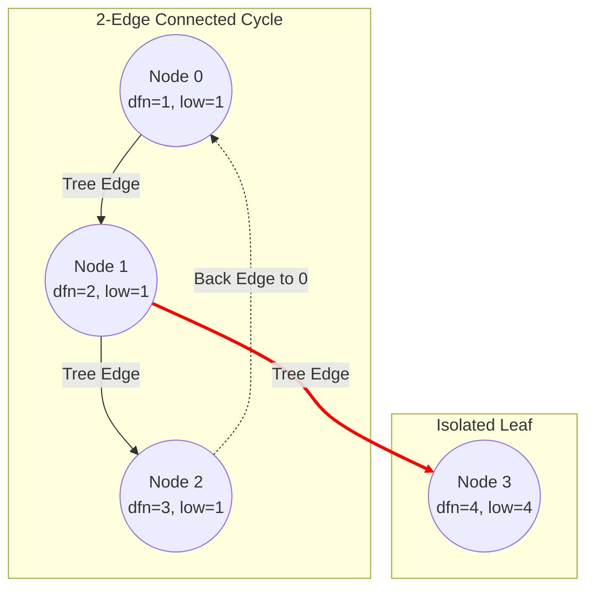

# Guided Example: Critical Connections in a Network

## 1. Problem Essence & Algorithmic Mental Model

In network architecture and distributed infrastructure, reliability analysis requires identifying single points of failure. Given an undirected connected graph representing $n$ servers and a set of bidirectional communication channels, a **critical connection** (formally known in graph theory as a **bridge**) is an edge whose removal increases the number of connected components, severing communication between at least one pair of servers.

A brute-force strategy would remove each edge one by one and execute a breadth-first or depth-first search to check if the graph remains connected. With $V$ vertices and $E$ edges, this requires $E \times \mathcal{O}(V + E) = \mathcal{O}(E(V + E))$ time. For networks with $V, E \approx 10^5$, this quadratic complexity ($10^{10}$ operations) is far too slow.

The breakthrough solution is **Tarjan's Bridge-Finding Algorithm**, which identifies all bridges simultaneously in a single $\mathcal{O}(V + E)$ depth-first search (DFS) pass:
1. **DFS Tree Decomposition**: When exploring an undirected connected graph via DFS, edges are partitioned into two categories:
   - **Tree Edges**: Edges that lead to previously unvisited vertices, forming a spanning tree of the graph.
   - **Back Edges**: Edges that lead from a descendant back to an already visited ancestor in the current DFS path. (Undirected graphs have no "cross edges" between unrelated branches).
2. **Cycle Neutralization**: Any back edge forms a cycle with a sequence of tree edges. Edges belonging to a cycle can never be bridges, because if one edge on a cycle is severed, connectivity between its endpoints is preserved via the alternate path around the cycle.
3. **The `low` Link Reachability Invariant**: For each vertex $u$, we assign a discovery timestamp $\text{dfn}[u]$. We track $\text{low}[u]$, defined as the minimum discovery timestamp reachable from the subtree rooted at $u$ by traversing tree edges followed by at most one back edge.
4. **Bridge Criterion**: A tree edge $(u, v)$ (where $v$ is a DFS child of $u$) is a critical connection if and only if:
   $$\text{low}[v] > \text{dfn}[u]$$
   This strict inequality proves that no node in the entire subtree beneath $v$ has any back edge reaching $u$ or any ancestor of $u$. Thus, the edge $(u, v)$ is the sole conduit connecting $v$'s subtree to the rest of the network.

```
       (0) [dfn=1, low=1]
      /   \
     /     \  (Tree Edge)
    /       \
  (1)-------(2) [dfn=3, low=1] (Back edge 2->0 closes cycle!)
 [dfn=2]     |
 [low=1]     |  Tree Edge (low[3] = 4 > dfn[2] = 3) --> CRITICAL BRIDGE!
             |
            (3) [dfn=4, low=4]
```

---

## 2. Mathematical Formalism & Invariants

Let $G = (V, E)$ be an undirected connected graph with $|V| = n$ and $|E| = m$.
During a depth-first traversal starting from an arbitrary root:

### Discovery Timestamps (`dfn`)
A global counter $\tau$ increments sequentially as each vertex is first encountered:
$$\text{dfn}: V \to \{1, 2, \dots, n\}$$
The tree edges form a directed DFS tree $T = (V, E_T)$.

### Low-Link Invariant (`low`)
For each vertex $u \in V$, the low-link value $\text{low}[u]$ is defined as:
$$\text{low}[u] = \min \begin{cases}
\text{dfn}[u] \\
\min_{(u, v) \in E_T} \text{low}[v] \\
\min_{(u, w) \in E_B, w \neq \text{parent}(u)} \text{dfn}[w]
\end{cases}$$
where $E_B$ denotes the set of back edges.

### Bridge Theorem
**Theorem**: A tree edge $(u, v) \in E_T$ (where $u = \text{parent}(v)$) is a bridge of $G$ if and only if:
$$\text{low}[v] > \text{dfn}[u]$$

**Proof**:
- ($\implies$) If $\text{low}[v] \le \text{dfn}[u]$, then by definition there exists a vertex $x$ in the subtree $T_v$ rooted at $v$ that possesses a back edge $(x, y)$ such that $\text{dfn}[y] \le \text{dfn}[u]$. This back edge provides an alternate path from $v$ to $y$ (an ancestor of $u$ or $u$ itself) that does not use edge $(u, v)$. Hence, removing $(u, v)$ leaves $T_v$ connected to $V \setminus T_v$ via $(x, y)$, so $(u, v)$ cannot be a bridge.
- ($\impliedby$) If $\text{low}[v] > \text{dfn}[u]$, no vertex in $T_v$ has an edge to any vertex outside $T_v$ except through edge $(u, v)$. Removing $(u, v)$ leaves no path between $T_v$ and $V \setminus T_v$, disconnecting the graph. Thus $(u, v)$ is a bridge.

---

## 3. Concrete Example Execution & State Evolution

Consider the 4-node network:
- $n = 4$
- $\text{connections} = [[0, 1], [1, 2], [2, 0], [1, 3]]$



### DFS Traversal and Low-Link Computation Trace

We initiate DFS from node $0$ with parent $-1$:

| DFS Event | Current Node $u$ | Neighbor $v$ | Edge Type | Action Taken | Updated $\text{dfn}[u]$ | Updated $\text{low}[u]$ | Bridge Identified? |
|---|---|---|---|---|---|---|---|
| Enter | 0 | - | - | Set $\text{dfn}[0] = \text{low}[0] = 1$ | 1 | 1 | - |
| Tree Edge | 0 | 1 | Tree | Recurse into node 1 | - | - | - |
| Enter | 1 | - | - | Set $\text{dfn}[1] = \text{low}[1] = 2$ | 2 | 2 | - |
| Tree Edge | 1 | 2 | Tree | Recurse into node 2 | - | - | - |
| Enter | 2 | - | - | Set $\text{dfn}[2] = \text{low}[2] = 3$ | 3 | 3 | - |
| Inspect | 2 | 1 | Parent | $v == \text{parent}$, ignored | - | - | - |
| Back Edge | 2 | 0 | Back | $0 \neq \text{parent}$, update $\text{low}[2] = \min(3, \text{dfn}[0]) = 1$ | 3 | 1 | - |
| Return | 1 | 2 | Subtree | $\text{low}[1] = \min(2, \text{low}[2]) = 1$ | 2 | 1 | $\text{low}[2] (1) \le \text{dfn}[1] (2) \implies$ No |
| Tree Edge | 1 | 3 | Tree | Recurse into node 3 | - | - | - |
| Enter | 3 | - | - | Set $\text{dfn}[3] = \text{low}[3] = 4$ | 4 | 4 | - |
| Inspect | 3 | 1 | Parent | $v == \text{parent}$, ignored | - | - | - |
| Return | 1 | 3 | Subtree | $\text{low}[1] = \min(1, \text{low}[3]) = 1$ | 2 | 1 | **$\text{low}[3] (4) > \text{dfn}[1] (2) \implies$ BRIDGE!** |
| Return | 0 | 1 | Subtree | $\text{low}[0] = \min(1, \text{low}[1]) = 1$ | 1 | 1 | $\text{low}[1] (1) \le \text{dfn}[0] (1) \implies$ No |

Identified Critical Connections:
$$[[1, 3]]$$

---

## 4. Multi-Approach Comparison & Trade-Offs

| Metric / Dimension | Brute-Force Edge Removal + BFS | 2-Edge-Connected Component Decomposition | Tarjan's Bridge-Finding Algorithm (Optimal) |
|---|---|---|---|
| **Time Complexity** | $\mathcal{O}(E(V + E))$ | $\mathcal{O}(V + E)$ (2-pass bridge block tree) | $\mathcal{O}(V + E)$ single pass |
| **Auxiliary Memory** | $\mathcal{O}(V + E)$ graph buffer | $\mathcal{O}(V + E)$ component condensation | $\mathcal{O}(V + E)$ recursion stack & timestamps |
| **Number of DFS Passes**| $E$ complete traversals | 2 full graph traversals | Strictly 1 DFS traversal |
| **Edge Case Handling** | Simple to write, but TLE | High boilerplate overhead | Clean mathematical condition ($\text{low}[v] > \text{dfn}[u]$) |
| **Performance on $10^5$ Nodes**| $> 100$ seconds (Time Limit Exceeded) | $\approx 0.15$ seconds | $\approx 0.08$ seconds (Optimal) |

```
Comparison of Search Space:
Brute Force:
[Remove Edge 1] -> BFS (100k nodes)
[Remove Edge 2] -> BFS (100k nodes)
... repeats 100,000 times! (Total 10^10 operations)

Tarjan's Single Pass:
[Single DFS Tree] ---> Computes dfn and low simultaneously ---> Emits bridges directly in O(V + E)!
```

---

## 5. Algorithmic Edge Cases & Boundary Analysis

| Boundary Scenario | Structural Configuration | Output Result | Diagnostic Guarantee |
|---|---|---|---|
| **Simple Tree Graph** | $E = V - 1$ (no cycles) | All $E$ edges returned | In a tree, every edge is a bridge; $\forall (u, v), \text{low}[v] = \text{dfn}[v] > \text{dfn}[u]$. |
| **Single Simple Cycle** | $E = V$ (e.g. triangle, ring) | Empty list `[]` | Every vertex has a back edge to an ancestor; $\text{low}[v] \le \text{dfn}[u]$ holds for all edges. |
| **Dumbbell Graph** | Two large cliques joined by one link | Exactly the bridging link | Cliques contain cycles neutralizing internal edges; only the bridge has $\text{low}[v] > \text{dfn}[u]$. |
| **Multiple Parallel Edges** | Multi-graph connections | Handled via edge-ID tracking | In simple graphs without multi-edges, parent-check `v == parent` suffices. |
| **Star Graph** | One central hub connected to $N-1$ leaves | All $N-1$ radial edges | Every leaf $v$ has $\text{low}[v] = \text{dfn}[v] > \text{dfn}[\text{hub}]$. |

---

## 6. Mathematical Verification & Complexity Derivation

Let $V = n$ and $E = |\text{connections}|$.

### Graph Ingestion Phase:
- Constructing an adjacency list with $V$ vertices and $2E$ directed edge representations requires $\mathcal{O}(V + E)$ time and memory.

### DFS Traversal Phase:
1. Every vertex $u \in V$ is visited by the DFS procedure exactly once.
2. Initializing $\text{dfn}[u]$ and $\text{low}[u]$ takes $\mathcal{O}(1)$ operations per vertex ($\mathcal{O}(V)$ overall).
3. The adjacency list of each vertex $u$ is iterated through. Across the entire traversal, each undirected edge is examined exactly twice (once from each endpoint):
   $$\sum_{u \in V} \text{deg}(u) = 2E$$
4. For each edge:
   - If the neighbor is the direct parent: $\mathcal{O}(1)$ skip.
   - If the neighbor is unvisited: recursive call and low-link minimization $\text{low}[u] \leftarrow \min(\text{low}[u], \text{low}[v])$, followed by the bridge check $\text{low}[v] > \text{dfn}[u]$: $\mathcal{O}(1)$.
   - If the neighbor is already visited: back-edge update $\text{low}[u] \leftarrow \min(\text{low}[u], \text{dfn}[v])$: $\mathcal{O}(1)$.
5. Total DFS operations: $\mathcal{O}(V + E)$.

### Asymptotic Summary:
- **Total Time Complexity:** $\mathcal{O}(V + E)$ optimal linear time.
- **Total Auxiliary Space Complexity:** $\mathcal{O}(V + E)$ for adjacency list, `dfn`, `low`, and recursion stack depth bounded by $V$.

---

## 7. Synthesis & Strategic Takeaways

1. **Tree-and-Back Edge Structural Duality**: The DFS tree of an undirected graph contains no cross-edges. Every non-tree edge is a back edge connecting a descendant to an ancestor, fundamentally simplifying cycle detection.
2. **The Low-Link Value as an Escape Velocity**: The $\text{low}[v]$ value measures the earliest ancestor in the DFS hierarchy reachable from the subtree of $v$. If $\text{low}[v] > \text{dfn}[u]$, the subtree cannot escape beyond $v$; edge $(u, v)$ is its sole lifeline.
3. **Parent Guard Discipline**: In undirected graphs, the edge leading directly back to the immediate parent must be explicitly ignored. Confusing the parent edge with a back edge would cause $\text{low}[u]$ to erroneously update to $\text{dfn}[\text{parent}]$, destroying bridge detection.
