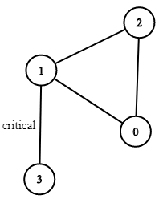

### 1. Description

There are `n` servers numbered from `0` to $n - 1$ connected by undirected server-to-server `connections` forming a network where $\text{connections}[i] = [a_{i}, b_{i}]$ represents a connection between servers $a_{i}$ and $b_{i}$. Any server can reach other servers directly or indirectly through the network.

A *critical connection* is a connection that, if removed, will make some servers unable to reach some other server.

Return all critical connections in the network in any order.

### 2. Function Contract

**Inputs**

- `n`: Input parameter (`int`).
- `connections`: Input parameter (`List[List[int]]`).

**Return value**

- Returns `List[List[int]]`.

### 3. Examples

#### Example 1

- **Input:** $n = 4, connections = [[0,1],[1,2],[2,0],[1,3]]$
- **Output:** `[[1,3]]`
- **Explanation:** [[3,1]] is also accepted.

#### Example 2

- **Input:** $n = 2, connections = [[0,1]]$
- **Output:** `[[0,1]]`

### 4. Constraints

- $2 \le n \le 10^{5}$

- $n - 1 \le \text{connections.length} \le 10^{5}$

- $0 \le a_{i}, b_{i} \le n - 1$

- $a_{i} \neq b_{i}$

- There are no repeated connections.
