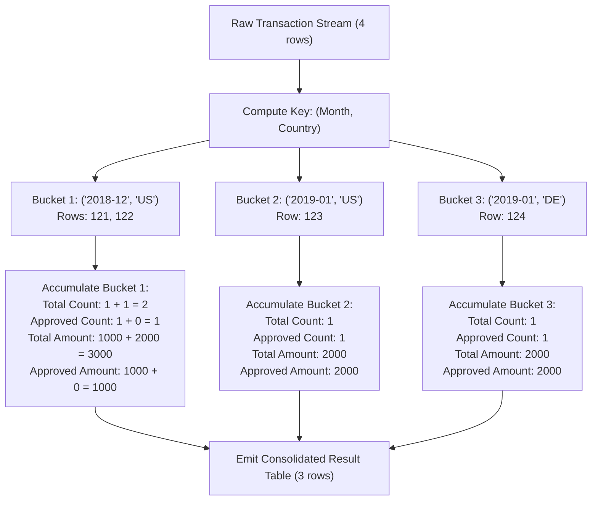

# Guided Example: Monthly Transactions I

## 1. Problem Essence & Algorithmic Mental Model

In financial transaction systems and merchant analytics, payment processors must continuously aggregate volume, velocity, and approval ratios across chronological and geographic dimensions. We are provided with a relational table of credit card transactions, where each entry contains a transaction identifier, an optional country code, a transaction state (`approved` or `declined`), a monetary amount, and a timestamp.

Our objective is to produce a monthly summary table that, for each distinct combination of calendar month (`YYYY-MM`) and geographic territory (`country`), computes four essential metrics:
1. **Total Transaction Volume**: The total number of transactions processed.
2. **Approved Transaction Volume**: The number of transactions that were successfully approved.
3. **Total Transaction Value**: The gross monetary sum across all transactions.
4. **Approved Transaction Value**: The gross monetary sum restricted strictly to approved transactions.

A naive conceptual process might filter the table twice—once for all transactions and once for approved transactions—and execute an outer join on `(month, country)`. However, in relational algebra, this requires two independent full-table scans and an intermediate join hash table.

The optimal relational paradigm utilizes **Composite Group-By with Filtered Indicator Accumulators**:
1. **Temporal Truncation**: Timestamps are truncated from precise dates (`YYYY-MM-DD`) to their monthly period (`YYYY-MM`).
2. **Composite Partitioning**: The relation is partitioned by the composite key $(\text{month}, \text{country})$. Standard relational grouping semantics correctly treat `null` as a distinct matching grouping value.
3. **Single-Pass Conditional Aggregation**: Within each partition bucket, global sums are computed directly, while approved-only metrics use conditional indicators that evaluate to the row's value if `state == 'approved'` and zero otherwise.

```
Input Row: Date: 2019-05-18 | Country: US | State: approved | Amount: 1000
Trunk Key: (2019-05, US)
Contributes to:
- trans_count: +1
- approved_count: +1 (state is approved)
- trans_total_amount: +1000
- approved_total_amount: +1000 (state is approved)

Input Row: Date: 2019-05-19 | Country: US | State: declined | Amount: 2000
Trunk Key: (2019-05, US)
Contributes to:
- trans_count: +1
- approved_count: +0 (declined)
- trans_total_amount: +2000
- approved_total_amount: +0 (declined)
```

---

## 2. Mathematical Formalism & Invariants

Let $\mathcal{T} = \{\rho_1, \rho_2, \dots, \rho_N\}$ be the relation of $N$ transaction tuples:
$$\rho = (id, \text{country}, \text{state}, \text{amount}, \text{date})$$
where $\text{state} \in \{\text{'approved'}, \text{'declined'}\}$, $\text{amount} \in \mathbb{Z}$, and $\text{country} \in \Sigma^* \cup \{\text{null}\}$.

### Coordinate Projection
Define the monthly truncation mapping $\tau: \text{Date} \to \mathcal{M}$:
$$\tau(\text{date}) = \text{year}(\text{date}) \circ \text{"-"} \circ \text{pad}_2(\text{month}(\text{date}))$$

Define the composite partition key:
$$\kappa(\rho) = (\tau(\rho.\text{date}), \rho.\text{country})$$

### Partition Equivalence Relation
The table is partitioned into equivalence classes $\mathcal{P}_k$:
$$\mathcal{P}_k = \{\rho \in \mathcal{T} \mid \kappa(\rho) = k\}$$
where two null countries within the same month belong to the identical equivalence class:
$$(\mu, \text{null}) = (\mu, \text{null})$$

### Indicator Reduction Functions
For each equivalence class $\mathcal{P}_k$, the four metrics are defined by:
1. **Total Count**:
   $$C_{\text{total}}(k) = |\mathcal{P}_k| = \sum_{\rho \in \mathcal{P}_k} 1$$
2. **Approved Count**:
   $$C_{\text{approved}}(k) = \sum_{\rho \in \mathcal{P}_k} [\rho.\text{state} = \text{'approved'}]$$
3. **Total Amount**:
   $$A_{\text{total}}(k) = \sum_{\rho \in \mathcal{P}_k} \rho.\text{amount}$$
4. **Approved Amount**:
   $$A_{\text{approved}}(k) = \sum_{\rho \in \mathcal{P}_k} \rho.\text{amount} \cdot [\rho.\text{state} = \text{'approved'}]$$

---

## 3. Concrete Example Execution & State Evolution

Consider an input dataset containing four transactions:

### Input Dataset
| $id$ | $\text{country}$ | $\text{state}$ | $\text{amount}$ | $\text{trans\_date}$ | Truncated Month |
|---|---|---|---|---|---|
| 121 | `"US"` | `"approved"` | 1000 | `2018-12-18` | `2018-12` |
| 122 | `"US"` | `"declined"` | 2000 | `2018-12-19` | `2018-12` |
| 123 | `"US"` | `"approved"` | 2000 | `2019-01-01` | `2019-01` |
| 124 | `"DE"` | `"approved"` | 2000 | `2019-01-07` | `2019-01` |



### Partition Accumulation Trace

We trace the step-by-step state evolution inside Bucket `('2018-12', 'US')`:

| Processing Step | Row Added | $\text{trans\_count}$ | $\text{approved\_count}$ | $\text{trans\_total\_amount}$ | $\text{approved\_total\_amount}$ |
|---|---|---|---|---|---|
| Initialization | - | 0 | 0 | 0 | 0 |
| Row 121 | $(121, \text{US}, \text{approved}, 1000)$ | $0 + 1 = 1$ | $0 + 1 = 1$ | $0 + 1000 = 1000$ | $0 + 1000 = 1000$ |
| Row 122 | $(122, \text{US}, \text{declined}, 2000)$ | $1 + 1 = \mathbf{2}$ | $1 + 0 = \mathbf{1}$ | $1000 + 2000 = \mathbf{3000}$ | $1000 + 0 = \mathbf{1000}$ |
| Bucket Result | `('2018-12', 'US')` | **2** | **1** | **3000** | **1000** |

Consolidated Output Relation:
| $\text{month}$ | $\text{country}$ | $\text{trans\_count}$ | $\text{approved\_count}$ | $\text{trans\_total\_amount}$ | $\text{approved\_total\_amount}$ |
|---|---|---|---|---|---|
| `"2018-12"` | `"US"` | 2 | 1 | 3000 | 1000 |
| `"2019-01"` | `"US"` | 1 | 1 | 2000 | 2000 |
| `"2019-01"` | `"DE"` | 1 | 1 | 2000 | 2000 |

---

## 4. Multi-Approach Comparison & Trade-Offs

| Dimension / Metric | Two Independent Scans + Outer Join | Subquery Correlated Projections | Hash Group-By with Indicator Folding (Optimal) |
|---|---|---|---|
| **Table Scans** | 2 full table scans | $1 + 2K$ correlated subquery scans | Exactly 1 table scan ($\mathcal{O}(N)$) |
| **Join Overhead** | Full outer hash/merge join node | Nested loop probes per group | Zero joins; direct grouping hash table |
| **Time Complexity** | $\mathcal{O}(N \log N + M \log M)$ | $\mathcal{O}(N \cdot K)$ quadratic | $\mathcal{O}(N)$ linear time |
| **Memory Footprint** | Large intermediate join buffers | Cache eviction from repeated scans | Compact hash map of $K$ accumulator cells |
| **Null-Key Safety** | Join condition fails on `country = country` if null! | Complicated null-safe comparisons | Engine natively groups nulls together |

```
Query Execution Plan Comparison:

Dual-Scan Join:
[Scan All] -------> [Group All] ----\
                                      ====> [Full Outer Join on (Month, Country)] -> [Result]
[Scan Approved] --> [Group Approved]-/

Indicator Folding (Optimal):
[Single Scan] ---> [Hash Group on (Month, Country)] ---> [4 Accumulators per Entry] ---> [Result]
```

---

## 5. Algorithmic Edge Cases & Boundary Analysis

| Boundary Scenario | Condition State | Engine Handling & Correctness |
|---|---|---|
| **Null Country Code** | Tuple contains `country = null` | Group-By specification treats `null` as a distinct valid group; all transactions with null country in month $M$ are aggregated together. |
| **All Transactions Declined** | No `approved` entries in group | `trans_count` $> 0$, `approved_count` $= 0$, `approved_total_amount` $= 0$. Zero is returned (not null). |
| **All Transactions Approved** | Zero `declined` entries | `trans_count = approved_count` and `trans_total_amount = approved_total_amount`. |
| **Multi-Year Identical Month** | Same month across years (e.g. `2018-05` and `2019-05`) | Truncation incorporates full four-digit year `YYYY-MM`; disparate years remain in completely separate buckets. |
| **Single-Day Volume Spike** | Millions of transactions on one day | Grouped into the single bucket for that month without integer overflow in standard 64-bit integer accumulators. |

---

## 6. Mathematical Verification & Complexity Derivation

Let $N$ be the total number of rows in the `Transactions` table, and let $K$ be the number of distinct $(\text{month}, \text{country})$ combinations ($K \le N$).

### Query Engine Execution Phases:
1. **Sequential Table Scan**:
   - The query processor reads $N$ records from storage in $\mathcal{O}(N)$ linear time.
2. **Key Extraction & Hashing**:
   - For each tuple, the date string is formatted/truncated to 7 characters: $\mathcal{O}(1)$.
   - The composite key $(\text{month}, \text{country})$ is hashed into the grouping table: $\mathcal{O}(1)$ average time.
3. **Accumulator Updates**:
   - For each row, four arithmetic operations are executed:
     - Total count: $+1$.
     - Approved count: $+1$ if approved, else $+0$.
     - Total amount: $+ \text{amount}$.
     - Approved amount: $+ \text{amount}$ if approved, else $+0$.
   - Each tuple requires $\mathcal{O}(1)$ constant operations.
   - Total accumulation across all $N$ tuples: $\mathcal{O}(N)$.
4. **Result Emission**:
   - Emitting the $K$ aggregated tuples from the hash table takes $\mathcal{O}(K) \le \mathcal{O}(N)$ time.

### Asymptotic Summary:
- **Total Time Complexity:** $\mathcal{O}(N)$ strictly linear in the number of transaction rows.
- **Total Space Complexity:** $\mathcal{O}(K)$ auxiliary memory to maintain the grouping hash table and metric accumulators for each distinct cohort.

---

## 7. Synthesis & Strategic Takeaways

1. **Indicator Functions Eliminate Join Overhead**: Instead of creating separate filtered datasets and joining them back together, multiplying values by conditional boolean indicators ($[\text{state} = \text{'approved'}] \in \{0, 1\}$) folds multiple conditional metrics into a single aggregation scan.
2. **Relational Grouping Semantics on Nulls**: In relational database theory, while $\text{null} = \text{null}$ evaluates to unknown/false in row-level predicates, the `GROUP BY` operator establishes an equivalence relation where null values are placed into a single shared grouping partition.
3. **Temporal Normalization**: Truncating timestamps to standardized categorical buckets (`YYYY-MM`) transforms continuous time-series data into discrete grouping keys, enabling standard hash-aggregation indexing.
