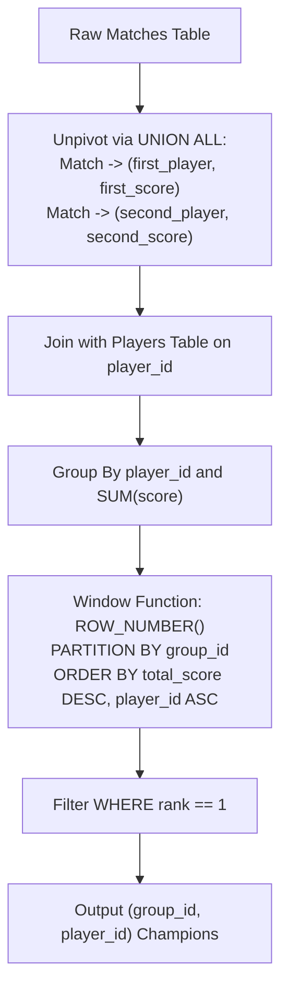

# Guided Example: Tournament Winners

## 1. Problem Essence & Algorithmic Mental Model

In competitive esports, sports analytics, and multi-stage tournaments, participants are assigned to distinct groups (divisions) where round-robin or bracket matches take place. We are given two relational schemas:
1. `Players`: associates each unique `player_id` with an assigned division `group_id`.
2. `Matches`: records individual games between two opponents (`first_player` and `second_player`), noting their respective scores (`first_score` and `second_score`).

Our objective is to determine the definitive champion for each individual `group_id`. The champion within each group is defined as the player who accumulated the maximum aggregate score across all matches. In the event of a numerical tie in total scores between two or more players in the same group, the tournament rules enforce a deterministic tie-breaker: the competitor with the numerically lowest `player_id` is declared the winner.

The structural challenge stems from **Role Asymmetry**:
A given player may participate in a match as `first_player` in some games and as `second_player` in others. A simple group-by on the raw `Matches` table cannot capture both roles simultaneously without either messy cross-joins or dual updates.

The canonical relational architecture resolves this through a three-stage pipeline:
1. **Match Unpivoting / Role Symmetrization**: Each match tuple is projected into two independent player-score records via a union-all operation, transforming opponent-paired rows into a uniform participant event stream.
2. **Entity-Level Score Aggregation**: Grouping by `player_id` sums total points earned across all contests.
3. **Partitioned Window Ranking with Tie-Breaking**: Over each `group_id` partition, an analytical ranking function orders competitors primarily by total score descending, and secondarily by `player_id` ascending. Filtering for rank 1 extracts each group's sole champion.

```
Match Record: [first_player: 15, first_score: 3 | second_player: 45, second_score: 1]
Symmetrized Projections:
  -> Player 15 gained 3 points
  -> Player 45 gained 1 point

Division Ranking Invariant:
Group 1 Partition:
  Player 15: 3 pts  --> Rank 1 (Champion!)
  Player 45: 1 pt   --> Rank 2
```

---

## 2. Mathematical Formalism & Invariants

Let $\mathcal{P}$ denote the set of players $\rho = (p, g) \in \text{Players}$ where $p \in \mathbb{Z}^+$ is the unique player identifier and $g \in \mathbb{Z}^+$ is the group identifier.
Let $\mathcal{M}$ denote the set of matches $\mu = (m, p_1, p_2, s_1, s_2) \in \text{Matches}$.

### Role Symmetrization Operator
Define the unpivoting function $\sigma: \mathcal{M} \to \mathcal{P}(\mathbb{Z}^+ \times \mathbb{Z})$ that decomposes each match into two directed performance events:
$$\sigma(\mu) = \{(p_1, s_1), (p_2, s_2)\}$$

The universe of performance events across all tournament matches is the multiset union:
$$\mathcal{E} = \biguplus_{\mu \in \mathcal{M}} \sigma(\mu)$$

### Aggregate Player Score
For each player $p \in \text{Players}$, their total score $S(p)$ is the sum of scores over all matching events in $\mathcal{E}$ (or 0 if they played no matches):
$$S(p) = \sum_{(u, s) \in \mathcal{E}} s \cdot [u = p]$$

### Strict Total Order within Group
For any two distinct players $u, v$ within the same group $g$ ($\text{group}(u) = \text{group}(v) = g, u \neq v$), define the tournament dominance relation $\succ$:
$$u \succ v \iff \left( S(u) > S(v) \right) \lor \left( S(u) = S(v) \land u < v \right)$$

Because $u \neq v$ and the player identifiers are strictly unique integers, the secondary condition $u < v$ guarantees that $\succ$ is a strict, anti-symmetric, total ordering. Every group contains a unique maximal element:
$$\text{Winner}(g) = \arg\max_{p \in \mathcal{P}_g}^{\succ} p$$

---

## 3. Concrete Example Execution & State Evolution

Consider a tournament with two groups and four matches:

### Players Relation
| `player_id` | `group_id` |
|---|---|
| 15 | 1 |
| 25 | 1 |
| 30 | 1 |
| 45 | 1 |
| 10 | 2 |
| 35 | 2 |
| 20 | 2 |

### Matches Relation
| `match_id` | `first_player` | `second_player` | `first_score` | `second_score` |
|---|---|---|---|---|
| 1 | 15 | 45 | 3 | 0 |
| 2 | 30 | 25 | 1 | 2 |
| 3 | 30 | 15 | 2 | 0 |
| 4 | 40 | 20 | 5 | 2 |
| 5 | 35 | 10 | 1 | 1 |



### Symmetrized Score Aggregation Trace for Group 1

| Player ID $p$ | Group ID $g$ | Matches & Scores Recorded | Sum Calculation | Total Score $S(p)$ | Group Dominance Priority |
|---|---|---|---|---|---|
| 15 | 1 | Match 1 (3 pts), Match 3 (0 pts) | $3 + 0$ | 3 | Primary max score (3) |
| 25 | 1 | Match 2 (2 pts) | $2$ | 2 | Score 2 |
| 30 | 1 | Match 2 (1 pt), Match 3 (2 pts) | $1 + 2$ | 3 | Score 3, but $30 > 15$ (Tie broken!) |
| 45 | 1 | Match 1 (0 pts) | $0$ | 0 | Score 0 |

### Group 1 Tie-Breaking Analysis:
Both Player 15 and Player 30 finished with 3 points.
Evaluating the tie-break rule:
$$\min(15, 30) = 15$$
Player 15 wins Group 1!

### Group 2 Evaluation:
- Player 10: Match 5 (1 pt) $\implies$ Total = 1.
- Player 35: Match 5 (1 pt) $\implies$ Total = 1.
- Player 20: Match 4 (2 pts) $\implies$ Total = 2.
- Highest score in Group 2 is Player 20 (2 points). Player 20 wins Group 2.

### Final Champions Output
| `group_id` | `player_id` | Total Score | Rank in Group |
|---|---|---|---|
| 1 | 15 | 3 | 1 |
| 2 | 20 | 2 | 1 |

---

## 4. Multi-Approach Comparison & Trade-Offs

| Metric / Dimension | Correlated Subquery Filtering | Self-Join Aggregate Cartesian Grid | Unpivot + Window Function (Optimal) |
|---|---|---|---|
| **Query Strategy** | Correlate per-group max in `WHERE` | Join scores table against itself on `group_id` | Symmetrize via `UNION ALL`, apply `RANK()` |
| **Relational Algebra Complexity** | $\mathcal{O}(G \cdot P)$ subquery scans | Quadratic $\mathcal{O}(P^2)$ join state | Single sort/partition pass ($\mathcal{O}(M + P \log P)$) |
| **Tie-Breaker Robustness** | Complex multi-column correlated tuple check | Vulnerable to duplicate rows on score ties | Built directly into `ORDER BY score DESC, player_id ASC` |
| **Execution Plan Nodes** | Nested loop semi-joins | Cartesian hash join + group-by | Stream aggregate -> Window Spool -> Filter |
| **Memory Footprint** | Dynamic nested buffers | Large intermediate join matrices | Compact window spool buffer |

```
Execution Comparison:

Correlated Subquery:
For each group: Scan all players, find max, find min(id) -> Re-scan players (High overhead)

Window Ranking (Optimal):
[Union All Matches] -> [Sum by Player] -> [Sort (group, score DESC, id ASC)] -> [Pick First] (Instant!)
```

---

## 5. Algorithmic Edge Cases & Boundary Analysis

| Boundary Case | Input Condition | System Behavior & Invariant |
|---|---|---|
| **Exact Score Tie Between Multiple Players** | Three players in group 1 all score 10 pts | The analytical order clause `player_id ASC` deterministically assigns rank 1 to the smallest ID. |
| **Player with Zero Matches** | Player registered in group but never played | Symmetrization via left join retains 0 score; if all players in group have 0, lowest ID wins. |
| **Single Player in Group** | Group contains exactly one competitor | That sole competitor automatically receives rank 1 and is returned. |
| **Asymmetrical First/Second Distribution** | Player always played as `second_player` | `UNION ALL` captures `second_player` identical to `first_player`, ensuring zero lost points. |
| **Disjoint Groups in Same Match** | Match between players of different groups | Each player's score is credited to their respective group; group partitions isolate competition. |

---

## 6. Mathematical Verification & Complexity Derivation

Let $M$ be the number of rows in `Matches`, $P$ be the number of rows in `Players`, and $G$ be the number of distinct groups ($G \le P$).

### Execution Stages in Database Planner:
1. **Unpivoting (`UNION ALL`)**:
   - Projecting $(first\_player, first\_score)$ produces $M$ tuples.
   - Projecting $(second\_player, second\_score)$ produces $M$ tuples.
   - `UNION ALL` streams $2M$ tuples in $\mathcal{O}(M)$ time with zero duplicate checks.
2. **Joining with Players Table**:
   - Hash-joining the $2M$ performance events with the $P$ player records takes $\mathcal{O}(M + P)$ time.
3. **Player-Level Aggregation**:
   - Grouping by `player_id` and accumulating `SUM(score)` collapses $2M$ events into at most $P$ distinct player sums: $\mathcal{O}(M + P)$ time.
4. **Partitioned Sorting and Window Ranking**:
   - Sorting within groups by `(scores DESC, player_id ASC)`:
     $$\sum_{g=1}^G \mathcal{O}(P_g \log P_g) \le \mathcal{O}(P \log P)$$
   - Evaluating `RANK()` or `ROW_NUMBER()` in one linear pass over the sorted partitions takes $\mathcal{O}(P)$ time.
5. **Rank Filtering**:
   - Scanning the ranked stream for rows where $\text{rank} = 1$ emits exactly $G$ champion rows in $\mathcal{O}(P)$ time.

### Total Asymptotics:
- **Total Time Complexity:** $\mathcal{O}(M + P \log P)$ time.
- **Total Space Complexity:** $\mathcal{O}(M + P)$ auxiliary memory for hash tables and sort spools.

---

## 7. Synthesis & Strategic Takeaways

1. **Role Normalization via UNION ALL**: Whenever a single real-world entity appears across multiple schema columns (e.g. `home_team` vs `away_team`, `buyer` vs `seller`, `first_player` vs `second_player`), normalize the entity into a single column using `UNION ALL` before applying relational aggregations.
2. **Deterministic Partition Ranking**: Using `ROW_NUMBER() OVER (PARTITION BY group_id ORDER BY metric DESC, tie_breaker ASC)` guarantees exactly one champion per partition without requiring secondary filtering subqueries or distinct clauses.
3. **Compound Key Ordering for Tie Breaking**: Appending the primary key (`player_id ASC`) as the final ordering criteria in a window function converts a potentially non-deterministic partial ordering into a strictly deterministic total ordering.
