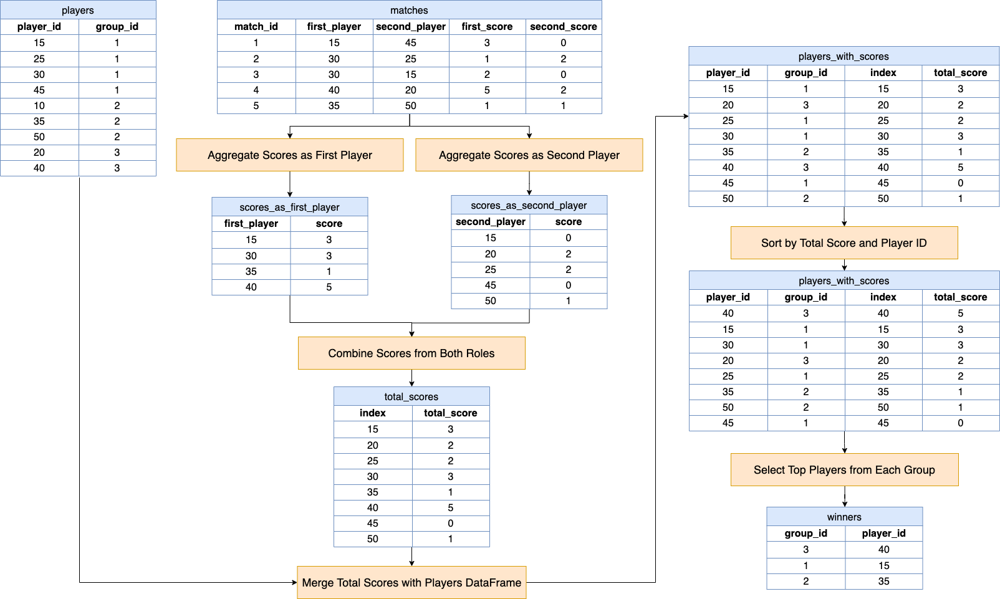

[TOC]

# Solution

---

## pandas

### Approach: Aggregated Score Ranking Method

The pandas solution for identifying tournament winners employs a systematic approach to process match data and determine the top player in each group. It begins by aggregating individual scores from the matches dataframe, separately summing up points scored by players in both the first and second playing positions. This step ensures that each player's total contribution, irrespective of their match role, is accounted for. The aggregated scores are then combined to form a complete picture of each player's performance across all matches. Next, this comprehensive score data is merged with the players dataframe to link each player's total score with their respective group. The merged dataframe is then sorted based on total scores and, in case of ties, by player IDs to adhere to the tie-breaking rule. Finally, the solution isolates the top player from each group by selecting the first row from each group after sorting, effectively identifying the winners based on their accumulated scores throughout the tournament.

**Visualization of Approach:**



#### Intuition

Let's review the intuition behind each step given the following input DataFrames:

Players DataFrame (`players`):

<table>
  <tr>
    <th>player_id</th>
    <th>group_id</th>
  </tr>
  <tr>
    <td>15</td>
    <td>1</td>
  </tr>
  <tr>
    <td>25</td>
    <td>1</td>
  </tr>
  <tr>
    <td>30</td>
    <td>1</td>
  </tr>
  <tr>
    <td>45</td>
    <td>1</td>
  </tr>
  <tr>
    <td>10</td>
    <td>2</td>
  </tr>
  <tr>
    <td>35</td>
    <td>2</td>
  </tr>
  <tr>
    <td>50</td>
    <td>2</td>
  </tr>
  <tr>
    <td>20</td>
    <td>3</td>
  </tr>
  <tr>
    <td>40</td>
    <td>3</td>
  </tr>
</table>
<br>

Matches DataFrame (`matches`):

<table>
  <tr>
    <th>match_id</th>
    <th>first_player</th>
    <th>second_player</th>
    <th>first_score</th>
    <th>second_score</th>
  </tr>
  <tr>
    <td>1</td>
    <td>15</td>
    <td>45</td>
    <td>3</td>
    <td>0</td>
  </tr>
  <tr>
    <td>2</td>
    <td>30</td>
    <td>25</td>
    <td>1</td>
    <td>2</td>
  </tr>
  <tr>
    <td>3</td>
    <td>30</td>
    <td>15</td>
    <td>2</td>
    <td>0</td>
  </tr>
  <tr>
    <td>4</td>
    <td>40</td>
    <td>20</td>
    <td>5</td>
    <td>2</td>
  </tr>
  <tr>
    <td>5</td>
    <td>35</td>
    <td>50</td>
    <td>1</td>
    <td>1</td>
  </tr>
</table>
<br>

1. **Aggregate Scores as First Player**

   This step aggregates the scores each player earned while playing in the position of the first player. It's crucial because a player's total score is a combination of scores from both playing positions.

   ```python
   scores_as_first_player = matches_df.groupby("first_player")["first_score"].sum()
   ```

`scores_as_first_player`:
<table>
  <tr>
    <th>first_player</th>
    <th>score</th>
  </tr>
  <tr>
    <td>15</td>
    <td>3</td>
  </tr>
  <tr>
    <td>30</td>
    <td>3</td>
  </tr>
  <tr>
    <td>35</td>
    <td>1</td>
  </tr>
  <tr>
    <td>40</td>
    <td>5</td>
  </tr>
</table>
<br>

2. **Aggregate Scores as Second Player**

   Similarly to the first step, here we aggregate the scores for each player when they were the second player. This ensures that all points a player scored, regardless of their playing position in each match, are accounted for.

   ```python
   scores_as_second_player = matches_df.groupby("second_player")["second_score"].sum()
   ```

`scores_as_second_player`:
<table>
  <tr>
    <th>second_player</th>
    <th>score</th>
  </tr>
  <tr>
    <td>15</td>
    <td>0</td>
  </tr>
  <tr>
    <td>20</td>
    <td>2</td>
  </tr>
  <tr>
    <td>25</td>
    <td>2</td>
  </tr>
  <tr>
    <td>45</td>
    <td>0</td>
  </tr>
  <tr>
    <td>50</td>
    <td>1</td>
  </tr>
</table>
<br>

3. **Combine Scores from Both Roles**

   This step combines the scores from both the first and second player positions to get the total score for each player. The $\text{fill}_{value}=0$ is used to handle any instances where a player may not have played in one of the roles, avoiding `NaN` values in the sum.

   ```python
   total_scores = scores_as_first_player.add(scores_as_second_player, fill_value=0).reset_index(name="total_score")
   ```

$\text{total}_{scores}$:
<table>
  <tr>
    <th>index</th>
    <th>total_score</th>
  </tr>
  <tr>
    <td>15</td>
    <td>3</td>
  </tr>
  <tr>
    <td>20</td>
    <td>2</td>
  </tr>
  <tr>
    <td>25</td>
    <td>2</td>
  </tr>
  <tr>
    <td>30</td>
    <td>3</td>
  </tr>
  <tr>
    <td>35</td>
    <td>1</td>
  </tr>
  <tr>
    <td>40</td>
    <td>5</td>
  </tr>
  <tr>
    <td>45</td>
    <td>0</td>
  </tr>
  <tr>
    <td>50</td>
    <td>1</td>
  </tr>
</table>
<br>

4. **Merge Total Scores with Players DataFrame**

   The players' total scores need to be linked with their respective groups. This is achieved by merging the total scores with the $\text{players}_{df}$, which contains the group information for each player.

   ```python
   players_with_scores = players_df.merge(total_scores, left_on="player_id", right_on="index")
   ```

`players_with_scores`:
<table>
  <tr>
    <th>player_id</th>
    <th>group_id</th>
    <th>index</th>
    <th>total_score</th>
  </tr>
  <tr>
    <td>15</td>
    <td>1</td>
    <td>15</td>
    <td>3</td>
  </tr>
  <tr>
    <td>20</td>
    <td>3</td>
    <td>20</td>
    <td>2</td>
  </tr>
  <tr>
    <td>25</td>
    <td>1</td>
    <td>25</td>
    <td>2</td>
  </tr>
  <tr>
    <td>30</td>
    <td>1</td>
    <td>30</td>
    <td>3</td>
  </tr>
  <tr>
    <td>35</td>
    <td>2</td>
    <td>35</td>
    <td>1</td>
  </tr>
  <tr>
    <td>40</td>
    <td>3</td>
    <td>40</td>
    <td>5</td>
  </tr>
  <tr>
    <td>45</td>
    <td>1</td>
    <td>45</td>
    <td>0</td>
  </tr>
  <tr>
    <td>50</td>
    <td>2</td>
    <td>50</td>
    <td>1</td>
  </tr>
</table>
<br>

5. **Sort by Total Score and Player ID**

   To determine the winner in each group, players are sorted first by their total score (in descending order) and then by their player ID (in ascending order). This sorting helps in resolving ties - if two players have the same score, the one with the lower player ID is chosen.

   ```python
   players_with_scores.sort_values(["total_score", "player_id"], ascending=[False, True], inplace=True)
   ```

`players_with_scores`:
<table>
  <tr>
    <th>player_id</th>
    <th>group_id</th>
    <th>index</th>
    <th>total_score</th>
  </tr>
  <tr>
    <td>40</td>
    <td>3</td>
    <td>40</td>
    <td>5</td>
  </tr>
  <tr>
    <td>15</td>
    <td>1</td>
    <td>15</td>
    <td>3</td>
  </tr>
  <tr>
    <td>30</td>
    <td>1</td>
    <td>30</td>
    <td>3</td>
  </tr>
  <tr>
    <td>20</td>
    <td>3</td>
    <td>20</td>
    <td>2</td>
  </tr>
  <tr>
    <td>25</td>
    <td>1</td>
    <td>25</td>
    <td>2</td>
  </tr>
  <tr>
    <td>35</td>
    <td>2</td>
    <td>35</td>
    <td>1</td>
  </tr>
  <tr>
    <td>50</td>
    <td>2</td>
    <td>50</td>
    <td>1</td>
  </tr>
  <tr>
    <td>45</td>
    <td>1</td>
    <td>45</td>
    <td>0</td>
  </tr>
</table>
<br>

6. **Select Top Player from Each Group**

   The final step is to identify the winner in each group. After sorting, the first player in each group (based on the sorted order) is the winner. The `head(1)` function selects the top player from each group.

   ```python
   winners = players_with_scores.groupby("group_id").head(1)[["group_id", "player_id"]]
   ```

`winners`:
<table>
  <tr>
    <th>group_id</th>
    <th>player_id</th>
  </tr>
  <tr>
    <td>3</td>
    <td>40</td>
  </tr>
  <tr>
    <td>1</td>
    <td>15</td>
  </tr>
  <tr>
    <td>2</td>
    <td>35</td>
  </tr>
</table>
<br>

#### Implementation

```python
import pandas as pd

def tournament_winners(
    players_df: pd.DataFrame, matches_df: pd.DataFrame
) -> pd.DataFrame:
    # Aggregate scores for each player when they are the first player
    scores_as_first_player = matches_df.groupby("first_player")["first_score"].sum()

    # Aggregate scores for each player when they are the second player
    scores_as_second_player = matches_df.groupby("second_player")["second_score"].sum()

    # Combine the scores from both roles (first and second player)
    total_scores = scores_as_first_player.add(
        scores_as_second_player, fill_value=0
    ).reset_index(name="total_score")

    # Merge the total scores with the players DataFrame
    players_with_scores = players_df.merge(
        total_scores, left_on="player_id", right_on="index"
    )

    # Sort by total score (descending) and player_id (ascending) for tie-breaking
    players_with_scores.sort_values(
        ["total_score", "player_id"], ascending=[False, True], inplace=True
    )

    # Select the top player from each group
    winners = players_with_scores.groupby("group_id").head(1)[["group_id", "player_id"]]

    return winners

```

---

## Database

### Approach: Grouped Window Ranking Method

The SQL solution for determining tournament winners adopts a structured and efficient query-based approach, leveraging Common Table Expressions (CTEs) and window functions. Initially, it consolidates player scores from the matches table, irrespective of their playing position (first or second), by using a `UNION ALL` operation. This step creates a comprehensive view of each player's performance. Next, it aggregates these scores to calculate the total score for each player. The pivotal part of the solution involves applying a window function, $\text{FIRST}_{VALUE}$, within each group, ordered by total score and player ID for tie-breaking. This is achieved by joining this aggregated score data with the players table to include group information. The window function efficiently identifies the top player in each group, considering the highest total score and using player ID as a secondary criterion in case of score ties.

#### Intuition

Here's a breakdown of the logic:

1. **Combine Scores for Each Playing Position**

   This step creates a unified view of scores, regardless of whether the player was playing in the first or second position in a match. The `UNION ALL` combines scores from both positions into a single table with two columns: $\text{player}_{id}$ and `score`.

   ```sql
   WITH PlayerScores AS (
       SELECT first_player AS player_id, first_score AS score
       FROM matches
       UNION ALL
       SELECT second_player AS player_id, second_score AS    score
       FROM matches
   )
   ```

2. **Aggregate Total Scores for Each Player**

   Here, the total score for each player is calculated by summing up their scores across all matches. This aggregation is essential to determine the overall performance of each player in the tournament.

   ```sql
   TotalScores AS (
       SELECT player_id, SUM(score) AS total_score
       FROM PlayerScores
       GROUP BY player_id
   )
   ```

3. **Select the Winner in Each Group**

   The final step is to determine the winner in each group.
   - **Distinct Groups**: The `DISTINCT` keyword ensures that each group is represented once.
   - **Window Function**: $\text{FIRST}_{VALUE}$ is used within an `OVER` clause, partitioned by $\text{group}_{id}$. This window function selects the player with the highest score in each group. In case of a tie (same score), the player with the lower $\text{player}_{id}$ is chosen, as specified by the `ORDER BY` clause.
   - **Join with Players Table**: The `LEFT JOIN` with the `players` table brings in the $\text{group}_{id}$ information, linking it to the total scores of players.

   ```sql
   SELECT DISTINCT group_id,
       FIRST_VALUE(TotalScores.player_id) OVER (
           PARTITION BY group_id
           ORDER BY total_score DESC, TotalScores.player_id
       ) AS player_id
   FROM TotalScores
   LEFT JOIN players ON TotalScores.player_id = players.player_id
   ```

#### Implementation

```mysql []
-- Common Table Expression for Consolidating Scores
WITH PlayerScores AS (
  -- Combine scores where player is the first player
  SELECT
    first_player AS player_id,
    first_score AS score
  FROM
    matches
  UNION ALL
-- Combine scores where player is the second player
  SELECT
    second_player AS player_id,
    second_score AS score
  FROM
    matches
),
TotalScores AS (
  -- Aggregate Total Scores for Each Player
  SELECT
    player_id,
    SUM(score) AS total_score
  FROM
    PlayerScores
  GROUP BY
    player_id
) -- Select the Winner in Each Group
SELECT
  DISTINCT group_id,
  -- Use window function to determine the player with the highest score in each group
  -- In case of a tie, the player with the lowest player_id is chosen
  FIRST_VALUE(TotalScores.player_id) OVER (
    PARTITION BY group_id
    ORDER BY
      total_score DESC,
      TotalScores.player_id
  ) AS player_id -- Winner player_id
FROM
  TotalScores -- Join with Players table to get group information
  LEFT JOIN players ON TotalScores.player_id = players.player_id

```