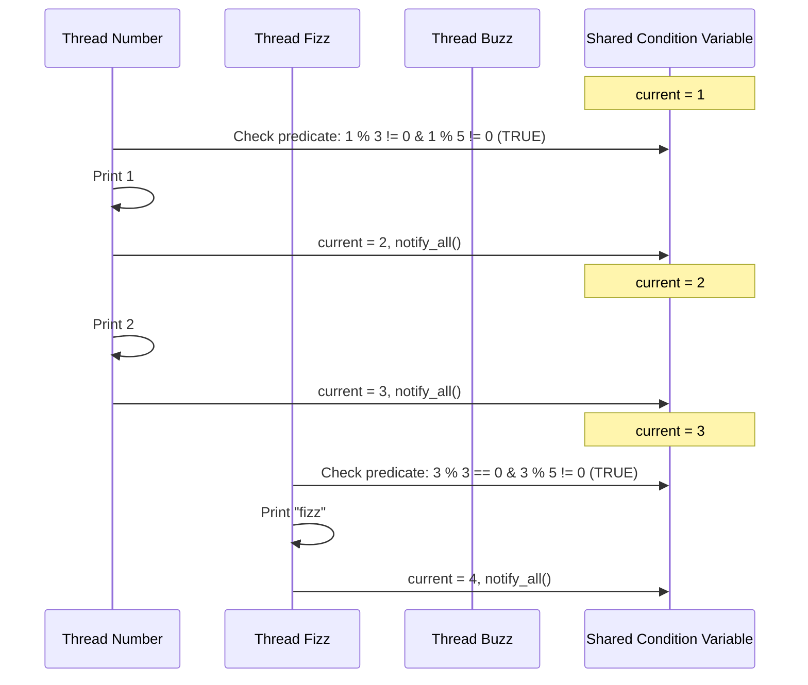

# Guided Example: Multithreaded FizzBuzz

## 1. Problem Essence & Algorithmic Mental Model

In concurrent systems programming and synchronization theory, coordinating multiple worker threads to emit a strictly serialized, deterministic sequence is a foundational coordination problem. We are given an integer $n$. Four distinct concurrent threads execute four separate functions simultaneously:
1. **Thread A (`fizz`)**: Outputs the string `"fizz"` if the current integer is divisible by 3 but not by 5.
2. **Thread B (`buzz`)**: Outputs the string `"buzz"` if the current integer is divisible by 5 but not by 3.
3. **Thread C (`fizzbuzz`)**: Outputs the string `"fizzbuzz"` if the current integer is divisible by both 3 and 5 (i.e., divisible by 15).
4. **Thread D (`number`)**: Outputs the integer itself if it is divisible by neither 3 nor 5.

The global execution invariant requires that the combined output of all four threads forms the exact canonical sequence from $1$ up to $n$ in strictly increasing numerical order, without race conditions, dropped integers, or deadlocks.

The mathematical core of this problem rests on **Residue Class Partitioning**:
Under the modular ring $\mathbb{Z}_{15}$, every positive integer $i$ belongs to exactly one of four pairwise disjoint residue sets:
- $\Omega_{\text{fizzbuzz}} = \{i \mid i \equiv 0 \pmod{15}\}$
- $\Omega_{\text{fizz}} = \{i \mid i \in \{3, 6, 9, 12\} \pmod{15}\}$
- $\Omega_{\text{buzz}} = \{i \mid i \in \{5, 10\} \pmod{15}\}$
- $\Omega_{\text{number}} = \{i \mid i \in \{1, 2, 4, 7, 8, 11, 13, 14\} \pmod{15}\}$

Because these four sets form an exact partition of $\mathbb{Z}^+$, for any integer $i$, **precisely one** thread is legally permitted to act. All three other threads must remain suspended. Once the designated thread prints and increments the shared counter from $i$ to $i+1$, a synchronization broadcast notifies the dormant threads, transferring execution authority to the next unique owner.

```
Modular Period of 15 (Single Global Counter i):
i = 1  (mod 15 = 1)  --> Thread D (number) fires: 1
i = 2  (mod 15 = 2)  --> Thread D (number) fires: 2
i = 3  (mod 15 = 3)  --> Thread A (fizz) fires: "fizz"
i = 4  (mod 15 = 4)  --> Thread D (number) fires: 4
i = 5  (mod 15 = 5)  --> Thread B (buzz) fires: "buzz"
...
i = 15 (mod 15 = 0)  --> Thread C (fizzbuzz) fires: "fizzbuzz"
```

---

## 2. Mathematical Formalism & Invariants

Let the target sequence domain be $\mathcal{I} = \{1, 2, \dots, n\}$.
Define the four predicate functions over integer $k$:
$$\begin{aligned}
P_{\text{fb}}(k) &\iff (k \bmod 15 = 0) \\
P_{\text{f}}(k)  &\iff (k \bmod 3 = 0) \land (k \bmod 5 \neq 0) \\
P_{\text{b}}(k)  &\iff (k \bmod 5 = 0) \land (k \bmod 3 \neq 0) \\
P_{\text{num}}(k)&\iff (k \bmod 3 \neq 0) \land (k \bmod 5 \neq 0)
\end{aligned}$$

### Partition Invariant
For any integer $k \ge 1$:
$$P_{\text{fb}}(k) + P_{\text{f}}(k) + P_{\text{b}}(k) + P_{\text{num}}(k) = 1$$
This guarantees that at any state $k \le n$, there is zero ambiguity regarding which thread must take action.

### Synchronization State Invariants
Let $S$ denote the shared state protected by a mutual exclusion lock:
1. **Monotonic Counter Progress**:
   $$1 = c_0 < c_1 < c_2 < \dots < c_n = n + 1$$
   The shared counter $\text{current}$ begins at 1 and increments by exactly 1 after every completed print action.
2. **Safety Invariant**:
   No thread executes its output routine unless its specific predicate evaluates to true on the active value of $\text{current}$.
3. **Liveness & Termination**:
   When $\text{current}$ increments to $n+1$, all threads waiting on the condition variable are woken up via a final broadcast notification and terminate cleanly without deadlock.

---

## 3. Concrete Example Execution & State Evolution

Consider $n = 5$.
Four threads: $T_{\text{fizz}}$, $T_{\text{buzz}}$, $T_{\text{fb}}$, $T_{\text{num}}$ concurrently start.

### Timeline Interleaving and Condition Signaling Trace

| Counter `current` | Condition Predicate Match | Active Thread Unblocked | Action Performed | Counter Mutation | Threads Remaining Suspended |
|---|---|---|---|---|---|
| Initial | - | All 4 start | Acquire mutex | `current = 1` | - |
| 1 | $P_{\text{num}}(1)$ is True | $T_{\text{num}}$ | Prints `1` | $1 \to 2$, calls notify-all | $T_{\text{fizz}}, T_{\text{buzz}}, T_{\text{fb}}$ sleep |
| 2 | $P_{\text{num}}(2)$ is True | $T_{\text{num}}$ | Prints `2` | $2 \to 3$, calls notify-all | $T_{\text{fizz}}, T_{\text{buzz}}, T_{\text{fb}}$ sleep |
| 3 | $P_{\text{f}}(3)$ is True | $T_{\text{fizz}}$ | Prints `"fizz"` | $3 \to 4$, calls notify-all | $T_{\text{buzz}}, T_{\text{fb}}, T_{\text{num}}$ sleep |
| 4 | $P_{\text{num}}(4)$ is True | $T_{\text{num}}$ | Prints `4` | $4 \to 5$, calls notify-all | $T_{\text{fizz}}, $T_{\text{buzz}}, $T_{\text{fb}}$ sleep |
| 5 | $P_{\text{b}}(5)$ is True | $T_{\text{buzz}}$ | Prints `"buzz"` | $5 \to 6$, calls notify-all | $T_{\text{fizz}}, $T_{\text{fb}}, $T_{\text{num}}$ sleep |
| 6 | $\text{current} > 5$ | All 4 threads | Detect termination condition | Terminate | All threads exit cleanly |



### Modular Residue Distribution within Period $\mathbb{Z}_{15}$

| Residue $k \bmod 15$ | Divisible by 3? | Divisible by 5? | Applicable Predicate | Designated Acting Thread | Emitted Token |
|---|---|---|---|---|---|
| 1, 2, 4, 7, 8, 11, 13, 14 | No | No | $P_{\text{num}}$ | Thread D (`number`) | $k$ |
| 3, 6, 9, 12 | Yes | No | $P_{\text{f}}$ | Thread A (`fizz`) | `"fizz"` |
| 5, 10 | No | Yes | $P_{\text{b}}$ | Thread B (`buzz`) | `"buzz"` |
| 0 | Yes | Yes | $P_{\text{fb}}$ | Thread C (`fizzbuzz`) | `"fizzbuzz"` |

---

## 4. Multi-Approach Comparison & Trade-Offs

| Concurrency Pattern | Busy-Wait Atomic Spin-Locks | Four Directed Semaphores | Monitor with Condition Variable (Optimal) |
|---|---|---|---|
| **CPU Utilization** | $100\%$ CPU saturation (spinning) | Zero CPU waste during sleep | Zero CPU waste during sleep |
| **Context Switching** | Minimal latency, but burns power | Minimal: signals only designated thread | Broadcast wakes all 4, non-matching sleep |
| **Implementation Complexity**| Fragile memory ordering fences | Complex multi-semaphore orchestration | Unified clean predicate harness |
| **Deadlock Vulnerability** | High under preemptive scheduling | High if permit handoff order drifts | Structurally impossible under monotonic counter |
| **Standard Portability** | Requires atomic memory model | Platform semaphore dependent | Universal across POSIX, Java, Python, C++ |

```
Synchronization Flow Comparison:

Directed Semaphores:
[Thread D] ===(signal_fizz)===> [Thread A] ===(signal_num)===> [Thread D] (Strict Handshakes)

Condition Variable Monitor (Optimal):
[Active Thread] -> [Prints] -> [current++] -> [broadcast()] -> [All Check Predicates]
```

---

## 5. Algorithmic Edge Cases & Boundary Analysis

| Boundary Scenario | Condition | System Response & Correctness |
|---|---|---|
| **Smallest Input ($n = 1$)** | $n = 1$ | $T_{\text{num}}$ prints 1, increments `current` to 2. All 4 threads wake, see $2 > 1$, and exit. |
| **Exact Multiple of 15 ($n = 15$)** | Tests all 4 thread types | $T_{\text{fb}}$ acts at step 15, prints `"fizzbuzz"`, increments to 16, triggering clean shutdown. |
| **Clean Termination on Completion** | `current > n` while threads wait | The termination guard `if self.current > self.n: return` ensures threads don't block indefinitely on exit. |
| **Spurious Wakeup Handling** | OS signals thread without mutation | The enclosing `while not predicate(current)` re-verifies the condition before any print action. |
| **Unbalanced Thread Scheduling** | One thread starves initially | The strict equality on `current` prevents faster threads from advancing ahead; execution remains ordered. |

---

## 6. Mathematical Verification & Complexity Derivation

Let $n$ be the target sequence length.

### Step-by-Step Execution Cost:
1. **Total State Transitions**:
   - The shared counter `current` advances strictly from $1$ to $n+1$.
   - Exactly $n$ print actions are performed across all threads.
2. **Synchronization Overhead per Increment**:
   - Each increment performs 1 mutex unlock, 1 condition broadcast, and 1 mutex lock.
   - Up to 4 threads wake up and evaluate their divisibility predicate ($\mathcal{O}(1)$ arithmetic operations).
   - Exactly 1 thread succeeds and proceeds; the other 3 re-enter sleep ($\mathcal{O}(1)$).
3. **Total Work**:
   $$n \times \mathcal{O}(1) = \mathcal{O}(n)$$

### Complexity Summary:
- **Total Time Complexity:** $\mathcal{O}(n)$ optimal linear time across the concurrent system.
- **Total Auxiliary Space Complexity:** $\mathcal{O}(1)$ constant auxiliary memory (one integer counter, one mutex lock, and one condition variable).

---

## 7. Synthesis & Strategic Takeaways

1. **The Reified Predicate Runner Idiom**: In multi-threaded problems where different threads perform identical synchronization workflows under distinct activation conditions, factoring the wait-and-signal protocol into a single shared runner parameterized by `(predicate, action)` eliminates repetitive boilerplate.
2. **Guarding Termination After Wait**: In monitor patterns where threads loop until a global limit, always inspect the termination condition immediately following `condition.wait()`. A thread may awaken not because its predicate became true, but because a companion thread signaled a shutdown.
3. **Modulo Arithmetic as an Invariant Arbiter**: Partitioning integers via modular arithmetic guarantees mutual exclusivity at the mathematical level, ensuring that concurrent race conditions can never produce conflicting claims over the shared resource.
