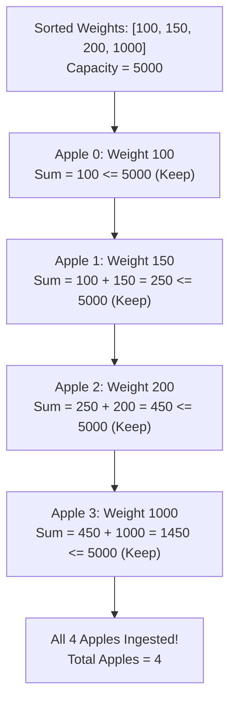

# Guided Example: How Many Apples Can You Put into the Basket

## 1. Problem Essence & Algorithmic Mental Model

We are presented with a collection of apples, where each apple has an associated positive integer weight given in the array $\text{weight}$. We possess a single basket with a rigid physical carrying capacity of at most $5000$ weight units. Our objective is to determine the maximum total count of apples that can be placed into the basket without exceeding this weight threshold.

This problem represents the classic **Unit-Profit Knapsack Problem**:
In a general 0-1 knapsack problem, each item possesses both an arbitrary weight $w_i$ and an arbitrary value $v_i$, requiring dynamic programming to resolve non-trivial value-to-weight density trade-offs. Here, however, all items share an identical unit value:
$$v_i = 1 \quad \forall i$$
Our goal is solely to maximize the cardinality of the chosen subset.

Because every apple contributes equally ($+1$) toward the objective regardless of how heavy it is, heavier apples consume scarce capacity without providing any compensatory benefit. Therefore, the optimal strategy is pure **Greedy Selection by Ascending Weight**:
1. Sort all available apples in non-decreasing order of weight: $w_{(0)} \le w_{(1)} \le \dots \le w_{(n-1)}$.
2. Iterate through the sorted list, greedily adding the lightest available apple to the basket.
3. Terminate immediately when the next apple would cause the cumulative weight to strictly exceed $5000$. The number of successfully added apples is mathematically guaranteed to be the global maximum.

```
Available Apples: [900, 1000, 100, 200, 500, 4000]
Capacity: 5000

Sorted by Weight:
[100, 200, 500, 900, 1000, 4000]
 ^    ^    ^    ^    ^
 │    │    │    │    └─ Cumulative sum: 100 + 200 + 500 + 900 + 1000 = 2700 <= 5000
 └────┴────┴────┴────── Next is 4000: 2700 + 4000 = 6700 > 5000 (Exceeds capacity!)

Max Apples Placed = 5
```

---

## 2. Mathematical Formalism & Invariants

Let $W = [w_0, w_1, \dots, w_{n-1}]$ be the list of $n$ apple weights.
Let $C = 5000$ denote the basket capacity constraint.

### Optimization Formulation
We seek a binary selection vector $\mathbf{x} = (x_0, x_1, \dots, x_{n-1}) \in \{0, 1\}^n$ to:
$$\max \sum_{i=0}^{n-1} x_i \quad \text{subject to} \quad \sum_{i=0}^{n-1} x_i \cdot w_i \le C$$

### Theorem: Optimality of the Greedy Ordering
Let $w_{(0)} \le w_{(1)} \le \dots \le w_{(n-1)}$ be the sorted permutation of $W$.
Let $k^*$ be the largest integer in $\{0, 1, \dots, n\}$ satisfying:
$$\sum_{j=0}^{k^*-1} w_{(j)} \le C$$
Then the greedy prefix of length $k^*$ is an optimal solution.

### Proof via Greedy Exchange Argument
Assume for contradiction that an optimal selection $S^* \subset W$ achieves cardinality $|S^*| > k^*$, or achieves $|S^*| = k^*$ but differs from the prefix $P = \{w_{(0)}, \dots, w_{(k^*-1)}\}$.
Since $S^* \neq P$, there must exist an element $w_{(a)} \in P \setminus S^*$ and an element $w_{(b)} \in S^* \setminus P$.
By construction of the sorted prefix, $a < k^* \le b$, which implies:
$$w_{(a)} \le w_{(b)}$$
Consider the swapped subset $S' = (S^* \setminus \{w_{(b)}\}) \cup \{w_{(a)}\}$.
1. The cardinality is preserved: $|S'| = |S^*|$.
2. The total weight satisfies:
   $$\text{Weight}(S') = \text{Weight}(S^*) - w_{(b)} + w_{(a)} \le \text{Weight}(S^*) \le C$$
Thus $S'$ remains valid. By repeatedly applying this exchange, we can transform any optimal solution into the greedy prefix $P$ without decreasing cardinality or exceeding capacity. Furthermore, if any valid subset had cardinality $k^* + 1$, the sum of its lightest $k^*+1$ elements would be at least $\sum_{j=0}^{k^*} w_{(j)} > C$, which contradicts validity.
Hence, the greedy prefix achieves the unique global maximum cardinality.

---

## 3. Concrete Example Execution & State Evolution

Consider the apple inventory:
$\text{weight} = [100, 200, 150, 1000]$ with capacity $C = 5000$.

### Initial State and Sorting Trace
Original array: `[100, 200, 150, 1000]`
Sorted array: `[100, 150, 200, 1000]`



### Contrast Trace with Heavy Apples
Consider a second example where the capacity boundary is breached:
$\text{weight} = [900, 950, 800, 1000, 700, 800]$
Sorted: `[700, 800, 800, 900, 950, 1000]`

| Step $i$ | Apple Weight $w_{(i)}$ | Previous Cumulative Sum | New Cumulative Sum | Threshold Check ($\le 5000$) | Action Taken |
|---|---|---|---|---|---|
| 0 | 700 | 0 | 700 | $700 \le 5000$ (True) | Added to basket (Count = 1) |
| 1 | 800 | 700 | 1500 | $1500 \le 5000$ (True) | Added to basket (Count = 2) |
| 2 | 800 | 1500 | 2300 | $2300 \le 5000$ (True) | Added to basket (Count = 3) |
| 3 | 900 | 2300 | 3200 | $3200 \le 5000$ (True) | Added to basket (Count = 4) |
| 4 | 950 | 3200 | 4150 | $4150 \le 5000$ (True) | Added to basket (Count = 5) |
| 5 | 1000 | 4150 | 5150 | $5150 \le 5000$ (False) | **Breached!** Stop scan. |

Final count returned: **5** apples.

---

## 4. Multi-Approach Comparison & Trade-Offs

| Approach | Dynamic Programming (0-1 Knapsack) | Min-Heap Extraction | Sort and Linear Scan (Optimal) |
|---|---|---|---|
| **Strategy** | 2D table over $[N \times C]$ states | Push all into heap, pop smallest | Sort array in-place, accumulate prefix |
| **Time Complexity** | $\mathcal{O}(N \cdot C) = \mathcal{O}(5000 \cdot N)$ | $\mathcal{O}(N + K \log N)$ | $\mathcal{O}(N \log N)$ |
| **Auxiliary Memory** | $\mathcal{O}(C) = 5000$ DP cells | $\mathcal{O}(N)$ heap storage | $\mathcal{O}(1)$ constant memory |
| **Implementation Complexity**| High (redundant for unit values) | Moderate | 5 lines of code |
| **Cache Locality** | Table updates / strided access | Pointer chasing / tree swaps | Contiguous linear memory stream |

```
Execution Comparison:

0-1 Knapsack DP:
[State Table: N rows x 5000 columns] -> Massive unnecessary computation!

Sort + Greedy Scan (Optimal):
[Sort Array] ---> [Accumulate until > 5000] ---> [Return index] (Instantaneous!)
```

---

## 5. Algorithmic Edge Cases & Boundary Analysis

| Scenario | Input Condition | Expected Behavior | Handling Mechanism |
|---|---|---|---|
| **All Apples Fit in Basket** | Sum of all weights $\le 5000$ | Returns $N$ (all apples) | Loop completes without triggering `s > 5000`; returns `len(weight)`. |
| **First Apple Exceeds Capacity** | First apple has weight $= 5001$ | Returns 0 | At $i = 0$, $s = 5001 > 5000$; immediately returns index 0. |
| **Exact Capacity Boundary** | Cumulative sum reaches exactly 5000 | Apple is accepted | Strict inequality `s > 5000` allows cumulative weight equal to 5000. |
| **All Apples Identical Weight** | $N = 1000$ apples of weight 10 | Returns $\min(N, \lfloor 5000 / 10 \rfloor) = 500$ | Handled naturally by linear accumulation. |
| **Single Apple in Input** | Single apple weighing 4999 | Returns 1 | Evaluates single element; returns 1. |

---

## 6. Mathematical Verification & Complexity Derivation

Let $N = |\text{weight}|$ be the number of apples in the input array.

### Sorting Phase:
- Sorting an array of $N$ integers using an optimal comparison sort (such as Timsort, Heapsort, or Introsort) requires:
  $$\mathcal{O}(N \log N) \text{ comparisons and operations}$$
- Auxiliary memory for sorting is $\mathcal{O}(1)$ or $\mathcal{O}(N)$ depending on whether an in-place sort is used.

### Linear Scan Phase:
- We initialize a running accumulator $s = 0$.
- For each index $i \in [0, N-1]$:
  - $s \leftarrow s + w_{(i)}$
  - Check if $s > 5000$: if so, return $i$.
- This loop runs at most $N$ iterations, performing $\mathcal{O}(1)$ operations per step.
- Scanning takes $\mathcal{O}(N)$ time.

### Total Asymptotics:
- **Total Time Complexity:** $\mathcal{O}(N \log N)$. With $N \le 10^4$, $N \log N \approx 1.4 \times 10^5$ operations, completing in $< 1$ millisecond.
- **Total Auxiliary Space Complexity:** $\mathcal{O}(1)$ auxiliary space if sorted in place.

---

## 7. Synthesis & Strategic Takeaways

1. **Greedy Dominance under Uniform Rewards**: When a resource-constrained maximization problem assigns uniform value to all entities, the optimal subset is always the set of items that consume the least resource per unit reward.
2. **The Exchange Argument Paradigm**: To formally prove that a greedy ordering is optimal, assume an optimal solution deviates from the greedy choice and show that swapping a non-greedy item for a greedy item preserves or improves feasibility without reducing utility.
3. **Capacity Invariant Boundary Check**: Ensuring that the capacity boundary condition uses strict inequality (`s > 5000` rather than `s >= 5000`) correctly permits the basket to be loaded to its exact physical capacity threshold.
