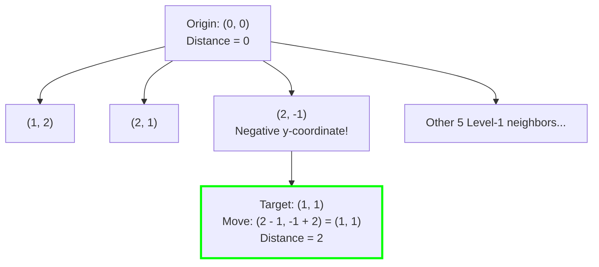

# Guided Example: Minimum Knight Moves

## 1. Problem Essence & Algorithmic Mental Model

On an infinite two-dimensional chessboard with coordinate grid $\mathbb{Z} \times \mathbb{Z}$, a knight piece begins at the origin $(0, 0)$. In chess, a knight moves in an "L-shape": two squares along one Cartesian axis and one square along the perpendicular axis, giving eight possible transition vectors:
$$\Delta \in \{(\pm 1, \pm 2), (\pm 2, \pm 1)\}$$
Our objective is to compute the minimum number of moves required for the knight to reach a given target coordinate $(x, y)$.

Because edge weights are uniform (each move incurs a cost of exactly $1$), the problem maps directly to finding the shortest path in an unweighted infinite graph, typically resolved via **Breadth-First Search (BFS)**. However, an unconstrained BFS on an infinite grid fans out with branching factor 8, examining $8^d$ nodes without geometric bounding.

To make search practical and efficient, we leverage two core geometric insights:
1. **Four-Quadrant Absolute Symmetry**:
   The grid's origin is isotropic under reflection across both Cartesian axes ($x \leftrightarrow -x$, $y \leftrightarrow -y$) and the diagonal ($x \leftrightarrow y$). Therefore:
   $$\text{dist}(x, y) = \text{dist}(|x|, |y|) = \text{dist}(|y|, |x|)$$
   We can immediately fold the target into the first quadrant where $x \ge 0$ and $y \ge 0$.
2. **The Origin Boundary Trap (Why Pruning Must Allow Slight Negatives)**:
   It is tempting to restrict search strictly to non-negative coordinates ($i \ge 0, j \ge 0$). However, this introduces a critical trap near the origin:
   - To reach $(1, 1)$, an optimal 2-step path is:
     $$(0, 0) \to (2, -1) \to (1, 1)$$
     The knight must temporarily step into the negative coordinate $(2, -1)$!
   - If coordinates are strictly pruned to $i \ge 0, j \ge 0$, the algorithm is blocked from discovering this 2-move trajectory and erroneously concludes a longer path.
   Therefore, any valid pruning window must allow a safety buffer (typically $i \ge -2$ and $j \ge -2$).

```
Reaching (1, 1) in 2 Moves requires stepping into negative space:
        y ^
          │
      (1,1)◄────────┐ Step 2: (-1, +2)
          │         │
    ──────┼─────────┼────────> x
    (0,0) │         │
          │         ▼
          │       (2,-1)  Step 1: (+2, -1)
```

---

## 2. Mathematical Formalism & Invariants

Let $V = \mathbb{Z}^2$ be the infinite vertex set.
The knight adjacency operator $\mathcal{N}: V \to \mathcal{P}(V)$ is defined by:
$$\mathcal{N}(u, v) = \{(u + a, v + b) \mid (a, b) \in \{(\pm 1, \pm 2), (\pm 2, \pm 1)\}\}$$

### Symmetry Folding
For any target $(X, Y) \in \mathbb{Z}^2$, define the normalized target:
$$(X^*, Y^*) = (|X|, |Y|)$$
The shortest path distance $\delta: V \times V \to \mathbb{Z}_{\ge 0}$ satisfies:
$$\delta((0, 0), (X, Y)) = \delta((0, 0), (X^*, Y^*))$$

### BFS Wavefront Invariant
In level-by-level BFS:
- Let $L_k \subset V$ denote the set of vertices discovered at step depth $k$.
- Initial state: $L_0 = \{(0, 0)\}$.
- Inductive transition:
  $$L_{k+1} = \left( \bigcup_{u \in L_k} \mathcal{N}(u) \right) \setminus \left( \bigcup_{j=0}^k L_j \right)$$
- The first step $k$ where $(X^*, Y^*) \in L_k$ is guaranteed to equal $\delta((0, 0), (X^*, Y^*))$.

### Safe Pruning Domain
To prevent explosive expansion while preserving all geodesic shortest paths to $(X^*, Y^*)$, the search space is confined to the bounding box:
$$\Omega = \{(u, v) \in \mathbb{Z}^2 \mid -2 \le u \le X^* + 2, \ -2 \le v \le Y^* + 2\}$$

---

## 3. Concrete Example Execution & State Evolution

Consider the target $(X, Y) = (2, 1)$.
Here $(X^*, Y^*) = (2, 1)$.

### Step-by-Step BFS Frontier Expansion

We initiate search at $(0, 0)$ with depth $d = 0$:

| BFS Level $k$ | Nodes Expanded from Frontier | Newly Discovered Neighbors (within $\Omega$) | Target Reached? |
|---|---|---|---|
| Level 0 | $(0, 0)$ | $(1, 2), (2, 1), (2, -1), (1, -2), (-1, 2), (-2, 1), (-1, -2), (-2, -1)$ | **Yes!** $(2, 1) \in L_1$ |
| Result | Target hit at Level 1 | Path: $(0, 0) \to (2, 1)$ | Distance = **1** |

Now consider the more intricate target $(X, Y) = (1, 1)$.
Normalized: $(1, 1)$.

| BFS Level $k$ | Active Frontier Size | Sample Nodes in Frontier | Contains Target $(1, 1)$? |
|---|---|---|---|
| Level 0 | 1 | $(0, 0)$ | No |
| Level 1 | 8 | $(1, 2), (2, 1), (2, -1), (1, -2), (-1, 2), (-2, 1), (-1, -2), (-2, -1)$ | No |
| Level 2 | 28 | Expanded from $(2, -1)$: $(2-1, -1+2) = \mathbf{(1, 1)}$! | **Yes!** $(1, 1)$ reached |



### Table of Distances Near the Origin ($x, y \in [0, 3]$)

| $y \backslash x$ | 0 | 1 | 2 | 3 |
|---|---|---|---|---|
| **0** | 0 | 3 | 2 | 3 |
| **1** | 3 | **2** | 1 | 2 |
| **2** | 2 | 1 | 4 | 3 |
| **3** | 3 | 2 | 3 | 2 |

Notice the famous anomaly:
- Distance to $(0, 0)$ is 0.
- Distance to $(1, 0)$ is 3: $(0,0) \to (2,1) \to (0,2) \to (1,0)$.
- Distance to $(1, 1)$ is 2: $(0,0) \to (2,-1) \to (1,1)$.
- Distance to $(2, 2)$ is 4: $(0,0) \to (2,1) \to (1,3) \to (3,2) \to (2,2)$ (or through $(0,0) \to (1,2) \to (2,4) \to (0,3) \to (2,2)$).

---

## 4. Multi-Approach Comparison & Trade-Offs

| Metric / Dimension | Unbounded Naive BFS | Bounded Unidirectional BFS | Bounded Bidirectional BFS (Optimal) |
|---|---|---|---|
| **Search Space** | Infinite grid / memory explosion | Confined to $\Omega$ box | Two meeting frontiers from $(0,0)$ and $(X,Y)$ |
| **Explored States** | Exponential ($\approx 8^d$) | $\mathcal{O}((X + 4)(Y + 4)) = \mathcal{O}(X \cdot Y)$ | $\mathcal{O}((X \cdot Y) / 2)$ |
| **Time Complexity** | TLE for $X, Y \ge 50$ | $\mathcal{O}(X \cdot Y)$ | $\mathcal{O}(X \cdot Y)$ with $\approx 50\%$ fewer visited states |
| **Auxiliary Memory** | Exhausts heap memory | Hash set of size $\le (X+4)(Y+4)$ | Two smaller hash sets |
| **Origin Trap Risk** | High if heuristic pruned | Zero if $-2$ boundary preserved | Zero if $-2$ boundary preserved |

```
Search Frontier Comparison:

Unidirectional BFS:
(0,0) =====================================> Target (Radius R, Area ~ pi * R^2)

Bidirectional BFS:
(0,0) ====> (Meet) <==== Target (Two circles of Radius R/2, Combined Area ~ 2 * pi * (R/2)^2 = Half Area!)
```

---

## 5. Algorithmic Edge Cases & Boundary Analysis

| Boundary Case | Target Coordinate | Shortest Path Distance | Algorithmic Criticality |
|---|---|---|---|
| **Origin Target** | $(0, 0)$ | 0 moves | Immediate return at initialization level 0. |
| **Adjacent Coordinate** | $(1, 0)$ or $(0, 1)$ | 3 moves | Requires detour via $(2, 1)$ and $(0, 2)$; cannot be solved in 1 move. |
| **Diagonal Neighbor** | $(1, 1)$ | 2 moves | Strictly requires permitting temporary negative coordinate $(2, -1)$. |
| **Symmetric Diagonals** | $(2, 2)$ | 4 moves | Anomaly: takes 4 moves despite coordinate sum being only 4. |
| **Negative Input Coordinates** | $(-100, -200)$ | Same as $(100, 200)$ | Absolute value transformation $\lvert X \rvert, \lvert Y \rvert$ normalizes all coordinates to the first quadrant. |

---

## 6. Mathematical Verification & Complexity Derivation

Let $X^* = |X|$ and $Y^* = |Y|$ be the normalized coordinate magnitudes.
The search is restricted to the grid box $[-2, X^* + 2] \times [-2, Y^* + 2]$.

### State-Space Bound:
- The total number of valid lattice points in the bounding box is:
  $$|\Omega| = (X^* + 5) \times (Y^* + 5) = \mathcal{O}(X^* \cdot Y^*)$$
- Each lattice point has at most 8 neighbors.

### Execution Cost:
1. **Normalization**:
   - $X^* = |X|, Y^* = |Y|$ takes $\mathcal{O}(1)$ operations.
2. **BFS Traversal**:
   - Each state $(u, v) \in \Omega$ is enqueued into the FIFO queue and inserted into the visited hash set at most once.
   - For each dequeued node, exactly 8 transition offsets are evaluated.
   - Bounding box checks $(-2 \le u+a \le X^*+2, -2 \le v+b \le Y^*+2)$ and hash set membership checks take $\mathcal{O}(1)$ average time.
   - Total vertex expansions: at most $|\Omega| = \mathcal{O}(X^* \cdot Y^*)$.

### Asymptotic Summary:
- **Total Time Complexity:** $\mathcal{O}(X \cdot Y)$ bounded by the area spanned between origin and target. (For max coordinate magnitude 300, $|\Omega| \approx 305 \times 305 \approx 9.3 \times 10^4$ states, executing in a few milliseconds).
- **Total Space Complexity:** $\mathcal{O}(X \cdot Y)$ auxiliary memory to store the visited hash set and BFS queue.

---

## 7. Synthesis & Strategic Takeaways

1. **Reflectional Symmetry Folding**: In isotropic geometric problems, taking absolute values $(|x|, |y|)$ compresses an infinite 4-quadrant plane into a single quadrant, shrinking the problem volume by $4\times$.
2. **The Danger of Overzealous Pruning**: Pruning boundaries must account for temporary retreats. In discrete motion with step size greater than 1 (such as the knight's 2-step hop), an optimal path may step outside the bounding box of the target before converging. A margin of 2 units prevents cutting off legal shortest paths.
3. **Graph Radius vs Geometric Metric**: Euclidean or Manhattan metrics do not equal graph shortest path distance under non-standard basis vectors. Always use BFS or verified mathematical parity corrections rather than naive division by step length.
