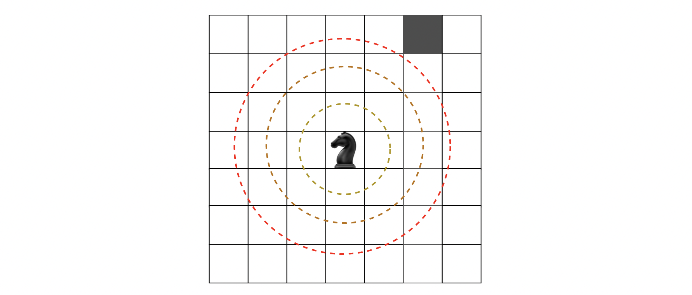
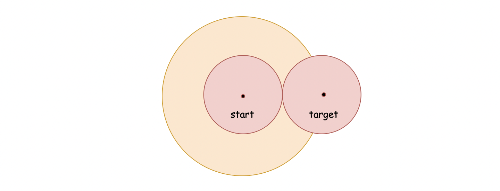
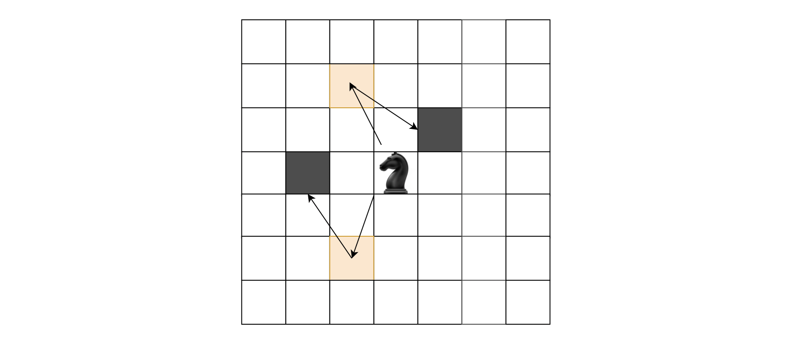

[TOC]

## Solution

---
### Approach 1: BFS (Breadth-First Search)

**Intuition**

We are asked to find the **_minimum_** steps required to travel from one point to another point on a grid.
One of the most intuitive ideas that one might come up with during an interview is _**brute force enumeration**_, _i.e._ we explore all possible paths between the two points and return the minimum number of moves.

It is indeed a valid solution. However, it will be beneficial to give the idea a second thought, before jumping into the implementation.
The question resembles a classical graph search problem, which is to find the _shortest_ path between two nodes in a graph.
As one might recall, the solution to the graph search problem is called [Dijkstra's algorithm](https://en.wikipedia.org/wiki/Dijkstra%27s_algorithm).

>One of the key ideas within the Dijkstra's algorithm is the strategy of **BFS** (Breadth-First Search), as opposed to DFS (Depth-First Search). With BFS we make sure that before exploring further towards the destination, all the immediate neighborhoods are properly explored.

The key to solving this problem is based on the BFS strategy.
The idea is that starting from the origin, we explore the neighborhood following the order that is determined by the distance to the origin, _i.e._ we first explore all the points within a single step from the origin, then we explore all the points that can be reached with two steps, so on and so forth.

During the exploration process, as soon as we reach the _**target**_ point, we then can call the current path the _shortest_ path, since our exploration follows the order of distance.

>One can imagine the whole process as if we send a sound wave to determine the distance to an unknown object.
The sound wave propagates in all directions with the same speed, while its scope grows as a **_circle_**.
Once the circle reaches the target object, the **_radius_** is the shortest distance between the origin and the target object.



**Algorithm**

As a reminder, BFS is a pattern for a collection of algorithms, rather than a specific algorithm.
Additionally, given a specific BFS algorithm, there are several sub-patterns in terms of how the algorithm is implemented.

>Despite the differences, all BFS algorithms share the usage of two important data structures: **_queue_** and **_set_** (or _map_).
A queue is used to maintain the order in which places are visited, while a set/map is used to mark which places have already been visited.

For reference, we provide a pattern to implement BFS algorithms in our [Queue and BFS Explore Card](https://leetcode.com/explore/learn/card/queue-stack/231/practical-application-queue/).
Following the strategy of BFS, here we provide a sample algorithm to solve the problem with the following steps:

- First, we create a `queue` data structure to store the places to be visited during the next step and a set data structure named `visited` to keep track of all the places that we have visited so far.

- The process of BFS consists of a loop that spins around the `queue`. The loop ends either when we reach the target or when the queue is empty.

- Within the main loop, we use a nested loop to iterate over the current elements in the `queue`. All of the elements are of the same distance from the starting point.

- Within the nested loop, we prepare the elements that will be visited during the next step.

```python
class Solution:
    def minKnightMoves(self, x: int, y: int) -> int:
        # the offsets in the eight directions
        offsets = [(1, 2), (2, 1), (2, -1), (1, -2),
                   (-1, -2), (-2, -1), (-2, 1), (-1, 2)]

        def bfs(x, y):
            visited = set()
            queue = deque([(0, 0)])
            steps = 0

            while queue:
                curr_level_cnt = len(queue)
                # iterate through the current level
                for i in range(curr_level_cnt):
                    curr_x, curr_y = queue.popleft()
                    if (curr_x, curr_y) == (x, y):
                        return steps

                    for offset_x, offset_y in offsets:
                        next_x, next_y = curr_x + offset_x, curr_y + offset_y
                        if (next_x, next_y) not in visited:
                            visited.add((next_x, next_y))
                            queue.append((next_x, next_y))

                # move on to the next level
                steps += 1

        return bfs(x, y)
```

Note: In Java, the `HashSet` is not the most efficient data structure.  For this reason, using the `HashSet` data structure to keep track of the visited cells in the Java implementation will result in the **TLE** (Time Limit Exceeded) exception.

To avoid the TLE exception, we use a bitmap (_i.e._ a two-dimentional array of boolean values) instead of a `HashSet`.
The range of the array is set according to the constraint of the input (_i.e._ $|x| + |y| <= 300$).

**Complexity Analysis**

Given the coordinate of the target as $(x, y)$, the number of cells covered by the circle that is centered at point $(0, 0)$ and reaches the target point is roughly $\big(\max(|x|, |y|)\big) ^ 2$.

- Time Complexity: $O\bigg(\big(\max(|x|, |y|)\big) ^ 2\bigg)$

- Due to the nature of BFS, before reaching the target, we will have covered all the neighborhoods that are closer to the start point. The aggregate of these neighborhoods forms a circle, and the area can be approximated by the area of a square with an edge length of $\max(2|x|, 2|y|)$. The number of cells within this square would be $\big(\max(2|x|, 2|y|)\big) ^ 2$.

- Hence, the overall time complexity of the algorithm is $O\bigg(\big(\max(2|x|, 2|y|)\big) ^ 2 \bigg) = O\bigg(\big(\max(|x|, |y|)\big) ^ 2 \bigg)$.

- Space Complexity: $O\bigg(\big(\max(|x|, |y|)\big) ^ 2\bigg)$

- We employed two data structures in the algorithm, _i.e._ queue and set.

- At any given moment, the queue contains elements that are situated in at most two different layers (or levels). In our case, the maximum number of elements at one layer would be $4 \cdot \max(|x|, |y|)$, _i.e._ the perimeter of the exploration square. As a result, the space complexity for the queue is $O\big( \max(|x|, |y|) \big)$.

- As for the set, it will contain every elements that we visited, which is $\big(\max(|x|, |y|)\big) ^ 2$ as we estimated in the time complexity analysis. As a result, the space complexity for the set is $O\bigg(\big(\max(|x|, |y|)\big) ^ 2\bigg)$.

- To sum up, the overall space complexity of the algorithm is $O\bigg(\big(\max(|x|, |y|)\big) ^ 2\bigg)$, which is dominated by the space used by the set.

<br/>

---

### Approach 2: Bidirectional BFS

**Intuition**

Based on the above idea of BFS, one optimization that we can apply is to perform _**bidirectional**_ exploration instead of unidirectional exploration.

The reason why the bidirectional BFS is an optimized solution is illustrated in the following graph:



>Intuitively, as we can see from the above graph, the area of the orange circles that we explore with _bidirectional_ BFS is much smaller than the area of the red circle that we would explore with unidirectional BFS (twice as small, to be exact).

This can be proved mathematically. Suppose that the distance between the start and target points is $d$, the exploration scope covered by the unidirectional BFS will be a circle whose area is $\pi \cdot d^2$.
On the other hand, with the bidirectional BFS, the exploration scope will be two smaller circles whose total area is $2 \cdot \pi (\frac{d}{2})^2 = \pi \cdot \frac{d^2}{2}$, _i.e._ half of the area covered by the unidirectional BFS.

**Algorithm**

To implement the bidirectional BFS algorithm, we will double the usage of the data structures in the unidirectional BFS.
Additionally, we need to make the following adaptations:

- Instead of using the set data structure to keep track of the visited places, we use the **_map_** data structure, which contains not only the information of visited places but also the distance between each place and the starting point.

- Instead of only storing the coordinates of the next places to be visited in the queue, we also store the distance between each place and the starting point.  This way we don't need an extra variable to keep track of distance.

With the two adaptations listed above, we can make the implementation more concise and clear. Here are some sample implementations.

```python
class Solution:
    def minKnightMoves(self, x: int, y: int) -> int:
        # the offsets in the eight directions
        offsets = [(1, 2), (2, 1), (2, -1), (1, -2),
                   (-1, -2), (-2, -1), (-2, 1), (-1, 2)]

        # data structures needed to move from the origin point
        origin_queue = deque([(0, 0, 0)])
        origin_distance = {(0, 0): 0}

        # data structures needed to move from the target point
        target_queue = deque([(x, y, 0)])
        target_distance = {(x, y): 0}

        while True:
            # check if we reach the circle of target
            origin_x, origin_y, origin_steps = origin_queue.popleft()
            if (origin_x, origin_y) in target_distance:
                return origin_steps + target_distance[(origin_x, origin_y)]

            # check if we reach the circle of origin
            target_x, target_y, target_steps = target_queue.popleft()
            if (target_x, target_y) in origin_distance:
                return target_steps + origin_distance[(target_x, target_y)]

            for offset_x, offset_y in offsets:
                # expand the circle of origin
                next_origin_x, next_origin_y = origin_x + offset_x, origin_y + offset_y
                if (next_origin_x, next_origin_y) not in origin_distance:
                    origin_queue.append((next_origin_x, next_origin_y, origin_steps + 1))
                    origin_distance[(next_origin_x, next_origin_y)] = origin_steps + 1

                # expand the circle of target
                next_target_x, next_target_y = target_x + offset_x, target_y + offset_y
                if (next_target_x, next_target_y) not in target_distance:
                    target_queue.append((next_target_x, next_target_y, target_steps + 1))
                    target_distance[(next_target_x, next_target_y)] = target_steps + 1
```

Note: in theory, the above implementation of bidirectional BFS should be faster than the unidirectional BFS.
However, in reality, this is **not** the case for the Java implementation, due to heavy usage of sophisticated data structures, which are inefficient compared to simple arrays.

In addition to the bidirectional exploration optimization, there is also a technique called **pruning** that has been mentioned in [some posts](https://leetcode.com/problems/minimum-knight-moves/discuss/947138/Python-3-or-BFS-DFS-Math-or-Explanation).

Pruning means to remove the unwanted parts, and that is exactly what this technique does.
It focuses only on the *directions* that might eventually lead to the discovery of the target while ignoring other directions thereby reducing our total search space.

Indeed, it can improve our performance. However, it can be tricky to ensure the correctness of the algorithm. If we accidentally prune a valid branch, we might fail to obtain the correct answer in the end.
Under the circumstance of passing an interview in a short time frame, one must weigh the risks associated with prunning against the potential gain.

**Complexity Analysis**

Although the bidirectional BFS cuts the exploration scope in half, compared to the unidirectional BFS, the overall time and space complexities remain the same.
We will break it down in detail in this section.

First of all, given the target's coordinate, $(x, y)$, then the area that is covered by the two exploratory circles of the bidirectional BFS will be ${\max(|x|, |y|) ^ 2}/{2}$.

- Time Complexity: $O\bigg(\big(\max(|x|, |y|)\big) ^ 2\bigg)$

- Reducing the scope of exploration by half does speed up the algorithm. However, it does not change the time complexity of the algorithm which remains $O\bigg(\big(\max(|x|, |y|)\big) ^ 2\bigg)$.

- Space Complexity: $O\bigg(\big(\max(|x|, |y|)\big) ^ 2\bigg)$

- In exchange for reducing the search scope, we double the usage of data structures compared to the unidirectional BFS.
    Similarly to the time complexity, multiplying the required space by two does not change the overall space complexity of the algorithm which remains $O\bigg(\big(\max(|x|, |y|)\big) ^ 2\bigg)$.

<br/>

---

### Approach 3: DFS (Depth-First Search) with Memoization

**Intuition**

>As opposed to BFS, **_DFS (Depth-First Search)_** is a pattern of an exploration algorithm, which prioritizes the **_depth_** over **_breadth_** during the exploration process.

It is not surprising that problems that can be solved with BFS can also be solved with DFS.
However, in most scenarios one method is more efficient than the other.
Indeed, this is also the case for this problem.

**Symmetry of Solutions**

Before explaining how we can apply the DFS algorithm to this problem, we should address the **_symmetry_** of the answers, which we haven't touched on so far.

>We claim that the target $(x, y)$, its _horizontally_, _vertically_, and _diagonally_ symmetric points (_i.e._ $(x, -y), (-x, y), (-x, -y)$) share the same answer as the target point.

Due to the symmetry of the board (_i.e._ from `-infinity` to `+infinity`) and the symmetry of the allowed movements, we can rest assured that the above claim is correct, without rigid mathematical proof.

Based on the above insight, we can focus on the **_first quadrant_** of the coordinate plane where both $x$ and $y$ are positive.
Any target that is outside of the first quadrant, can be shifted to its _symmetric_ point in the first quadrant by taking the absolute value of each coordinate, _i.e._ $(|x|, |y|)$.

>At the beginning of the DFS as well as during the process of DFS, we will always shift the exploration to the _first quadrant_.

**Reduced Directions**

Now that we have contained the exploration within the first quadrant, we can further focus on which directions we employ.
For a target that is situated in the first quadrant, though technically we could move in **8** different directions, there are only two directions (_i.e._ left-down and down-left) that will move us closer to the origin.

>Indeed, before we reach the **_immediate neighborhood_** of the origin, we only need to explore the two left-down directions (with offsets of $(-1, -2)$ and $(-2, -1)$), since the rest of the directions will deviate further away from the origin.

The __immediate neighborhood__ of the origin, refers to the points of where the sum of coordinates is less than or equal to 2, _i.e._ $x + y <= 2$.
In order to reach an immediate neighbor point from the origin, we need to do a bit of **_zigzag_**.
In the following graph, we show examples of how to reach some of the immediate neighbors via zigzag steps.



As it turns out, any immediate neighbors with ($x + y = 2$), takes exactly **2** steps to reach when starting from the origin.
One can *exhaustively* verify the above insight.

**Algorithm**

With the above insights in mind, we can begin to work on our DFS algorithm.

>Rather than starting from the origin, we start from the **_target_** and walk *__backwards__* to reach the origin.
Also, instead of exploring all 8 directions, we only need to explore the two left-down directions as we discussed before.

Assume that the function `dfs(x, y)` returns the minimum steps required to reach the target point `(x, y)`, the idea of DFS can be expressed in the following formula:

$\text{dfs}(x, y) = \min\big(\text{dfs}(|x-2|, |y-1|), \text{dfs}(|x-1|, |y-2|)\big) + 1$

The formula can be interpreted as such: at each step of the backward exploration process, by only exploring the left-down directions we can obtain the shortest path.

As one might notice, the above function is a recursive function.
And it is critical to define the **_base cases_** to make the definition sound.
There are in general two base cases:

- case 1): `x=0, y=0`, when we reach the origin, no further steps are required to reach our goal, _i.e._ $dfs(x, y) = 0$.

- case 2): $x + y = 2$, when we are at a _immediate neighbor_ as we discussed before, it takes two more steps to reach our goal, _i.e._ $dfs(x, y) = 2$.

**Note:** one might argue that there is another base case to cover, which is $x + y = 1$, _e.g._ `x=1, y=0`.
This is not our base case though, because by taking one more step further, it will be reduced down to our base case 2), _i.e._ $|x-1| + |y-2| = 2$.

Given the above definitions, one can intuitively implement them with a recursive function.
Additionally, it is important to apply the **_memoization_** technique to prevent duplicate calculations from occurring during the recursive process.

The above form of recursion with memoization is also known as **Top-Down Dynamic Programming**, where we work out the solutions from top to down (base cases), and we _reuse_ the intermediate results (with _memoization_) to speed up the calculation.

_It is also feasible to start from the origin and move towards the target.
Accordingly, we should adapt the conditions in the base cases._

```python
class Solution:
    def minKnightMoves(self, x: int, y: int) -> int:

        @lru_cache(maxsize=None)
        def dfs(x, y):
            if x + y == 0:
                # base case: (0, 0)
                return 0
            elif x + y == 2:
                # base case: (1, 1), (0, 2), (2, 0)
                return 2
            else:
                return min(dfs(abs(x - 1), abs(y - 2)), dfs(abs(x - 2), abs(y - 1))) + 1

        return dfs(abs(x), abs(y))
```

**Complexity Analysis**

Let $(x, y)$ be the coordinate of the target.

- Time Complexity: $O(|x \cdot y|)$

- The execution of our recursive algorithm will unfold as a _binary tree_ where each node represents an invocation of the recursive function.
    And the time complexity of the algorithm is proportional to the total number of invocations, _i.e._ total number of nodes in the binary tree.

- The total number of nodes grows exponentially in the binary tree.
    However, there will be some overlap in terms of the invocations, _i.e._ `dfs(x,y)` might be invoked multiple times with the same input.
    Thanks to the *memoization* technique, we avoid redundant calculations, _i.e._ the return value of `dfs(x,y)` is stored for reuse later, which greatly improves the performance.

- In the algorithm, we restrict the exploration to the **first quadrant** of the board. Therefore, in the worst case, we will explore all of the cells between the origin and the target in the first quadrant.
    In total, there are $|x \cdot y|$ cells in a rectangle that spans from the origin to the target. As a result, the overall time complexity of the algorithm is $O(|x \cdot y|)$.

- Space Complexity: $O(|x \cdot y|)$

- First of all, due to the presence of recursion in the algorithm, it will incur additional memory consumption in the function call stack.
    The consumption is proportional to the level of the execution tree, _i.e._ $\max(|x|, |y|)$.

- Secondly, due to the application of memoization technique, we will keep all the intermediate results in the memory for reuse.
    As we have seen in the above time complexity analysis, the maximum number of intermediate results will be $O(|x \cdot y|)$.

- To sum up, the overall space complexity of the algorithm is $O(|x \cdot y|)$, which is dominated by the memoization part.

<br/>

---

### Follow-up

For math lovers, as it turns out, we can derive a mathematical formula based on the DFS solution, which can solve the problem in $O(1)$ time complexity.

Fore more details, check out the post by [poorvank](https://leetcode.com/problems/minimum-knight-moves/discuss/387036/$\mathcal{O}(1)$-formula) in the discussion forum.

The solution is definitely brilliant. However, it goes without saying that it is unlikely that one would be expected to come up with such a solution during an interview.
It could be equally difficult to defend and explain the solution to the interviewer.

<br/>
---