[TOC]

## Video Solution

---

<div>
    <div class="video-container">
        <iframe src="https://player.vimeo.com/video/526343810?texttrack=en" width="640" height="360" frameborder="0" allow="autoplay; fullscreen" allowfullscreen></iframe>
    </div>
</div>

<div>
</div>

## Solution Article

---

The fact that every row is sorted in the *increasing* order tells us that there are no duplicates within a single row. So, if an element appears in all rows, it will appear exactly `n` times (where `n` is the number of rows).

We can count all elements, and then pick the smallest one that appears `n` times. This approach has a linear time complexity - at the cost of additional memory for storing counts.

Also, we can use a binary search to look elements up directly in the matrix. We won't need any additional memory, though this approach will be a bit slower.

Finally, we can track positions for each row. We will then repeatedly advance positions for smaller elements until all positions point to the common element - if there is one. The time complexity will be linear, and it will require less memory than when storing counts.

---

### Approach 1: Count Elements

Iterate through all elements row-by-row and count each element. Since elements are constrained to `[1...10000]`, we'll use an array of that size to store counts.

Then, iterate through the array left-to-right, and return the first element that appears `n` times. This is, by the way, how the counting sort works.

> For an unconstrained problem, we'll need to use an ordered map to store counts.

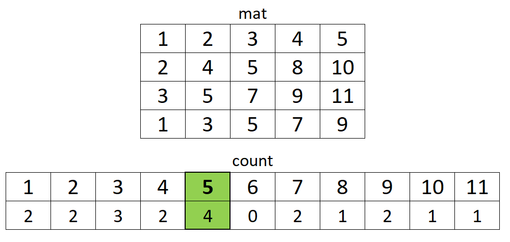

**Algorithm**

1. Iterate `i` through each row.

- Iterate `j` through each column.

- Increment `count` for element $\text{mat}[i][j]$.

2. Iterate `k` from `1` to `10000`.

- If $\text{count}[k]$ equals `n`, return `k`.

3. Return `-1`.

```cpp
int smallestCommonElement(vector<vector<int>>& mat) {
    int count[10001] = {};
    int n = mat.size(), m = mat[0].size();
    for (int i = 0; i < n; ++i) {
        for (int j = 0; j < m; ++j) {
            ++count[mat[i][j]];
        }
    }
    for (int k = 1; k <= 10000; ++k) {
        if (count[k] == n) {
            return k;
        }
    }
    return -1;
}
```

**Improved Solution**

We can improve the average time complexity if we count elements column-by-column. This way, smaller elements will be counted first, and we can exit as soon as we get to an element that repeats `n` times.

> For an unconstrained problem, we can use an unordered map (which should be faster than the ordered map as for the initial solution) if we count elements column-by-column.

```cpp
int smallestCommonElement(vector<vector<int>>& mat) {
    int count[10001] = {};
    int n = mat.size(), m = mat[0].size();
    for (int j = 0; j < m; ++j) {
        for (int i = 0; i < n; ++i) {
            if (++count[mat[i][j]] == n) {
                return mat[i][j];
            }
        }
    }
    return -1;
}
```

**Handling Duplicates**

If elements are in non-decreasing order, we'll need to modify these solutions to properly handle duplicates. For example, we return ```4``` (initial solution) and ```7``` (improved solution) instead of ```5``` for this test case:

`[[1,2,3,4,5],[5,7,7,7,7],[5,7,7,7,7],[1,2,4,4,5],[1,2,4,4,5]]`

It's easy to modify these solutions to handle duplicates. Since elements in a row are sorted, we can skip the current element if it's equal to the previous one.

**Complexity Analysis**

- Time complexity: $\mathcal{O}(nm)$, where $n$ and $m$ are the number of rows and columns.

- Space complexity:

- Constrained problem: $\mathcal{O}(10000)=\mathcal{O}(1)$.

- Unconstrained problem: $\mathcal{O}(k)$, where $k$ is the number of unique elements.

---

### Approach 2: Binary Search

We can go through each element in the first row, and then use binary search to check if that element exists in all other rows.

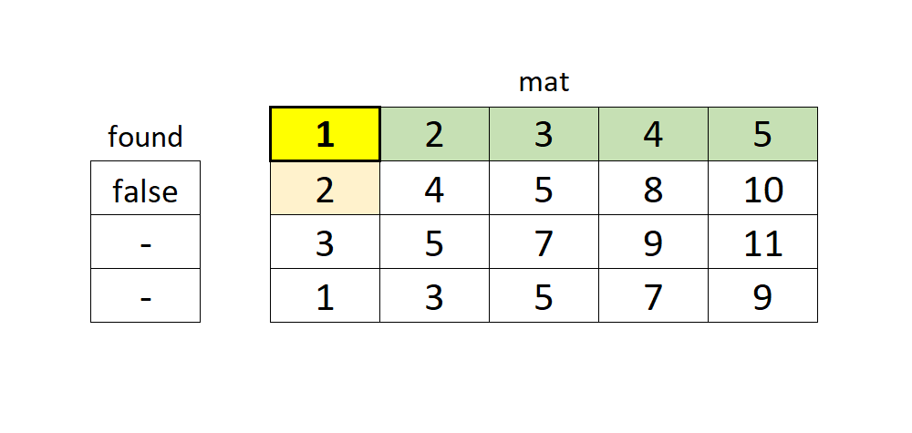

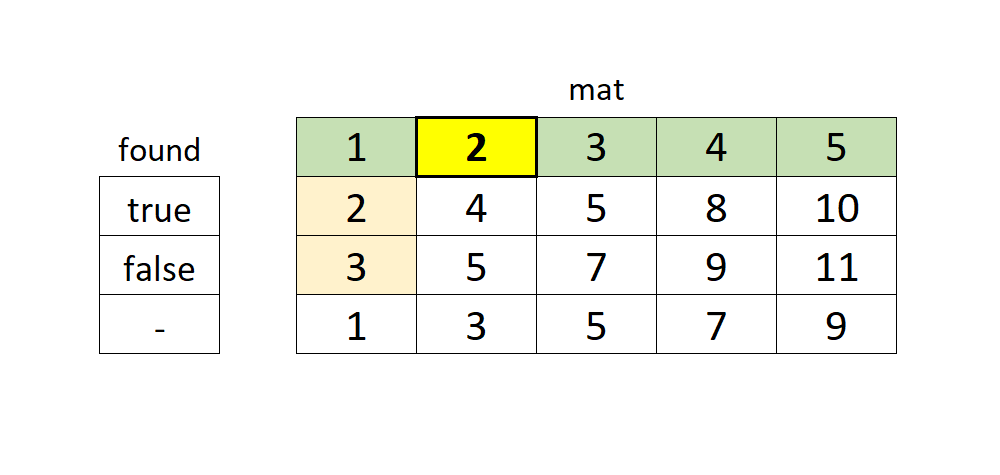

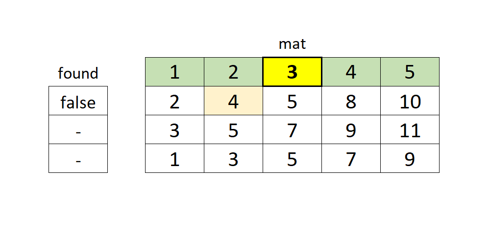

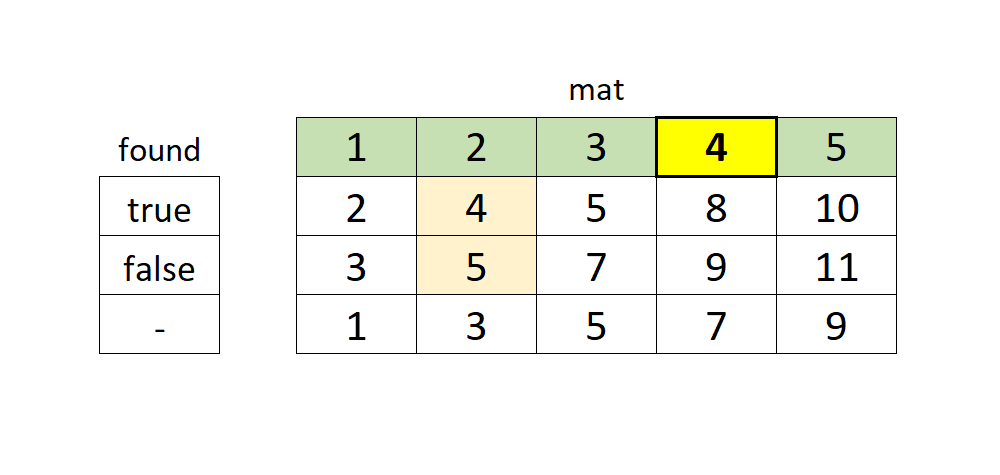

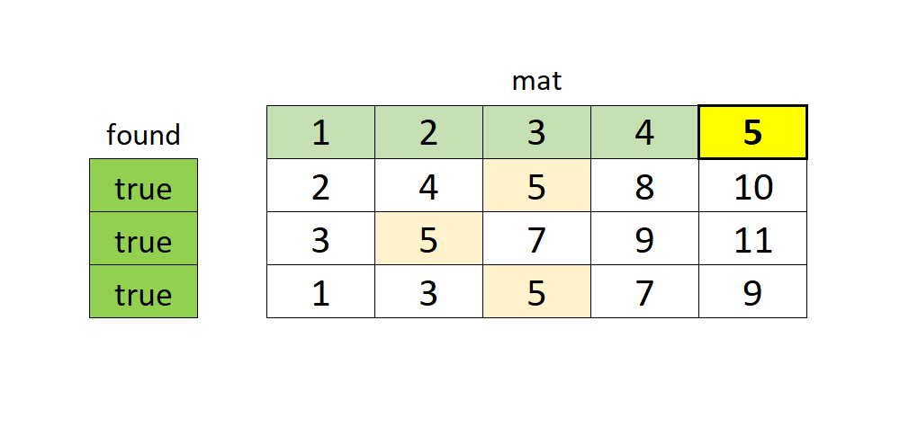

**Algorithm**

1. Iterate through each element in the first row.

- Initialize `found` to true.

- For each row:

- Use binary search to check if the element exists.

- If it does not, set `found` to false and exit the loop.

- If `found` is true, return the element.

2. Return `-1`.

```cpp
int smallestCommonElement(vector<vector<int>>& mat) {
    int n = mat.size(), m = mat[0].size();
    for (int j = 0; j < m; ++j) {
        bool found = true;
        for (int i = 1; i < n && found; ++i) {
            found = binary_search(begin(mat[i]), end(mat[i]), mat[0][j]);
        }
        if (found) {
            return mat[0][j];
        }
    }
    return -1;
}
```

**Improved Solution** <a name="approach2_improved"></a>

In the solution above, we always search the entire row. We can improve the average time complexity if we start the next search from the position returned by the previous search. We can also return `-1` if all elements in the row are smaller than value we searched for.

> Note that $\text{lower}_{bound}$ in C++ returns the position of first element that is equal (if exists) or greater than the searched value. In Java, `binarySearch` returns a positive index if the element exists, or $(-\text{insertion}_{point} - 1)$, where $\text{insertion}_{point}$ is also the position of the next greater element. In both cases, it points past the last element if all elements are smaller than the value being searched for.

```cpp
int smallestCommonElement(vector<vector<int>>& mat) {
    int n = mat.size(), m = mat[0].size();
    vector<int> pos(n);
    for (int j = 0; j < m; ++j) {
        bool found = true;
        for (int i = 1; i < n && found; ++i) {
            pos[i] = lower_bound(begin(mat[i]) + pos[i], end(mat[i]), mat[0][j]) - begin(mat[i]);
            if (pos[i] >= m) {
                return -1;
            }
            found = mat[i][pos[i]] == mat[0][j];
        }
        if (found) {
            return mat[0][j];
        }
    }
    return -1;
}
```

**Handling Duplicates**

Since we search for an element in each row, this approach works correctly if there are duplicates.

**Complexity Analysis**

- Time complexity: $\mathcal{O}(mn\log{m})$

- We iterate through $m$ elements in the first row.

- For each element, we perform the binary search $n$ times over $m$ elements.

- Space complexity:

- Original solution: $\mathcal{O}(1)$.

- Improved solution: $\mathcal{O}(n)$ to store search positions for all rows.

---

### Approach 3: Row Positions

We can enumerate elements in all rows in the sorted order, as described in approach 2 for the [23. Merge k Sorted List](https://leetcode.com/problems/merge-k-sorted-lists/solution/) problem.

For each row, we track the position of the current element starting from zero. Then, we find the smallest element among all positions, and advance the position for the corresponding row. We find our answer when all positions point to elements with the same value.

For this problem, however, we do not need to enumerate elements in the perfectly sorted order. We can determine the largest element among all positions and skip smaller elements in all other rows.

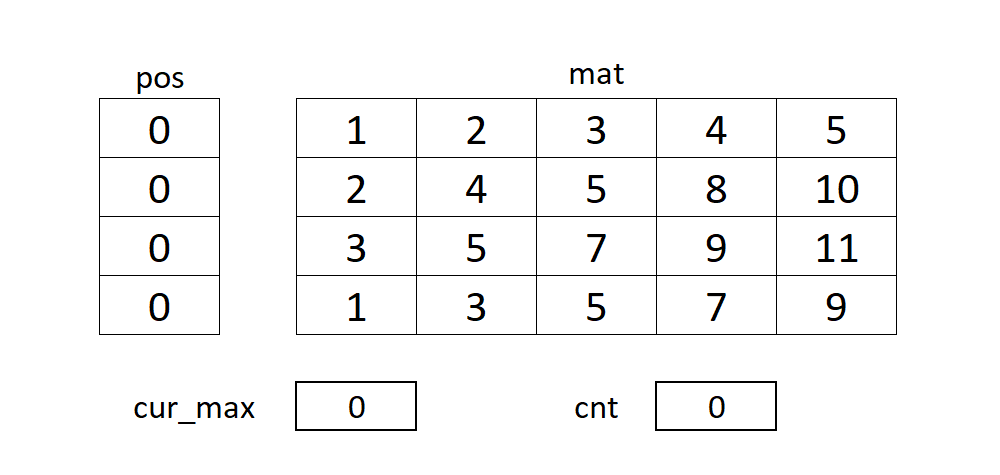

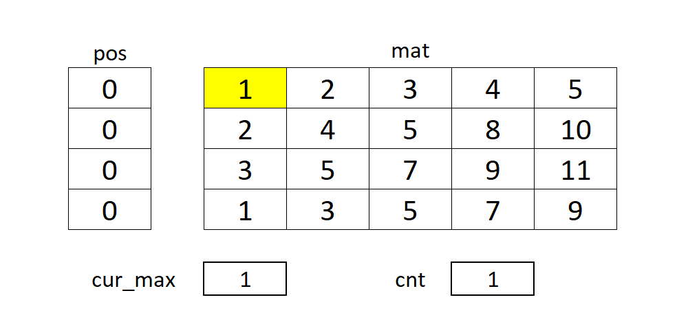

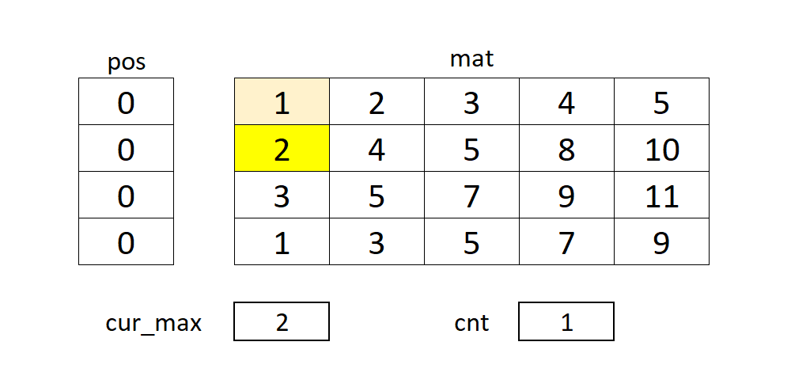

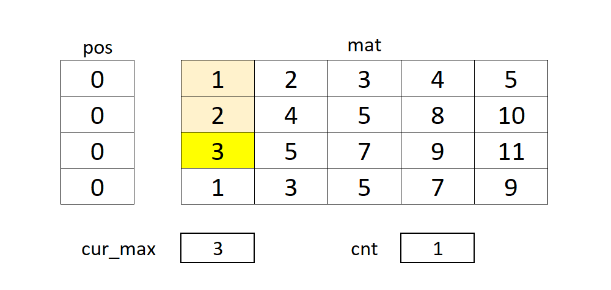

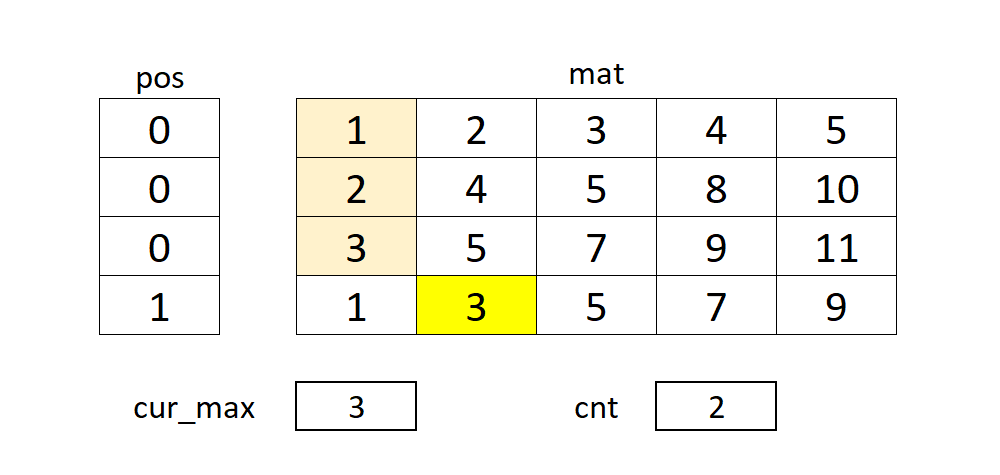

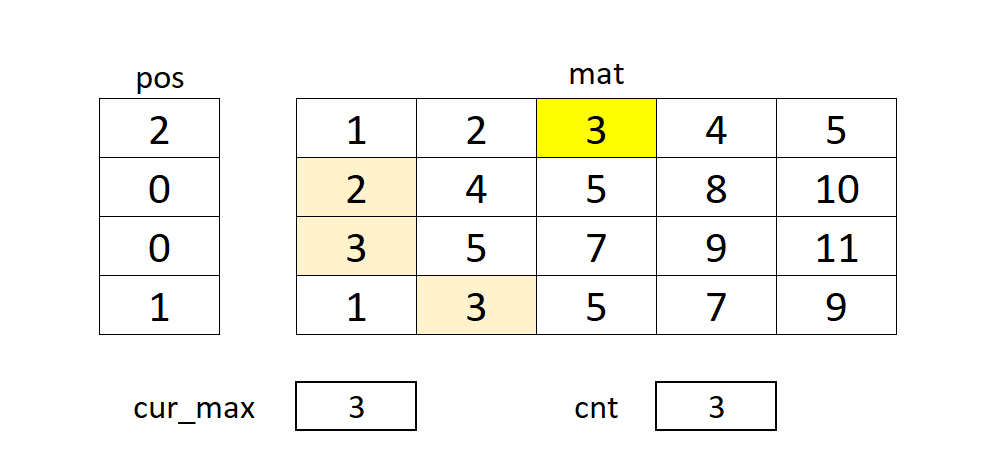

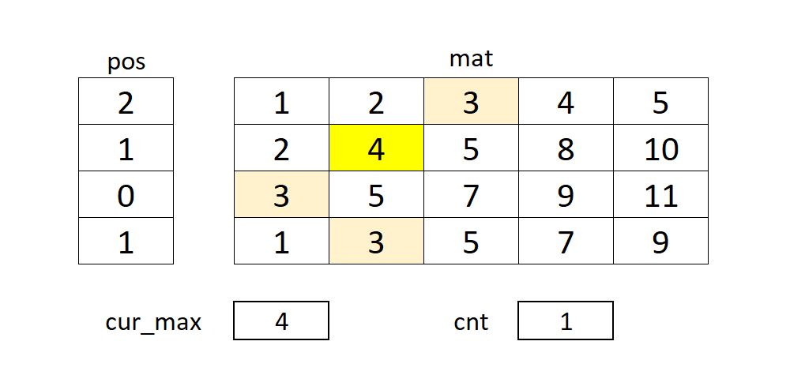

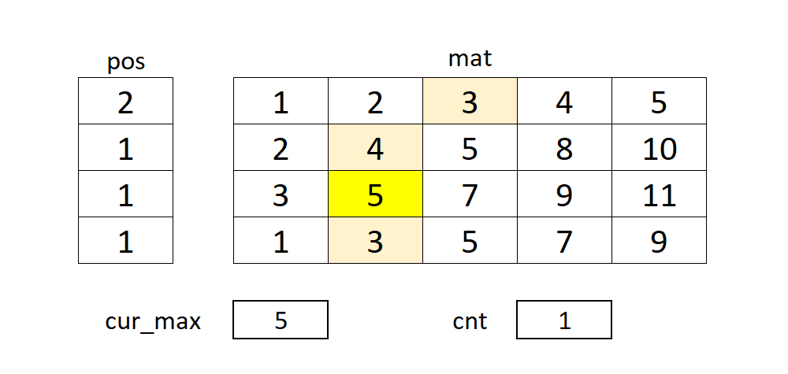

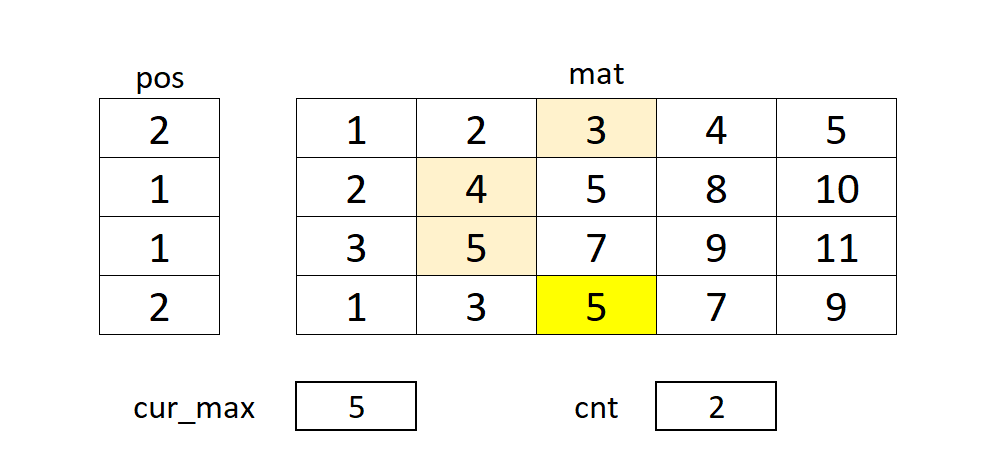

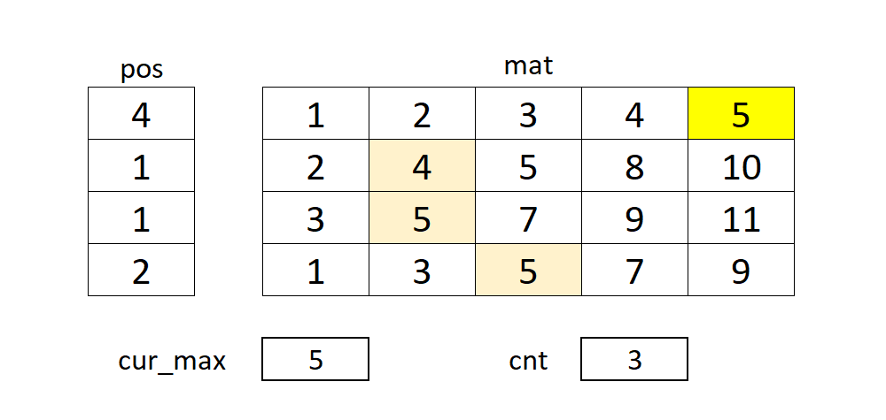

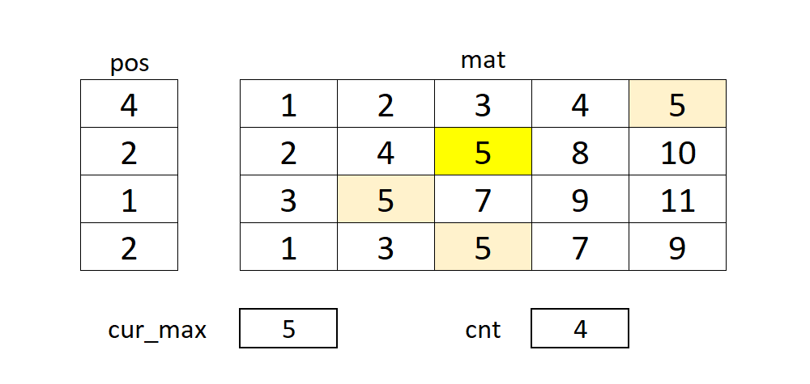

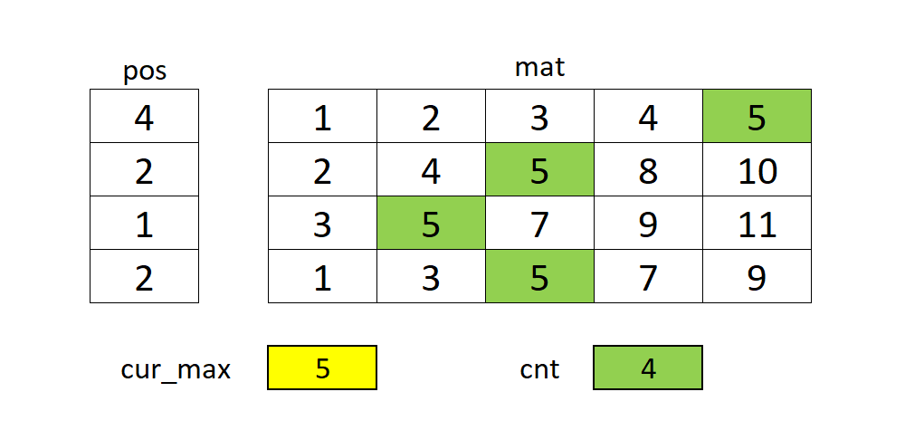

**Algorithm**

1. Initialize row positions, current max and counter with zeros.

2. For each row:

- Increment the row position until the value is equal or greater than the current max.

- If we reach the end of the row, return `-1`.

- If the value equals the current max, increase the counter.

- Otherwise, reset the counter to `1` and update the current max.

- If the counter is equal to `n`, return the current max.

3. Repeat step 2.

```cpp
int smallestCommonElement(vector<vector<int>>& mat) {
    int n = mat.size(), m = mat[0].size();
    int cur_max = 0, cnt = 0;
    vector<int> pos(n);
    while (true) {
        for (int i = 0; i < n; ++i) {
            while (pos[i] < m && mat[i][pos[i]] < cur_max) {
                ++pos[i];
            }
            if (pos[i] >= m) {
                return -1;
            }
            if (cur_max != mat[i][pos[i]]) {
                cnt = 1;
                cur_max = mat[i][pos[i]];
            } else if (++cnt == n) {
                return cur_max;
            }
        }
    }
    return -1;
}
```

**Handling Duplicates**

Since we take one element from each row, this approach works correctly if there are duplicates.

**Complexity Analysis**

- Time complexity: $\mathcal{O}(nm)$; we iterate through all $nm$ elements in the matrix in the worst case.

- Space complexity: $\mathcal{O}(n)$ to store row indices.

**Improved Solution**

We can use a binary search to advance positions, like in [Improved Solution for Approach 2](#approach2_improved).

While it can certantly improve the runtime, the worst case time complexity will be $\mathcal{O}(mn\log{m})$, which is a downgrade from $\mathcal{O}(nm)$ for the simple increment. The reason is that, if we need to advance row positions one-by-one, the binary search will still take $\mathcal{O}(\log{m})$ to find that very next value.

To optimize for the worst-case scenario, we can use the one-sided binary search (also known as the meta binary search), where we iterativelly double the distance from out position. The number of operations performed by such search will not exceed the distance between the original and resulting position, bringing the time complexity back to $\mathcal{O}(nm)$.

```cpp
int metaSearch(vector<int> &row, int pos, int val, int d = 1) {
    int sz = row.size();
    while (pos < sz && row[pos] < val) {
        d <<= 1;
        if (row[min(pos + d, sz - 1)] >= val) {
            d = 1;
        }
        pos += d;
    }
    return pos;
}
int smallestCommonElement(vector<vector<int>>& mat) {
    int n = mat.size(), m = mat[0].size();
    int cur_max = 0, cnt = 0;
    vector<int> pos(n);
    while (true) {
        for (int i = 0; i < n; ++i) {
            pos[i] = metaSearch(mat[i], pos[i], cur_max);
            if (pos[i] >= m) {
                return -1;
            }
            if (cur_max != mat[i][pos[i]]) {
                cnt = 1;
                cur_max = mat[i][pos[i]];
            } else if (++cnt == n) {
                return cur_max;
            }
        }
    }
    return -1;
}
```