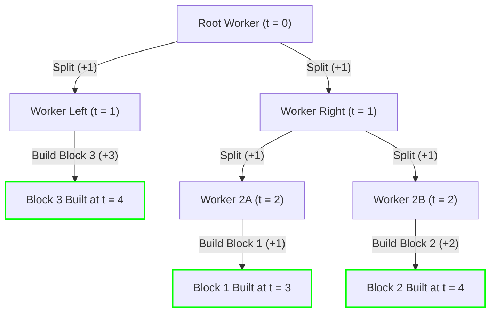

# Guided Example: Minimum Time to Build Blocks

## 1. Problem Essence & Algorithmic Mental Model

We are tasked with constructing a collection of blocks given by their respective build times $\text{blocks} = [b_0, b_1, \dots, b_{n-1}]$. At time $t = 0$, we begin with a single active worker. A worker can perform one of two actions:
1. **Build a block**: Choose an unbuilt block $i$ and spend $b_i$ units of time constructing it. Upon completion, that block is built, and the worker retires.
2. **Split into two workers**: Spend $\text{split}$ units of time splitting into two independent workers. Once the split finishes, both resulting workers may independently build or split further in parallel.

Our goal is to determine the minimum total time (makespan) required to build all $n$ blocks.

The core realization is that every valid construction schedule corresponds to a **Full Binary Tree of Worker Divisions**:
- The single initial worker is the root of the tree (depth 0).
- Each internal node represents a worker split taking time $\text{split}$.
- Each leaf represents the construction of a specific block $b_i$.
- If block $b_i$ is placed at depth $d_i$ in the tree (meaning its worker was produced after $d_i$ sequential splits), the completion time of that block is:
  $$\text{Completion}(i) = d_i \cdot \text{split} + b_i$$
- The overall project duration is the bottleneck completion time across all leaves:
  $$T = \max_{0 \le i < n} (d_i \cdot \text{split} + b_i)$$

This mirrors **Huffman Coding / Optimal Merge Trees**:
Instead of planning top-down from 1 worker into $n$ workers, we invert the perspective and construct the optimal binary tree **bottom-up**:
When two subproblems with makespans $c_1$ and $c_2$ (with $c_1 \le c_2$) are combined under a single predecessor worker, that worker spends $\text{split}$ time dividing into two workers who then execute the two sub-schedules in parallel. Because they run concurrently, the time required for this merged branch is:
$$\text{Cost}(\text{merged}) = \max(c_1, c_2) + \text{split} = c_2 + \text{split}$$

To keep overall costs minimal, we should always merge the two sub-schedules that finish the earliest (the two smallest values). Merging them into a single task with duration $c_2 + \text{split}$ and repeating this reduction until a single root remains guarantees the optimal makespan.

```
Bottom-Up Merge Equivalence (Huffman-Style Min-Heap):

Initial Leaves:    [1]    [2]       [5]
                     \   /
                      (Split)
                         │
Merged Node:           [2 + split]   [5]
                            \        /
                             (Split)
                                │
Final Root:               [max(2+split, 5) + split]
```

---

## 2. Mathematical Formalism & Invariants

Let $B = \{b_0, b_1, \dots, b_{n-1}\}$ be the multiset of block build times.
Let $s = \text{split} \in \mathbb{Z}^+$ be the split cost.

### Binary Schedule Tree Invariant
A valid schedule is a rooted binary tree $\mathcal{T}$ with $n$ leaves, where each leaf $i \in \{0, \dots, n-1\}$ has a depth $d_i$ satisfying the Kraft-McMillan inequality:
$$\sum_{i=0}^{n-1} 2^{-d_i} \le 1$$
The makespan objective is:
$$\min_{\mathcal{T}} \max_{0 \le i < n} (d_i \cdot s + b_i)$$

### Bottom-Up Parallel Composition Operator
For any two independent tasks with completion times $c_1, c_2 \in \mathbb{R}_{\ge 0}$:
Joining them under a parent split creates a compound task with completion duration:
$$c_1 \odot c_2 = \max(c_1, c_2) + s$$

### Greedy Choice Property (Huffman Isomorphism)
Let $H$ be a min-heap initially populated with the $n$ block durations:
$$H_0 = B$$
At each step $k \in [1, n-1]$:
1. Extract the two smallest elements:
   $$c_1 = \min(H_{k-1}), \quad c_2 = \min(H_{k-1} \setminus \{c_1\}) \quad (\text{with } c_1 \le c_2)$$
2. Form the merged node value:
   $$c_{\text{new}} = c_2 + s$$
3. Reinsert into the heap:
   $$H_k = (H_{k-1} \setminus \{c_1, c_2\}) \cup \{c_{\text{new}}\}$$

After $n-1$ iterations, $|H_{n-1}| = 1$. The remaining scalar is the optimal makespan $T^*$.

---

## 3. Concrete Example Execution & State Evolution

Consider the configuration:
- $\text{blocks} = [1, 2, 3]$
- $\text{split} = 1$

### Step-by-Step Min-Heap Reduction Trace

| Step $k$ | Active Min-Heap State | Popped First ($c_1$) | Popped Second ($c_2$) | Merged Value $c_2 + s$ | Updated Heap after Re-insertion |
|---|---|---|---|---|---|
| Initial | $\{1, 2, 3\}$ | - | - | - | $\{1, 2, 3\}$ |
| Step 1 | $\{1, 2, 3\}$ | $1$ | $2$ | $2 + 1 = 3$ | $\{3, 3\}$ |
| Step 2 | $\{3, 3\}$ | $3$ | $3$ | $3 + 1 = 4$ | $\{4\}$ |
| Final | $\{4\}$ | - | - | - | **Makespan = 4** |



### Schedule Verification:
- Time $t = 0$: Initial worker splits into Worker A and Worker B. Split completes at $t = 1$.
- Time $t = 1$:
  - Worker A begins building Block 3 (duration 3). Completes at $t = 1 + 3 = 4$.
  - Worker B splits again into Worker B1 and Worker B2. Split completes at $t = 2$.
- Time $t = 2$:
  - Worker B1 builds Block 1 (duration 1). Completes at $t = 2 + 1 = 3$.
  - Worker B2 builds Block 2 (duration 2). Completes at $t = 2 + 2 = 4$.
- All blocks finished by $t = \max(4, 3, 4) = 4$.

---

## 4. Multi-Approach Comparison & Trade-Offs

| Metric / Dimension | Top-Down Recursive Memoization | Binary Search on Answer + Greedy Check | Min-Heap Huffman Reduction (Optimal) |
|---|---|---|---|
| **Paradigm** | Dynamic programming over (block_idx, workers) | Guess makespan $T$, verify worker counts | Bottom-up greedy priority queue |
| **Time Complexity** | $\mathcal{O}(N^2)$ states | $\mathcal{O}(N \log(\max B + N \cdot s))$ | $\mathcal{O}(N \log N)$ |
| **Auxiliary Memory** | $\mathcal{O}(N^2)$ DP memoization table | $\mathcal{O}(1)$ or $\mathcal{O}(N)$ recursion | $\mathcal{O}(N)$ binary heap storage |
| **Implementation Footprint**| Complex state transitions / bounds | Custom tree feasibility validator | 6 lines of code |
| **Theoretical Connection** | State-space search | Decision-version reduction | Direct Huffman coding isomorphism |

```
Execution Comparison:

Top-Down DP:
Explores: "Should 1 worker split or build block i?" -> Massive branching tree of state options!

Huffman Min-Heap (Optimal):
[Heapify blocks] -> Repeatedly pair smallest two: heappush(heappop() + split) -> Instant O(N log N)!
```

---

## 5. Algorithmic Edge Cases & Boundary Analysis

| Scenario | Input Condition | Expected Makespan | Rationale & Mechanism |
|---|---|---|---|
| **Single Block ($N = 1$)** | `blocks = [7]`, any `split` | 7 | Heap loop `while len > 1` never executes; returns `blocks[0] = 7` immediately without splitting. |
| **Zero Split Time** | $\text{split} = 0$ | $\max(\text{blocks})$ | Splitting is instantaneous; unlimited workers are created at $t=0$; all blocks built in parallel. |
| **Enormous Split Cost** | $\text{split} \gg \sum b_i$ | Still splits as needed | The algorithm still produces a valid full binary tree with $N$ leaves, as 1 worker can only build 1 block. |
| **All Blocks Identical** | `blocks = [5, 5, 5, 5]`, `split = 2` | $5 + 2 \times 2 = 9$ | Merges into balanced binary tree of depth 2: $5 + 2 \cdot s = 9$. |
| **Skewed Block Durations** | One massive block e.g. `[1, 1, 1, 1000]` | $1000 + s$ | The huge block remains at depth 1 while smaller blocks cluster at deeper levels. |

---

## 6. Mathematical Verification & Complexity Derivation

Let $N = |\text{blocks}|$ be the number of blocks to build.

### Algorithm Phases:
1. **Heap Construction (`heapify`)**:
   - Initializing the binary min-heap from an array of $N$ integers requires $\mathcal{O}(N)$ linear time using Floyd's heap construction algorithm.
2. **Sequential Reductions**:
   - The loop runs exactly $N - 1$ times because each iteration extracts 2 elements and inserts 1 element, strictly reducing heap size by 1:
     $$N \to N-1 \to N-2 \to \dots \to 1$$
   - In iteration $k$:
     - First extraction: $\text{heappop}()$ takes $\mathcal{O}(\log(N - k + 1))$.
     - Second extraction: $\text{heappop}()$ takes $\mathcal{O}(\log(N - k))$.
     - Insertion of $c_2 + s$: $\text{heappush}()$ takes $\mathcal{O}(\log(N - k + 1))$.
   - Total operations across all $N-1$ iterations:
     $$\sum_{k=1}^{N-1} 3 \log(N - k + 1) = \mathcal{O}(N \log N)$$

### Complexity Summary:
- **Total Time Complexity:** $\mathcal{O}(N \log N)$ strictly optimal comparison-based time.
- **Total Auxiliary Space Complexity:** $\mathcal{O}(N)$ memory to store the min-heap elements.

---

## 7. Synthesis & Strategic Takeaways

1. **The Inversion Principle in Scheduling**: When top-down decision trees branch exponentially from a single initial worker, invert the perspective. Composing sub-schedules bottom-up transforms an intractable branching search into a deterministic greedy merge.
2. **Huffman Duality for Parallel Makespans**: In sequential Huffman coding, costs add along the tree ($\sum w_i d_i$). In parallel scheduling with uniform split penalties, the operation becomes $c_2 + \text{split}$, which preserves the greedy choice property and allows direct re-use of the Huffman heap pattern.
3. **The Kraft-McMillan Criterion for Parallel Tree Schedules**: Any valid division schedule for $N$ workers corresponds to a prefix code tree. Minimizing the maximum leaf depth weighted by build time produces the optimal makespan.
