## Solution

---

### Overview

Let's analyze a few statements given in the problem description.

- *"A block can only be built by exactly one worker"*

- *"A worker can (either) split into two workers or build a block"*

    > Since a block can only be built by exactly one worker, so if the worker has decided not to split, then he has to build a block. He/she then cannot be used to build another block.

- *"Return the minimum time needed to build all blocks. Initially, there is only **one** worker."*

    > Initially we have only one worker, but we have to build all the blocks, say $N$ blocks. Thus, we need at least $N$ workers to build all the blocks. Thus, we should do the necessary splits to produce $N$ workers.

Let's take an example of $N$ as $4$. Here's the initial worker.

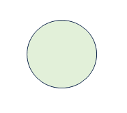
<br/>

We have two options, either to build a block or to split, but the building would be invalid because once built, we won't be having any workers to build the remaining blocks. Thus, we have to split. The split looks like this.

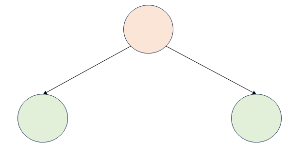
<br/>

We should note that after splitting, the top-most worker is not available for building blocks. Hence we only have $2$ workers now, and not $3$.

> The split can be visualized as a tree, where the root node is the initial worker. In terms of tree theory, we can say that **only leaf nodes (green colored) can build blocks**.

Thus, we should split until we have $N$ leaf nodes. From the above-given orientation, we can produce $4$ leaf nodes as one of the following.

| Description | Visualization |
| :--- | :--- |
| Split both leaf node of depth-1 to have $4$ leaf nodes | 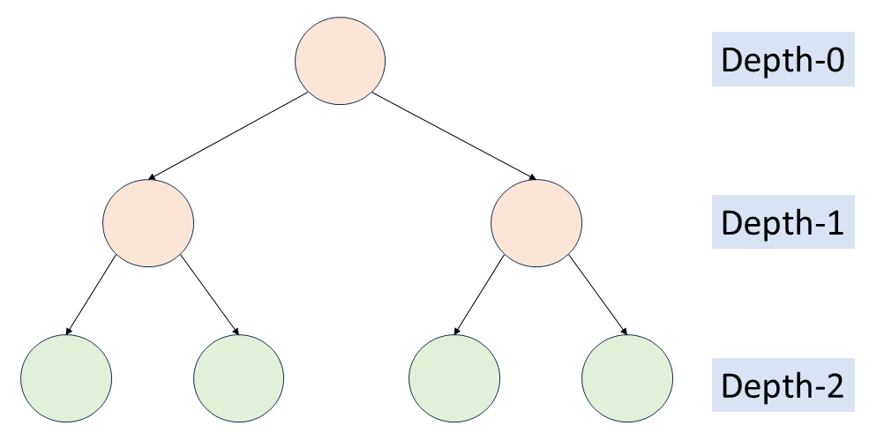 |
| Split left leaf node of depth-1, and left-most leaf node of depth-2 to have $4$ leaf nodes | 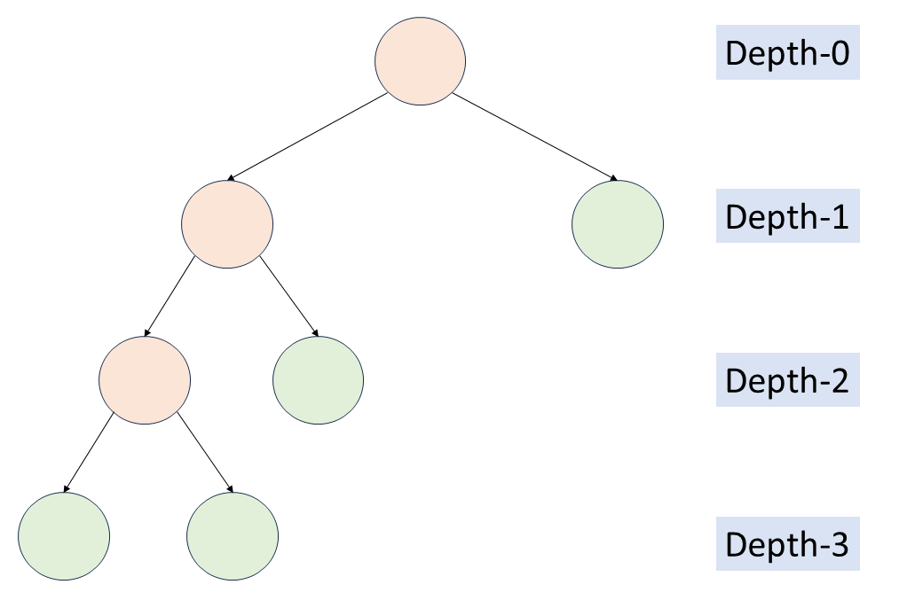  |
| Split left leaf node of depth-1, and right-most leaf node of depth-2 to have $4$ leaf nodes | 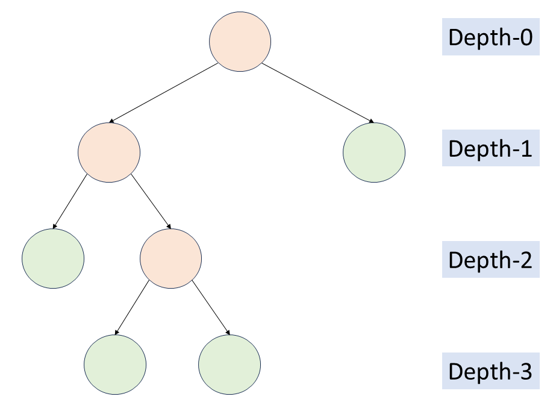  |
| Split right leaf node of depth-1, and left-most leaf node of depth-2 to have $4$ leaf nodes | 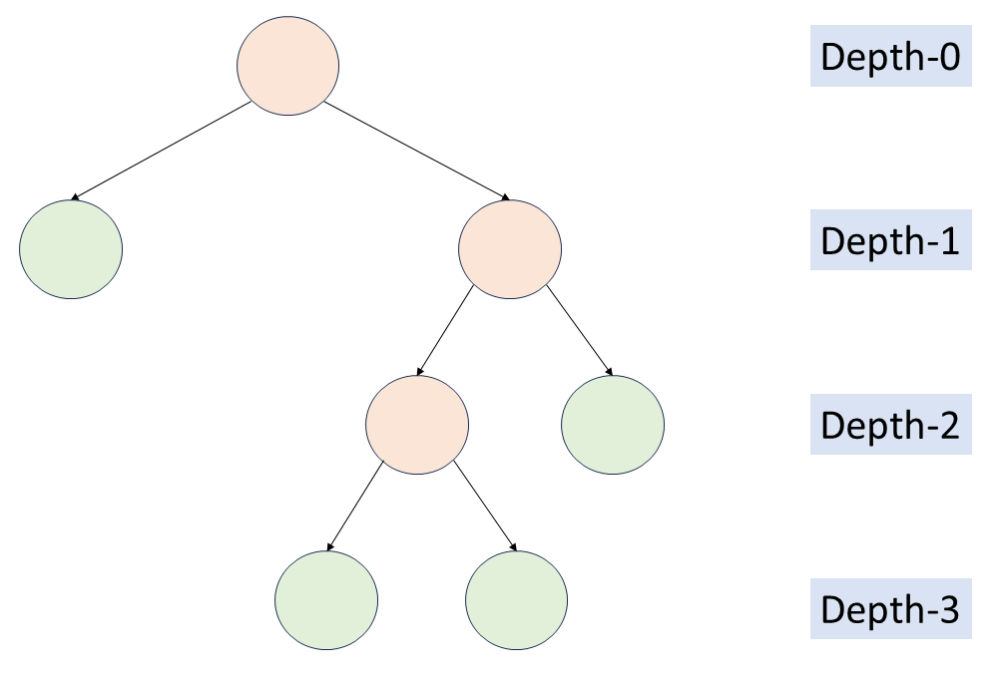  |
| Split right leaf node of depth-1, and right-most leaf node of depth-2 to have $4$ leaf nodes | 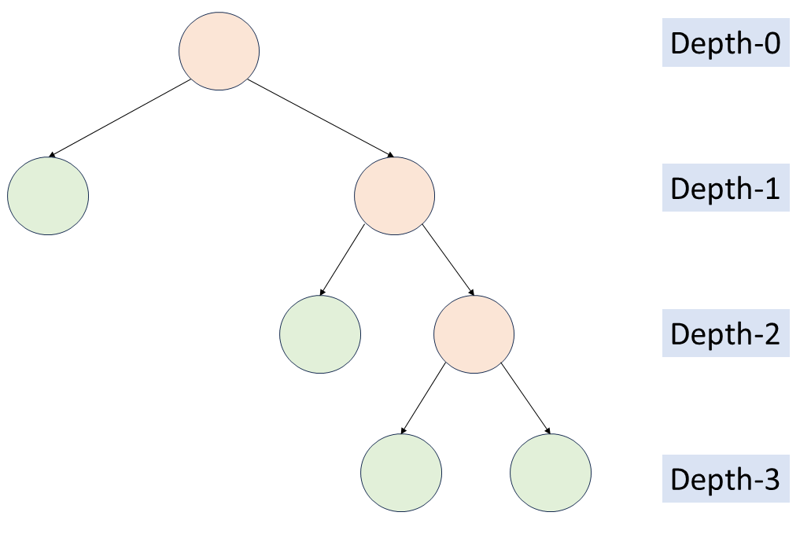  |

Now, we have $4$ leaf nodes, and we can build $4$ blocks. The time taken by a worker (leaf node) to build a block is the sum of

- the depth of the leaf node. Assuming the depth of the root node to be 0, the depth of the leaf node is the number of edges from the root node to that leaf node. These depths signify the number of splits required to produce that worker.

    Thus, if the depth is $d$, then the time factor because of split would be $d \cdot \text{split}$, where $\text{split}$ is the time taken to split, given as input `split`.

- the block assigned to that worker. Out of $N$ blocks, we can assign any non-assigned block to this leaf node. Let's assign blocks from left to right. Thus, leaf node at index `i` *(let's index from left to right)* would be assigned $\text{blocks}[i]$

Hence, the total time taken by a worker (leaf node) to build a block is $\text{blocks}[i] + (\text{depth}[i] * split)$.

The total time taken by a tree would depend on the maximum time taken by a worker to build his/her block.

Hence, **total time** would be $max(\text{blocks}[i] + (\text{depth}[i] * split))$ for all `i` in `0 ~ N-1`. The problem aims to minimize this total time.

For the time being, let's forget the fact of assigning $\text{leaf}[i]$ to $\text{blocks}[i]$. We can very intuitively see that

- the block which takes maximum time to build, should be assigned to the leaf node which is nearest to the root node.

    > This is because the leaf node at the lowest depth would have the least time factor because of the split. It's always better to assign the block which takes the maximum time to build, to the worker which takes the minimum split to produce.

- the leaf node farthest from the root node should be assigned the block with the minimum build time.

    > This is because the leaf node at the maximum depth would have the maximum time factor because of the split. It's always better to assign the block which takes minimum time to build, to the worker which takes maximum split to produce.

Hence, due to this property, we can say that the orange path below should be assigned `min(blocks)` and the blue path should be assigned `max(blocks)`, in the following four trees. Thus, the following four trees are symmetric.

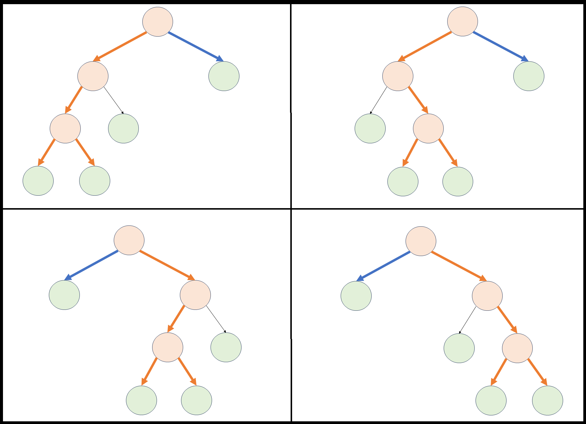
<br/>

> We can note that **sorting** would help us in assigning the blocks to the leaf nodes.

Thus, we have two tree structures as choices. Let's assume the **sorted order** of `blocks` is `[a, b, c, d]`. The time taken by these individual trees can be computed, provided `split` as `s`.

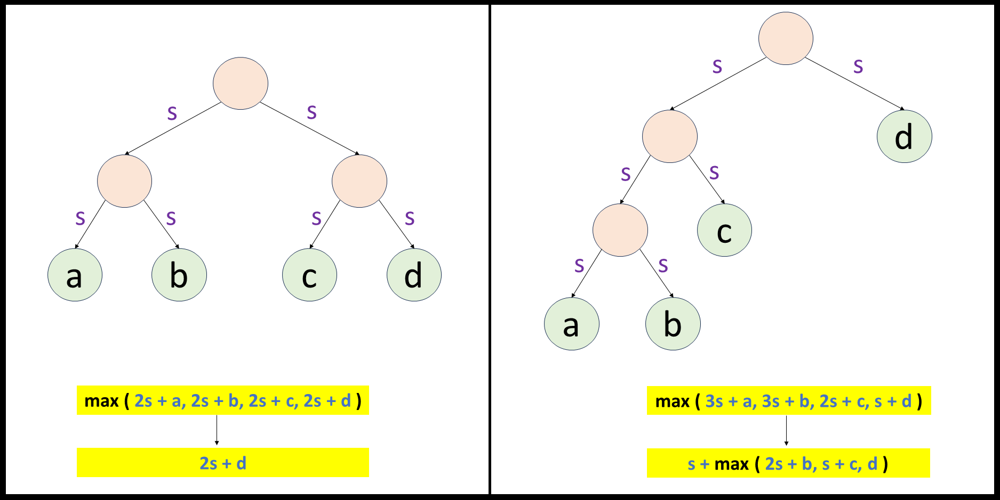
<br/>

**Which of the two trees' structures is best?**
It certainly depends on the value of `a`, `b`, `c`, `d`, and `s`.

- if sorted `blocks` is `[2, 3, 4, 5]`, and `s` is `7`, then the left tree would give time as `19`, and the right tree would give time as `24`. Hence, the left tree is preferred for this set of inputs.

- if sorted `blocks` is `[2, 3, 4, 20]`, and `s` is `7`, then the left tree would give time as `34`, and the right tree would give time as `27`. Hence, the right tree is preferred for this set of inputs.

- if sorted `blocks` is `[2, 3, 4, 5]`, and `s` is `2`, then both the trees would give time as `9`. Both are equally preferred for this set of inputs.

Thus, the best tree structure depends on the input. This hints that we may have to **look for all possible options**, and choose the best one.

The editorial tries to systematically find the best tree structure.

---

### Approach 1: Top-down Dynamic Programming

#### Intuition

Let's analyze the two asymmetric trees we discussed above.

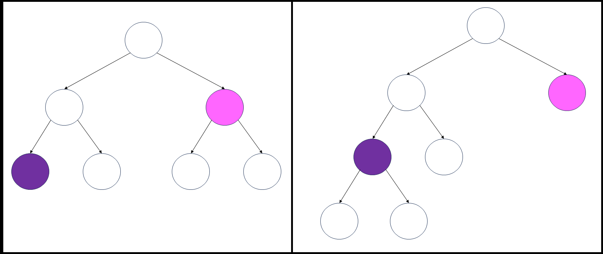
<br/>

**What set of actions, and particularly action by which node, lead to the production of two different trees?**

- The purple node (worker) decided to work (and go home) in the left tree, but the same purple node decided to split in the right tree.

- The pink node (worker) decided to split in the left tree, but the same pink node decided to work (and go home) in the right tree.

Thus, every node has two options, choosing one of which leads to the production of two different trees.
- work, and continues as a leaf node
- split, and become an internal node

To formulate, let's assume we want to successfully build all the blocks after index `b` using `w` workers. This we can do by focussing on current block at index `b`, and then recursively building the next block at index $b + 1$.

*As discussed in the [overview](#overview) section, it's always better to assign the block which takes maximum time to build, to the worker which takes minimum split to produce.* **Hence, we should sort the `blocks` in descending order.**

Let's define a function `solve(b, w)` which returns the **minimum** time taken to finish all the blocks in the suffix array `blocks[b ~ N-1]` using `w` workers. **After building the block at index `b`, it will recursively try to build the next block**, i. e. $blocks[b + 1]$. The calling of `solve(b, w)` implies that we have already built blocks before index `b`, because of the recursive nature of the function, provided we initially call the function with `b` as `0`.

Initially, we have $w = 1$. We would call `solve(0, 1)` to build the blocks after index `0` using the `1` worker, which implicitly means
- that we have already built blocks before index `0`
- this function call will build $\text{blocks}[0]$
- also, this function call will do the sufficient task to build all blocks after index `0`

Before moving to the recursive formulation, let's try to analyze a few easy cases.

- if $b = N$, it means we have built all the blocks. We don't need any more time. Thus, $solve(N, w) = 0$.

- if $w = 0$, then no matter what the value of `b` is, we can't build any block, or we can say that it will take infinite time to build any block. Thus, $solve(b, 0) = inf$.

- we have already built blocks before index `b`, or we can say we have built `b` blocks.

    > `b` as `1` implies we have built `1` block, namely $\text{blocks}[0]$.

    Our main purpose was to build all `N` blocks. The number of remaining blocks to be built is $N - b$. If we have produced sufficient workers by splitting, then we can build all the remaining blocks. The time taken would be the maximum time taken by any worker to build his/her block.

    However, since we have sorted the `blocks` in descending order, the maximum time taken by any worker to build his/her block would be $\text{blocks}[b]$.

    Hence, if $w \ge N - b$, then $solve(b, w) = \text{blocks}[b]$.

Hence, all these cases don't require any recursive call, thus these are the **base cases.**

```Pseudocode []
solve(b, w):
    if b == N:
        return 0
    if w == 0:
        return inf
    if w >= N - b:
        return blocks[b]
    .
    .
    .
```

Now, let's move to the recursive part. We have two options, either to work or to split.

1. If we used this worker to build `blocks[b]`, then our next task would be to move to the next worker with `w - 1` workers.

    Since both things can work in parallel, the total time taken for solving this sub-problem would be the maximum time taken by both things.

    Hence, using this worker for building `blocks[b]` would take `max(blocks[b], solve(b + 1, w - 1))` time.

2. If we used this worker to split, then our next task would be to build **this** block only. We should note that we haven't built this block yet. Splitting requires time `split`.

**How many workers to split?**: In problem description, it's given that

    > Note that if two workers split at the same time, they split in parallel so the cost would be `split`.

    Therefore, if we have `w` workers at this node, then it would be better to split all `w` workers. Isn't it? With the same time-cost of `split`, we can produce `w` additional workers. A full split is always better than a partial split. After a full split, more workers can do more work in parallel.

**Is it really necessary to produce `w` additional workers?** No, it's not. We can note that even producing `N - b` additional workers would be sufficient to build all the remaining blocks. Hence, after splitting, we can say that we have `min(2 * w, N - b)` workers.

    Thus using this worker for splitting would take `split + solve(b, min(2 * w, N - b))` time.

Out of these two cases, we would choose one which ultimately would take minimum time. Hence, `solve(b, w)` would be the minimum of these two cases.

```Pseudocode []
solve(b, w):
    .
    .
    .
    .
    work_here = max(blocks[b], solve(b + 1, w - 1))
    split_here = split + solve(b, min(2 * w, N - b))

    return min(work_here, split_here)
```

Now, every `(b, w)` pair would call two sub-problems, and each of these sub-problems would call two sub-problems, and so on. This would lead to an exponential number of sub-problems.

However, we can notice that the parameters `b` and `w` are changing in a particular range. `b` is changing from `0` to `N`, and `w` is changing from `0` to `N` only. Hence, there would be $O(N^2)$ sub-problems.

Thus, instead of solving the same sub-problem again and again, we can store the result of each sub-problem and use it whenever required.

> The programming paradigm is often called Dynamic Programming. If you're not familiar with this, you can check the [**Dynamic Programming Explore Card**](https://leetcode.com/explore/learn/card/dynamic-programming/)

To store the result, since there are two state variables `b` and `w`, we can use a 2D array `dp` to store the result of each sub-problem. `dp[b][w]` would store the result of `solve(b, w)`. The `b` would be the row index and `w` would be the column index.
- `b` varies from `0` to `N - 1`, so we need `N` rows. `b = N` is a base case.
- `w` varies from `0` to `N`, so we need `N + 1` columns. However, `w = 0` is a base case, and needs not to be stored, hence the first column values can be treated as garbage values.

> If there are $T$ state variables, then we need an array of at most $T$ dimensions to store the result of each sub-problem.

There is no hard-and-fast rule to use a two-dimensional array. We may use a hash map to cache the result of each sub-problem. The key of the hash map would be the pair `(b, w)` and the value would be the result of `solve(b, w)`.

The implementation below uses a 2D array, readers are encouraged to try this problem using the hash map as well.

#### Algorithm

1. Sort the `blocks` in descending order.

2. Initialize a 2D array `dp` of size `N * (N + 1)` with `-1`.

3. Define a function `solve(b, w)` which returns the minimum time taken to finish all the blocks in the suffix array `blocks[b ~ N-1]` using `w` workers, provided `blocks` is sorted in descending order. Apart from `b` and `w`, it can take other parameters so that we can access the required variables.

- If `b == blocks.length`, then we have already built all the blocks. Hence, return `0`.

- If `w == 0`, then we can't build any block. Hence, return `Integer.MAX_VALUE`.

- If `w >= blocks.length - b`, then we can build all the remaining blocks without additional workers. Hence, return `blocks[b]`, the block which will take the maximum time to build out of all the remaining blocks.

- If subproblem `(b, w)` is already solved, then return the result from `dp`. It can be checked by checking if `dp[b][w] != -1`.

- Otherwise, we have two choices

- Work here. Save its optimal result in `work_here`. It would be `max(blocks[b], solve(b + 1, w - 1))`.

- Split here. Save its optimal result in `split_here`. It would be `split + solve(b, min(2 * w, blocks.length - b))`.

- Save the minimum of `work_here` and `split_here` in `dp[b][w]`.

- Return `dp[b][w]`.

4. Call `solve(0, 1)` because we have to finish all the blocks in the suffix array `blocks[0 ~ N-1]`, and we have only one worker at the beginning.

#### Implementation

```python
class Solution:
    def minBuildTime(self, blocks, split):
        n = len(blocks)

        # Sort the blocks in descending order
        blocks.sort(reverse=True)

        # dp[i][j] represents the minimum time taken to
        # build blocks[i~n-1] block using j workers
        dp = [[-1] * (n + 1) for _ in range(n)]

        def solve(b, w):
            # Base cases
            if b == n:
                return 0
            if w == 0:
                return float('inf')
            if w >= n - b:
                return blocks[b]

            # If the sub-problem is already solved, return the result
            if dp[b][w] != -1:
                return dp[b][w]

            # Two Choices
            work_here = max(blocks[b], solve(b + 1, w - 1))
            split_here = split + solve(b, min(2 * w, n - b))

            # Store the result in the dp array
            dp[b][w] = min(work_here, split_here)
            return dp[b][w]

        # For block from index 0, with 1 worker
        return solve(0, 1)
```

#### Complexity Analysis

Let $N$ be the length of `blocks`.

* Time complexity: $O(N^2)$.

- Sorting would take $O(N \cdot \log N)$ time.

- Initializing the `dp` array would take $O(N^2)$ time, since there are $N * (N + 1)$ elements in the array.

- Then, we are calling the `solve` function. It will be called at most $O(N^2)$ times, since there are $N * (N + 1)$ elements in the `dp` array, and each element is called at most once. In every sub-problem call, we are doing $O(1)$ work.

    Hence, the total time complexity would be $O(N^2)$.

* Space complexity: $O(N^2)$.

- We are sorting the `blocks` array in place. When we sort an array in place, some extra space is used. The space complexity depends on the implementation of the sorting algorithm in the programming language.
- In Python, the `sort` method sorts a list using the Timsort algorithm, which is a combination of Merge Sort and Insertion Sort and uses $O(N)$ additional space.

- In C++, the `sort()` function is implemented as a hybrid of Quick Sort, Heap Sort, and Insertion Sort, with worst-case space complexity of $O(\log N)$.
- In Java, `Arrays.sort()` is implemented using a variant of the Quick Sort algorithm which has a space complexity of $O(\log N)$.

- The `dp` array would take $O(N^2)$ space, since there are $N * (N + 1)$ elements in the array.

    Hence, the total space complexity would be $O(N^2)$.

---

### Approach 2: Bottom-up Dynamic Programming

#### Intuition

Let's transform the recursive solution into an iterative solution.

For this let's write the mathematical recurrence for the problem.

> For succinctness
> - we will use $b$ to denote the index of the block we are currently building.
> - we will use $w$ to denote the number of workers we have available.
> - for `split`, we will use $s$.
> - `solve` will be replaced by $T$ implicitly representing the minimum time taken to build the remaining blocks.
> - `blocks.length` will be replaced by $N$.

$T(b, w)$ represents the minimum time taken to build all the blocks starting from index $b$ using $w$ workers. The equation for the recurrence (which is often called Bellman Equation) is

$$T(b, w) = \begin{cases} 0 & \text{if } b = N \\
\infty & \text{if } w = 0 \\
blocks[b] & \text{if } w \geq N - b \\
\\
\min\bigg(\max\big(blocks[b], T(b + 1, w - 1)\big), s + T\big(b, \min(2 * w, N - b)\big)\bigg) & \text{otherwise} \end{cases}$$

Since there are two state variables `b` and `w`, we will use a two-dimensional array `dp` to store the results of the sub-problems. `dp[b][w]` will store the value of $T(b, w)$.

Our agenda is to fill the array in a bottom-up fashion. We will start with the base cases and then fill the array for the remaining sub-problems.

- If `w = 0`, then for all blocks, the minimum time taken to build the remaining blocks is $\infty$. Hence, we will fill the first column with $\infty$.

- If `b = N`, then for all workers, the minimum time taken to build the remaining blocks is $0$. Hence, we will fill the last row with $0$. This `N` implies that for building non-existing blocks, we don't need any time. Thus. `dp[N][0]` will also be $0$ because we don't need any workers to build non-existing blocks.

    > This point also hints about the dimension of the `dp` array. `b` can vary from `0` to `N`, and `w` can vary from `0` to `N`. Thus, the `dp` array should be of size $(N + 1) * (N + 1)$.
    >
    > In the [top-down solution](#approach-1-top-down-dynamic-programming), the `dp` array was of size $N * (N + 1)$. This is because we were not storing the case when `b = N`. In that case, we were returning $0$ from the base case itself. In the bottom-up solution, we need to store the case when `b = N`. Therefore, we need to allocate one more row in the `dp` array.

- Now, if we see recurrence carefully, then $T(b, \_)$ depends on $T(b, \_)$ and $T(b + 1, \_)$ only. Therefore, we should start from the last row and go to the first row. This way, we will be able to fill the `dp` array in a bottom-up fashion.

    > It's worth noting that it is bottom-up because we are **moving from the solved base case to the unsolved sub-problems**.
    >
    > The order of traversal from bottom-row to up has **nothing to do** with the term bottom-up dynamic programming. Many problems require traversal in a diagonal manner. Thus, critically analyze the Bellman Equation to conclude the order of filling the array.

- Again, on analyzing recurrence, $T(b, w)$ depends on either next-row, which we have already computed, or on some next column of the same row, which is evident from the term $T\big(b, \min(2 * w, N - b)\big)$. Therefore, we should start from the last column and go to the first column.

Hence, for the order of filling, we should traverse from the last row to the first row, and within each column, we should traverse from the last column to the first column.

Please note that out of three base cases, two are already filled. The third base can be filled by traversing diagonally, or it can be filled on the fly while filling the `dp` array.

The implementation will follow the fly approach. Readers are encouraged to try the diagonal approach as well.

#### Algorithm

1. Sort the `blocks` array in descending order.

2. Declare a two-dimensional array `dp` of size $(N + 1) * (N + 1)$.

3. Fill the first column of `dp` with $\infty$, except for the first column of the last row.

4. Fill the last row of `dp` with $0$.

5. Traverse `b`, the number of blocks state variable from `N - 1` to `0`. For every `b`, traverse `w`, the number of workers state variable from `N` to `1`

- If `w >= N - b`, then we can build all the remaining blocks with the available workers. Hence, the minimum time taken to build the remaining blocks is the maximum time taken to build any of the remaining blocks. This is because we can build all the remaining blocks in parallel. Therefore, fill `dp[b][w]` with `blocks[b]`.

- Otherwise, we will fill `dp[b][w]` with the minimum of two terms.

- The first term is the maximum of `blocks[b]` and `dp[b + 1][w - 1]`, when we decide to use the current worker to build the current block.

- The second term would be `split + dp[b][min(2 * w, N - b)]` when we decide to split the current worker into two workers. We need at most `N - b` workers to build the remaining blocks, so we will take the minimum of `2 * w` and `N - b` workers.

6. Return `dp[0][1]`. In general, `dp[b][w]` denotes the minimum time taken to build all blocks from index `b` to the last block using `w` workers. Thus, `dp[0][1]` denotes the minimum time taken to build all blocks from index `0` to the last block using `1` worker.

#### Implementation

```python
class Solution:
    def minBuildTime(self, blocks: List[int], split: int) -> int:
        # Sort the blocks in descending order.
        N = len(blocks)
        blocks.sort(reverse=True)

        # Initialize the dp array.
        dp = [[0] * (N + 1) for _ in range(N + 1)]

        # Base case 1: If there are no workers, then we can't build any block.
        for b in range(N):
            dp[b][0] = float('inf')

        # Base case 2: If there are no blocks, then we don't need any time.
        for w in range(N + 1):
            dp[N][w] = 0

        # Fill the dp array in a bottom-up fashion.
        for b in range(N - 1, -1, -1):
            for w in range(N, 0, -1):
                # Base case 3: If we have more workers than blocks,
                # Then we can build all the blocks.
                if w >= N - b:
                    dp[b][w] = blocks[b]
                    continue

                # Recurrence relation.
                workHere = max(blocks[b], dp[b + 1][w - 1])
                split_here = split + dp[b][min(2 * w, N - b)]

                # Store the result in the dp array
                dp[b][w] = min(workHere, split_here)

        # For building all the blocks, with
        # initially 1 worker.
        return dp[0][1]
```

#### Complexity Analysis

Let $N$ be the length of `blocks`.

* Time complexity: $O(N^2)$.

- Sorting the `blocks` takes $O(N \cdot \log N)$ time.

- Filling two base cases takes $O(N)$ time.

- We are traversing $O(N^2)$ cells of `dp` array. In each traversal, we do constant time operations.

    Thus, total time complexity is $O(N \cdot \log N + N + N^2) = O(N^2)$.

* Space complexity: $O(N^2)$.

- We are sorting the `blocks` array in place. When we sort an array in place, some extra space is used. The space complexity depends on the implementation of the sorting algorithm in the programming language.
- In Python, the `sort` method sorts a list using the Timsort algorithm, which is a combination of Merge Sort and Insertion Sort and uses $O(N)$ additional space.

- In C++, the `sort()` function is implemented as a hybrid of Quick Sort, Heap Sort, and Insertion Sort, with worst-case space complexity of $O(\log N)$.
- In Java, `Arrays.sort()` is implemented using a variant of the Quick Sort algorithm which has a space complexity of $O(\log N)$.

- `dp` array consumes $O(N^2)$ space.

    Thus, total space complexity is $O(N + N^2) = O(N^2)$.

---

### Approach 3: Space-Optimized Bottom-up Dynamic Programming

#### Intuition

The rule of thumb is

> If there are $T$ state variables, then we need an array of **at most** $T$ dimensions to store the result of each sub-problem.

The term **at most** is a good signal. We might be able to reduce the number of dimensions of the array by carefully analyzing the recurrence relation.

$$T(b, w) = \begin{cases} 0 & \text{if } b = N \\
\infty & \text{if } w = 0 \\
blocks[b] & \text{if } w \geq N - b \\
\\
\min\bigg(\max\big(blocks[b], T(b + 1, w - 1)\big), s + T\big(b, \min(2 * w, N - b)\big)\bigg) & \text{otherwise} \end{cases}$$

Let's fix one $b$, which essentially means that we are fixing one row of the `dp` array. Since our traversal order was from bottom to top, we can say that the initial row will be the last row, which was all `0`s.

Now, let's move upwards.

- if $w = 0$, then $T(b, w) = \infty$. More particularly, given any row, the first column's value is $\infty$.

- if $w \neq 0$

- if $w \geq N - b$, then $T(b, w) = blocks[b]$. More particularly, given any row, the last $N - b$ columns' values are $blocks[b]$.

- if $w < N - b$, then $T(b, w) = \min\bigg(\max\big(blocks[b], T(b + 1, w - 1)\big), s + T\big(b, \min(2 * w, N - b)\big)\bigg)$.

- it depends on some next column of the same row, or

- it depends on the predecessor column of the next row., and since we are traversing from right to left, the predecessor column will not be overwritten by the current column.

Hence, instead of using the entire $O(N^2)$ space, we can use $O(N)$ space. A single row of the `dp` array will be sufficient to store the result of each sub-problem since the order of traversal doesn't overwrite the value required for the next computation.

#### Algorithm

1. Sort the `blocks` in descending order.

2. Initialize the `dp` array of size $N + 1$, with all `0`s. It means that when all $N$ blocks are done, we need $0$ time.

3. If there are no workers, then we can't build any block. Hence, initialize the first column of the `dp` array with $\infty$.

4. Fill the `dp` array in a bottom-up fashion. Iterate the `b` state variable from `N - 1` to `0` and for every `b`, iterate the `w` state variable from `N` to `1`.

- if `w >= N - b`, then `dp[w] = blocks[b]`.

- otherwise, `dp[w]` is the minimum of these two choices we have

- if we work here, then `dp[w] = max(blocks[b], dp[w - 1])`. This `dp[w - 1]` actually represents `dp[b + 1][w - 1]`

- if we split here, then `dp[w] = split + dp[min(2 * w, N - b)]`. This `dp[min(2 * w, N - b)]` actually represents `dp[b][min(2 * w, N - b)]`

5. Return `dp[1]`, which represents the minimum time taken to build all the blocks starting from the first block using 1 worker.

#### Implementation

```python
class Solution:
    def minBuildTime(self, blocks: List[int], split: int) -> int:
        # Sort the blocks in descending order.
        N = len(blocks)
        blocks.sort(reverse=True)

        # Initialize the dp array. When all N blocks
        # done, we need 0 time.
        dp = [0] * (N + 1)

        # The case when we have no workers.
        dp[0] = float('inf')

        # Fill the dp array in a bottom-up fashion.
        for b in range(N - 1, -1, -1):
            for w in range(N, 0, -1):
                # If we have more workers than blocks,
                # Then we can build all the blocks.
                if w >= N - b:
                    dp[w] = blocks[b]
                    continue

                # Recurrence relation.
                work_here = max(blocks[b], dp[w - 1])
                split_here = split + dp[min(2 * w, N - b)]

                # Store the result in the dp array
                dp[w] = min(work_here, split_here)

        # For building all the blocks, with
        # initially 1 worker.
        return dp[1]
```

#### Complexity Analysis

Let $N$ be the length of `blocks`.

* Time complexity: $O(N^2)$.

- Sorting the `blocks` takes $O(N \cdot \log N)$ time.

- We are doing $O(N^2)$ traversals using nested loops. In each traversal, we do constant time operations.

    Thus, total time complexity is $O(N \cdot \log N + N^2) = O(N^2)$.

* Space complexity: $O(N)$

- We are sorting the `blocks` array in place. When we sort an array in place, some extra space is used. The space complexity depends on the implementation of the sorting algorithm in the programming language.
- In Python, the `sort` method sorts a list using the Timsort algorithm, which is a combination of Merge Sort and Insertion Sort and uses $O(N)$ additional space.

- In C++, the `sort()` function is implemented as a hybrid of Quick Sort, Heap Sort, and Insertion Sort, with worst-case space complexity of $O(\log N)$.
- In Java, `Arrays.sort()` is implemented using a variant of the Quick Sort algorithm which has a space complexity of $O(\log N)$.

- `dp` array consumes $O(N)$ space.

    Thus, total space complexity is $O(N + N) = O(N)$.

---

### Approach 4: Optimal Merge Pattern

#### Intuition

Let's revisit one of the $\text{Key Idea}$ we have concluded in the [overview](#overview) section.

$\downarrow_{\text{  Key Idea}}$

> The leaf node which is farthest from the root node, should be assigned the block which takes minimum time to build.
>
> > This is because the leaf node at the maximum depth would have the maximum time factor because of the split. It's always better to assign the block which takes minimum time to build, to the worker which takes maximum split to produce.

$\uparrow^{\text{ Key Idea}}$

In other words, we can say that

**"The more the length of the path of a leaf node *(produced worker)* from the root node *(initial worker)*, the less building time will be allocated to the produced worker**

Therefore, if we have three `blocks` as `[10, 50, 25]` and the cost of `split` as `7`, then we surely want to assign `10` to the worker which takes maximum split to produce. Let's build the tree from the bottom-most layer to the top-most layer.

> Again, worth noting that although we are building the tree from bottom to top, it **cannot** be labeled as Bottom-Up Dynamic Programming.

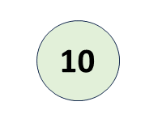
<br/>

A worker with the assigned block of time `10` cannot exist alone, it very intuitively needs to have a sibling to be one of the by-products of the split. Split is necessary at this stage because we don't have sufficient workers for all blocks. What would be the preferred sibling out of `50` and `25`?

It's `25`, because of our $\text{Key Idea}$. As a result, our tree initially looks like this.

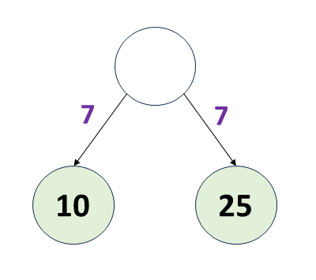
<br/>

Assuming only two blocks, the time taken by this set of blocks to build would be `7 + max(10, 25) = 32`.

**Can we somehow abstract away the subtree?**
We know that from the root node of the above subtree, to go to the last leaf node, it would take a time of `32`. Therefore, we can replace the subtree with a single node of value `32`. In this way, our tree will look like this. The arrow pointing nowhere is just to indicate that the node is abstracted.

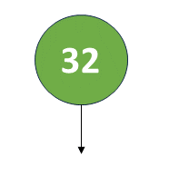
<br/>

Now, we have a new block `50` which needs to be assigned. Since `50` is the maximum, it needs to be the upper-most leaf node (as only the leaf node are workers). Thus, the sibling relationship between `50` and `32` is established. Hence, our final tree looks like this.

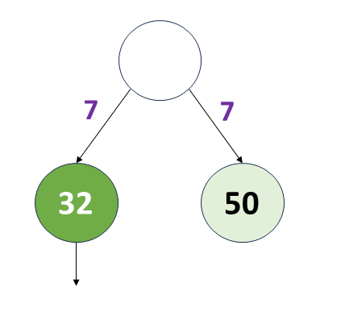
<br/>

The cost will be `7 + max(50, 32) = 57`, which is optimal.

> If we would have followed different split order or different assignment order, then the answer might be sub-optimal. Following is one such example with the cost as `64`
>
> 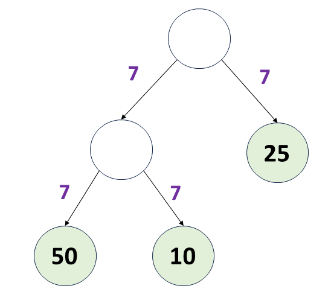

<br/>

*We are still not sure what exactly is our approach, but it's somewhat around picking the minimum, abstracting the tree, setting up sibling relationships with the next minimum, and repeating.*

**Let's take another example**. Suppose we have `blocks` as `[2, 3, 4, 5]` and `split` as `7`. Initially, we will take `2` and `3`, and make (sub)-root from them. Time from sub-root onwards will be `7 + max(2, 3) = 10`. After abstracting away, the tree will look like this.

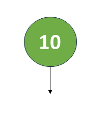
<br/>

If we then take `4` (the next minimum) and follow the same procedure, then the cost of the subtree will be `7 + max(4, 10) = 17`. Next, the block is `5`, cost of the entire tree will be `7 + max(5, 17) = 24`. Therefore, our final tree looks like this.

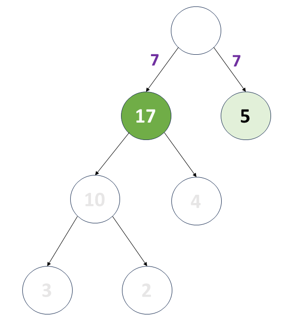
<br/>

**Is it optimal?** Turns out No. The following tree structure is indeed optimal with cost as `19`.

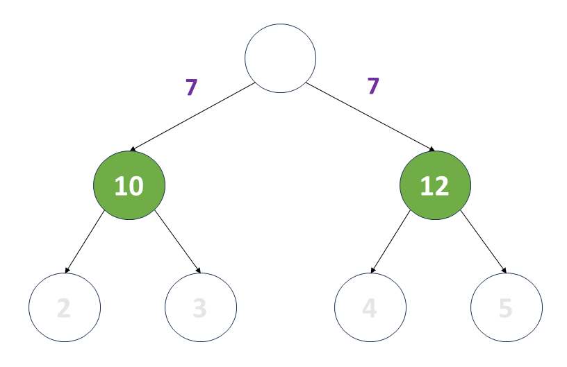
<br/>

**What went wrong?** If we see the optimal tree structure, then we would notice that instead of making a sibling relationship of `4` with abstracted `[2, 3]` of "ahead time" as `10`, we should make a sibling relationship of `4` with `5`. This, then would produce a new abstracted node with "ahead time" of `7 + max(4, 5) = 12`. Thus, our tree after abstracting away would look like these two independent subtrees (abstracted nodes)

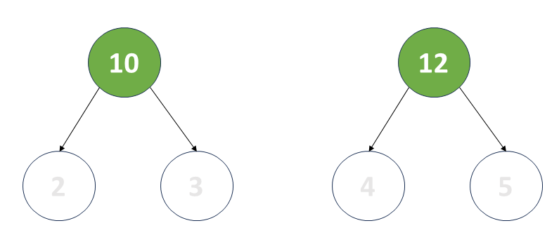
<br/>

After that, we can make a sibling relationship of `12` with `10` to produce the final root node with the time of `7 + max(10, 12) = 19`.

**Why does `4` preferred `5` over `10`?** The reason lies that after making sibling nodes `[2, 3]`, our `blocks` was no longer `[2, 3, 4, 5]`. It then becomes `[10, 4, 5]`. Thus, we again should take the next two minimums, instead of taking only one minimum and then abstracting away.

**Will it work always? If yes, why so?**
It turns out it will work always. The reason is that at every step, we are greedily growing our tree so that the "ahead time" of every abstracted node is minimized. If it is optimal to make the current minimum node part of the existing tree, then we will do it. Otherwise, we will make a sibling relationship with the next minimum node. This all is a result of our $\text{Key Idea}$, where worker building time not only contains the original `blocks`, but also includes the time taken by abstracted away nodes.

> This algorithm is called **Optimal Merge Pattern** and is primarily used for merging sorted files *(by 2-way merge patterns)* to produce a single sorted file so that the cost of merging is minimum.
>
> If two sorted files have $x$ and $y$ records respectively, then the cost of merging them into a single sorted file is $x + y$.
>
> In this problem, if the building time of two blocks is $x$ and $y$ respectively, then the time of building both the blocks will be $\text{split} + \max(x, y)$. Thus, there is a similarity between the two problems.

**How we can efficiently get a block with minimum building time?**
- Sorting? Perhaps No! Because when we build two blocks, we need to abstract the `blocks` array to insert a new block with abstracted building time. This again demands sorting of the `blocks`, and hence is inefficient. There will be $N$ building time and $N-1$ abstracted building time. Hence, overall there will be $O(N)$ iterations. Sorting in each iteration will take $O(N \log N)$ time. Thus, the overall time complexity will be $O(N^2 \log N)$.
- Sort. Pop two minimum, and insert the new abstracted time at the correct position using binary search. There will be $O(N)$ iterations, but again inserting (due to the cost of shifting) may take $O(N)$ time. Thus, the overall time complexity will be $O(N^2)$.
- Find two minimums by linear search. There will be $O(N)$ iterations, and finding two minimums will take $O(N)$ time. Thus, the overall time complexity will be $O(N^2)$. Moreover, there will be an overhead of removing two minimums from the array.

**By which data structure we can get minimum building time efficiently, where building time is dynamic?**
Heap. Isn't it? In the heap, we can pop minimum in $O(\log N)$ time, and insert new element in $O(\log N)$ time. In this way, the overall time complexity for $N$ iterations will be $O(N \log N)$.

> **Heap** is a tree-based data structure that is often used to implement a priority queue. To dive deep into the Heap, readers can visit our [Explore Card](https://leetcode.com/explore/learn/card/heap/)

The approach belongs to the "Greedy Algorithm" paradigm and is one of the ways to solve optimization problems. Many problems can be solved using the "Greedy" as well as "Dynamic Programming" paradigm.

Readers can try the following set of problems.
- [1130. Minimum Cost Tree From Leaf Values](https://leetcode.com/problems/minimum-cost-tree-from-leaf-values/)
- [23. Merge k Sorted Lists](https://leetcode.com/problems/merge-k-sorted-lists/)

#### Algorithm

1. Prepare a heap of building time. Initially, the heap will contain all the building time given in `blocks`.

2. Until we have more than one building time in the heap, we will follow the following steps.

- Pop the minimum building time from the heap. Let's say it is `x`.
- Pop the second minimum *(which is now the minimum)* building time from the heap. Let's say it is `y`.
- Now, make sibling relationship of `x` and `y` with "ahead time" of `split + max(x, y)`, which is `split + y`.
- Insert the new abstracted building time in the heap.

3. Now we have only a single building time in the heap. Return it as the answer.

#### Implementation

```python
class Solution:
    def minBuildTime(self, blocks: List[int], split: int) -> int:
        # Prepare Heap of Building Time
        heapq.heapify(blocks)

        # Make sibling blocks until we are left with only one root node
        while len(blocks) > 1:
            # Pop two minimum. The time of the abstracted sub-root will be
            # split + max(x, y) which is split + y
            x = heapq.heappop(blocks)
            y = heapq.heappop(blocks)
            heapq.heappush(blocks, split + y)

        # Time of final root node
        return heapq.heappop(blocks)
```

**Implementation Note:** We don't need to store the second minimum in a separate variable `y`. Instead, we can directly do the pop-push part as follows

```java []
int x = pq.poll();
pq.offer(split + pq.poll());
```
```python3 []
_ = heapq.heappop(blocks)
heapq.heappush(blocks, split + heapq.heappop(blocks))
```

Python also provides functions such as [`heapq.heapreplace`](https://docs.python.org/3/library/heapq.html#heapq.heapreplace) and [`heapq.heappushpop`](https://docs.python.org/3/library/heapq.html#heapq.heappushpop). Readers may try to come up with more succinct code using these functions. Here is the [Official Documentation](https://docs.python.org/3/library/heapq.html) for reference.

#### Complexity Analysis

Let $N$ be the length of `blocks`.

* Time complexity: $O(N \cdot \log N)$.

- Inserting an element into heap takes $O(\log N)$ time. There will be initial $N$ insertions. Thus, it will take $O(N \cdot \log N)$ time.

- Now, the `while` loop will run until we have more than one building time in the heap. In each iteration, we pop two and push one. Thus, there will be $N-1$ iterations.

        Now, in each iteration, two pops will take $O(\log N)$ time, and one push will take $O(\log N)$ time. Hence, the overall time complexity for the `while` loop will be $O((N-1) \cdot (3 \cdot \log N)) = O(N \cdot \log N)$.

- The last pop will take $O(1)$ time since we don't have to restore the heap property.

    Therefore, overall time complexity will be $O(N \cdot \log N) + O(N \cdot \log N) + O(1) = O(N \cdot \log N)$.

* Space complexity: $O(N)$

    If we are heapifying the existing `blocks` array, then space complexity will be $O(1)$. Otherwise, to have a new priority queue, we will need $O(N)$ space.

---

### Approach 5: Binary Search

#### Intuition

Let's say `answer` is the minimum time required to build all the blocks.

- For all time `t < answer`, it is not possible to build all the blocks. Let's label all those times as `0`
- For all time `t >= answer`, it is possible to build all the blocks. Let's label all those times as `1`

In this way, our time scale would be
`[0, 0, 0, ..., 0, 1, 1, 1, ..., 1]`

This time search space is monotonic. Recall that when search space is sorted, we can use binary search. Hence, we can apply **binary search** to find the time corresponding to which we have the first label of `1`. The problem will somewhat reduce to ["278. First Bad Version"](https://leetcode.com/problems/first-bad-version/).

> **Binary Search** is an algorithm for searching in a sorted array by repeatedly dividing the search interval in half.
>
> While the basic algorithm sounds simpler, backed by in-built functions such as `bisect.bisect_left`, `upper_bound`, `lower_bound`, etc., the implementation has a good number of corner cases to handle, particularly off-by-one errors.
>
> Hence, readers are strongly advised to follow the template given in [**Leetcode Binary Search Explore Card**](https://leetcode.com/explore/learn/card/binary-search/). The templates there standardize the implementation of binary search and help in avoiding silly mistakes.

We will have a search space, say `left` to `right`. We will take `mid` as our test-point

- if it is possible to build all the blocks in `mid` time, then we know that all times greater than `mid` will also be possible. Hence, we can discard all those time, and our search space will reduce to `[left, mid]`. Please note that `mid` is still in the search space because the task is possible at `mid` time.

- otherwise, we know that all times less than `mid` will not be possible. Hence, we can discard all those time, and our search space will reduce to `[mid+1, right]`. Now, `mid` won't be in search space because the task is not possible at `mid` time.

**Where to start?**

- `left` initially would be the least possible candidate of time, and it will depend on the maximum building time in `blocks` because at least one such block consumes such time. Thus, `left` will be `max(blocks)`.

- `right`? Well, we can do mathematical analysis to find the same, but there exists an alternate way. The function `minBuildTime` expects us to return an integer as the answer without any MOD operation. Thus, we can set `right` as `INT_MAX`.

    > **Online Assessment Tip:** Constraint analysis often helps in finding the range of search space.

    However, for the sake of completeness, we can say that the maximum time depends on the height of the tree structure that we are going to build. The height of the tree will be the maximum when the tree is skewed. In that case, the longest path from root to leaf will have `N` nodes, and `N-1` edges. Thus, time because of the split will be `split * (N-1)`. The time because of the building will be maximum when we allocate the `max(blocks)` to the farthest leaf node. Thus, the maximum time will be `split * (N-1) + max(blocks)`.

**Can we derive a better `right`?**
    For that, we can focus on two of our intuition
- *"A full split is always better than a partial split"*.

- *"If we have sufficient workers, then we can stop splitting to produce more workers"*

    In our approach, at every step, we were doubling the number of workers, or in other words, we were building a full binary tree. Thus, the height of the tree will be $\log N$. The time because of the split will be `split * (log N)`. The time because of the building will be maximum when we allocate the `max(blocks)` to the farthest leaf node. Thus, the maximum time will be `split * (log N) + max(blocks)`.

    > Full Binary Tree may be ambiguous because different literature follows different definitions, but the idea is that we extend the tree completely to the left and right whenever possible.

    Since taking a logarithm may produce a floating-point number, we can take the ceiling of the same to avoid missing any time. Thus, our `right` will be `split * (ceil(log N)) + max(blocks)`.

Here comes the tricky part. **How to check if it is possible to build all the blocks in `mid` time?**

As we were doing in [top-down dynamic programming](#approach-1-top-down-dynamic-programming), we again want to allocate the block with maximum building time as soon as possible. Thereby, we will sort the `blocks` array in descending order.

Now, we will start allocating the blocks with building time as `time` to any one of the workers we have *(if we were required to build the tree, it would be the top-most worker, but here we just wish to keep track of worker)*. Now, for this block if `time` exceeds the `limit` (which is `mid`) we have, or there aren't any workers left, then we can return `false`.

Otherwise, we can allocate this block to one worker, but before doing that, we can smartly produce as many workers as we can such that the splitting time combined with `time` doesn't exceed the `limit`. If at any stage, we produced sufficient enough workers, then we can return `true`. In the end, if we have completed all the blocks, then also we can return `true`.

Thus, using this logic, we can check if it is possible to build all the blocks in `mid` time.

Readers are encouraged to implement the solution keeping in mind the nuances of binary search.

#### Algorithm

1. Sort the `blocks` array in descending order.

2. Define a function `possible` which takes as argument `limit` and returns `true` if it is possible to build all the blocks in `limit` time, otherwise `false`.

- Initialize `worker` as `1`. This will be the number of workers we have.

- Iterate over the `blocks` array from left to right.

- If `worker` is non-positive or `time` is greater than `limit`, then return `false` as we can't build the current block.

- Otherwise, keep splitting the block and produce as many workers as we can such that the splitting time combined with `time` doesn't exceed the `limit`. The condition will be `time + split <= limit`.
            While doing so, decrement `limit` by `split` and double the `worker`. If workers exceed the remaining blocks, then return `true`.

- Decrement the number of `workers` by `1` as we have allocated the block to one worker.

- If we have completed all the blocks, then return `true`.

3. Do the binary search on the time scale. Initialize `left` to maximum building time in `blocks`. Since we have sorted the `blocks` array in descending order, it will be the first element. Initialize `right` to `split * (ceil(log N)) + max(blocks)`. The base of the logarithm is `2`, and `max(blocks)` can be obtained from `blocks[0]` since we have sorted the array in descending order. Do the next steps while `left < right`.

- Find the `mid` of the search space.

- If `possible(mid)` returns `true`, then it is possible to build all the blocks in `mid` time. Thus, we can discard all the time greater than `mid` and search in `[left, mid]`. Set `right = mid`.

- Otherwise, we can discard all the time less than `mid` and search in `[mid+1, right]`. Set `left = mid + 1`.

1. Return `right` as the answer *(We can also return `left` because this is the point where both `left` and `right` will converge)*.

#### Implementation

```python
class Solution:
    def minBuildTime(self, blocks: List[int], split: int) -> int:
        # Sort Array in Descending Order of the required time
        blocks.sort(reverse = True)

        # If can be built in "limit"
        def possible(limit):
            # Build all blocks starting with one worker
            worker = 1

            for index, time in enumerate(blocks):
                # If no worker or no sufficient time
                if worker <= 0 or time > limit:
                    return False

                # Keep splitting and producing workers as long as
                # we are within the limit for this block
                while time + split <= limit:
                    limit -= split
                    worker *= 2

                    # Sufficient workers for the remaining block
                    if worker >= len(blocks) - index:
                        return True

                # Build Block
                worker -= 1

            # All blocks build
            return True

        # Binary Search Algorithm
        left = blocks[0]
        right = math.ceil(log2(len(blocks))) * split  + blocks[0]
        while left < right:
            mid = (left + right) // 2
            if possible(mid):
                right = mid
            else:
                left = mid + 1

        # Right is the minimum time when the task is possible
        return int(right)
```

#### Complexity Analysis

Let $N$ be the number of `blocks`, $M$ be the maximum building time in `blocks` and $S$ be the `split` time.

* Time complexity: $O(N \cdot (\log N + \log S))$

- Sorting the `blocks` array takes $O(N \cdot \log N)$ time.

- Now, we have binary search on time range $[M, S \cdot \log N + M]$.

        The total number of iterations will be $O\bigg(\log\big(S \cdot \log N + M - M\big)\bigg)$ which is $O\bigg(\log(S \cdot \log N)\bigg)$.

        This term can be written as $O\bigg(\log S + \log(\log N)\bigg)$.

        We now call the `possible` function in each iteration. Hence, the time complexity of the binary search loop depends on the time complexity of the `possible` function.

- Let's analyze the `possible` function.

        It has a `for` loop which runs $N$ times.

        Inside the loop, we have a `while` loop. The `while` loop will terminate when the number of `worker` exceeds the remaining blocks. Hence, there will be at most $O(N)$ **total iterations** of the `while` loop. This is because we are doubling the number of the remaining `worker` in each iteration until we reach the $N$, which creates at least 1 `worker` each time.

        > Here is the case where we will have $O(N)$ splits for creating $N$ workers. The worst case varies with `split` and `limit`, but it won't exceed $O(N)$.
        >
        > 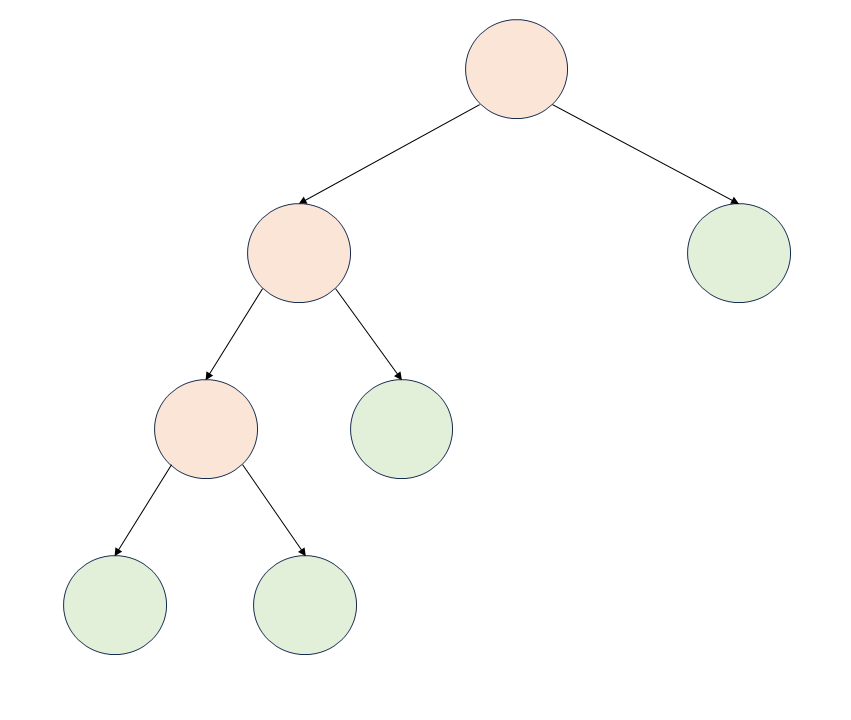

*It's worth noting that the `while` loop will run at most $O(N)$ times in total, and not $O(N)$ times in each iteration of the `for` loop. On doing amortized analysis, we can say that the `while` loop will run $O(1)$ times in each iteration of the `for` loop.*

        Thus, the time complexity of the `possible` function will be $O(N)$.

    Hence, overall time complexity will be $O(N \cdot \log N) + O\bigg(\log S + \log(\log N)\bigg) \cdot O(N)$ which can be simplified as $O(N \cdot \log N + N \cdot \log S + N \cdot \log(\log N))$

    Thus, the final time complexity will be $O(N \cdot (\log N + \log S))$.

* Space complexity: $O(N)$

    We are sorting the `blocks` array in place. When we sort an array in place, some extra space is used. The space complexity depends on the implementation of the sorting algorithm in the programming language.

- In Python, the `sort` method sorts a list using the Timsort algorithm, which is a combination of Merge Sort and Insertion Sort and uses $O(N)$ additional space.

- In C++, the `sort()` function is implemented as a hybrid of Quick Sort, Heap Sort, and Insertion Sort, with worst-case space complexity of $O(\log N)$.

- In Java, `Arrays.sort()` is implemented using a variant of the Quick Sort algorithm which has a space complexity of $O(\log N)$.

    Thus, the space complexity will be $O(N)$.

---