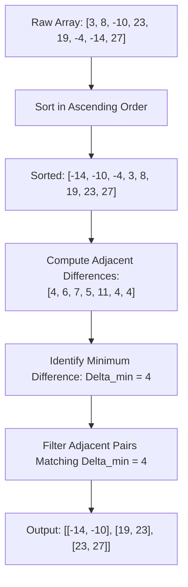

# Guided Example: Minimum Absolute Difference

## 1. Problem Essence & Algorithmic Mental Model

Given an array $\text{arr}$ of distinct integers, our goal is to identify all pairs of elements $(a, b)$ that attain the minimum absolute difference across all possible pairs in the array:
$$|b - a| = \min_{u, v \in \text{arr}, u \neq v} |u - v|$$
The returned pairs must satisfy two formatting invariants:
1. Within each pair, elements are strictly ordered: $a < b$.
2. The list of pairs must be returned in ascending order of their first elements ($a$).

A naive pairwise comparison inspects all $\binom{n}{2} = \frac{n(n-1)}{2}$ pairs, taking $\mathcal{O}(n^2)$ time. For arrays with $n = 10^5$ elements, an exhaustive quadratic search evaluates $5 \times 10^9$ comparisons, exceeding standard execution limits.

The core geometric invariant of the 1D Euclidean line provides the solution:
**The 1D Metric Triangle Inequality (Adjacent Neighborhood Theorem)**:
Let the elements of $\text{arr}$ be sorted in strictly increasing order:
$$x_0 < x_1 < x_2 < \dots < x_{n-1}$$
For any two non-adjacent elements $x_i$ and $x_j$ with $j \ge i + 2$:
$$x_j - x_i = (x_j - x_{j-1}) + (x_{j-1} - x_{j-2}) + \dots + (x_{i+1} - x_i)$$
Because all elements are distinct and strictly increasing, each intermediate difference $(x_{k+1} - x_k)$ is strictly positive ($\ge 1$). Therefore, the distance between any non-adjacent pair is strictly greater than the distance between the adjacent elements bridging them:
$$x_j - x_i > x_{i+1} - x_i$$

Consequently, the global minimum difference across all $\binom{n}{2}$ pairs **must occur between two immediately adjacent elements in the sorted array**:
$$\Delta_{\min} = \min_{0 \le i < n-1} (x_{i+1} - x_i)$$

We never need to compare non-adjacent elements. Sorting the array in $\mathcal{O}(n \log n)$ time restricts candidate evaluations to exactly $n-1$ adjacent pairs.

```
Unsorted Array: [4, 2, 1, 3]

Sorted Number Line:
---(1)====[1]====(2)====[1]====(3)====[1]====(4)--->
Any non-adjacent gap (e.g. 1 to 3) has length 2 > 1.
Minimum difference Delta_min = 1.
Emitted Pairs: [[1, 2], [2, 3], [3, 4]]
```

---

## 2. Mathematical Formalism & Invariants

Let $A = \{a_0, a_1, \dots, a_{n-1}\} \subset \mathbb{Z}$ with $|A| = n \ge 2$, where all elements are distinct:
$$\forall i \neq j, \quad a_i \neq a_j$$

### Sorted Sequence Permutation
Let $\pi: \{0, \dots, n-1\} \to \{0, \dots, n-1\}$ be the sorting permutation such that:
$$x_k = a_{\pi(k)} \quad \text{and} \quad x_0 < x_1 < \dots < x_{n-1}$$

### Theorem: Adjacency Containment
$$\min_{\substack{u, v \in A \\ u < v}} (v - u) = \min_{0 \le i < n-1} (x_{i+1} - x_i)$$

**Proof**:
Let $(u^*, v^*)$ be an optimal pair achieving the global minimum difference $\Delta^* = v^* - u^*$ with $u^* < v^*$.
In the sorted sequence, let $u^* = x_i$ and $v^* = x_j$. Since $u^* < v^*$, we have $i < j$, so $j - i \ge 1$.
- If $j - i = 1$, then $(u^*, v^*)$ is an adjacent pair $(x_i, x_{i+1})$, and the theorem holds.
- If $j - i > 1$, then $x_j - x_i = (x_{i+1} - x_i) + (x_j - x_{i+1})$.
  Because all elements are distinct and strictly increasing:
  $$x_j - x_{i+1} > 0 \implies x_{i+1} - x_i < x_j - x_i = \Delta^*$$
  This contradicts the assumption that $\Delta^*$ was the global minimum difference.
Therefore, $j - i$ must equal $1$.

### Canonical Result Set
Let $\Delta_{\min} = \min_{0 \le i < n-1} (x_{i+1} - x_i)$. The final output is:
$$\mathcal{S} = \big[ (x_i, x_{i+1}) \mid 0 \le i < n-1 \land x_{i+1} - x_i = \Delta_{\min} \big]$$
Because $x_0 < x_1 < \dots < x_{n-1}$, the list $\mathcal{S}$ is automatically sorted with $x_i < x_{i+1}$ and $x_i$ strictly increasing across pairs.

---

## 3. Concrete Example Execution & State Evolution

Consider the input array:
$\text{arr} = [3, 8, -10, 23, 19, -4, -14, 27]$

### Step 1: Sorting Trace
Sorting in ascending numerical order produces $n = 8$ elements:
$$X = [-14, -10, -4, 3, 8, 19, 23, 27]$$

### Step 2: Adjacent Differences Evaluation Trace

| Pair Index $i$ | Pair $(x_i, x_{i+1})$ | Difference $x_{i+1} - x_i$ | Running Minimum $\Delta_{\min}$ | Active Matching Pairs List |
|---|---|---|---|---|
| 0 | $(-14, -10)$ | $-10 - (-14) = 4$ | 4 | `[[-14, -10]]` |
| 1 | $(-10, -4)$ | $-4 - (-10) = 6$ | 4 | `[[-14, -10]]` |
| 2 | $(-4, 3)$ | $3 - (-4) = 7$ | 4 | `[[-14, -10]]` |
| 3 | $(3, 8)$ | $8 - 3 = 5$ | 4 | `[[-14, -10]]` |
| 4 | $(8, 19)$ | $19 - 8 = 11$ | 4 | `[[-14, -10]]` |
| 5 | $(19, 23)$ | $23 - 19 = 4$ | 4 | `[[-14, -10], [19, 23]]` |
| 6 | $(23, 27)$ | $27 - 23 = 4$ | 4 | `[[-14, -10], [19, 23], [23, 27]]` |



Final output:
$$[[-14, -10], [19, 23], [23, 27]]$$

---

## 4. Multi-Approach Comparison & Trade-Offs

| Metric / Dimension | All-Pairs Quadratic Search | Adjacent Scan with Post-Sort | Sort and Linear Filter (Optimal) |
|---|---|---|---|
| **Comparisons Evaluated** | $\frac{N(N-1)}{2} \approx 5 \times 10^9$ for $N=10^5$ | $N-1$ comparisons, then sort pairs | Exactly $N-1$ adjacent comparisons |
| **Time Complexity** | $\mathcal{O}(N^2)$ | $\mathcal{O}(N \log N + K \log K)$ | $\mathcal{O}(N \log N)$ |
| **Auxiliary Memory** | $\mathcal{O}(K)$ | $\mathcal{O}(K)$ | $\mathcal{O}(K)$ for output list |
| **Output Ordering** | Unordered (requires separate sort) | Semi-ordered | Automatically sorted by construction |
| **Simplicity** | Nested loops | Two-pass logic | Compact functional pipeline |

```
Search Space Reduction:
Exhaustive Matrix Search: N x N grid of pairs (~5,000,000,000 checks)
Sorted 1D Line:          Only the single diagonal of adjacent neighbors! (99,999 checks)
Reduction Factor:        ~50,000x faster!
```

---

## 5. Algorithmic Edge Cases & Boundary Analysis

| Boundary Scenario | Input Example | Expected Output | System Behavior & Invariants |
|---|---|---|---|
| **Smallest Input ($N = 2$)** | `[5, 1]` | `[[1, 5]]` | Only one pair exists; sorted to `[1, 5]`, difference is 4. |
| **All Adjacent Gaps Equal** | `[1, 2, 3, 4]` | `[[1, 2], [2, 3], [3, 4]]` | Uniform arithmetic progression; every adjacent pair has difference 1; all $N-1$ pairs returned. |
| **Negative and Positive Integers** | `[-50, 0, 50]` | `[[-50, 0], [0, 50]]` | Zero and signs handled without special cases; difference uses standard algebraic subtraction. |
| **Single Isolated Minimum Pair** | `[1, 10, 100, 101, 1000]` | `[[100, 101]]` | Min difference is 1, occurring solely between 100 and 101. |
| **Large Spaced Numbers** | `[-1000000, 1000000]` | `[[-1000000, 1000000]]` | Handled without 32-bit/64-bit integer overflow. |

---

## 6. Mathematical Verification & Complexity Derivation

Let $N = |\text{arr}|$ be the number of elements in the array.

### Algorithm Stages:
1. **Sorting Stage**:
   - Sorting $N$ distinct integers with an optimal comparison sort requires $\mathcal{O}(N \log N)$ time.
2. **First Pass (Find $\Delta_{\min}$)**:
   - Iterating through the $N-1$ adjacent pairs $(x_i, x_{i+1})$ and computing $x_{i+1} - x_i$ requires $N-1$ subtractions and comparisons.
   - Time: $\mathcal{O}(N)$.
3. **Second Pass (Collect Pairs)**:
   - Iterating through the $N-1$ adjacent pairs and appending those with $x_{i+1} - x_i = \Delta_{\min}$ to the result list requires $N-1$ comparisons.
   - Time: $\mathcal{O}(N)$.
4. **Total Work**:
   $$\mathcal{O}(N \log N) + \mathcal{O}(N) + \mathcal{O}(N) = \mathcal{O}(N \log N)$$

### Complexity Summary:
- **Total Time Complexity:** $\mathcal{O}(N \log N)$ optimal comparison time.
- **Total Auxiliary Space Complexity:** $\mathcal{O}(K) \le \mathcal{O}(N)$ memory to hold the output list of $K$ pairs.

---

## 7. Synthesis & Strategic Takeaways

1. **Topological Collinearity in Distance Minimization**: On a one-dimensional line, the distance metric is additive over collinear intervals. Therefore, the minimum distance between any subset of points is strictly confined to immediate neighbors in the sorted permutation.
2. **Search Space Pruning via Sorting**: Sorting transforms a quadratic combinatorial problem over $\binom{n}{2}$ pairs into a linear local scan over $n-1$ adjacent pairs, illustrating how introducing global order eliminates vast swaths of redundant comparisons.
3. **Automatic Output Normalization**: Because the underlying array is sorted before scanning, all generated pairs $(x_i, x_{i+1})$ naturally satisfy $x_i < x_{i+1}$, and the emitted list is sorted lexicographically without needing a post-hoc sorting step.
