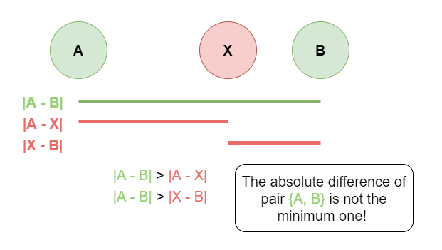

## Solution

---
### Overview

In this problem, we are given an array `arr` of **distinct** integers. We can pick any two integers `a` and `b` from the array. These two integers have an absolute difference $|a - b|$. Among all the possible absolute difference pairs, we should find all pairs of elements with the minimum absolute difference.

<br/>

---

### Approach 1: Sort + 2 Traversals

**Intuition**

The most intuitive method is to get every possible pair `{a, b}` from the array. Then for each pair, we can calculate its absolute difference; let's call this `currPairDiff` standing for the current absolute difference, where $currPairDiff = |a - b|$. While calculating `currPairDiff` for each pair, we can keep a record of the minimum absolute difference, `minPairDiff`, seen so far.
Finally, we traverse every pair again, and if a pair has the same absolute difference as `minPairDiff`, then we add this pair to the answer.

However, in this brute force approach, we iterate every possible pair from the array. Given $n$ as the size of the input array, this approach has a time complexity of $O(n^2)$ which would likely exceed the time limit. Therefore, we shall look for a more efficient way!

Before we get lost in collecting every possible pair, let's think of how to judge if a pair is a potential candidate or not.

Suppose we have picked two integers `a` and `b` from the array (let's assume that `a` is less than `b` for convenience). Do we always have to calculate their difference $b - a$? It depends on if there exists a third value `X` from the array which size is in the middle of `a` and `b`.

If such `X` exists, we will have `a < X < b`. Hence, $b - a > X - a > 0$ and $b - a > b - X > 0$ also hold, where $X - a$ and $b - X$ are the absolute difference of the pair `{a, X}` and `{X, b}` respectively. This implies that there are at least two pairs `{a, X}` and `{X, b}` having absolute differences smaller than that of the pair `{a, b}`. Therefore, the pair `{a, b}` surely doesn't have the minimum absolute difference, so we don't need to bother calculating it.



How can we carry out an algorithm to select the pairs without intermediate integers and filter out the rest effectively?

> Sorting

By sorting the original array, every number will be adjacent to the one or two numbers in the array that are closest to it. Since there cannot be an intermediate integer between two adjacent numbers in the sorted array, the candidate pool for the answer list will consist of all pairs made by two adjacent integers. All that is left to do is to calculate the absolute differences of these pairs and select the pairs with an absolute difference that is equal to the minimum absolute difference.

!?!../Documents/1200/walkthrough_1.json:601,301!?!

<br>

**Algorithm**

1) Sort the original array `arr`. Initialize `minPairDiff` as a huge number so that we won't miss the absolute difference of the first pair.

2) Traverse the sorted array, compute the absolute difference of every adjacent integer pair, $currPairDiff = arr[i + 1] - \text{arr}[i]$ where $0 \le i < n - 1$ and keep a record of the minimum difference, $minPairDiff = min(minPairDiff, currPairDiff)$, seen so far. Notice that we don't need to calculate the absolute value of $arr[i + 1] - \text{arr}[i]$ since `arr` has already been sorted so $arr[i + 1]$ will always be larger than $\text{arr}[i]$.

3) Traverse the sorted array again for every pair of adjacent numbers. If their absolute difference equals `minPairDiff`, add this pair to the answer list in the correct form.

4) Return the answer list.

**Implementation**

```python
class Solution:
    def minimumAbsDifference(self, arr: List[int]) -> List[List[int]]:
        # Sort the original array
        arr.sort()
        answer = []

        # Initialize minimum difference as a huge integer in order not
        # to miss the absolute difference of the first pair.
        min_pair_diff = float('inf')

        # Traverse the sorted array and calcalute the minimum absolute difference.
        for i in range(len(arr) - 1):
            min_pair_diff = min(min_pair_diff, arr[i + 1] - arr[i])

        # Traverse the sorted array and check every pair again, if
        # the absolute difference equals the minimum difference,
        # add this pair to the answer list.
        for i in range(len(arr) - 1):
            if arr[i + 1] - arr[i] == min_pair_diff:
                answer.append([arr[i], arr[i + 1]])
        return answer
```

**Complexity Analysis**

Let $n$ be the length of the array `arr`.

* Time complexity: $O(n \cdot \log n)$

- We sort `arr` first, which takes $O(n \cdot \log n)$.
- We then traverse the array two times, which takes $O(n)$ for each traversal.
- To sum up, the time complexity is $O(n \cdot \log n)$.

* Space complexity: $O(\log n)$ or $O(n)$

- Some extra space is used when we sort `arr` in place. The space complexity of the sorting algorithm depends on the programming language.
- In python, the `sort` method sorts a list using Timsort algorithm which has $O(n)$ additional space where $n$ is the number of the elements.
- In C++, the sort() function is implemented as a hybrid of Quick Sort, Heap Sort and Insertion Sort, with a worst case space complexity of $O(\log n)$.
- In Java, Arrays.sort() is implemented using a variant of the Quick Sort algorithm which has a space complexity of $O(\log n)$.
- In Javascript, the space complexity of sort() is $O(\log n)$.
- To sum up, the overall space complexity is $O(\log n)$ or $O(n)$, depending on the programming language and implementation.

<br/>

---

### Approach 2: Sort + 1 Traversal

**Intuition**

In the first approach, we traverse the sorted array two times to find the minimum absolute difference and find all the pairs with such difference, respectively.

However, we could have finished these two tasks in a single traversal by simultaneously updating the `minPairDiff` and the answer list.

We can accomplish this by skipping the first traversal that we used to find the minimum difference, and instead, we compare each pair to the minimum difference that we have seen so far.
- If we find a pair with `currPairDiff > minPairDiff`, move on to the next pair since we know for sure that this pair cannot be a candidate.
- If we find a pair with $currPairDiff = minPairDiff$, we add this pair to the answer list.
- If we find a pair with `currPairDiff < minPairDiff`, this means that we should discard all the pairs in the answer list since their absolute difference is greater than the minimum absolute difference. Then, only add this pair to the list.

!?!../Documents/1200/walkthrough_2.json:601,301!?!

<br>

**Algorithm**

1) Sort the original array. Initialize `minPairDiff` as a huge number so that we won't miss the absolute difference of the first pair.

2) Traverse the sorted array, and for every pair of adjacent numbers, compare its absolute difference `currPairDiff` with `minPairDiff`.
- If `currPairDiff` is greater than `minPairDiff`, move on to the next pair.
- If `currPairDiff` equals `minPairDiff`, add this pair to the answer list.
- If `currPairDiff` is less than `minPairDiff`, discard all elements in answer list, add this pair to the list and update $minPairDiff = currPairDiff$.
3) After traversing the sorted array, return the answer list.

**Implementation**

```python
class Solution:
    def minimumAbsDifference(self, arr: List[int]) -> List[List[int]]:
        # Sort the original array
        arr.sort()

        # Initialize minimum difference `min_pair_diff` as a huge integer in order not
        # to miss the absolute difference of the first pair.
        min_pair_diff = float('inf')
        answer = []

        # Traverse the sorted array
        for i in range(len(arr) - 1):
            # For the absolute value `curr_pair_diff` of the current pair:
            curr_pair_diff = arr[i + 1] - arr[i]

            # If `curr_pair_diff` equals `min_pair_diff`, add this pair to the answer list.
            # If `curr_pair_diff` is smaller than `min_pair_diff`, discard all pairs in the answer list,
            # add this pair to the answer list and update `min_pair_diff`.
            # If `curr_pair_diff` is larger than `min_pair_diff`, we just go ahead.
            if curr_pair_diff == min_pair_diff:
                answer.append([arr[i], arr[i + 1]])
            elif curr_pair_diff < min_pair_diff:
                answer = [[arr[i], arr[i + 1]]]
                min_pair_diff = curr_pair_diff

        return answer
```

**Complexity Analysis**

Let $n$ be the length of the array `arr`.

* Time complexity: $O(n\cdot \log(n))$

- First, we sort `arr` using comparision sorting, which takes $O(n \cdot \log(n))$.
- We then traverse the array, which takes $O(n)$ time.
- To sum up, the overall time complexity is $O(n \cdot \log(n))$.

* Space complexity: $O(n)$.

- Some extra space is used when we sort `arr` in place. The space complexity of the sorting algorithm depends on the programming language.
- In python, the `sort` method sorts a list using Timsort algorithm which has $O(n)$ additional space where $n$ is the number of the elements.
- In C++, the sort() function is implemented as a hybrid of Quick Sort, Heap Sort and Insertion Sort, with a worst case space complexity of $O(\log n)$.
- In Java, Arrays.sort() is implemented using a variant of the Quick Sort algorithm which has a space complexity of $O(\log n)$.
- In Javascript, the space complexity of sort() is $O(\log n)$.
- We then traverse the array and update the output array `answer` as we go. While the output itself does not count towards the space complexity, the space used by the `answer` array that is not part of the output is counted. For example, if the array is $[1, 3, 5, 7, 8]$, at some point, the `answer` array will contain $n - 2$ pairs, each with a difference of $2$, but the output will only consist of $1$ pair with a difference of $1$. Thus, the answer array requires $O(n)$ space.
- To sum up, the overall space complexity is $O(n)$.
<br/>

---

### Approach 3: Counting Sort

**Intuition**

In the previous two approaches, the sorting of the original array takes $O(n \cdot \log(n))$ time and is the dominant term in the total time complexity, is there a way we can reduce the time spent sorting the array?
The constraints of the problem state that the maximum possible value in `arr` is $10^6$, and the minimum possible value in `arr` is $-10^6$. Therefore, the difference between the maximum value and the minimum value is $10^{6} - (-10^{6}) = 2 \cdot 10^{6}$. The time and space required to use Counting Sort are directly related to this difference between the maximum and minimum possible values in `arr`. Thus, Counting Sort is a workable approach to this problem.

>What is counting sort?

For a detailed introduction, you can refer to [this Wikipedia article](https://en.wikipedia.org/wiki/Counting_sort)!

<br>

In short, counting sort is not a comparison sort; thus, the $O(n \cdot \log(n))$ time complexity for comparison sorting does not apply. To perform a counting sort, we create an empty array (`line`), and for each number in `arr`, we increment $\text{line}[index]$ where the index is based on the number's value.

>How do we determine the size of the auxiliary array?

Notice that the constraints of integers in the array is $-$10^{6}$ \leq \text{arr}[i] \leq 10^{6}$. Therefore, we could use an auxiliary array of size $2 \cdot 10^{6} + 1$; this array would cover all possible values within the given range. However, the index of the auxiliary array is from $0$ to $2 \cdot 10^{6}$, while the range of the elements is from $-10^{6}$ to $10^{6}$. So we need to build a bijection, a one-to-one correspondence between the element value (`value`) and the index (`index`) of the auxiliary array. We can map the `value` to `index` where this element should be placed by adding a term $shift = 10^6$ to the value. Put simply, for each `value` in `arr` we will set $line[value + shift]$ equal to 1.

> **Note:** It is not necessary for us to use an array of size $2 \cdot 10^{6} + 1$ for `line`. Consider an example where the range of values in `arr` is small, such as `arr = [1, -3, 2]`. The array `line` only needs to be of length $6$ to store all mapped values from $-3$ to $2$. Thus we can use the minimum and maximum value in `arr` to decide the size of our auxiliary array.  Since we will map the smallest value in `arr` to position $0$ in `line`, this means that `shift` should equal `-arr.min`.

>How do we "sort" the array?

We can iterate over the array, and for each integer element (`value`), we can find the corresponding index of this integer using $index = value + shift$ and increase the value at `index` in the auxiliary array `line` by 1. That is to say $\text{line}[index] += 1$.

!?!../Documents/1200/walkthrough_3.json:601,301!?!

<br>

Once we have iterated over every element in `arr`, every index in `line` that corresponds to a value in `arr` will have changed from 0 to 1. The last step is to traverse the `modified` line once, starting from the first index. Each index in `line`, where $\text{line}[index]$ is not zero, signifies the value $index - shift$ exists in `arr`. Thus by traversing `line` from left to right, we can collect the values in sorted order!

>How to collect & compare pairs of adjacent numbers?

This step is pretty similar to that of the 2nd approach, where we simultaneously update the answer list and the minimum difference.
We iterate over the modified `line` array, and for every index `curr`, if $\text{line}[curr]$ equals `0`, this means that there is no element of value $index - shift$ in the input array, and so we will move on to the next index. If $\text{line}[curr]$ equals `1`, this means that there is an element of value $curr - shift$ in the input array and that this element composes a pair with the previous element.

When we find a pair ${prev - shift, curr - shift}$, we will check if the absolute difference of this pair `currPairDiff` is less than, equal to, or larger than the minimum absolute difference `minPairDiff`.
- If `currPairDiff > minPairDiff`, we move on to the next pair since we know for sure that this pair cannot be a candidate. That is, let $prev = curr$ and move to the next index of `line`.
- If $currPairDiff = minPairDiff$, we add this pair to the answer list. Let $prev = curr$ and move to the next index.
- If `currPairDiff < minPairDiff`, we discard all the pairs in the answer list since their absolute difference is greater than the minimum absolute difference. Then, only add this pair to the list. Let $prev = curr$ and move to the next index.

!?!../Documents/1200/walkthrough_4.json:601,301!?!

<br>

>**Interview Tip:** If the problem constraints are provided, it is a good idea to consider the constraints when deciding how to approach the problem. For example, the previous approach takes $O(n \cdot \log n)$ time, and in the worst case, $n$ equals $10^5$ where $n$ is the length of `arr`. The current approach will take $O(m + n)$ time, and in the worst case, $m$ equals $2 \cdot 10^6$ where $m$ is the difference between the largest and smallest element in `arr`.
>
>Thus, for the given constraints, the previous and the current approaches have similar worst-case run times, so both approaches are acceptable. However, if the constraints were different and $m$ was much larger than $n \log n$, then the previous approach would be the better option and vice versa.

**Algorithm**

1) Find the minimum value (`minElement`) and maximum value (`maxElement`) in `arr`.

2) Initialize the auxiliary array `line` of size $maxElement - minElement + 1$, and set `shift` equal to `-minElement`.
  This means the smallest element in arr will map to index 0 in `line`, and the largest element will map to the last index in `line`.
3) Iterate over `arr`, and for each element `value`, increment the value at the index $value + shift$ by 1.
4) Traverse the `line` array and check the value at every index (`curr`):
- If $\text{line}[curr]$ equals `0`, this means the corresponding value is not in `arr`, so continue on to the next index.
- If $\text{line}[curr]$ equals `1`, this means the corresponding value $curr - shift$ is in `arr`, so we go to step 5.

5) Compare the absolute difference `currPairDiff` of the pair ${prev - shift, curr - shift}$ with `minPairDiff`.
- If `currPairDiff` is greater than `minPairDiff`, continue.
- If `currPairDiff` equals `minPairDiff`, add this pair to the answer list.
- If `currPairDiff` is less than `minPairDiff`, discard all elements in answer list, add this pair to the list and update $minPairDiff = currPairDiff$.
    Let $prev = curr$ and repeat step 4 for the next element in `line`.
6) After traversing all elements in `arr`, the answer list will contain all pairs with the minimum absolute difference. Return the answer list.

**Implementation**

```python
class Solution:
    def minimumAbsDifference(self, arr: List[int]) -> List[List[int]]:
        # Initialize the auxiliary array `line`.
        # Keep a record of the minimum element and the maximum element.
        min_element = min(arr)
        max_element = max(arr)
        shift = -min_element
        line = [0] * (max_element - min_element + 1)
        answer = []

        # For each integer `num` in `arr`, we increment line[num + shift] by 1.
        for num in arr:
            line[num + shift] = 1

        # Start from the index representing the minimum integer, initialize the
        # absolute difference `min_pair_diff` as a huge value such as
        # `max_element - min_element` in order not to miss the absolute
        # difference of the first pair.
        min_pair_diff = max_element - min_element
        prev = 0

        # Iterate over the array `line` and check if line[curr]
        # holds the occurrence of an input integer.
        for curr in range(1, max_element + shift + 1):
            # If line[curr] == 0, meaning there is no occurrence of the integer (curr - shift)
            # held by this index, we will move on to the next index.
            if line[curr] == 0:
                continue

            # If the difference (curr - prev) equals `min_pair_diff`, we add this pair
            # {prev - shift, curr - shift} to the answer list.
            if curr - prev == min_pair_diff:
                answer.append([prev - shift, curr - shift])
            elif curr - prev < min_pair_diff:
                # If the difference (curr - prev) is smaller than `min_pair_diff`,
                # we empty the answer list and add the pair {curr - shift, prev - shift}
                # to the answer list and update the `min_pair_diff`
                answer = [[prev - shift, curr - shift]]
                min_pair_diff = curr - prev

            # Update prev as curr.
            prev = curr

        return answer
```

**Complexity Analysis**

Let $n$ be the size of the input array `arr`, and $m$ be the range of values in `arr`.

* Time complexity: $O(m + n)$

- We initialize an auxiliary array of all zeros, which takes $O(m)$ time.
- We then iterate over `arr` to inspect each element and increment the corresponding element in `line`; this takes $O(n)$ time.
- To check every pair of elements, we must iterate over `line`; this takes $O(m)$ time.
- To sum up, the overall time complexity is $O(m + n)$.

* Space complexity: $O(m + n)$

- We used an auxiliary array `line` of size $O(m)$.
- While the output array does not count towards the space complexity, the answer array is modified in the same manner as in Approach 2; thus, the answer array is not guaranteed to only contain the output values. In the worst-case scenario, the answer array will temporarily contain $n - 2$ values that are not part of the output array. Thus, the answer array will use $O(n)$ space.
- Therefore, the overall space complexity is $O(m + n)$.

<br/>