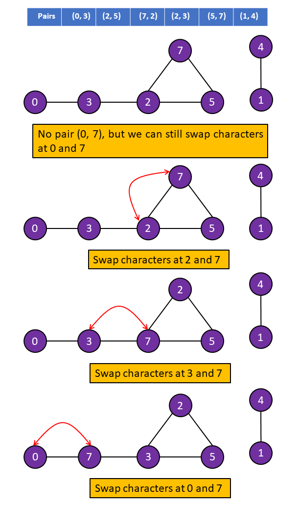

[TOC]

## Solution

---

### Overview

We have a string of lowercase English letters and some pairs of the form `(a, b)` where `a` and `b`  are indices in the string. Our goal is to find the lexicographically smallest string by swapping the characters at indices `a` and `b`. There is no restriction on the maximum number of swaps.

> Note: The important point to note here is that if we have pairs like `(a, b)` and `(b, c)`, then we can swap characters at indices `a` and `c`. Although we don't have the pair `(a, c)`, we can still swap them by first swapping them with the character at index `b`. Thus, because we can swap the characters at these indices any number of times, we can rearrange the characters `a`, `b`, and `c` into any order.

This can be depicted as a graph problem. Each index is a vertex and each given pair is an edge between the vertices. An edge implies that we can travel from one vertex to another, or in other words, we can swap them. As shown in the figure below, we have some pairs, and we draw an edge between the two vertices for each pair. If a pair of vertices exists on the same path, then they can be swapped by repeatedly swapping with other vertices in the path between them.



This demonstrates how we can swap any pair of vertices present in the same connected component. Thus, we can rearrange the characters such that any character is at any index within the connected component. To find the lexicographically smallest string, we need to sort the characters that correspond to these indices in ascending order and then place the $i_{th}$ character at the $i_{th}$ index.

Therefore, we can break the solution down into four steps: build a graph using the given pairs, find the connected components in the graph, sort the characters in each connected component in ascending order, and build the smallest string.

The biggest challenge in solving this problem was figuring out that, with infinite swaps, we can arrange all characters that belong to the same connected component in sorted order. With that hurdle behind us, our next challenge is, how do we find out which indices belong to the same connected component?

DFS, BFS, and Union-Find are each commonly used to find connected components. Since the DFS and BFS solutions are quite similar in implementation, we will only cover DFS and Union-Find in this article. If you would like to learn more about DFS, BFS, or Union-Find, we encourage you to check out the [Graph Explore Card](https://leetcode.com/explore/featured/card/graph/).
</br>

---

### Approach 1: Depth-First Search (DFS)

**Intuition**

> If you're not familiar with DFS, check out our [Explore Card](https://leetcode.com/explore/featured/card/graph/619/depth-first-search-in-graph/3882/).

We will build the adjacency list using the pairs given i.e., for each pair `(x, y)` we will add an edge from `x` to `y` and from `y` to `x`. Then we will iterate over the indices from `0` to `n-1` where `n` is the length of the given string `s`. For each index, if it has not been visited yet, we will perform a DFS and store the vertices (index) and the characters at these indices in a list. Each list will represent a different component in the graph. Then we will sort each list of indices and each list of characters and place the $i_{th}$ character at the $i_{th}$ index in the string `smallestString`.

**Algorithm**

1. Iterate over the `pairs` and create an adjacency list such that $\text{adj}[source]$ contains all the adjacent vertices of vertex `source`.
2. Iterate over the indices from `0` to $\text{s.size}() - 1$. For each index `vertex` we will:
     - Perform DFS if `vertex` is not visited yet ($\text{visited}[vertex]$ is `false`)
-  While performing DFS, store `vertex` in the list `indices` and the character $s[vertex]$ in the list `characters`.
     - Sort the lists `indices` and `characters`.
     - Iterate over `indices` and `characters`, and place the $i_{th}$ character at the $i_{th}$ index in the string `smallestString`.
3. Return `smallestString`.

**Implementation**

```cpp
class Solution {
public:
    // Maximum number of vertices
    static const int N = 100001;
    vector<int> adj[N];
    bool visited[N];

    void DFS(string& s, int vertex, vector<char>& characters, vector<int>& indices) {
        // Add the character and index to the list
        characters.push_back(s[vertex]);
        indices.push_back(vertex);

        visited[vertex] = true;

        // Traverse the adjacents
        for (int adjacent : adj[vertex]) {
            if (!visited[adjacent]) {
                DFS(s, adjacent, characters, indices);
            }
        }
    }

    string smallestStringWithSwaps(string s, vector<vector<int>>& pairs) {
        // Build the adjacency list
        for (vector<int> edge : pairs) {
            int source = edge[0];
            int destination = edge[1];

            // Undirected edge
            adj[source].push_back(destination);
            adj[destination].push_back(source);
        }

        for (int vertex = 0; vertex < s.size(); vertex++) {
            // If not covered in the DFS yet
            if (!visited[vertex]) {
                vector<char> characters;
                vector<int> indices;

                DFS(s, vertex, characters, indices);
                // Sort the list of characters and indices
                sort(characters.begin(), characters.end());
                sort(indices.begin(), indices.end());

                // Store the sorted characters corresponding to the index
                for (int index = 0; index < characters.size(); index++) {
                    s[indices[index]] = characters[index];
                }
            }
        }

        return s;
    }
};
```

**Complexity Analysis**

Here, $V$ represents the number of vertices (the length of the given string) and $E$ represents the number of edges (the number of pairs).

* Time complexity: $O(E + V \log V)$

  Building the adjacency list will take $O(E)$ operations, as we iterate over the list of pairs once, and inserting an element into the adjacency list takes $O(1)$ time.

  During the DFS traversal, each vertex will only be visited once. This is because we mark each vertex as visited as soon as we see it, and then we only visit vertices that are not marked as visited. When we iterate over the edge list of each vertex, we look at each edge once. This has a total cost of $O(V + E)$.

  Additionally, we also sort the list `indices` and `characters` for each component. In the worst case, all of the vertices in the graph belong to the same component. In that case, sorting two lists of $V$ elements will take $O(V \log V)$ time. Hence the total time complexity is equal to $O(E + V \log V)$.

* Space complexity: $O(E + V)$

  Building the adjacency list will take $O(E)$ space. To track the visited vertices, an array `visited` of size $O(V)$ is required. In the worst case, `indices` and `characters` can take $O(V)$ space. Also, the run-time stack for DFS will use $O(V)$ space i.e., one active function call for each vertex.

  Additional space is used for sorting the lists  `indices`  and `characters`. The space complexity of the sorting algorithm is language-specific. For instance, in Java, the Arrays.sort() for primitives is implemented as a variant of quicksort algorithm whose space complexity is $O(\log V)$. In C++ sort() function provided by STL is a hybrid of Quick Sort, Heap Sort, and Insertion Sort and has a worst-case space complexity of $O(\log V)$. Thus, using the inbuilt sort() function might add up to $O(\log V)$ to space complexity.

  The total space required is $(E + V + \log V)$ and hence, the space complexity is equal to $O(E + V)$.
<br/>

---

### Approach 2: Disjoint Set Union (DSU)

**Intuition**

Remember, our first task is to determine which indices belong to the same connected component. In this approach, we will use the Union-Find data structure to accomplish this.

> If you're not familiar with DSU, check out our [Explore Card](https://leetcode.com/explore/learn/card/graph/618/disjoint-set/3881/).

First, we will union all vertices that share an edge (vertices `a` and `b` share an edge if `(a, b)` or `(b, a)` exists in `pairs`). After which, all vertices with the same root will belong to the same component. This way, by looking at the root node for each vertex, we can put the vertices and the characters at these vertices (indices) in separate lists corresponding to the component they belong to. Then, similar to the previous approach, we will sort the list of characters that belong to the same component and place the $i_{th}$ character at the $i_{th}$ index in a string `smallestString`.

Note that we don't need to sort the list of indices in this approach because, as we iterate over vertices in ascending order, we will store the vertices that belong to the same component in ascending order.

**Algorithm**

1. Iterate over the `pairs`, for each pair `(a, b)` perform the union operation for vertices `a` and `b`.
2. Iterate over the indices from `0` to $\text{s.size}() - 1$. For each index (`vertex`) we will:
   - Perform the find operation on `vertex` to find the `root`.
   - Store the `vertex` in the list corresponding to `root` in the HashMap `rootToComponent`.
3. Iterate over each list in the HashMap `rootToComponent`:
- For each list `indices`, iterate over the list and for each element store the corresponding character in `s` in the list of characters (`characters`). Here, each element in `indices` represents an index in `s` and each character in `characters` represents the characters at this index in `s`.
   - Sort the list and `characters`.
   - Iterate over the lists `indices` and `characters`, place the $i_{th}$ character at the $i_{th}$ index in the string `smallestString`.
4. Return `smallestString`.

**Implementation**

```cpp
class UnionFind {
private:
    vector<int> root;
    vector<int> rank;
public:
    // Initialize the array root and rank
    // Each vertex is representative of itself with rank 1
    UnionFind(int sz) : root(sz), rank(sz) {
        for (int i = 0; i < sz; i++) {
            root[i] = i;
            rank[i] = 1;
        }
    }

    // Get the root of a vertex
    int find(int x) {
        if (x == root[x]) {
            return x;
        }
        return root[x] = find(root[x]);
    }

    // Perform the union of two components
    void unionSet(int x, int y) {
        int rootX = find(x);
        int rootY = find(y);
        if (rootX != rootY) {
            if (rank[rootX] >= rank[rootY]) {
                root[rootY] = rootX;
                rank[rootX] += rank[rootY];
            } else {
                root[rootX] = rootY;
                rank[rootY] += rank[rootX];
            }
        }
    }
};

class Solution {
public:
    string smallestStringWithSwaps(string s, vector<vector<int>>& pairs) {
        UnionFind uf(s.size());

        // Iterate over the edges
        for (vector<int> edge : pairs) {
            int source = edge[0];
            int destination = edge[1];

            // Perform the union of end points
            uf.unionSet(source, destination);
        }

        unordered_map<int, vector<int>> rootToComponent;
        // Group the vertices that are in the same component
        for (int vertex = 0; vertex < s.size(); vertex++) {
            int root = uf.find(vertex);
            // Add the vertices corresponding to the component root
            rootToComponent[root].push_back(vertex);
        }

        // String to store the answer
        string smallestString(s.length(), ' ');
        // Iterate over each component
        for (auto component : rootToComponent) {
            vector<int> indices = component.second;

            // Sort the characters in the group
            vector<char> characters;
            for (int index : indices) {
                characters.push_back(s[index]);
            }
            sort(characters.begin(), characters.end());

            // Store the sorted characters
            for (int index = 0; index < indices.size(); index++) {
                smallestString[indices[index]] = characters[index];
            }
        }

        return smallestString;
    }
};
```

**Complexity Analysis**

Here, $V$ represents the number of vertices (the length of the given string) and $E$ represents the number of edges (the number of pairs).

* Time complexity: $O((E + V) \cdot \alpha(V) + V \log V)$

  The amortized time complexity for each union-find operation is $O(\alpha(V))$, where $\alpha$ is [The Inverse Ackermann Function](https://en.wikipedia.org/wiki/Ackermann_function#Inverse), this is because we have used union by rank as well as path compression in the DSU implementation.

  We iterate over each pair and perform the union, which takes $O(E \cdot \alpha(V))$ time. Then iterating over each vertex and performing the find operation will take $O(V \cdot \alpha(V))$ time.

  Additionally, we are sorting the list `indices` and `characters` for each component. In the worst case, we can have a connected graph with a single component, and sorting two lists of size $V$ will take $O(V \log V)$ time.

  Hence, the total time complexity is $O((E + V) \cdot \alpha(V) + V \log V)$.

* Space complexity: $O(V)$

  The size of lists `root`, `rank` in DSU is $V$. The HashMap `rootToComponent` will contain all the vertices and hence will take $O(V)$ space. In the worst case, the lists `indices` and `characters` can take $O(V)$ space.

  Some space will be used for sorting the list `indices` and string `characters`. The space complexity of the sorting algorithm depends on the implementation of each programming language. For instance, in Java, the Arrays.sort() for primitives is implemented as a variant of quicksort algorithm whose space complexity is $O(\log V)$. In C++ sort() function provided by STL is a hybrid of Quick Sort, Heap Sort, and Insertion Sort and has a worst-case space complexity of $O(\log V)$. Thus, the use of the inbuilt sort() function might add up to $O(\log V)$ to space complexity.

  The total space required is $(V + \log V)$ and hence, the space complexity is $O(V)$.
<br/>

---